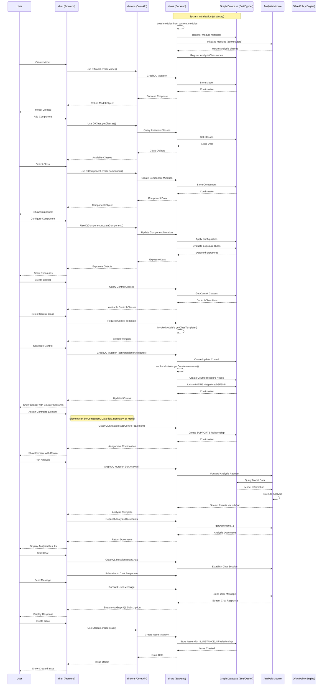

# Dethernety Platform Architecture

> Technical architecture overview for developers and contributors

## Table of Contents
- [Overview](#overview)
- [Architecture Vision](#architecture-vision)
- [System Architecture](#system-architecture)
- [System Interactions](#system-interactions)
- [Technology Strategy](#technology-strategy)
- [Core Architecture](#core-architecture)
- [Security Architecture](#security-architecture)
- [Scalability & Deployment](#scalability--deployment)
- [Detailed Documentation](#detailed-documentation)

---

## Overview

Dethernety is a **graph-native threat modeling platform**. Components, data flows, trust boundaries, exposures, and controls are stored as nodes and edges in a Bolt/Cypher graph database. This makes it possible to run queries like "find all paths from internet-facing components to PII stores through unencrypted data flows" directly against the model.

The platform ships with MITRE ATT&CK and D3FEND data, a visual threat modeling UI, and pluggable analysis backends (rule-based, query-based, or AI-powered).

### Design Philosophy

```
┌─────────────────────────────────────────────────────────────────────────────┐
│                         CORE DESIGN PRINCIPLES                              │
├─────────────────────────────────────────────────────────────────────────────┤
│                                                                             │
│  1. GRAPH-NATIVE ARCHITECTURE                                               │
│     ─────────────────────────                                               │
│     Threat models stored as native graph structures in Bolt/Cypher          │
│     database. GraphQL API maps 1:1 to the graph data layer—queries          │
│     traverse relationships directly. Enables complex traversal queries      │
│     impossible with relational databases: "find all paths from internet-    │
│     facing components to PII stores through unencrypted data flows."        │
│                                                                             │
│  2. SWAPPABLE ANALYSIS BACKEND                                              │
│     ─────────────────────────                                               │
│     Analysis engine is abstracted through DTModule interface:               │
│     • Query-based analysis (Cypher traversals, pattern matching)            │
│     • Single-agent AI (LLM-powered reasoning)                               │
│     • Multi-agent AI (orchestrated workflows)                               │
│     • Rule-based (OPA/Rego policy evaluation)                               │
│     Same API regardless of backend—swap engines without UI changes.         │
│                                                                             │
│  3. EXECUTABLE MODULE SYSTEM                                                │
│     ─────────────────────────                                               │
│     Modules are real JavaScript/TypeScript classes loaded at runtime:       │
│     • Define component classes with custom attributes and validation        │
│     • Implement exposure detection with OPA/Rego or custom logic            │
│     • Provide AI analysis workflows via the module interface                │
│     • Sync with external systems (Jira, cloud APIs, CMDBs)                  │
│     Not configuration files—executable code with full platform access.      │
│                                                                             │
└─────────────────────────────────────────────────────────────────────────────┘
```

### Architecture Highlights

| Characteristic | Implementation |
|----------------|----------------|
| **Data Model** | Graph-native (Bolt/Cypher on Neo4j or Memgraph) |
| **Analysis Engine** | Pluggable backends: query, rule-based, single-agent AI, multi-agent AI |
| **Module System** | Runtime-loaded JavaScript classes with full platform API access |
| **Frontend** | Vue 3 + TypeScript with interactive graph visualization |
| **Backend** | NestJS GraphQL with module-routed resolvers |
| **Deployment** | Docker, self-hosted, or cloud (single-instance or multi-tenant) |
| **Integration** | OIDC/OAuth2, GraphQL, MCP Protocol, Issue Trackers |

---

## Architecture Vision

### Design Principles

The Dethernety architecture is guided by five core principles:

```
┌─────────────────────────────────────────────────────────────────────────────┐
│                         ARCHITECTURE PRINCIPLES                             │
├─────────────────────────────────────────────────────────────────────────────┤
│                                                                             │
│  1. EXTENSIBILITY          Modules can add capabilities without core        │
│     ───────────────        modifications. New component types, security     │
│                            rules, and AI analyses plug in seamlessly.       │
│                                                                             │
│  2. GRAPH-NATIVE           Security relationships modeled naturally as      │
│     ───────────────        nodes and edges. Threats, controls, and data     │
│                            flows represent interconnected reality.          │
│                                                                             │
│  3. AI-INTEGRATED          AI is a first-class citizen, not an add-on.      │
│     ───────────────        Modules can implement complex multi-step         │
│                            security analysis workflows with human oversight.│
│                                                                             │
│  4. STANDARDS-BASED        MITRE ATT&CK and D3FEND integrated natively.     │
│     ───────────────        Industry frameworks provide shared vocabulary    │
│                            and actionable threat intelligence.              │
│                                                                             │
│  5. SECURE BY DESIGN       Security at every layer. JWT/OIDC auth,          │
│     ───────────────        encrypted data, API protection,                  │
│                            module allowlisting.                             │
│                                                                             │
└─────────────────────────────────────────────────────────────────────────────┘
```

### Architecture Goals

| Goal | Implementation |
|------|----------------|
| **Security Modeling Fidelity** | Graph-native data model maps data flows, attack paths, and attack states as first-class relationships -- enables queries impossible with SQL (path traversals, reachability, pattern matching) |
| **Extensibility** | Module system enables new security domains (cloud, IoT, OT) without platform changes |
| **Integration** | OIDC/OAuth2 supports Keycloak, Auth0, Zitadel, and other providers; GraphQL enables custom tooling |
| **AI Flexibility** | Analysis engine abstraction allows swapping AI models and adding new reasoning patterns |
| **Database Portability** | Bolt/Cypher compatibility enables either Neo4j or Memgraph deployment |

---

## System Architecture

### High-Level Architecture

```
┌─────────────────────────────────────────────────────────────────────────────────┐
│                              DETHERNETY PLATFORM                                │
├─────────────────────────────────────────────────────────────────────────────────┤
│                                                                                 │
│  ┌───────────────────────────────────────────────────────────────────────────┐  │
│  │                            PRESENTATION LAYER                             │  │
│  │                                                                           │  │
│  │  ┌──────────────────┐  ┌──────────────────┐  ┌──────────────────────┐     │  │
│  │  │   Web UI         │  │   MCP Server     │  │   CLI / SDK          │     │  │
│  │  │   (Vue 3)        │  │   (TypeScript)   │  │   (TypeScript)       │     │  │
│  │  │                  │  │                  │  │                      │     │  │
│  │  │  • Data Flow     │  │  • AI Assistant  │  │  • Automation        │     │  │
│  │  │    Editor        │  │    Integration   │  │  • CI/CD Integration │     │  │
│  │  │  • Analysis      │  │  • Model Import/ │  │  • Scripting         │     │  │
│  │  │    Dashboard     │  │    Export        │  │                      │     │  │
│  │  │  • Issue Manager │  │                  │  │                      │     │  │
│  │  └────────┬─────────┘  └────────┬─────────┘  └──────────┬───────────┘     │  │
│  │           │                     │                       │                 │  │
│  └───────────┼─────────────────────┼───────────────────────┼─────────────────┘  │
│              │                     │                       │                    │
│              └─────────────────────┼───────────────────────┘                    │
│                                    │                                            │
│                          ┌─────────┴─────────┐                                  │
│                          │    dt-core        │                                  │
│                          │ (Shared Data      │                                  │
│                          │  Access Layer)    │                                  │
│                          └─────────┬─────────┘                                  │
│                                    │                                            │
│  ┌─────────────────────────────────┼───────────────────────────────────────┐    │
│  │                     API LAYER   │                                       │    │
│  │                                 ▼                                       │    │
│  │  ┌───────────────────────────────────────────────────────────────────┐  │    │
│  │  │                    GraphQL API (NestJS)                           │  │    │
│  │  │                                                                   │  │    │
│  │  │   • Queries & Mutations (CRUD)    • Real-time Subscriptions       │  │    │
│  │  │   • Module-routed Requests        • JWT/OIDC Authentication       │  │    │
│  │  │   • Query Depth Protection        • Input Validation              │  │    │
│  │  └───────────────────────────────────────────────────────────────────┘  │    │
│  │                                                                         │    │
│  └─────────────────────────────────────────────────────────────────────────┘    │
│                                    │                                            │
│  ┌─────────────────────────────────┼───────────────────────────────────────┐    │
│  │               BUSINESS LOGIC    │                                       │    │
│  │                                 ▼                                       │    │
│  │  ┌──────────────────────────────────────────────────────────────────┐   │    │
│  │  │                    Module System                                 │   │    │
│  │  │  ┌─────────────────┐  ┌─────────────────┐  ┌─────────────────┐   │   │    │
│  │  │  │  Dethernety     │  │   Analysis      │  │   Custom        │   │   │    │
│  │  │  │  Module         │  │   Modules       │  │   Modules       │   │   │    │
│  │  │  │                 │  │                 │  │                 │   │   │    │
│  │  │  │ • Component     │  │ • Attack        │  │ • Cloud         │   │   │    │
│  │  │  │   Classes       │  │   Scenario      │  │   Security      │   │   │    │
│  │  │  │ • OPA/Rego      │  │   Analysis      │  │ • Compliance    │   │   │    │
│  │  │  │   Policies      │  │ • Interactive   │  │ • Industry-     │   │   │    │
│  │  │  │ • Exposure      │  │   Chat          │  │   Specific      │   │   │    │
│  │  │  │   Detection     │  │                 │  │                 │   │   │    │
│  │  │  └─────────────────┘  └─────────────────┘  └─────────────────┘   │   │    │
│  │  └──────────────────────────────────────────────────────────────────┘   │    │
│  │                                                                         │    │
│  └─────────────────────────────────────────────────────────────────────────┘    │
│                                    │                                            │
│  ┌─────────────────────────────────┼───────────────────────────────────────┐    │
│  │                   DATA LAYER    │                                       │    │
│  │                                 ▼                                       │    │
│  │  ┌─────────────────────┐  ┌──────────────────────────────────────────┐  │    │
│  │  │   Graph Database    │  │   Module Storage (optional)              │  │    │
│  │  │   (Bolt/Cypher)     │  │                                          │  │    │
│  │  │                     │  │ • Analysis state and results             │  │    │
│  │  │ • Threat Models     │  │ • Chat history                           │  │    │
│  │  │ • MITRE Data        │  │ • Document retrieval                     │  │    │
│  │  │ • Module Metadata   │  │   (implementation varies by module)      │  │    │
│  │  │ • Rego Policies     │  │                                          │  │    │
│  │  └─────────────────────┘  └──────────────────────────────────────────┘  │    │
│  │                                                                         │    │
│  └─────────────────────────────────────────────────────────────────────────┘    │
│                                    │                                            │
│  ┌─────────────────────────────────┼───────────────────────────────────────┐    │
│  │              EXTERNAL SERVICES  │                                       │    │
│  │                                 ▼                                       │    │
│  │  ┌─────────────────┐  ┌─────────────────┐  ┌─────────────────────────┐  │    │
│  │  │  OPA Server     │  │  Analysis       │  │  Identity Provider      │  │    │
│  │  │                 │  │  Service (opt.) │  │  (OIDC)                 │  │    │
│  │  │ • Rego Policy   │  │                 │  │                         │  │    │
│  │  │   Evaluation    │  │ • AI Workflows  │  │ • Keycloak / Auth0      │  │    │
│  │  │ • Exposure      │  │ • Module-       │  │ • Zitadel / Custom      │  │    │
│  │  │   Detection     │  │   provided      │  │ • Any OIDC provider     │  │    │
│  │  └─────────────────┘  └─────────────────┘  └─────────────────────────┘  │    │
│  │                                                                         │    │
│  └─────────────────────────────────────────────────────────────────────────┘    │
│                                                                                 │
└─────────────────────────────────────────────────────────────────────────────────┘
```

### Component Overview

| Layer | Component | Technology | Purpose |
|-------|-----------|------------|---------|
| **Presentation** | Web UI | Vue 3 + Vuetify + Vue Flow | Interactive threat modeling interface |
| **Presentation** | MCP Server | TypeScript (dt-core) | AI assistant integration (Claude, etc.) |
| **Shared** | dt-core | TypeScript | Unified data access layer across all clients |
| **API** | GraphQL Server | NestJS + Apollo | Unified API with subscriptions |
| **Business** | Module System | DTModule interface | Extensible threat modeling capabilities |
| **Business** | Analysis Engine | Module-provided | AI, query-based, or rule-based security analysis |
| **Data** | Graph Database | Neo4j / Memgraph | Threat models, relationships, policies |
| **External** | OPA Server | Open Policy Agent | Rego policy evaluation |
| **External** | OIDC Provider | Keycloak/Auth0/Zitadel | Enterprise authentication |

---

## System Interactions

The following sequence diagram shows how components interact during the core workflows: system initialization, model creation, security analysis, and issue management.



---

## Technology Strategy

### Build vs. Buy Decisions

| Capability | Decision | Rationale |
|------------|----------|-----------|
| **Graph Database** | Buy (Neo4j/Memgraph) | Security relationships are inherently graph-structured; no viable alternative |
| **UI Framework** | Buy (Vue 3) | Modern, performant, excellent TypeScript support |
| **Policy Engine** | Buy (OPA) | Industry-standard, Rego is well-suited for security rules |
| **Module System** | Build | Requires tight platform integration for runtime loading and GraphQL routing |
| **Data Access Layer** | Build (dt-core) | Consistency across all clients requires shared implementation |
| **Threat Modeling UI** | Build | Purpose-built interface for graph-based threat modeling workflows |

### Technology Rationale

```
┌─────────────────────────────────────────────────────────────────────────────┐
│                        TECHNOLOGY SELECTION RATIONALE                       │
├─────────────────────────────────────────────────────────────────────────────┤
│                                                                             │
│  GRAPH DATABASE (Bolt/Cypher)                                               │
│  ─────────────────────────────                                              │
│  Security data is inherently relational: components connect via data flows, │
│  threats map to techniques, controls mitigate exposures. Graph databases    │
│  model these relationships natively, enabling efficient traversal queries   │
│  that would be expensive in relational databases.                           │
│                                                                             │
│  Protocol flexibility (Bolt/Cypher) enables:                                │
│  • Neo4j for enterprise deployments requiring rich features                 │
│  • Memgraph for cost-optimized deployments (fraction of Neo4j cost)         │
│                                                                             │
│  OPA/REGO (Policy Engine)                                                   │
│  ─────────────────────────────                                              │
│  Exposure detection rules are security policies. OPA provides:              │
│  • Declarative Rego language suited for security logic                      │
│  • Hot-reload without server restart                                        │
│  • Partial evaluation for debugging                                         │
│  • Industry adoption in Kubernetes, service mesh, IAM                       │
│                                                                             │
│  GRAPHQL (API Layer)                                                        │
│  ─────────────────────────────                                              │
│  Threat models are hierarchical with varying depth requirements:            │
│  • Summary views need model-level data only                                 │
│  • Detail views need deep component trees                                   │
│  GraphQL eliminates over-fetching and enables efficient caching.            │
│                                                                             │
└─────────────────────────────────────────────────────────────────────────────┘
```

---

## Core Architecture

### 1. Extensible Module System

The `DTModule` interface is how you extend the platform without modifying the core. The `packages/dt-module` library provides abstract base classes on top of this interface that handle database operations, policy evaluation, and analysis integration.

```
┌─────────────────────────────────────────────────────────────────────────────┐
│                         DTMODULE CAPABILITIES                               │
├─────────────────────────────────────────────────────────────────────────────┤
│                                                                             │
│  DESIGN CLASSES              Can integrate with live data sources           │
│  ──────────────────          • Kubernetes API → container components        │
│                              • AWS API → cloud resources                    │
│                              • CMDBs → enterprise inventory                 │
│                                                                             │
│  SECURITY LOGIC              Pluggable rule engines                         │
│  ──────────────────          • OPA/Rego for policy-as-code                  │
│                              • JSON Logic for simple rules                  │
│                              • Custom engines for proprietary logic         │
│                                                                             │
│  AI ANALYSIS                 Multiple analysis patterns                     │
│  ──────────────────          • Attack scenario generation                   │
│                              • Interactive threat modeling chat             │
│                              • Compliance gap analysis                      │
│                                                                             │
│  ISSUE INTEGRATION           External tracker sync                          │
│  ──────────────────          • Jira, GitHub Issues, Azure DevOps            │
│                              • ServiceNow, custom systems                   │
│                                                                             │
│  CONFIGURATION               Dynamic UI schemas                             │
│  ──────────────────          • JSONForms-powered property panels            │
│                              • Module-specific documentation                │
│                                                                             │
└─────────────────────────────────────────────────────────────────────────────┘
```

#### Module Development Library (`dt-module`)

The `packages/dt-module` library provides abstract base classes that handle common patterns:

| Base Class | Storage | Rule Engine | Use Case |
|------------|---------|-------------|----------|
| `DtNeo4jOpaModule` | Graph database | OPA/Rego | Production modules with centralized policy management |
| `DtFileOpaModule` | JSON files | OPA/Rego | Development, version-controlled configurations |
| `DtFileJsonModule` | JSON files | JSON Logic | Simple rules without OPA dependency |
| `DtLgModule` | Graph database | LangGraph | AI-powered analysis workflows |

Each base class provides:
- Automatic class registration and metadata management
- Built-in database operations (DbOps)
- Policy evaluation helpers (OpaOps)
- LangGraph operations (DtLgAnalysisOps, DtLgDocumentOps)
- GraphQL resolver integration

To create a new OPA-based module, you define class schemas and Rego policies. The base class handles database persistence, GraphQL integration, and policy evaluation. New security domains (cloud security, OT/ICS, IoT) can be added as modules without platform changes. See the [Module Development Guide](./modules/DEVELOPMENT_GUIDE.md) for details.

### 2. Graph-Native Threat Modeling

Threat models are stored as graph structures, not document trees. Relationships between components, data flows, and security controls are edges in the graph, so queries that would require joins across multiple tables in a relational database are single-hop traversals here.

For example, "find all components reachable from internet-facing processes that handle PII" is a single Cypher query.

### 3. AI-Integrated Analysis

Analysis modules run within the platform, with access to the full threat model graph:

```
┌─────────────────────────────────────────────────────────────────────────────┐
│                      AI ANALYSIS ARCHITECTURE                               │
├─────────────────────────────────────────────────────────────────────────────┤
│                                                                             │
│  ┌──────────────┐    ┌──────────────┐    ┌──────────────┐                   │
│  │   Analysis   │───►│   Module     │───►│   Results    │                   │
│  │   Request    │    │   Analysis   │    │   Store      │                   │
│  └──────────────┘    └──────┬───────┘    └──────────────┘                   │
│                             │                                               │
│           ┌─────────────────┼─────────────────┐                             │
│           │                 │                 │                             │
│           ▼                 ▼                 ▼                             │
│  ┌────────────────┐ ┌────────────────┐ ┌────────────────┐                   │
│  │  Graph Context │ │  Context       │ │  Human Review  │                   │
│  │  (Threat Model)│ │  Retrieval     │ │  (Interrupt    │                   │
│  │                │ │  (optional)    │ │   Points)      │                   │
│  └────────────────┘ └────────────────┘ └────────────────┘                   │
│                                                                             │
│  FEATURES:                                                                  │
│  • Real-time streaming of analysis progress                                 │
│  • Human-in-the-loop for critical decisions                                 │
│  • Long-running sessions (15+ minutes)                                      │
│  • Resumable after interruption                                             │
│  • Unified retrieval API regardless of storage backend                      │
│                                                                             │
└─────────────────────────────────────────────────────────────────────────────┘
```

### 4. Unified Data Access Layer (dt-core)

The `dt-core` TypeScript package is the shared data access layer used by all platform clients:

| Client | Language | Package |
|--------|----------|---------|
| Web UI | TypeScript | `dt-core` |
| Backend | TypeScript | `dt-core` |
| MCP Server | TypeScript | `dt-core` |
| CLI Tools | TypeScript | `dt-core` |

All clients share the same GraphQL operation implementations, so a bug fix in dt-core applies everywhere.

---

## Security Architecture

### Security principles

| Principle | Implementation |
|-----------|----------------|
| **Authentication** | OIDC/OAuth2 with PKCE; JWT validated against JWKS endpoints on every request |
| **API Protection** | GraphQL query depth limiting, complexity scoring, input validation |
| **Module Security** | Module allowlisting via `ALLOWED_MODULES`; file permission and size validation |
| **Encryption** | TLS 1.2+ in transit; encryption at rest for stored data |

### Security Layers

```
┌─────────────────────────────────────────────────────────────────────────────┐
│                          SECURITY LAYERS                                    │
├─────────────────────────────────────────────────────────────────────────────┤
│                                                                             │
│  LAYER 1: AUTHENTICATION                                                    │
│  ─────────────────────                                                      │
│  • OIDC/OAuth2 with PKCE flow (no client secrets)                           │
│  • JWT validation against JWKS endpoints                                    │
│  • Token auto-refresh preventing session expiration                         │
│  • MFA support (TOTP) via identity provider                                 │
│  • Support for multiple IdPs (Keycloak, Auth0, Zitadel, etc.)               │
│                                                                             │
│  LAYER 2: API PROTECTION                                                    │
│  ─────────────────────                                                      │
│  • GraphQL query depth limiting                                             │
│  • Complexity scoring to prevent DoS                                        │
│  • Input validation on all parameters                                       │
│  • Sanitized error responses (no internal leakage)                          │
│                                                                             │
│  LAYER 3: MODULE SECURITY                                                   │
│  ─────────────────────                                                      │
│  • Module allowlisting via ALLOWED_MODULES environment variable             │
│  • Wildcard and prefix pattern matching for module names                    │
│  • File permission validation (rejects world-writable files)                │
│  • File size limits (max 10MB per module)                                   │
│  • Path traversal protection for module loading                             │
│                                                                             │
│  LAYER 4: DATA PROTECTION                                                   │
│  ─────────────────────                                                      │
│  • Encryption at rest for stored data                                       │
│  • Data isolation in graph database                                         │
│  • Credential masking in logs                                               │
│                                                                             │
└─────────────────────────────────────────────────────────────────────────────┘
```

---

## Scalability & Deployment

### Deployment Options

Dethernety can be deployed as a single Docker container or as individual services:

```
┌─────────────────────────────────────────────────────────────────────────────┐
│                        DEPLOYMENT ARCHITECTURE                              │
├─────────────────────────────────────────────────────────────────────────────┤
│                                                                             │
│  DOCKER (SINGLE-INSTANCE)                                                   │
│  ─────────────────────────                                                  │
│  • All services in one container (Dockerfile.production)                    │
│  • Suitable for development, evaluation, and small teams                    │
│  • Requires: Bolt/Cypher database, OIDC provider                            │
│                                                                             │
│  SERVICES (PRODUCTION)                                                      │
│  ─────────────────────                                                      │
│  • dt-ws (NestJS backend) — stateless, horizontally scalable                │
│  • dt-ui (Vue frontend) — static assets, served via CDN or web server       │
│  • Graph database (Neo4j or Memgraph)                                       │
│  • OPA server (optional, for Rego policy evaluation)                        │
│  • OIDC identity provider (Keycloak, Auth0, Zitadel, etc.)                  │
│                                                                             │
└─────────────────────────────────────────────────────────────────────────────┘
```

### Horizontal Scaling

| Component | Scaling Strategy |
|-----------|-----------------|
| Web UI | Static assets; serve via CDN or any web server |
| API Server | Stateless; add instances behind load balancer |
| Graph Database | Read replicas for query distribution |
| Analysis Modules | Module-provided; scale per implementation |

---

## Architecture Decision Records

Significant technical decisions are documented as ADRs in [`decisions/`](./decisions/):

| ADR | Decision |
|-----|----------|
| [001](decisions/001-graph-native-data-model.md) | Graph-native data model (Bolt/Cypher) |
| [002](decisions/002-graphql-api-layer.md) | GraphQL API layer |
| [003](decisions/003-oidc-authentication.md) | OIDC authentication with multi-provider support |
| [004](decisions/004-executable-module-system.md) | Executable module system |
| [005](decisions/005-shared-data-access-layer.md) | Shared data access layer (dt-core) |
| [006](decisions/006-defense-in-depth-security.md) | Defense-in-depth security |

---

## Detailed Documentation

### Architecture Documentation Map

```
docs/architecture/
├── README.md                          ← This document (platform overview)
│
├── decisions/                         # Architecture Decision Records
│   ├── README.md                      # ADR index
│   ├── 001-graph-native-data-model.md
│   ├── 002-graphql-api-layer.md
│   ├── 003-oidc-authentication.md
│   ├── 004-executable-module-system.md
│   ├── 005-shared-data-access-layer.md
│   └── 006-defense-in-depth-security.md
│
├── frontend/                          # Frontend architecture
│   ├── TECHNICAL_OVERVIEW.md          # Technical summary
│   ├── FRONTEND_ARCHITECTURE.md       # Complete technical reference
│   └── LLD/                           # Low-level design
│       ├── Data architecture/         # Generic patterns
│       ├── AUTHENTICATION.md          # OIDC/PKCE flow
│       ├── APOLLO_CLIENT.md           # GraphQL client setup
│       ├── FLOW_STORE.md              # Optimistic updates
│       └── MODULE_SYSTEM.md           # Dynamic module loading
│
├── backend/                           # Backend architecture
│   ├── TECHNICAL_OVERVIEW.md          # Technical summary
│   ├── BACKEND_ARCHITECTURE.md        # Complete technical reference
│   └── LLD/                           # Low-level design (17 documents)
│       ├── 01-gql-module.md           # GraphQL module
│       ├── 02-schema-service.md       # Dynamic schema builder
│       ├── 03-module-registry.md      # Module lifecycle
│       └── ...                        # Additional services
│
├── dt-core/                           # Shared data access layer
│   ├── README.md                      # Package introduction
│   ├── DOMAIN_MODEL.md                # Core interfaces
│   ├── DATA_ACCESS_LAYER.md           # Utility patterns
│   ├── GRAPHQL_OPERATIONS.md          # Domain classes
│   └── IMPORT_EXPORT.md               # Model serialization
│
├── modules/                           # Module system
│   ├── README.md                      # Module system introduction
│   ├── DT_MODULE_INTERFACE.md         # Core contract
│   ├── BASE_CLASSES.md                # Implementation patterns
│   ├── UTILITY_CLASSES.md             # Helper classes
│   ├── DEVELOPMENT_GUIDE.md           # Development guide
│   └── MODULE_PACKAGE_DESIGN.md       # Module packaging and deployment
│
└── dethereal/                         # MCP Server (AI integration)
    ├── README.md                      # Quick reference
    └── ARCHITECTURE.md                # Complete technical reference
```

### Quick Reference Links

| Topic | Document |
|-------|----------|
| **Frontend Technical Overview** | [frontend/TECHNICAL_OVERVIEW.md](./frontend/TECHNICAL_OVERVIEW.md) |
| **Backend Technical Overview** | [backend/TECHNICAL_OVERVIEW.md](./backend/TECHNICAL_OVERVIEW.md) |
| **dt-core Package** | [dt-core/](./dt-core/) |
| **Module System** | [modules/](./modules/) |
| **MCP Server (Dethereal)** | [dethereal/ARCHITECTURE.md](./dethereal/ARCHITECTURE.md) |

---

## Summary

The architecture rests on three choices:

1. **Graph-native data model** -- Bolt/Cypher database where security relationships are nodes and edges, queryable via traversal.
2. **Swappable analysis backends** -- DTModule abstraction lets you swap between query-based, rule-based (OPA/Rego), and AI-powered analysis without changing client code.
3. **Executable module system** -- Modules are runtime-loaded JavaScript classes (not configuration files), with full platform API access for integrating with external systems.

All protocols are standards-based (Bolt/Cypher, OIDC, GraphQL), and both Neo4j and Memgraph are supported as database backends.

---

*For questions or contributions, see the project README and CONTRIBUTING guide.*
