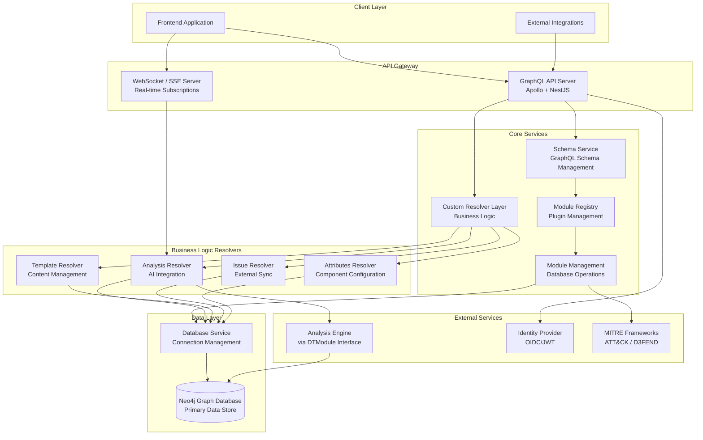

# Backend Architecture Overview

## Summary

The Dethernety backend is a NestJS GraphQL server backed by a Bolt/Cypher graph database (Neo4j or Memgraph). It auto-generates CRUD operations from the GraphQL schema, loads threat modeling modules at runtime, and routes analysis requests to the appropriate module.

**Stack:** NestJS + TypeScript, Neo4j/Memgraph (Bolt/Cypher), Apollo Server (GraphQL), OIDC/JWT auth, WebSocket/SSE for real-time updates.

---

## Architecture Overview



### Layered Architecture

The backend implements a layered architecture with clear separation of concerns:

| Layer | Responsibility | Key Components |
|-------|---------------|----------------|
| **API Gateway** | Request handling, authentication, protocol management | Apollo GraphQL, WebSocket Server |
| **Core Services** | Schema management, resolver orchestration, module loading | SchemaService, ModuleRegistry |
| **Business Logic** | Domain-specific operations and integrations | Custom Resolvers (Analysis, Template, Issue, Attributes) |
| **Data Access** | Database connectivity, transaction management | DatabaseService, Neo4j Driver |

---

## Technology Stack

### Core Framework

| Technology | Purpose |
|------------|---------|
| **NestJS** | Node.js framework with dependency injection |
| **TypeScript** | Type-safe development with full IDE support |
| **Apollo Server** | Production GraphQL server implementation |
| **Neo4j GraphQL Library** | Auto-generated CRUD operations from schema |

### Database

| Technology | Purpose |
|------------|---------|
| **Bolt Protocol + Cypher** | Standards-based graph database connectivity enabling multi-database support |
| **Neo4j / Memgraph** | Compatible graph databases (Memgraph default in cost-optimized deployments) |
| **Neo4j Driver** | Bolt protocol driver with modern transaction patterns |
| **Context Storage** | Graph database can be used by analysis modules for context retrieval |

### Communication

| Technology | Purpose |
|------------|---------|
| **GraphQL** | Primary API protocol with real-time subscriptions |
| **WebSockets / SSE** | Real-time streaming for AI analysis updates (SSE enables CloudFront VPC origin compatibility) |
| **HTTP/HTTPS** | RESTful health checks and system endpoints |

### Security

| Technology | Purpose |
|------------|---------|
| **OIDC/JWT** | Standards-based authentication via JWKS |
| **Query Limiting** | Depth and complexity protection against abuse |
| **Input Validation** | Parameter validation on all mutations and queries |

---

## Core Modules

### 1. GraphQL Module

The central API layer providing all GraphQL functionality.

**Capabilities:**
- Schema-first development with auto-generated CRUD operations
- Custom resolver integration for business logic
- Real-time subscriptions via WebSocket or SSE (Server-Sent Events)
- Query depth and complexity limiting
- Automatic authentication integration

**Production Features:**
- Environment-based configuration (dev/staging/production)
- GraphQL Playground disabled in production
- Schema introspection disabled in production
- Error sanitization for security

### 2. Database Module

Database connectivity and connection management.

**Capabilities:**
- Connection pool management (configurable pool size)
- Neo4j v5 transaction patterns (`executeRead`/`executeWrite`)
- Automatic session lifecycle management
- Health monitoring (connection status, query metrics)

**Performance Features:**
- Connection pooling with configurable limits
- Query performance metrics collection
- Automatic connection cleanup
- Multi-database support

### 3. Module Registry & DTModule Interface

Dynamic plugin system enabling unlimited integrations through the `DTModule` interface.

**Module System Capabilities:**

| Capability | Interface Methods | Purpose |
|------------|------------------|---------|
| **Design Classes** | `getMetadata()` | ComponentClass, SecurityBoundaryClass, DataFlowClass, ControlClass, DataClass definitions |
| **Configuration** | `getModuleTemplate()`, `getClassTemplate()`, `getClassGuide()` | Dynamic UI schemas and documentation |
| **Security Logic** | `getExposures()`, `getCountermeasures()` | Exposure detection and countermeasure mapping rules |
| **Issue Integration** | `getSyncedIssueAttributes()` | External issue tracker synchronization |
| **Analysis Engine** | `runAnalysis()`, `getDocument()`, etc. | Pluggable analysis implementations |

**Registry Features:**
- Runtime module loading from file system
- Module whitelisting for security (production)
- Hot reload support (development only)
- Interface validation and health monitoring

**Security Features:**
- Explicit module whitelisting in production
- File permission validation
- Secure driver wrapper for audit logging
- Module health tracking and statistics

Any system implementing `DTModule` can integrate with Dethernety - enabling custom security frameworks, proprietary analysis engines, or domain-specific threat modeling capabilities.

### 4. Custom Resolver Layer

Business logic implementation for specialized operations.

| Resolver | Purpose |
|----------|---------|
| **AnalysisResolver** | AI-powered security analysis with long-running operation support |
| **TemplateResolver** | Module template and configuration guide retrieval |
| **IssueResolver** | External issue tracking system synchronization |
| **SetInstantiationAttributes** | Component configuration with MITRE framework integration |
| **ModuleManagementResolver** | Module lifecycle and class management |

---

## Key Architectural Features

### 1. Production-Ready Security

```
Request → JWT Validation → Query Protection → Authorization → Execution → Response
```

**Security Layers:**
- **Transport Security**: HTTPS/WSS encryption
- **Authentication**: OIDC JWT validation via JWKS endpoint
- **Query Protection**: Depth limiting (default: 10) and complexity scoring (default: 1000)
- **Error Sanitization**: Internal errors hidden in production
- **Input Validation**: All inputs validated before processing

### 2. Monitoring

All services implement structured logging and health monitoring:

**Metrics Collected:**
- Operation success/failure rates
- Response times and performance tracking
- Database connection pool utilization
- Module health status
- Cache hit rates (where applicable)

**Health Check System:**
- Database connectivity verification
- GraphQL schema validation
- Module availability checks
- Service status aggregation

### 3. Scalability Design

**Horizontal Scaling Support:**
- Stateless application design
- Database connection pooling
- No server-side session storage
- Schema caching in memory

**Performance Optimizations:**
- LRU caching with TTL for templates and metadata
- Batch processing for frequent operations (auto-save)
- Connection pool management
- Async file operations

### 4. Error Handling & Resilience

**Error Handling Patterns:**
- Structured error classification (System, User, Business)
- Fallback behavior when non-critical services are unavailable
- Detailed logging for debugging
- Sanitized responses for security

**Resilience Features:**
- Retry logic with exponential backoff
- Timeout protection on all external calls
- Fallback mechanisms for non-critical operations
- Mutex handling for concurrent requests

### 5. Pluggable Resolver Architecture

A key design pattern enabling maintainability and extensibility through modular business logic.

```
┌─────────────────────────────────────────────────────────────────────────┐
│                         Custom Resolver Module                          │
├─────────────────────────────────────────────────────────────────────────┤
│  ┌─────────────────────────────────────────────────────────────────┐    │
│  │                    Shared Services Layer                        │    │
│  │  AuthorizationService │ MonitoringService │ CacheServices       │    │
│  └─────────────────────────────────────────────────────────────────┘    │
│                                    │                                    │
│  ┌─────────────────────────────────────────────────────────────────┐    │
│  │                   Resolver Services (Pluggable)                 │    │
│  │  ┌───────────┐ ┌───────────┐ ┌───────────┐ ┌───────────┐        │    │
│  │  │ Analysis  │ │ Template  │ │  Issue    │ │ Attributes│  ...   │    │
│  │  │ Resolver  │ │ Resolver  │ │ Resolver  │ │ Resolver  │        │    │
│  │  └───────────┘ └───────────┘ └───────────┘ └───────────┘        │    │
│  └─────────────────────────────────────────────────────────────────┘    │
│                                    │                                    │
│  ┌─────────────────────────────────────────────────────────────────┐    │
│  │            Factory Pattern: Auto-Registration                   │    │
│  │     RESOLVER_SERVICES → SchemaService.mergeResolvers()          │    │
│  └─────────────────────────────────────────────────────────────────┘    │
└─────────────────────────────────────────────────────────────────────────┘
                                    │
                                    ▼
                    ┌───────────────────────────────┐
                    │   GraphQL Schema (Neo4j GQL)  │
                    │   Auto-generated + Custom     │
                    └───────────────────────────────┘
```

**Architecture Benefits:**

| Benefit | Description |
|---------|-------------|
| **Pluggability** | New resolvers added without modifying core GraphQL setup |
| **Separation of Concerns** | Each resolver handles specific domain logic independently |
| **Shared Services** | Common functionality (auth, monitoring, caching) centralized |
| **Type Safety** | All resolvers implement `ResolverService` interface contract |
| **Testability** | NestJS dependency injection enables easy mocking and testing |
| **Auto-Registration** | Factory pattern automatically collects and merges resolvers |

**Adding a New Resolver:**

1. Create service implementing `ResolverService` interface
2. Add to `resolverServiceClasses` array
3. Resolver automatically injected and merged into GraphQL schema

**Shared Services Available:**

| Service | Purpose |
|---------|---------|
| `AuthorizationService` | Context extraction and authorization framework |
| `MonitoringService` | Operation metrics, statistics, and health reporting |
| `TemplateCacheService` | LRU cache with TTL for template content |
| `AnalysisCacheService` | Specialized caching for analysis metadata |

Each resolver service is independently testable and has its own health endpoint.

---

## Integration Points

### DTModule Interface - Unlimited Integration Potential

The `DTModule` interface (`@dethernety/dt-module`) is the core abstraction enabling unlimited third-party integrations. Any system implementing this interface can extend Dethernety's capabilities:

```
┌─────────────────────────────────────────────────────────────────────────┐
│                         DTModule Interface                              │
├─────────────────────────────────────────────────────────────────────────┤
│  Design Classes        │ ComponentClass, SecurityBoundaryClass,         │
│  (via getMetadata)     │ DataFlowClass, ControlClass, DataClass         │
├────────────────────────┼────────────────────────────────────────────────┤
│  Configuration         │ Module templates, class templates, guides      │
│  (getModuleTemplate,   │ → Dynamic UI generation via JSONForms          │
│   getClassTemplate,    │                                                │
│   getClassGuide)       │                                                │
├────────────────────────┼────────────────────────────────────────────────┤
│  Security Logic        │ Exposure detection rules                       │
│  (getExposures,        │ Countermeasure mapping to MITRE frameworks     │
│   getCountermeasures)  │                                                │
├────────────────────────┼────────────────────────────────────────────────┤
│  Issue Integration     │ External issue tracker synchronization         │
│  (getSyncedIssue       │ (interface supports Jira, GitHub, etc.)        │
│   Attributes)          │                                                │
├────────────────────────┼────────────────────────────────────────────────┤
│  Analysis Engine       │ AI, query-based, rule-based, or hybrid         │
│  (runAnalysis,         │ analysis with document/result retrieval        │
│   getDocument, etc.)   │                                                │
└─────────────────────────────────────────────────────────────────────────┘
```

### Analysis Engine Capabilities

The analysis-related methods enable pluggable analysis implementations:

```typescript
// Key DTModule interface methods (simplified)
interface DTModule {
  // Analysis lifecycle
  runAnalysis?(id, analysisClassId, scope, pubSub, params): Promise<AnalysisSession>;
  startChat?(id, analysisClassId, scope, userQuestion, pubSub, params): Promise<AnalysisSession>;
  resumeAnalysis?(id, analysisClassId, input, pubSub): Promise<AnalysisSession>;
  getAnalysisStatus?(id): Promise<AnalysisStatus>;
  deleteAnalysis?(id): Promise<boolean>;

  // Results retrieval
  getAnalysisValues?(id, valueKey): Promise<object>;
  getDocument?(id, analysisClassId, scope, filter): Promise<object>;  // Retrieve from engine's store

  // ... additional methods (templates, exposures, countermeasures)
}
```

**Document Management:**

The `getDocument` method provides a unified interface to retrieve analysis results from the module's configured storage backend. This decouples result retrieval from storage implementation:

```typescript
// Example: Retrieve analysis results via filter
const results = await module.getDocument(modelId, analysisClassId, scope, {
  document: 'index'           // Get index document
});

const details = await module.getDocument(modelId, analysisClassId, scope, {
  namespace: ['analysis', id], // Direct store lookup
  key: 'threat-summary',
  attribute: 'findings'
});
```

**Supported Analysis Engine Types:**

| Type | Description | Example |
|------|-------------|---------|
| **AI-Powered** | LLM-based analysis with multi-agent workflows | External AI orchestration engines, custom pipelines |
| **Query-Based** | Database-driven analysis using predefined queries | Neo4j pattern matching, MITRE lookups |
| **Rule-Based** | Deterministic analysis using business rules | Compliance checks, policy validation |
| **Hybrid** | Combination of AI and rule-based approaches | AI-assisted with rule guardrails |

**Architecture Benefits:**

- **Engine Agnostic**: Any analysis implementation works as long as it implements `DTModule`
- **Storage Abstraction**: Unified document retrieval regardless of underlying store (document store, external DB, custom)
- **Long-Running Operations**: Supports 15+ minute analysis sessions
- **Real-Time Updates**: WebSocket or SSE subscriptions for progress streaming
- **Parallel Sessions**: Multiple concurrent analyses with different scopes
- **Unified API**: Same GraphQL interface regardless of underlying engine

### Design Class Integration Capabilities

Design classes (`ComponentClass`, `SecurityBoundaryClass`, `DataFlowClass`, `ControlClass`, `DataClass`) define the building blocks available for threat modeling. Through the `DTModule` interface, these classes can integrate with external systems for live data:

```typescript
// Key DTModule interface method (simplified)
interface DTModule {
  getMetadata(): DTMetadata | Promise<DTMetadata>;  // Returns all class definitions
}

// DTMetadata includes all design classes
interface DTMetadata {
  componentClasses?: ComponentClass[];       // System components (servers, services, devices)
  securityBoundaryClasses?: SecurityBoundaryClass[];  // Trust zones, network segments
  dataFlowClasses?: DataFlowClass[];         // Communication patterns
  controlClasses?: ControlClass[];           // Security controls
  dataClasses?: DataClass[];                 // Data types and sensitivity
  // ... additional metadata
}
```

**Integration Examples:**

| Source System | Class Type | Integration Example |
|---------------|------------|---------------------|
| **Kubernetes API** | ComponentClass, SecurityBoundaryClass | Auto-discover pods, services, namespaces as components and boundaries |
| **Cloud Provider APIs** | ComponentClass, DataFlowClass | Import AWS/Azure/GCP resources and their connections |
| **CMDB Systems** | ComponentClass | Sync enterprise asset inventory as modeling components |
| **Network Scanners** | DataFlowClass | Import discovered network flows between systems |
| **Container Registries** | ComponentClass | Define components from available container images |

**Architecture Benefits:**

- **Live Data Integration**: Classes can fetch current infrastructure state rather than static definitions
- **Dynamic Modeling**: Threat models reflect actual deployed systems
- **Cross-Platform**: Same interface works with any infrastructure provider
- **Custom Taxonomies**: Organizations can define domain-specific component types

### Security Logic Integration Capabilities

Security logic methods (`getExposures`, `getCountermeasures`) evaluate component configurations to identify vulnerabilities and map defensive controls. These methods support pluggable rule engines:

```typescript
// Key DTModule interface methods (simplified)
interface DTModule {
  getExposures?(id: string, classId: string): Promise<Exposure[]>;
  getCountermeasures?(id: string, classId: string): Promise<Countermeasure[]>;
}
```

**Rule Engine Options:**

| Engine | Implementation | Use Case |
|--------|----------------|----------|
| **OPA (Open Policy Agent)** | `DtNeo4jOpaModule` | Complex policy-as-code with Rego language |
| **JsonLogic** | `DtFileJsonModule` | Simple JSON-based rules, no external dependencies |
| **Custom Rules** | Custom module | Organization-specific evaluation logic |
| **External Policy Services** | API integration | Centralized enterprise policy engines |

**Integration Examples:**

| Source System | Security Logic Type | Integration Example |
|---------------|---------------------|---------------------|
| **AWS IAM Analyzer** | ControlClass rules | Evaluate IAM policies against least-privilege rules |
| **Kubernetes RBAC** | Exposure detection | Identify overly permissive role bindings |
| **Cloud Security Posture** | Countermeasure mapping | Map findings to MITRE D3FEND defenses |
| **Compliance Frameworks** | Exposure detection | Check configurations against CIS benchmarks |
| **Vulnerability Scanners** | Exposure detection | Import CVEs as exposures with ATT&CK mappings |

**Architecture Benefits:**

- **Policy-as-Code**: Security rules versioned and tested like application code
- **Centralized Policy**: Enterprise-wide rules applied consistently
- **Framework Integration**: Automatic MITRE ATT&CK and D3FEND linking
- **Auditability**: Rule evaluation logged for compliance

### Configuration & Template Capabilities

Configuration methods provide dynamic UI generation through JSON Schema templates and Markdown documentation:

```typescript
// Key DTModule interface methods (simplified)
interface DTModule {
  getModuleTemplate?(): Promise<string>;              // Module-level configuration schema
  getClassTemplate?(id: string): Promise<string>;    // Class-specific configuration schema
  getClassGuide?(id: string): Promise<string>;       // Markdown documentation for class
}
```

**Capabilities:**

| Feature | Method | Purpose |
|---------|--------|---------|
| **Dynamic Forms** | `getClassTemplate()` | JSON Schema defining configuration UI via JSONForms |
| **Documentation** | `getClassGuide()` | Markdown guides with MITRE references and best practices |
| **Module Config** | `getModuleTemplate()` | Top-level module settings and preferences |

Templates can be stored in various backends (files, database, CMS) and retrieved dynamically, enabling centralized management of security guidance.

### Issue Tracker Integration Capabilities

The `DTModule` interface supports external issue tracker synchronization. Currently, issues are stored in the graph database; external integrations can be built via the interface:

```typescript
// Key DTModule interface method (simplified)
interface DTModule {
  getSyncedIssueAttributes?(
    issueId: string,
    attributes: string,    // Which attributes to fetch
    lastSyncAt: string     // Incremental sync support
  ): Promise<string>;
}
```

**Potential Integrations:**

| Platform | Integration Type | Capabilities |
|----------|-----------------|--------------|
| **Jira** | REST API | Sync status, assignee, priority, custom fields |
| **GitHub Issues** | GraphQL/REST | Link to security issues, pull request status |
| **Azure DevOps** | REST API | Work item synchronization |
| **ServiceNow** | REST API | ITSM integration for enterprise workflows |
| **Custom Systems** | Webhook/API | Any system exposing issue attributes via API |

**Interface Benefits:**

- **Real-Time Sync**: No caching, always current data from external systems
- **Timeout Protection**: 30-second limit prevents blocking on slow systems
- **Fallback**: Returns local data when external system is unreachable

### Reference Implementations

The `@dethernety/dt-module` package includes reference implementations demonstrating different integration patterns:

| Implementation | Storage | Rule Engine | Use Case |
|----------------|---------|-------------|----------|
| **DtFileJsonModule** | File-based JSON | JsonLogic | Simple deployments, static configuration |
| **DtNeo4jOpaModule** | Neo4j database | Open Policy Agent | Enterprise deployments with centralized policy |
| **DtLgModule** | LangGraph store | AI-powered | Advanced AI analysis with agent workflows |

These implementations serve as templates for custom integrations, demonstrating the full breadth of the `DTModule` interface.

### MITRE Frameworks

Deep integration with cybersecurity standards:

- **ATT&CK Integration**: Automatic linking of exposures to attack techniques
- **D3FEND Integration**: Countermeasure mapping to defensive techniques
- **Data Ingestion**: Automated MITRE data import and updates

---

## Configuration Management

### Environment-Based Configuration

The system uses validated, type-safe configuration:

```bash
# Core Settings
NODE_ENV=production
NEO4J_URI=neo4j+s://cluster.neo4j.io:7687
NEO4J_USERNAME=neo4j
NEO4J_PASSWORD=${NEO4J_PASSWORD}

# Security Settings
OIDC_JKWS_URI=https://auth-provider/.well-known/jwks.json
GQL_QUERY_DEPTH_LIMIT=10
GQL_QUERY_COMPLEXITY_LIMIT=1000

# Module Settings
ALLOWED_MODULES=dethernety-module,dt-built-in-module
ENABLE_MODULE_HOT_RELOAD=false

# Performance Settings
NEO4J_MAX_POOL_SIZE=100
NEO4J_CONNECTION_TIMEOUT=60000
```

### Feature Comparison: Development vs Production

| Feature | Development | Production |
|---------|-------------|------------|
| GraphQL Playground | Enabled | Disabled |
| Schema Introspection | Enabled | Disabled |
| Error Details | Full stack traces | Sanitized messages |
| Query Limits | Relaxed | Strict |
| Module Hot Reload | Enabled | Disabled |
| Logging Level | Debug | Info |

---

## Data Architecture

### Graph Database Model

The system uses Bolt protocol and Cypher query language, enabling deployment on Neo4j, Memgraph, or other compatible graph databases. Memgraph is the default choice for cost-optimized deployments due to favorable unit economics.

The database stores interconnected security model data:

**Core Entities:**
- **Folder** - Hierarchical organization for models and controls
- **Model** - System models containing security boundaries, modules, and analyses
- **Component** - Key entities in the system (processes, external entities, stores)
- **SecurityBoundary** - Trust boundaries with hierarchical nesting support
- **DataFlow** - Data flow connections between components
- **Data** - Data elements handled by components, flows, and boundaries
- **Control** - Security controls supporting elements
- **Exposure** - Identified vulnerabilities linked to MITRE ATT&CK techniques
- **Countermeasure** - Defensive measures linked to MITRE D3FEND techniques
- **Issue** - Tracked issues associated with any element
- **Analysis** - Analysis instances with status tracking

**MITRE Framework Entities:**
- **MitreAttackTactic** - ATT&CK tactics (e.g., Initial Access, Execution)
- **MitreAttackTechnique** - ATT&CK techniques and sub-techniques
- **MitreAttackMitigation** - ATT&CK mitigations
- **MitreDefendTactic** - D3FEND tactics
- **MitreDefendTechnique** - D3FEND defensive techniques

**Module Entities:**
- **Module** - Module metadata with version and path
- **ComponentClass**, **SecurityBoundaryClass**, **DataFlowClass** - Design element classes
- **ControlClass**, **DataClass** - Control and data type classes
- **AnalysisClass** - Analysis type definitions
- **IssueClass** - Issue type definitions with templates

### Transaction Patterns

All database operations use modern Neo4j v5 patterns:

```typescript
// Read Operations
const result = await session.executeRead(async (tx) => {
  return await tx.run(query, parameters);
});

// Write Operations
await session.executeWrite(async (tx) => {
  return await tx.run(query, parameters);
});
```

---

## Production Deployment

### Deployment Requirements

**Infrastructure:**
- Node.js 18+ runtime environment
- Bolt-compatible graph database (Neo4j 7.x or Memgraph)
- HTTPS/WSS load balancer
- Container orchestration (Docker/Kubernetes)

**Resource Recommendations:**
- 2+ CPU cores per instance
- 4GB+ RAM per instance
- SSD storage for graph database
- Database replicas (tier-dependent, for high availability)

### Health Check Endpoints

```
GET /health/gql          - GraphQL system health
GET /health/database     - Database connectivity
GET /health/modules      - Module registry status
```

### Monitoring Integration

The backend supports integration with:
- Log aggregation systems (structured JSON logs)
- Metrics collection (Prometheus-compatible)
- Health check monitoring (Kubernetes probes)
- Alerting systems (configurable thresholds)

---

## Detailed Documentation

For implementation-level details, refer to the Low-Level Design (LLD) documentation:

| Document | Description |
|----------|-------------|
| [GraphQL Module](./LLD/GRAPHQL_MODULE.md) | Complete GraphQL API documentation |
| [Database Module](./LLD/DATABASE_MODULE.md) | Database service and configuration |
| [Module Registry](./LLD/MODULE_REGISTRY_DOCUMENTATION.md) | Plugin system architecture |
| [Analysis Resolver](./LLD/ANALYSIS_RESOLVER.md) | AI integration service |
| [Issue Resolver](./LLD/ISSUE_RESOLVER.md) | External system synchronization |
| [Template Resolver](./LLD/TEMPLATE_RESOLVER.md) | Content management service |
| [Module Management](./LLD/MODULE_MANAGEMENT_SERVICE.md) | Module database operations |
| [Architecture Diagrams](./LLD/ARCHITECTURE.md) | Detailed architecture diagrams |
| [API Reference](./LLD/API_REFERENCE.md) | Complete API specifications |

---

## Summary

The backend is stateless (horizontally scalable), loads modules at startup for extensibility, and routes all analysis through the `DTModule` interface regardless of the analysis engine behind it (AI, query-based, or rule-based).
