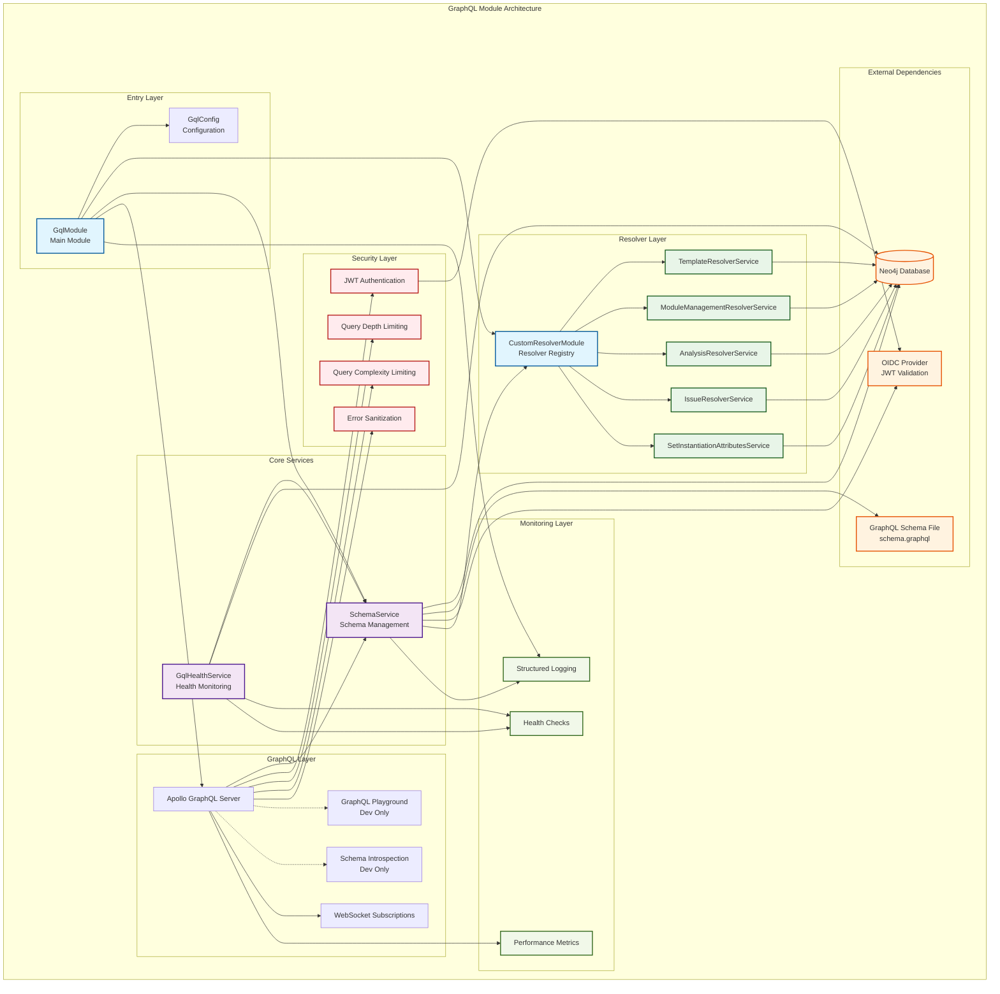

# GraphQL Module Architecture Overview

## System Architecture

The GraphQL module follows a layered architecture pattern with clear separation of concerns, providing a robust, scalable, and maintainable GraphQL API implementation.

## Architecture Diagram



## Architectural Layers

### 1. **Entry Layer**
The entry point and configuration layer that initializes the entire GraphQL system.

**Components:**
- **`GqlModule`**: Main NestJS module orchestrating all components
- **`GqlConfig`**: Centralized configuration with environment-based settings

**Responsibilities:**
- Module initialization and dependency injection
- Environment-specific configuration management
- Integration with NestJS application lifecycle

### 2. **Core Services Layer**
Business logic and schema management services.

**Components:**
- **`SchemaService`**: GraphQL schema creation and management
- **`GqlHealthService`**: System health monitoring and diagnostics

**Responsibilities:**
- Schema compilation and validation
- Custom resolver integration
- Health checks and system monitoring
- Error handling and logging

### 3. **Resolver Layer**
Custom business logic implementations for GraphQL field resolution.

**Components:**
- **`CustomResolverModule`**: Resolver service registry and provider
- **Resolver Services**: Individual business logic implementations
  - `TemplateResolverService`
  - `ModuleManagementResolverService`
  - `AnalysisResolverService`
  - `IssueResolverService`
  - `SetInstantiationAttributesService`

**Responsibilities:**
- Custom field resolution logic
- Database query execution
- Business rule implementation
- Data transformation and computation

### 4. **GraphQL Layer**
Apollo GraphQL server integration and API exposure.

**Components:**
- **Apollo GraphQL Server**: Core GraphQL execution engine
- **GraphQL Playground**: Development interface (dev only)
- **Schema Introspection**: Schema exploration (dev only)
- **WebSocket Subscriptions**: Real-time data updates

**Responsibilities:**
- GraphQL query parsing and execution
- HTTP and WebSocket protocol handling
- Development tooling integration
- Real-time subscription management

### 5. **Security Layer**
Comprehensive security measures for production deployment.

**Components:**
- **JWT Authentication**: Token-based user authentication
- **Query Depth Limiting**: Protection against deeply nested queries
- **Query Complexity Limiting**: Prevention of expensive operations
- **Error Sanitization**: Secure error message handling

**Responsibilities:**
- User authentication and authorization
- Query validation and limiting
- Security policy enforcement
- Sensitive information protection

### 6. **Monitoring Layer**
Observability and system health tracking.

**Components:**
- **Structured Logging**: Comprehensive operation logging
- **Health Checks**: System component status monitoring
- **Performance Metrics**: Query performance tracking

**Responsibilities:**
- Operation logging and audit trails
- System health monitoring
- Performance metrics collection
- Error tracking and alerting

## Data Flow Architecture

### 1. **Request Processing Flow**

```
HTTP Request → Apollo Server → Authentication → Query Validation → Schema Resolution → Custom Resolvers → Database → Response
```

**Detailed Steps:**
1. **HTTP Request**: Client sends GraphQL query/mutation
2. **Apollo Server**: Parses and validates GraphQL syntax
3. **Authentication**: JWT token validation (if required)
4. **Query Validation**: Depth/complexity limiting checks
5. **Schema Resolution**: Neo4j GraphQL auto-resolution
6. **Custom Resolvers**: Business logic execution
7. **Database**: Neo4j query execution
8. **Response**: Formatted JSON response

### 2. **Schema Creation Flow**

```
Schema File → SchemaService → Resolver Merging → Neo4j GraphQL → Executable Schema
```

**Detailed Steps:**
1. **Schema File**: Load GraphQL type definitions
2. **SchemaService**: Validate schema syntax and structure
3. **Resolver Merging**: Combine all custom resolvers
4. **Neo4j GraphQL**: Generate CRUD operations and integrate resolvers
5. **Executable Schema**: Final schema ready for execution

### 3. **Health Check Flow**

```
Health Request → GqlHealthService → Component Checks → Status Aggregation → Health Response
```

**Component Checks:**
- Neo4j database connectivity
- GraphQL schema validation
- Service availability verification

## Component Interactions

### 1. **Module Dependencies**

```typescript
GqlModule
├── ConfigModule (Configuration management)
├── DatabaseModule (Neo4j connection)
├── CustomResolverModule (Custom resolvers)
└── GraphQLModule (Apollo integration)
```

### 2. **Service Dependencies**

```typescript
SchemaService
├── ConfigService (Configuration access)
├── Neo4j Driver (Database connection)
└── ResolverServices[] (Custom business logic)

GqlHealthService
├── SchemaService (Schema validation)
└── Neo4j Driver (Connection testing)
```

### 3. **Resolver Dependencies**

```typescript
ResolverService
├── Neo4j Driver (Database queries)
├── ModuleRegistryService (Module management)
└── Business Services (Domain logic)
```

## Security Architecture

### 1. **Authentication Flow**

```
Client Request → JWT Token → OIDC Validation → User Context → Resolver Access
```

**Security Layers:**
- **Transport Security**: HTTPS/WSS encryption
- **Token Validation**: JWT signature verification
- **Context Propagation**: User information in resolvers
- **Authorization**: Role-based access control

### 2. **Query Protection**

```
GraphQL Query → Depth Analysis → Complexity Analysis → Execution
```

**Protection Mechanisms:**
- **Depth Limiting**: Prevents deeply nested queries
- **Complexity Scoring**: Assigns cost to each field
- **Query Timeout**: Prevents long-running operations
- **Rate Limiting**: Controls request frequency (external)

## Scalability Architecture

### 1. **Horizontal Scaling**

**Stateless Design:**
- No server-side session storage
- Database connection pooling
- Schema caching in memory

**Load Balancing:**
- Multiple application instances
- Shared Neo4j database cluster
- Session affinity for subscriptions

### 2. **Performance Optimization**

**Caching Strategy:**
- Schema compiled once at startup
- Database connection pooling
- Query result caching (external)

**Resource Management:**
- Automatic database session cleanup
- Memory-efficient resolver execution
- Lazy schema building

## Deployment Architecture

### 1. **Development Environment**

```
Developer → GraphQL Playground → GqlModule → Local Neo4j
```

**Features Enabled:**
- GraphQL Playground interface
- Schema introspection
- Detailed error messages
- Relaxed security limits

### 2. **Production Environment**

```
Load Balancer → Multiple App Instances → GqlModule → Neo4j Cluster
```

**Features Enabled:**
- Security hardening
- Error sanitization
- Query limiting
- Health check endpoints

### 3. **Monitoring Integration**

```
Application → Structured Logs → Log Aggregation → Monitoring Dashboard
Application → Health Checks → Health Monitoring → Alerting System
```

## Error Handling Architecture

### 1. **Error Classification**

**System Errors:**
- Database connection failures
- Schema compilation errors
- Service unavailability

**User Errors:**
- Invalid GraphQL syntax
- Authentication failures
- Authorization violations

**Business Errors:**
- Validation failures
- Business rule violations
- Data not found

### 2. **Error Flow**

```
Error Occurrence → Error Classification → Logging → Sanitization → Client Response
```

**Error Handling Strategy:**
- **Catch Early**: Validate inputs before processing
- **Log Everything**: Comprehensive error logging
- **Sanitize Output**: Hide internal details in production
- **Graceful Degradation**: Continue operation when possible

## Configuration Architecture

### 1. **Environment-Based Configuration**

```
Environment Variables → Configuration Validation → Type-Safe Config → Service Injection
```

**Configuration Layers:**
- **Environment Variables**: External configuration
- **Default Values**: Sensible fallbacks
- **Validation**: Runtime configuration checking
- **Type Safety**: TypeScript configuration classes

### 2. **Configuration Categories**

**Security Configuration:**
- Authentication settings
- Query limits
- Error handling modes

**Database Configuration:**
- Connection parameters
- Pool settings
- Timeout values

**Feature Configuration:**
- Playground enablement
- Subscription settings
- Logging levels

## Testing Architecture

### 1. **Testing Layers**

**Unit Tests:**
- Individual service testing
- Resolver function testing
- Configuration validation testing

**Integration Tests:**
- Module integration testing
- Database connectivity testing
- Schema compilation testing

**End-to-End Tests:**
- Complete GraphQL query testing
- Authentication flow testing
- Error handling testing

### 2. **Test Isolation**

```
Test Suite → Mock Dependencies → Service Under Test → Assertions
```

**Mocking Strategy:**
- Mock Neo4j driver for unit tests
- Mock authentication for resolver tests
- Mock configuration for service tests

## Future Architecture Considerations

### 1. **Potential Enhancements**

**Performance:**
- Query result caching layer
- Database query optimization
- Connection pool tuning

**Security:**
- Rate limiting implementation
- Advanced query analysis
- Audit logging enhancement

**Monitoring:**
- Distributed tracing integration
- Advanced metrics collection
- Real-time alerting system

### 2. **Scalability Improvements**

**Microservices:**
- Resolver service separation
- Independent deployment
- Service mesh integration

**Caching:**
- Redis integration
- Query result caching
- Schema caching distribution

This architecture provides a solid foundation for a production-ready GraphQL API with clear separation of concerns, comprehensive security, and excellent maintainability.
