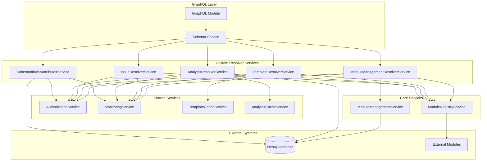

# Custom Resolver Services Documentation

## Overview

The Dethernety GraphQL module includes a comprehensive suite of **custom resolver services** that extend the auto-generated Neo4j GraphQL API with specialized business logic. These services provide advanced functionality for module management, template generation, issue synchronization, analysis execution, and component attribute management.

## 🏗️ **Architecture Overview**



## 📋 **Service Index**

1. [ModuleManagementResolverService](#1-modulemanagementresolverservice)
2. [TemplateResolverService](#2-templateresolverservice)
3. [IssueResolverService](#3-issueresolverservice)
4. [AnalysisResolverService](#4-analysisresolverservice)
5. [SetInstantiationAttributesService](#5-setinstantiationattributesservice)
6. [Shared Services](#6-shared-services)

---

## 1. ModuleManagementResolverService

**Location**: `src/gql/resolver-services/module-management-resolver.service.ts`

### **Purpose**
Provides GraphQL mutations for managing external modules, including installation, reset, and health monitoring operations.

### **Key Features**
- ✅ Module installation and reset operations
- ✅ Health status monitoring
- ✅ Statistics and performance metrics
- ✅ Authorization framework integration
- ✅ Comprehensive error handling and logging

### **GraphQL Resolvers**

#### **Mutations**

##### `resetModule(input: ResetModuleInput): Boolean`
Resets a module by reinstalling it from the module registry.

**Input Schema:**
```graphql
input ResetModuleInput {
  moduleName: String!
}
```

**Implementation:**
```typescript
async resetModule(input: ResetModuleInput): Promise<boolean> {
  // Input validation
  const validation = this.validateResetModuleInput(input);
  if (!validation.isValid) {
    throw new Error(`Validation failed: ${validation.errors.join(', ')}`);
  }

  // Authorization check
  const authResult = await this.checkAuthorization(context, {
    operationType: 'mutation',
    operationName: 'resetModule',
    resourceType: 'module',
    resourceId: input.moduleName,
  });

  // Execute module reset
  const moduleInstance = this.moduleRegistry.getModuleByName(input.moduleName);
  const result = await this.moduleManagement.resetSingleModule(moduleInstance);
  
  // Record operation metrics
  this.recordOperation('resetModule', Date.now() - startTime, {
    moduleName: input.moduleName,
    success: true,
  });

  return true;
}
```

### **Core Methods**

#### **`validateResetModuleInput(input: ResetModuleInput): ValidationResult`**
Validates input parameters for module reset operations.

**Validation Rules:**
- Module name is required and must be a string
- Module name length must be between 1-100 characters
- Module name format must match `^[a-zA-Z0-9_.-]+$`

#### **`checkAuthorization(context: AuthorizationContext, operation: OperationContext): Promise<AuthorizationResult>`**
Performs authorization checks (currently pass-through, ready for future enhancement).

#### **`recordOperation(operationName: string, duration: number, metadata?: any): void`**
Records operation metrics for monitoring and performance analysis.

### **Statistics & Monitoring**

#### **`getStatistics(): ResolverStatistics`**
Returns comprehensive service statistics:
```typescript
interface ResolverStatistics {
  totalOperations: number;
  successfulOperations: number;
  failedOperations: number;
  averageOperationTime: number;
  operationsByType: Map<string, number>;
  lastOperationAt?: Date;
}
```

#### **`getModuleHealth(): ModuleHealthStatus[]`**
Returns health status for all registered modules:
```typescript
interface ModuleHealthStatus {
  id: string;
  name: string;
  healthy: boolean;
  lastChecked: Date;
  responseTime?: number;
  error?: string;
}
```

---

## 2. TemplateResolverService

**Location**: `src/gql/resolver-services/template-resolver.service.ts`

### **Purpose**
Provides GraphQL resolvers for fetching module templates and class configuration guides with intelligent caching.

### **Key Features**
- ✅ Module template generation
- ✅ Class template and guide retrieval
- ✅ LRU caching with TTL (configurable)
- ✅ Timeout protection for module calls
- ✅ Health monitoring and cache statistics

### **GraphQL Resolvers**

#### **Queries**

##### `getModuleTemplate(moduleName: String!): TemplateResponse`
Retrieves the complete template for a module.

**Response Schema:**
```graphql
type TemplateResponse {
  template: String!
  metadata: TemplateMetadata!
}

type TemplateMetadata {
  moduleName: String!
  version: String
  generatedAt: String!
  cached: Boolean!
  cacheHit: Boolean!
}
```

**Implementation:**
```typescript
async getModuleTemplate(moduleName: string, context?: any): Promise<TemplateResponse> {
  // Input validation
  const validation = this.validateTemplateRequest({ moduleName, type: 'module' });
  if (!validation.isValid) {
    throw new Error(`Validation failed: ${validation.errors.join(', ')}`);
  }

  // Check cache first
  const cacheKey = `module:${moduleName}`;
  const cached = this.templateCache.get(cacheKey);
  if (cached) {
    return {
      template: cached.template,
      metadata: {
        ...cached.metadata,
        cached: true,
        cacheHit: true,
      },
    };
  }

  // Authorization check
  await this.checkAuthorization(context, {
    operationType: 'query',
    operationName: 'getModuleTemplate',
    resourceType: 'template',
    resourceId: moduleName,
  });

  // Get module instance and generate template
  const moduleInstance = this.moduleRegistry.getModuleByName(moduleName);
  const template = await Promise.race([
    moduleInstance.getTemplate(),
    new Promise<never>((_, reject) =>
      setTimeout(() => reject(new Error('Template generation timeout')), this.operationTimeout)
    ),
  ]);

  // Cache the result
  const response = {
    template,
    metadata: {
      moduleName,
      version: moduleInstance.getMetadata?.()?.version,
      generatedAt: new Date().toISOString(),
      cached: true,
      cacheHit: false,
    },
  };

  this.templateCache.set(cacheKey, response);
  return response;
}
```

##### `getClassTemplate(moduleName: String!, className: String!): TemplateResponse`
Retrieves the template for a specific class within a module.

##### `getClassGuide(moduleName: String!, className: String!): TemplateResponse`
Retrieves the configuration guide for a specific class.

### **Core Methods**

#### **`validateTemplateRequest(request: TemplateRequest): TemplateValidationResult`**
Validates template request parameters with comprehensive rules.

#### **`checkModuleHealth(moduleName: string): Promise<boolean>`**
Checks if a module is healthy and responsive (with caching).

### **Caching Strategy**

#### **Cache Configuration**
```typescript
interface CacheConfig {
  maxSize: number;        // Default: 100
  ttlMs: number;         // Default: 300000 (5 minutes)
  checkPeriodMs: number; // Default: 60000 (1 minute)
}
```

#### **Cache Operations**
- **`get(key: string): CachedItem | null`** - Retrieve cached item
- **`set(key: string, value: any): void`** - Store item in cache
- **`invalidateModule(moduleName: string): void`** - Clear all cache entries for a module

### **Performance Metrics**
```typescript
interface TemplateOperationStatistics {
  totalRequests: number;
  successfulRequests: number;
  failedRequests: number;
  averageResponseTime: number;
  cacheHitRate: number;
  requestsByModule: Map<string, number>;
  timeoutCount: number;
}
```

---

## 3. IssueResolverService

**Location**: `src/gql/resolver-services/issue-resolver.service.ts`

### **Purpose**
Provides GraphQL custom resolver for synchronizing issue attributes with external issue tracking systems. **No caching** is implemented to ensure real-time synchronization.

### **Key Features**
- ✅ Real-time issue synchronization (no caching)
- ✅ External system integration via modules
- ✅ Timeout protection for sync operations
- ✅ Comprehensive fallback mechanisms
- ✅ Sync statistics and monitoring
- ✅ Modern Neo4j v7 transaction patterns

### **GraphQL Resolvers**

#### **Field Resolvers**

##### `Issue.syncedAttributes: SyncedAttributesResponse`
Synchronizes and returns the current attributes from external issue tracking systems.

**Response Schema:**
```graphql
type SyncedAttributesResponse {
  attributes: JSON!
  _metadata: SyncMetadata!
}

type SyncMetadata {
  lastSyncAt: String!
  syncedAt: String!
  synced: Boolean!
  message: String
}
```

**Implementation:**
```typescript
async syncedAttributes(
  { id, attributes, issueClass, lastSyncAt }: IssueResolverInput,
  context?: any
): Promise<SyncedAttributesResponse> {
  // Input validation
  const validation = this.validateResolverInput({ id, attributes, issueClass, lastSyncAt });
  if (!validation.isValid) {
    return {
      attributes: this.parseAttributes(attributes),
      _metadata: {
        lastSyncAt: lastSyncAt || '',
        syncedAt: new Date().toISOString(),
        synced: false,
        message: `Validation failed: ${validation.errors.join(', ')}`,
      },
    };
  }

  // Check for existing sync operation (mutex)
  if (this.syncMutex.has(id)) {
    return await this.syncMutex.get(id)!;
  }

  // Extract module name and perform sync
  const moduleName = issueClass[0]?.module[0]?.name;
  const syncPromise = this.performSyncWithFallback(id, attributes, moduleName, lastSyncAt, authContext);
  
  this.syncMutex.set(id, syncPromise);
  
  try {
    return await syncPromise;
  } finally {
    this.syncMutex.delete(id);
  }
}
```

### **Core Methods**

#### **`getUpdatedIssue(issueId: string, attributes: string | null, moduleName: string, lastSyncAt: string | null): Promise<SyncResult>`**
Performs the actual synchronization with external systems.

**Process Flow:**
1. **Input Validation** - Validate all parameters
2. **Authorization Check** - Verify user permissions
3. **Module Lookup** - Get module instance from registry
4. **External Sync** - Call module's `getSyncedIssueAttributes` method with timeout
5. **Database Update** - Update `lastSyncAt` timestamp in Neo4j
6. **Response Building** - Parse attributes and build response

#### **`setSyncedDate(issueId: string): Promise<DatabaseOperationResult<string>>`**
Updates the last sync timestamp in the database using modern Neo4j v7 patterns.

```typescript
private async setSyncedDate(issueId: string): Promise<DatabaseOperationResult<string>> {
  const session = this.neo4jDriver.session({
    database: this.configService.get('database.name') || 'neo4j',
  });

  try {
    const result = await session.executeWrite(async (tx: any) => {
      return await tx.run(
        'MATCH (i:Issue {id: $issueId}) SET i.lastSyncAt = $syncedAt RETURN i.lastSyncAt AS lastSyncAt',
        { issueId, syncedAt: new Date().toISOString() },
      );
    });

    return {
      success: true,
      data: result.records[0]?.get('lastSyncAt'),
      duration: Date.now() - startTime,
    };
  } catch (error) {
    return {
      success: false,
      error: error.message,
      duration: Date.now() - startTime,
    };
  } finally {
    await session.close();
  }
}
```

#### **`parseAttributes(attributesJson: string | null): IssueAttributes`**
Safely parses JSON attributes with comprehensive error handling.

### **No-Caching Design**
The service intentionally **does not implement caching** because:
- **Real-time Sync**: Must always fetch fresh data from external systems
- **Business Logic**: Caching would prevent actual synchronization
- **Data Integrity**: Ensures users always get current issue state

### **Sync Statistics**
```typescript
interface IssueOperationStatistics {
  totalSyncRequests: number;
  successfulSyncs: number;
  failedSyncs: number;
  averageSyncTime: number;
  syncsByModule: Map<string, ModuleSyncStats>;
}

interface ModuleSyncStats {
  requests: number;
  successes: number;
  failures: number;
  averageTime: number;
}
```

---

## 4. AnalysisResolverService

**Location**: `src/gql/resolver-services/analysis-resolver.service.ts`

### **Purpose**
Provides GraphQL resolvers for AI-powered analysis operations, including long-running analysis sessions, real-time subscriptions, and parallel execution management.

### **Key Features**
- ✅ Long-running analysis sessions (15+ minutes, no timeouts)
- ✅ Real-time GraphQL subscriptions with PubSub
- ✅ Parallel analysis execution with different scopes
- ✅ Caching for Neo4j database operations only
- ✅ Session management and cleanup
- ✅ Modern Neo4j v7 transaction patterns

### **GraphQL Resolvers**

#### **Queries**

##### `getAnalysisStatus(analysisId: String!): AnalysisStatusResult`
Retrieves the current status of an analysis session.

##### `getAnalysisValueKeys(analysisId: String!): [String!]!`
Returns available value keys for an analysis.

##### `getAnalysisValues(analysisId: String!, keys: [String!]!): JSON!`
Retrieves specific analysis values by keys.

#### **Mutations**

##### `runAnalysis(input: AnalysisRequest!): AnalysisOperationResult`
Starts a new analysis session.

**Input Schema:**
```graphql
input AnalysisRequest {
  analysisId: String!
  scope: String
  parameters: JSON
}
```

**Implementation:**
```typescript
async runAnalysis(input: AnalysisRequest, context?: any): Promise<AnalysisOperationResult> {
  // Input validation
  const validation = this.validateAnalysisRequest(input);
  if (!validation.isValid) {
    throw new Error(`Validation failed: ${validation.errors.join(', ')}`);
  }

  // Authorization check
  await this.checkAuthorization(context, {
    operationType: 'mutation',
    operationName: 'runAnalysis',
    resourceType: 'analysis',
    resourceId: input.analysisId,
  });

  // Get analysis metadata (with caching for database operations)
  const metadata = await this.getAnalysisMetadataWithCache(input.analysisId);
  if (!metadata) {
    throw new Error(`Analysis not found: ${input.analysisId}`);
  }

  // Get module instance
  const moduleInstance = this.moduleRegistry.getModuleByName(metadata.moduleName);
  
  // Start long-running analysis (NO TIMEOUT - can run 15+ minutes)
  const analysisPromise = moduleInstance.runAnalysis(input.analysisId, input.parameters);
  
  // Track long-running analysis
  this.longRunningAnalyses.set(input.analysisId, {
    analysisId: input.analysisId,
    startedAt: new Date(),
    promise: analysisPromise,
    scope: input.scope,
  });

  // Publish start event
  this.pubSub.publish('ANALYSIS_STARTED', {
    analysisId: input.analysisId,
    scope: input.scope,
    startedAt: new Date(),
  });

  return {
    success: true,
    analysisId: input.analysisId,
    message: 'Analysis started successfully',
    metadata: {
      startedAt: new Date().toISOString(),
      scope: input.scope,
    },
  };
}
```

##### `startChat(input: ChatAnalysisRequest!): AnalysisOperationResult`
Starts an interactive chat analysis session.

##### `resumeAnalysis(input: ResumeAnalysisRequest!): AnalysisOperationResult`
Resumes a paused analysis session.

##### `deleteAnalysis(analysisId: String!): Boolean`
Deletes an analysis and cleans up resources.

**Implementation with Modern Neo4j v7:**
```typescript
private async deleteAnalysisNode(id: string): Promise<boolean> {
  const session = this.neo4jDriver.session({
    database: this.configService.get('database.name') || 'neo4j',
  });
  
  try {
    await session.executeWrite(async (tx: DatabaseTransaction) => {
      await tx.run(`MATCH (a {id: $id}) DETACH DELETE a`, { id });
    });
    
    this.analysisCache.invalidateAnalysis(id);
    return true;
  } catch (error) {
    this.logger.error('Failed to delete analysis node', {
      analysisId: id,
      error: error.message,
    });
    return false;
  } finally {
    await session.close();
  }
}
```

#### **Subscriptions**

##### `analysisUpdates(analysisId: String, scope: String): AnalysisStatusResult`
Real-time subscription for analysis progress updates.

**Implementation:**
```typescript
analysisUpdates: {
  subscribe: withFilter(
    () => this.pubSub.asyncIterator(['ANALYSIS_UPDATED', 'ANALYSIS_COMPLETED', 'ANALYSIS_ERROR']),
    (payload, variables) => {
      // Support parallel analysis execution with different scopes
      if (variables.analysisId && payload.analysisId !== variables.analysisId) {
        return false;
      }
      
      if (variables.scope && payload.scope !== variables.scope) {
        return false;
      }
      
      return true;
    },
  ),
  resolve: (payload) => payload,
}
```

### **Core Methods**

#### **`getAnalysisMetadataWithCache(analysisId: string): Promise<AnalysisMetadata | null>`**
Retrieves analysis metadata with caching for database operations only.

**Caching Strategy:**
- **Cache**: Neo4j database query results (metadata)
- **No Cache**: Module responses (real-time data)

#### **`getAnalysisClassAndModule(analysisId: string): Promise<AnalysisMetadata | null>`**
Queries analysis class and module information using modern Neo4j v7 patterns.

```typescript
private async getAnalysisClassAndModule(analysisId: string): Promise<AnalysisMetadata | null> {
  const session = this.neo4jDriver.session({
    database: this.configService.get('database.name') || 'neo4j',
  });
  
  try {
    const result = await session.executeRead(async (tx: DatabaseTransaction) => {
      return await tx.run(
        `MATCH (a {id: $analysisId})
         MATCH (a)<-[:ANALYZED_BY]-(e)
         MATCH (a)-[:IS_INSTANCE_OF]->(c:AnalysisClass)
         MATCH (c)<-[:HAS_CLASS]-(m:Module)
         RETURN c.id AS analysisClassId, m.name AS moduleName, e.id AS elementId`,
        { analysisId },
      );
    });

    if (result.records.length === 0) {
      return null;
    }

    const record = result.records[0];
    const metadata: AnalysisMetadata = {
      analysisClassId: record.get('analysisClassId'),
      moduleName: record.get('moduleName'),
      elementId: record.get('elementId'),
    };

    // Cache the metadata (database operation)
    this.analysisCache.setAnalysisMetadata(analysisId, metadata);
    return metadata;
  } finally {
    await session.close();
  }
}
```

### **Long-Running Analysis Management**

#### **Session Tracking**
```typescript
interface LongRunningAnalysis {
  analysisId: string;
  startedAt: Date;
  promise: Promise<any>;
  scope?: string;
}

private readonly longRunningAnalyses = new Map<string, LongRunningAnalysis>();
```

#### **Cleanup Operations**
- **Active Analysis Cleanup**: Removes completed/failed analyses
- **Subscription Cleanup**: Cleans up inactive PubSub subscriptions
- **Cache Cleanup**: Removes expired analysis metadata

### **PubSub Configuration**
```typescript
interface PubSubConfig {
  maxListeners: number;      // Default: 100
  cleanupInterval: number;   // Default: 300000 (5 minutes)
  subscriptionTimeout: number; // Default: 3600000 (1 hour)
}
```

### **Analysis Statistics**
```typescript
interface AnalysisOperationStatistics {
  totalAnalyses: number;
  activeAnalyses: number;
  completedAnalyses: number;
  failedAnalyses: number;
  averageAnalysisTime: number;
  analysesByModule: Map<string, number>;
  subscriptionCount: number;
  cacheHitRate: number;
}
```

---

## 5. SetInstantiationAttributesService

**Location**: `src/gql/resolver-services/set-instantiation-attributes.service.ts`

### **Purpose**
Provides GraphQL resolvers for managing component instantiation attributes, including exposures and countermeasures, with batch processing and modern Neo4j v7 transaction patterns.

### **Key Features**
- ✅ Modern Neo4j v7 transaction patterns (`executeRead`/`executeWrite`)
- ✅ Batch processing with debouncing for frequent updates
- ✅ Concurrency control using consistent mutex pattern
- ✅ Comprehensive input validation and error handling
- ✅ Performance monitoring and metrics

### **GraphQL Resolvers**

#### **Mutations**

##### `linkToExternalObject(input: LinkExternalObjectRequest!): Boolean`
Links a component to an external object.

##### `deleteObsoleteExternalObjects(input: DeleteObsoleteExternalObjectsRequest!): Boolean`
Removes obsolete external object relationships.

##### `upsertExposure(input: UpsertExposureRequest!): Boolean`
Creates or updates exposure relationships.

##### `upsertCountermeasures(input: UpsertCountermeasuresRequest!): Boolean`
Creates or updates countermeasure relationships.

##### `setAttributes(input: SetAttributesRequest!): Boolean`
Main method for setting component attributes with batch processing.

**Input Schema:**
```graphql
input SetAttributesRequest {
  componentId: String!
  attributes: JSON!
  metadata: JSON
}
```

**Implementation with Batch Processing:**
```typescript
async setAttributes(input: SetAttributesRequest, context?: any): Promise<boolean> {
  // Input validation
  const validation = this.validateSetAttributesRequest(input);
  if (!validation.isValid) {
    throw new Error(`Validation failed: ${validation.errors.join(', ')}`);
  }

  // Authorization check
  await this.checkAuthorization(context, {
    operationType: 'mutation',
    operationName: 'setAttributes',
    resourceType: 'component',
    resourceId: input.componentId,
  });

  // Use debounced batch processing for frequent updates
  const result = await this.executeWithConcurrencyControl(
    input.componentId,
    () => this.debouncedSetAttributes(input)
  );

  return result.success;
}
```

### **Core Methods**

#### **`executeWithConcurrencyControl<T>(resourceId: string, operation: () => Promise<T>): Promise<T>`**
Implements mutex pattern for single-resource operations.

```typescript
private async executeWithConcurrencyControl<T>(
  resourceId: string,
  operation: () => Promise<T>
): Promise<T> {
  // Check if operation is already in progress
  if (this.syncMutex.has(resourceId)) {
    await this.syncMutex.get(resourceId);
  }

  // Create new operation promise
  const operationPromise = operation();
  this.syncMutex.set(resourceId, operationPromise);

  try {
    const result = await operationPromise;
    return result;
  } finally {
    this.syncMutex.delete(resourceId);
  }
}
```

#### **`debouncedSetAttributes(input: SetAttributesRequest): Promise<SetAttributesResult>`**
Implements debouncing for batch processing of frequent frontend updates.

**Batch Processing Configuration:**
```typescript
interface BatchProcessingConfig {
  debounceMs: number;        // Default: 1000 (1 second)
  maxBatchSize: number;      // Default: 50
  batchTimeoutMs: number;    // Default: 5000 (5 seconds)
}
```

#### **Modern Neo4j v7 Transaction Implementation**
```typescript
private async performDatabaseOperation(
  componentId: string,
  attributes: any
): Promise<DatabaseOperationResult> {
  const session = this.neo4jDriver.session({
    database: this.configService.get('database.name') || 'neo4j',
  });

  try {
    const result = await session.executeWrite(async (tx: DatabaseTransaction) => {
      return await tx.run(
        `MATCH (c:Component {id: $componentId})
         SET c += $attributes
         SET c.updatedAt = datetime()
         RETURN c.id AS componentId`,
        { componentId, attributes }
      );
    });

    return {
      success: true,
      data: result.records[0]?.get('componentId'),
      duration: Date.now() - startTime,
    };
  } catch (error) {
    return {
      success: false,
      error: error.message,
      duration: Date.now() - startTime,
    };
  } finally {
    await session.close();
  }
}
```

### **Input Validation**

#### **`validateSetAttributesRequest(input: SetAttributesRequest): SetAttributesValidationResult`**
Comprehensive validation for attribute setting operations.

**Validation Rules:**
- Component ID is required and must be a string
- Component ID format validation
- Attributes must be a valid object
- Attribute key sanitization
- Value type validation
- Size limits for attributes

### **Batch Processing Metrics**
```typescript
interface BatchProcessingMetrics {
  totalBatches: number;
  averageBatchSize: number;
  averageProcessingTime: number;
  debouncedOperations: number;
  immediateOperations: number;
}
```

### **Concurrency Control Metrics**
```typescript
interface ConcurrencyControlMetrics {
  activeOperations: number;
  queuedOperations: number;
  averageWaitTime: number;
  concurrentOperationAttempts: number;
}
```

---

## 6. Shared Services

### **AuthorizationService**

**Location**: `src/gql/services/authorization.service.ts`

#### **Purpose**
Provides centralized authorization logic for all resolver services.

#### **Key Methods**

##### `checkAuthorization(context: AuthorizationContext, operation: OperationContext): Promise<AuthorizationResult>`
Performs authorization checks (currently pass-through, ready for enhancement).

##### `extractAuthContext(context: any): AuthorizationContext`
Extracts authorization context from GraphQL context.

### **MonitoringService**

**Location**: `src/gql/services/monitoring.service.ts`

#### **Purpose**
Provides centralized performance monitoring and metrics collection.

#### **Key Methods**

##### `recordOperation(metrics: OperationMetrics): void`
Records operation metrics for analysis.

```typescript
interface OperationMetrics {
  operationName: string;
  duration: number;
  success: boolean;
  timestamp: Date;
  metadata?: Record<string, any>;
}
```

##### `getStatistics(): MonitoringStatistics`
Returns comprehensive monitoring statistics.

##### `getHealthStatus(): HealthStatus`
Returns overall system health status.

### **TemplateCacheService**

**Location**: `src/gql/services/template-cache.service.ts`

#### **Purpose**
Provides LRU cache with TTL for template operations.

#### **Key Methods**

##### `get(key: string): CachedItem | null`
Retrieves cached item if not expired.

##### `set(key: string, value: any): void`
Stores item in cache with TTL.

##### `invalidateModule(moduleName: string): void`
Clears all cache entries for a specific module.

### **AnalysisCacheService**

**Location**: `src/gql/services/analysis-cache.service.ts`

#### **Purpose**
Specialized cache for analysis metadata (Neo4j operations only).

#### **Key Methods**

##### `getAnalysisMetadata(analysisId: string): AnalysisMetadata | null`
Retrieves cached analysis metadata.

##### `setAnalysisMetadata(analysisId: string, metadata: AnalysisMetadata): void`
Caches analysis metadata from database queries.

##### `invalidateAnalysis(analysisId: string): void`
Removes analysis from cache.

---

## 🔧 **Configuration**

### **Environment Variables**

```bash
# GraphQL Configuration
GRAPHQL_PLAYGROUND_ENABLED=false
GRAPHQL_INTROSPECTION_ENABLED=false
GRAPHQL_QUERY_DEPTH_LIMIT=10
GRAPHQL_QUERY_COMPLEXITY_LIMIT=1000

# Neo4j Configuration
NEO4J_URI=bolt://localhost:7687
NEO4J_USERNAME=neo4j
NEO4J_PASSWORD=password
NEO4J_DATABASE=neo4j

# Module Registry Configuration
MODULE_REGISTRY_PATH=./custom_modules
MODULE_REGISTRY_WHITELIST=module1,module2,module3

# Cache Configuration
TEMPLATE_CACHE_SIZE=100
TEMPLATE_CACHE_TTL_MS=300000
ANALYSIS_CACHE_SIZE=50
ANALYSIS_CACHE_TTL_MS=600000

# Operation Timeouts
TEMPLATE_OPERATION_TIMEOUT_MS=30000
ISSUE_SYNC_TIMEOUT_MS=30000
ANALYSIS_NO_TIMEOUT=true

# Batch Processing
BATCH_PROCESSING_DEBOUNCE_MS=1000
BATCH_PROCESSING_MAX_SIZE=50
BATCH_PROCESSING_TIMEOUT_MS=5000

# Monitoring
MONITORING_ENABLED=true
HEALTH_CHECK_INTERVAL_MS=60000
STATISTICS_RETENTION_HOURS=24
```

---

## 🚀 **Production Features**

### **Security**
- ✅ Input validation and sanitization
- ✅ Authorization framework (ready for enhancement)
- ✅ Cypher injection prevention
- ✅ Module whitelisting
- ✅ Secure file operations

### **Performance**
- ✅ Intelligent caching strategies
- ✅ Batch processing with debouncing
- ✅ Timeout protection
- ✅ Concurrency control
- ✅ Connection pooling

### **Reliability**
- ✅ Comprehensive error handling
- ✅ Graceful degradation
- ✅ Retry mechanisms
- ✅ Health monitoring
- ✅ Resource cleanup

### **Monitoring**
- ✅ Structured logging
- ✅ Performance metrics
- ✅ Health checks
- ✅ Statistics collection
- ✅ Error tracking

### **Scalability**
- ✅ Parallel execution support
- ✅ Resource pooling
- ✅ Efficient caching
- ✅ Batch operations
- ✅ Modern Neo4j v7 patterns

---

## 📊 **Monitoring & Health Checks**

### **Health Check Endpoints**

Each service provides health check methods:

```typescript
// Service-specific health checks
const moduleManagementHealth = moduleManagementResolver.getHealthStatus();
const templateHealth = templateResolver.getHealthStatus();
const issueHealth = issueResolver.getHealthStatus();
const analysisHealth = analysisResolver.getHealthStatus();
const attributesHealth = setInstantiationAttributesService.getHealthStatus();

// Overall health status
const overallHealth = {
  healthy: moduleManagementHealth.healthy && 
           templateHealth.healthy && 
           issueHealth.healthy && 
           analysisHealth.healthy && 
           attributesHealth.healthy,
  services: {
    moduleManagement: moduleManagementHealth,
    template: templateHealth,
    issue: issueHealth,
    analysis: analysisHealth,
    attributes: attributesHealth,
  },
  timestamp: new Date().toISOString(),
};
```

### **Performance Metrics**

Each service tracks comprehensive metrics:
- **Operation counts** (total, successful, failed)
- **Response times** (average, min, max)
- **Cache performance** (hit rate, evictions)
- **Resource utilization** (memory, connections)
- **Error rates** and types

---

## 🔗 **Integration Examples**

### **GraphQL Query Examples**

```graphql
# Get module template
query GetModuleTemplate {
  getModuleTemplate(moduleName: "security-scanner") {
    template
    metadata {
      moduleName
      version
      generatedAt
      cached
      cacheHit
    }
  }
}

# Sync issue attributes
query SyncIssueAttributes {
  issue(id: "ISSUE-123") {
    id
    title
    syncedAttributes {
      attributes
      _metadata {
        lastSyncAt
        syncedAt
        synced
        message
      }
    }
  }
}

# Start analysis
mutation StartAnalysis {
  runAnalysis(input: {
    analysisId: "analysis-456"
    scope: "security"
    parameters: {
      depth: 5
      includeThreats: true
    }
  }) {
    success
    analysisId
    message
    metadata
  }
}

# Subscribe to analysis updates
subscription AnalysisUpdates {
  analysisUpdates(analysisId: "analysis-456", scope: "security") {
    analysisId
    status
    progress
    results
    error
  }
}

# Set component attributes
mutation SetComponentAttributes {
  setAttributes(input: {
    componentId: "comp-789"
    attributes: {
      exposureLevel: "HIGH"
      countermeasures: ["firewall", "encryption"]
    }
    metadata: {
      updatedBy: "user-123"
      reason: "Security review"
    }
  })
}
```

### **Module Integration Example**

```typescript
import { Logger } from '@nestjs/common';

// External module implementation
export class SecurityScannerModule implements DTModule {
  constructor(
    private readonly driver: any,
    private readonly logger: Logger
  ) {
    this.logger.log('SecurityScannerModule initialized');
  }

  async getMetadata(): Promise<DTMetadata> {
    return {
      name: 'security-scanner',
      version: '1.0.0',
      description: 'Advanced security scanning module',
      // ... other metadata
    };
  }

  async getTemplate(): Promise<string> {
    this.logger.debug('Generating security scanner template');
    
    // Return module template
    const template = {
      scanTypes: ['vulnerability', 'compliance', 'penetration'],
      configurations: {
        // ... template configuration
      }
    };

    this.logger.log('Template generated successfully', {
      scanTypes: template.scanTypes.length,
      templateSize: JSON.stringify(template).length,
    });

    return JSON.stringify(template);
  }

  async getSyncedIssueAttributes(issueId: string, currentAttributes: string, lastSyncAt: string): Promise<string> {
    this.logger.log('Syncing issue attributes', {
      issueId,
      lastSyncAt,
      hasCurrentAttributes: !!currentAttributes,
    });

    try {
      // Sync with external issue tracking system
      const externalData = await this.fetchFromExternalSystem(issueId);
      
      this.logger.log('Issue sync completed', {
        issueId,
        attributeCount: Object.keys(externalData).length,
      });

      return JSON.stringify(externalData);
    } catch (error) {
      this.logger.error('Issue sync failed', {
        issueId,
        error: error.message,
      });
      throw error;
    }
  }

  async runAnalysis(analysisId: string, parameters: any): Promise<any> {
    this.logger.log('Starting security analysis', {
      analysisId,
      parameterCount: Object.keys(parameters).length,
    });

    try {
      // Perform long-running analysis
      const results = await this.performSecurityAnalysis(parameters);
      
      this.logger.log('Security analysis completed', {
        analysisId,
        duration: results.duration,
        threatsFound: results.threats?.length || 0,
      });

      return results;
    } catch (error) {
      this.logger.error('Security analysis failed', {
        analysisId,
        error: error.message,
        stack: error.stack,
      });
      throw error;
    }
  }
}
```

---

## 📚 **Additional Resources**

- [GraphQL Module Documentation](./README.md)
- [Schema Service Documentation](./ARCHITECTURE.md)
- [API Reference](./API_REFERENCE.md)
- [Production Checklist](../../PRODUCTION_CHECKLIST.md)
- [Neo4j JavaScript Driver Documentation](https://neo4j.com/docs/javascript-manual/current/transactions/)

---

## 🎯 **Summary**

The Custom Resolver Services provide a comprehensive, production-ready foundation for extending GraphQL functionality with:

- **5 specialized resolver services** for different business domains
- **4 shared services** for common functionality
- **Modern Neo4j v7 transaction patterns** throughout
- **Comprehensive monitoring and health checks**
- **Intelligent caching strategies** where appropriate
- **Robust error handling and validation**
- **Performance optimization** with batch processing and concurrency control
- **Real-time capabilities** with GraphQL subscriptions
- **Enterprise-grade security** and authorization framework
- **Enhanced logging** with NestJS Logger integration for external modules

Each service is designed to be **maintainable**, **scalable**, and **production-ready** with extensive documentation, monitoring, and testing capabilities.
