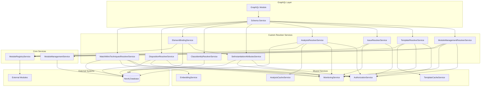

# Custom Resolver Services Documentation

## Overview

The Dethernety GraphQL module includes a set of custom resolver services that extend the auto-generated Neo4j GraphQL API with specialized business logic. These services provide advanced functionality for module management, template generation, issue synchronization, analysis execution, and component attribute management.

## Architecture Overview


```mermaid
graph TB
    subgraph "GraphQL Layer"
        GQL[GraphQL Module]
        SCHEMA[Schema Service]
    end

    subgraph "Custom Resolver Services"
        MMR[ModuleManagementResolverService]
        TR[TemplateResolverService]
        IR[IssueResolverService]
        AR[AnalysisResolverService]
        SIAR[SetInstantiationAttributesService]
        CIR[ClassIdentityResolverService]
        EBS[ElementBindingService]
        DRS[DispositionResolverService]
        MMT[MatchMitreTechniquesResolverService]
    end

    subgraph "Shared Services"
        AUTH[AuthorizationService]
        MON[MonitoringService]
        TC[TemplateCacheService]
        AC[AnalysisCacheService]
        EMB[EmbeddingService]
    end

    subgraph "Core Services"
        MMS[ModuleManagementService]
        MRS[ModuleRegistryService]
    end

    subgraph "External Systems"
        NEO4J[(Neo4j Database)]
        MODULES[External Modules]
    end

    GQL --> SCHEMA
    SCHEMA --> MMR
    SCHEMA --> TR
    SCHEMA --> IR
    SCHEMA --> AR
    SCHEMA --> SIAR
    SCHEMA --> CIR
    SCHEMA --> EBS
    SCHEMA --> DRS
    SCHEMA --> MMT

    MMR --> AUTH
    MMR --> MON
    MMR --> MMS
    MMR --> MRS

    TR --> AUTH
    TR --> MON
    TR --> TC
    TR --> MRS

    IR --> AUTH
    IR --> MON
    IR --> MRS

    AR --> AUTH
    AR --> MON
    AR --> AC
    AR --> MRS

    SIAR --> AUTH
    SIAR --> MON

    CIR --> NEO4J

    MMS --> NEO4J
    MRS --> MODULES
    AR --> NEO4J
    SIAR --> NEO4J
    EBS --> SIAR
    EBS --> NEO4J
    EBS --> MRS

    DRS --> AUTH
    DRS --> MON
    DRS --> NEO4J

    MMT --> AUTH
    MMT --> MON
    MMT --> EMB
    MMT --> NEO4J
```

## Service Index

1. [ModuleManagementResolverService](#1-modulemanagementresolverservice)
2. [TemplateResolverService](#2-templateresolverservice)
3. [IssueResolverService](#3-issueresolverservice)
4. [AnalysisResolverService](#4-analysisresolverservice)
5. [SetInstantiationAttributesService](#5-setinstantiationattributesservice)
6. [ClassIdentityResolverService](#6-classidentityresolverservice)
7. [ElementBindingService](#7-elementbindingservice)
8. [DispositionResolverService](#8-dispositionresolverservice)
9. [MatchMitreTechniquesResolverService](#9-matchmitretechniquesresolverservice)
10. [Shared Services](#10-shared-services)

---

## 1. ModuleManagementResolverService

**Location**: `src/gql/resolver-services/module-management-resolver.service.ts`

### Purpose
Provides GraphQL mutations for managing external modules, including installation, reset, and health monitoring operations.

### Key Features
- Module installation and reset operations
- Health status monitoring
- Statistics and performance metrics
- Authorization framework integration
- Error handling with logging

### GraphQL Resolvers

#### Mutations

##### `resetModule(input: ResetModuleInput): Boolean`
Resets a module by reinstalling it from the module registry.

**Input Schema:**
```graphql
input ResetModuleInput {
  moduleName: String!
}
```

**Implementation:**
```typescript
async resetModule(input: ResetModuleInput): Promise<boolean> {
  // Input validation
  const validation = this.validateResetModuleInput(input);
  if (!validation.isValid) {
    throw new Error(`Validation failed: ${validation.errors.join(', ')}`);
  }

  // Authorization check
  const authResult = await this.checkAuthorization(context, {
    operationType: 'mutation',
    operationName: 'resetModule',
    resourceType: 'module',
    resourceId: input.moduleName,
  });

  // Execute module reset
  const moduleInstance = this.moduleRegistry.getModuleByName(input.moduleName);
  const result = await this.moduleManagement.resetSingleModule(moduleInstance);

  // Record operation metrics
  this.recordOperation('resetModule', Date.now() - startTime, {
    moduleName: input.moduleName,
    success: true,
  });

  return true;
}
```

### Core Methods

#### `validateResetModuleInput(input: ResetModuleInput): ValidationResult`
Validates input parameters for module reset operations.

**Validation Rules:**
- Module name is required and must be a string
- Module name length must be between 1-100 characters
- Module name format must match `^[a-zA-Z0-9_.-]+$`

#### `checkAuthorization(context: AuthorizationContext, operation: OperationContext): Promise<AuthorizationResult>`
Performs authorization checks (currently pass-through, ready for future enhancement).

#### `recordOperation(operationName: string, duration: number, metadata?: any): void`
Records operation metrics for monitoring and performance analysis.

### Statistics and Monitoring

#### `getStatistics(): ResolverStatistics`
Returns service statistics:
```typescript
interface ResolverStatistics {
  totalOperations: number;
  successfulOperations: number;
  failedOperations: number;
  averageOperationTime: number;
  operationsByType: Map<string, number>;
  lastOperationAt?: Date;
}
```

#### `getModuleHealth(): ModuleHealthStatus[]`
Returns health status for all registered modules:
```typescript
interface ModuleHealthStatus {
  id: string;
  name: string;
  healthy: boolean;
  lastChecked: Date;
  responseTime?: number;
  error?: string;
}
```

---

## 2. TemplateResolverService

**Location**: `src/gql/resolver-services/template-resolver.service.ts`

### Purpose
Provides GraphQL resolvers for fetching module templates and class configuration guides with LRU caching with TTL.

### Key Features
- Module template generation
- Class template and guide retrieval
- LRU caching with TTL (configurable)
- Timeout protection for module calls
- Health monitoring and cache statistics

### GraphQL Resolvers

#### Queries

##### `getModuleTemplate(moduleName: String!): TemplateResponse`
Retrieves the complete template for a module.

**Response Schema:**
```graphql
type TemplateResponse {
  template: String!
  metadata: TemplateMetadata!
}

type TemplateMetadata {
  moduleName: String!
  version: String
  generatedAt: String!
  cached: Boolean!
  cacheHit: Boolean!
}
```

**Implementation:**
```typescript
async getModuleTemplate(moduleName: string, context?: any): Promise<TemplateResponse> {
  // Input validation
  const validation = this.validateTemplateRequest({ moduleName, type: 'module' });
  if (!validation.isValid) {
    throw new Error(`Validation failed: ${validation.errors.join(', ')}`);
  }

  // Check cache first
  const cacheKey = `module:${moduleName}`;
  const cached = this.templateCache.get(cacheKey);
  if (cached) {
    return {
      template: cached.template,
      metadata: {
        ...cached.metadata,
        cached: true,
        cacheHit: true,
      },
    };
  }

  // Authorization check
  await this.checkAuthorization(context, {
    operationType: 'query',
    operationName: 'getModuleTemplate',
    resourceType: 'template',
    resourceId: moduleName,
  });

  // Get module instance and generate template
  const moduleInstance = this.moduleRegistry.getModuleByName(moduleName);
  const template = await Promise.race([
    moduleInstance.getTemplate(),
    new Promise<never>((_, reject) =>
      setTimeout(() => reject(new Error('Template generation timeout')), this.operationTimeout)
    ),
  ]);

  // Cache the result
  const response = {
    template,
    metadata: {
      moduleName,
      version: moduleInstance.getMetadata?.()?.version,
      generatedAt: new Date().toISOString(),
      cached: true,
      cacheHit: false,
    },
  };

  this.templateCache.set(cacheKey, response);
  return response;
}
```

##### `getClassTemplate(moduleName: String!, className: String!): TemplateResponse`
Retrieves the template for a specific class within a module.

##### `getClassGuide(moduleName: String!, className: String!): TemplateResponse`
Retrieves the configuration guide for a specific class.

### Core Methods

#### `validateTemplateRequest(request: TemplateRequest): TemplateValidationResult`
Validates template request parameters with format and length rules.

#### `checkModuleHealth(moduleName: string): Promise<boolean>`
Checks if a module is healthy and responsive (with caching).

### Caching Strategy

#### Cache Configuration
```typescript
interface CacheConfig {
  maxSize: number;        // Default: 100
  ttlMs: number;         // Default: 300000 (5 minutes)
  checkPeriodMs: number; // Default: 60000 (1 minute)
}
```

#### Cache Operations
- `get(key: string): CachedItem | null` - Retrieve cached item
- `set(key: string, value: any): void` - Store item in cache
- `invalidateModule(moduleName: string): void` - Clear all cache entries for a module

### Performance Metrics
```typescript
interface TemplateOperationStatistics {
  totalRequests: number;
  successfulRequests: number;
  failedRequests: number;
  averageResponseTime: number;
  cacheHitRate: number;
  requestsByModule: Map<string, number>;
  timeoutCount: number;
}
```

---

## 3. IssueResolverService

**Location**: `src/gql/resolver-services/issue-resolver.service.ts`

### Purpose
Provides GraphQL custom resolver for synchronizing issue attributes with external issue tracking systems. No caching is implemented to ensure real-time synchronization.

### Key Features
- Real-time issue synchronization (no caching)
- External system integration via modules
- Timeout protection for sync operations
- Fallback mechanisms
- Sync statistics and monitoring
- Neo4j v5 transaction patterns

### GraphQL Resolvers

#### Field Resolvers

##### `Issue.syncedAttributes: SyncedAttributesResponse`
Synchronizes and returns the current attributes from external issue tracking systems.

**Response Schema:**
```graphql
type SyncedAttributesResponse {
  attributes: JSON!
  _metadata: SyncMetadata!
}

type SyncMetadata {
  lastSyncAt: String!
  syncedAt: String!
  synced: Boolean!
  message: String
}
```

**Implementation:**
```typescript
async syncedAttributes(
  { id, attributes, issueClass, lastSyncAt }: IssueResolverInput,
  context?: any
): Promise<SyncedAttributesResponse> {
  // Input validation
  const validation = this.validateResolverInput({ id, attributes, issueClass, lastSyncAt });
  if (!validation.isValid) {
    return {
      attributes: this.parseAttributes(attributes),
      _metadata: {
        lastSyncAt: lastSyncAt || '',
        syncedAt: new Date().toISOString(),
        synced: false,
        message: `Validation failed: ${validation.errors.join(', ')}`,
      },
    };
  }

  // Check for existing sync operation (mutex)
  if (this.syncMutex.has(id)) {
    return await this.syncMutex.get(id)!;
  }

  // Extract module name and perform sync
  const moduleName = issueClass[0]?.module[0]?.name;
  const syncPromise = this.performSyncWithFallback(id, attributes, moduleName, lastSyncAt, authContext);

  this.syncMutex.set(id, syncPromise);

  try {
    return await syncPromise;
  } finally {
    this.syncMutex.delete(id);
  }
}
```

### Core Methods

#### `getUpdatedIssue(issueId: string, attributes: string | null, moduleName: string, lastSyncAt: string | null): Promise<SyncResult>`
Performs the actual synchronization with external systems.

**Process Flow:**
1. **Input Validation** - Validate all parameters
2. **Authorization Check** - Verify user permissions
3. **Module Lookup** - Get module instance from registry
4. **External Sync** - Call module's `getSyncedIssueAttributes` method with timeout
5. **Database Update** - Update `lastSyncAt` timestamp in Neo4j
6. **Response Building** - Parse attributes and build response

#### `setSyncedDate(issueId: string): Promise<DatabaseOperationResult<string>>`
Updates the last sync timestamp in the database using Neo4j v5 patterns.

```typescript
private async setSyncedDate(issueId: string): Promise<DatabaseOperationResult<string>> {
  const session = this.neo4jDriver.session({
    database: this.configService.get('database.name') || 'neo4j',
  });

  try {
    const result = await session.executeWrite(async (tx: any) => {
      return await tx.run(
        'MATCH (i:Issue {id: $issueId}) SET i.lastSyncAt = $syncedAt RETURN i.lastSyncAt AS lastSyncAt',
        { issueId, syncedAt: new Date().toISOString() },
      );
    });

    return {
      success: true,
      data: result.records[0]?.get('lastSyncAt'),
      duration: Date.now() - startTime,
    };
  } catch (error) {
    return {
      success: false,
      error: error.message,
      duration: Date.now() - startTime,
    };
  } finally {
    await session.close();
  }
}
```

#### `parseAttributes(attributesJson: string | null): IssueAttributes`
Safely parses JSON attributes with error handling.

### No-Caching Design
The service intentionally does not implement caching because:
- **Real-time Sync**: Must always fetch fresh data from external systems
- **Business Logic**: Caching would prevent actual synchronization
- **Data Integrity**: Users always get the current issue state

### Sync Statistics
```typescript
interface IssueOperationStatistics {
  totalSyncRequests: number;
  successfulSyncs: number;
  failedSyncs: number;
  averageSyncTime: number;
  syncsByModule: Map<string, ModuleSyncStats>;
}

interface ModuleSyncStats {
  requests: number;
  successes: number;
  failures: number;
  averageTime: number;
}
```

---

## 4. AnalysisResolverService

**Location**: `src/gql/resolver-services/analysis-resolver.service.ts`

### Purpose
Provides GraphQL resolvers for AI-powered analysis operations, including long-running analysis sessions, real-time subscriptions, and parallel execution management.

### Key Features
- Long-running analysis sessions (15+ minutes, no timeouts)
- Real-time GraphQL subscriptions with PubSub
- Parallel analysis execution with different scopes
- Caching for Neo4j database operations only
- Session management and cleanup
- Neo4j v5 transaction patterns

### GraphQL Resolvers

#### Queries

##### `getAnalysisStatus(analysisId: String!): AnalysisStatusResult`
Retrieves the current status of an analysis session.

##### `getAnalysisValueKeys(analysisId: String!): [String!]!`
Returns available value keys for an analysis.

##### `getAnalysisValues(analysisId: String!, keys: [String!]!): JSON!`
Retrieves specific analysis values by keys.

#### Mutations

##### `runAnalysis(input: AnalysisRequest!): AnalysisOperationResult`
Starts a new analysis session.

**Input Schema:**
```graphql
input AnalysisRequest {
  analysisId: String!
  scope: String
  parameters: JSON
}
```

**Implementation:**
```typescript
async runAnalysis(input: AnalysisRequest, context?: any): Promise<AnalysisOperationResult> {
  // Input validation
  const validation = this.validateAnalysisRequest(input);
  if (!validation.isValid) {
    throw new Error(`Validation failed: ${validation.errors.join(', ')}`);
  }

  // Authorization check
  await this.checkAuthorization(context, {
    operationType: 'mutation',
    operationName: 'runAnalysis',
    resourceType: 'analysis',
    resourceId: input.analysisId,
  });

  // Get analysis metadata (with caching for database operations)
  const metadata = await this.getAnalysisMetadataWithCache(input.analysisId);
  if (!metadata) {
    throw new Error(`Analysis not found: ${input.analysisId}`);
  }

  // Get module instance
  const moduleInstance = this.moduleRegistry.getModuleByName(metadata.moduleName);

  // Start long-running analysis (NO TIMEOUT - can run 15+ minutes)
  const analysisPromise = moduleInstance.runAnalysis(input.analysisId, input.parameters);

  // Track long-running analysis
  this.longRunningAnalyses.set(input.analysisId, {
    analysisId: input.analysisId,
    startedAt: new Date(),
    promise: analysisPromise,
    scope: input.scope,
  });

  // Publish start event
  this.pubSub.publish('ANALYSIS_STARTED', {
    analysisId: input.analysisId,
    scope: input.scope,
    startedAt: new Date(),
  });

  return {
    success: true,
    analysisId: input.analysisId,
    message: 'Analysis started successfully',
    metadata: {
      startedAt: new Date().toISOString(),
      scope: input.scope,
    },
  };
}
```

##### `startChat(input: ChatAnalysisRequest!): AnalysisOperationResult`
Starts an interactive chat analysis session.

##### `resumeAnalysis(input: ResumeAnalysisRequest!): AnalysisOperationResult`
Resumes a paused analysis session.

##### `deleteAnalysis(analysisId: String!): Boolean`
Deletes an analysis and cleans up resources.

**Implementation with Neo4j v5:**
```typescript
private async deleteAnalysisNode(id: string): Promise<boolean> {
  const session = this.neo4jDriver.session({
    database: this.configService.get('database.name') || 'neo4j',
  });

  try {
    await session.executeWrite(async (tx: DatabaseTransaction) => {
      await tx.run(`MATCH (a {id: $id}) DETACH DELETE a`, { id });
    });

    this.analysisCache.invalidateAnalysis(id);
    return true;
  } catch (error) {
    this.logger.error('Failed to delete analysis node', {
      analysisId: id,
      error: error.message,
    });
    return false;
  } finally {
    await session.close();
  }
}
```

#### Subscriptions

##### `analysisUpdates(analysisId: String, scope: String): AnalysisStatusResult`
Real-time subscription for analysis progress updates.

**Implementation:**
```typescript
analysisUpdates: {
  subscribe: withFilter(
    () => this.pubSub.asyncIterator(['ANALYSIS_UPDATED', 'ANALYSIS_COMPLETED', 'ANALYSIS_ERROR']),
    (payload, variables) => {
      // Support parallel analysis execution with different scopes
      if (variables.analysisId && payload.analysisId !== variables.analysisId) {
        return false;
      }

      if (variables.scope && payload.scope !== variables.scope) {
        return false;
      }

      return true;
    },
  ),
  resolve: (payload) => payload,
}
```

### Core Methods

#### `getAnalysisMetadataWithCache(analysisId: string): Promise<AnalysisMetadata | null>`
Retrieves analysis metadata with caching for database operations only.

**Caching Strategy:**
- **Cache**: Neo4j database query results (metadata)
- **No Cache**: Module responses (real-time data)

#### `getAnalysisClassAndModule(analysisId: string): Promise<AnalysisMetadata | null>`
Queries analysis class and module information using Neo4j v5 patterns.

```typescript
private async getAnalysisClassAndModule(analysisId: string): Promise<AnalysisMetadata | null> {
  const session = this.neo4jDriver.session({
    database: this.configService.get('database.name') || 'neo4j',
  });

  try {
    const result = await session.executeRead(async (tx: DatabaseTransaction) => {
      return await tx.run(
        `MATCH (a {id: $analysisId})
         MATCH (a)<-[:ANALYZED_BY]-(e)
         MATCH (a)-[:IS_INSTANCE_OF]->(c:AnalysisClass)
         MATCH (c)<-[:HAS_CLASS]-(m:Module)
         RETURN c.id AS analysisClassId, m.name AS moduleName, e.id AS elementId`,
        { analysisId },
      );
    });

    if (result.records.length === 0) {
      return null;
    }

    const record = result.records[0];
    const metadata: AnalysisMetadata = {
      analysisClassId: record.get('analysisClassId'),
      moduleName: record.get('moduleName'),
      elementId: record.get('elementId'),
    };

    // Cache the metadata (database operation)
    this.analysisCache.setAnalysisMetadata(analysisId, metadata);
    return metadata;
  } finally {
    await session.close();
  }
}
```

### Long-Running Analysis Management

#### Session Tracking
```typescript
interface LongRunningAnalysis {
  analysisId: string;
  startedAt: Date;
  promise: Promise<any>;
  scope?: string;
}

private readonly longRunningAnalyses = new Map<string, LongRunningAnalysis>();
```

#### Cleanup Operations
- **Active Analysis Cleanup**: Removes completed/failed analyses
- **Subscription Cleanup**: Cleans up inactive PubSub subscriptions
- **Cache Cleanup**: Removes expired analysis metadata

### PubSub Configuration
```typescript
interface PubSubConfig {
  maxListeners: number;      // Default: 100
  cleanupInterval: number;   // Default: 300000 (5 minutes)
  subscriptionTimeout: number; // Default: 3600000 (1 hour)
}
```

### Analysis Statistics
```typescript
interface AnalysisOperationStatistics {
  totalAnalyses: number;
  activeAnalyses: number;
  completedAnalyses: number;
  failedAnalyses: number;
  averageAnalysisTime: number;
  analysesByModule: Map<string, number>;
  subscriptionCount: number;
  cacheHitRate: number;
}
```

---

## 5. SetInstantiationAttributesService

**Location**: `src/gql/resolver-services/set-instantiation-attributes.service.ts`

### Purpose
Provides GraphQL resolvers for managing component instantiation attributes, including exposures and countermeasures, with batch processing and Neo4j v5 transaction patterns.

### Key Features
- Neo4j v5 transaction patterns (`executeRead`/`executeWrite`)
- Batch processing with debouncing for frequent updates
- Concurrency control using consistent mutex pattern
- Input validation and error handling
- Performance monitoring and metrics

### GraphQL Resolvers

#### Mutations

##### `linkToExternalObject(input: LinkExternalObjectRequest!): Boolean`
Links a component to an external object.

##### `deleteObsoleteExternalObjects(input: DeleteObsoleteExternalObjectsRequest!): Boolean`
Removes obsolete external object relationships.

##### `upsertExposure(input: UpsertExposureRequest!): Boolean`
Creates or updates exposure relationships.

##### `upsertCountermeasures(input: UpsertCountermeasuresRequest!): Boolean`
Creates or updates countermeasure relationships.

##### `setAttributes(input: SetAttributesRequest!): Boolean`
Main method for setting component attributes with batch processing.

**Input Schema:**
```graphql
input SetAttributesRequest {
  componentId: String!
  attributes: JSON!
  metadata: JSON
}
```

**Implementation with Batch Processing:**
```typescript
async setAttributes(input: SetAttributesRequest, context?: any): Promise<boolean> {
  // Input validation
  const validation = this.validateSetAttributesRequest(input);
  if (!validation.isValid) {
    throw new Error(`Validation failed: ${validation.errors.join(', ')}`);
  }

  // Authorization check
  await this.checkAuthorization(context, {
    operationType: 'mutation',
    operationName: 'setAttributes',
    resourceType: 'component',
    resourceId: input.componentId,
  });

  // Use debounced batch processing for frequent updates
  const result = await this.executeWithConcurrencyControl(
    input.componentId,
    () => this.debouncedSetAttributes(input)
  );

  return result.success;
}
```

### Core Methods

#### `executeWithConcurrencyControl<T>(resourceId: string, operation: () => Promise<T>): Promise<T>`
Implements mutex pattern for single-resource operations.

```typescript
private async executeWithConcurrencyControl<T>(
  resourceId: string,
  operation: () => Promise<T>
): Promise<T> {
  // Check if operation is already in progress
  if (this.syncMutex.has(resourceId)) {
    await this.syncMutex.get(resourceId);
  }

  // Create new operation promise
  const operationPromise = operation();
  this.syncMutex.set(resourceId, operationPromise);

  try {
    const result = await operationPromise;
    return result;
  } finally {
    this.syncMutex.delete(resourceId);
  }
}
```

#### `debouncedSetAttributes(input: SetAttributesRequest): Promise<SetAttributesResult>`
Implements debouncing for batch processing of frequent frontend updates.

**Batch Processing Configuration:**
```typescript
interface BatchProcessingConfig {
  debounceMs: number;        // Default: 1000 (1 second)
  maxBatchSize: number;      // Default: 50
  batchTimeoutMs: number;    // Default: 5000 (5 seconds)
}
```

#### Neo4j v5 Transaction Implementation
```typescript
private async performDatabaseOperation(
  componentId: string,
  attributes: any
): Promise<DatabaseOperationResult> {
  const session = this.neo4jDriver.session({
    database: this.configService.get('database.name') || 'neo4j',
  });

  try {
    const result = await session.executeWrite(async (tx: DatabaseTransaction) => {
      return await tx.run(
        `MATCH (c:Component {id: $componentId})
         SET c += $attributes
         SET c.updatedAt = datetime()
         RETURN c.id AS componentId`,
        { componentId, attributes }
      );
    });

    return {
      success: true,
      data: result.records[0]?.get('componentId'),
      duration: Date.now() - startTime,
    };
  } catch (error) {
    return {
      success: false,
      error: error.message,
      duration: Date.now() - startTime,
    };
  } finally {
    await session.close();
  }
}
```

### Input Validation

#### `validateSetAttributesRequest(input: SetAttributesRequest): SetAttributesValidationResult`
Validation for attribute setting operations.

**Validation Rules:**
- Component ID is required and must be a string
- Component ID format validation
- Attributes must be a valid object
- Attribute key sanitization
- Value type validation
- Size limits for attributes

### Batch Processing Metrics
```typescript
interface BatchProcessingMetrics {
  totalBatches: number;
  averageBatchSize: number;
  averageProcessingTime: number;
  debouncedOperations: number;
  immediateOperations: number;
}
```

### Concurrency Control Metrics
```typescript
interface ConcurrencyControlMetrics {
  activeOperations: number;
  queuedOperations: number;
  averageWaitTime: number;
  concurrentOperationAttempts: number;
}
```

---

## 6. ClassIdentityResolverService

**Location**: [`src/gql/resolver-services/class-identity-resolver.service.ts`](../../../../apps/dt-ws/src/gql/resolver-services/class-identity-resolver.service.ts)

### Purpose

Exposes the engine-level class-identity surface to GraphQL so an operator can read the in-memory event log, resolve strict-mode rebind conflicts, and reconcile orphaned classes without DB shell access. Backs the admin **Operations** tab in `modules.vue`.

### Surfaces

| Kind | Field | Description |
|------|-------|-------------|
| Field resolver | `Module.rebindConflicts` | Joins `Module.lastInstallClassIds` against current DB ids; surfaces rows where they differ as `[RebindConflictDetail!]!` |
| Field resolver | `Module.constraintsHealthy` | Reflects the bootstrap result from `EnsureConstraintsService` |
| Query | `classIdentityEvents(kind?, moduleName?, since?)` | In-memory ring buffer (max 1000 events, drop-oldest, process-local) |
| Mutation | `migrateClassId(moduleName, className, classKind, newId)` | Audit-mode rebind of `(Module, *Class) → newId` |
| Mutation | `reviveOrphanedClass(classId, classKind)` | Flip `HAS_ORPHANED_CLASS` → `HAS_CLASS` |
| Mutation | `deleteOrphanedClass(classId, classKind, cascade)` | Hard-delete an orphaned class. Cascade gated on `incomingInstanceCount`; capped at 1000 incidents to stay within Memgraph's default per-tx memory ceiling |
| Mutation | `runIdentityMigration(dryRun)` | Re-run the idempotent class-identity cleanup migration |

### Authz model

**Every mutation AND the read query is gated by `requireAdmin(ctx)` at resolver entry** — see [`is-admin.ts`](../../../../apps/dt-ws/src/common/guards/is-admin.ts). The schema directive on these operations is just `@authentication` (token validity); the role check happens in TypeScript, not in the schema, to keep the admin contract role-aware without introducing a role-aware schema directive.

`requireAdmin` accepts admin from either `payload.roles` or `payload['cognito:groups']` — Cognito group mapping varies by deployment (some shops mirror groups into `roles` via a pre-token-generation Lambda, others ship the raw `cognito:groups` claim).

The `ctx.user` field is populated by the Apollo context factory (not by Nest's guard chain — Apollo handles `POST /graphql` directly). See [GRAPHQL_MODULE.md → JwtAuthGuard integration](./GRAPHQL_MODULE.md#jwtauthguard-integration-in-the-context-factory) for the context-creation flow.

### Audit log

Every admin mutation emits a `Logger.warn` structured entry **before** doing the work, capturing operator identity (`sub`, `email`) and arguments:

```typescript
this.logger.warn(`admin action: ${action}`, {
  action,
  args,
  operator: { sub: ctx?.user?.sub, email: ctx?.user?.email },
  timestamp: new Date().toISOString(),
})
```

Mutations that produce a class-identity event (`migrateClassId` is mechanically an audit-mode rebind, `reviveOrphanedClass` emits a `revive` event) **also** emit a structured event into the same in-memory log that automatic operations use — so the operator-driven action appears in the same timeline as the engine's own actions. No separate persisted audit log; if compliance later requires it, a downstream `Logger` transport handles persistence.

### Key invariants

- **TOCTOU guard on `migrateClassId`**: the write `MATCH` re-verifies `(oldId, className)` so a concurrent writer can't cause a misleading rebind event for a no-op write. Throws `ConflictException` if the pair changed between read and write.
- **Idempotent revive**: revive of an already-active class returns `true` without emitting an event (timeline shouldn't show a non-action).
- **Cascade hard cap**: `deleteOrphanedClass(cascade: true)` refuses above `CASCADE_HARD_LIMIT = 1000` incident instances — operator must chunk via direct Cypher or escalate the per-tx memory limit before retrying.
- **Cross-module collision check**: `migrateClassId` refuses if `newId` is already owned by a different Module at the same label.
- **Idempotent migration**: `runIdentityMigration` is safe to invoke any time — running twice produces an identical end state. `dryRun=true` (default) reports planned actions without writing.

### Related

- [Module → `rebindConflicts` field semantics](./SCHEMA.md#module)
- [Class-identity admin mutation reference](../GRAPHQL_API_REFERENCE.md#migrateclassid)
- [`Module.lastInstallClassIds` snapshot write](./MODULE_MANAGEMENT_SERVICE.md) (in `upsertModule`)

---

## 7. ElementBindingService

**Location**: [`src/gql/resolver-services/element-binding.service.ts`](../../../../apps/dt-ws/src/gql/resolver-services/element-binding.service.ts)

### Purpose

Owns the `changeElementBinding` mutation — the single sanctioned write path for the `IS_INSTANCE_OF` and `REPRESENTS_MODEL` edges. Replaces five legacy per-type wrappers with one atomic mutation that handles every binding transition (class → class, class → none, none → class, class → represented-model, represented-model → class) for Components, Security Boundaries, Data Flows, Data items, and Controls.

### Surfaces

| Kind | Field | Description |
|------|-------|-------------|
| Mutation | `changeElementBinding(elementId: ID!, target: ElementBindingInput!): ChangeElementBindingResult!` | Atomic binding change. Discriminated input (`kind: CLASS \| REPRESENTED_MODEL \| NONE`); structured result with `targetBinding` union, `deltas`, and `errorCode` taxonomy |

### Transaction shape

The mutation handler runs validation and a preflight read outside any transaction, then opens **one** `session.executeWrite(...)` block that performs:

1. **In-tx authoritative re-read** of the current binding (`IS_INSTANCE_OF` and `REPRESENTS_MODEL`). The preflight read is an optimisation that lets the resolver invoke module SDKs (which produce the to-be-instantiated exposures / countermeasures) before opening the write transaction; the in-tx read is the authority.
2. **Identity short-circuit** — if the in-tx-current binding equals the requested target, exit with `success = true, deltas = all-zero, errorCode = null`. No graph mutation persisted.
3. **Destructive sweep** of stale SYSTEM-derived findings on the disconnected class(es). The sweep predicate `createdBy = 'SYSTEM' OR createdBy IS NULL` is the contract that protects USER-authored findings from cascading deletes; null-`createdBy` legacy rows are treated as SYSTEM.
4. **Rewire** of `IS_INSTANCE_OF` / `REPRESENTS_MODEL` edges (idempotent `MERGE`).
5. **Constructive upsert** via the public tx-bound helpers `upsertExposuresInTx` / `upsertCountermeasuresInTx` from [`SetInstantiationAttributesService`](./SET_INSTANTIATION_ATTRIBUTES.md) — both write paths share one upsert implementation and one module-attribute sanitiser ([`shared/finding-attrs.ts`](../../../../apps/dt-ws/src/gql/resolver-services/shared/finding-attrs.ts)).

All five steps share one Bolt transaction. On any error inside the block (module-SDK failure, database error, constraint violation), Bolt rolls back the rewire and the upsert together — no partial graph state can land.

### Error taxonomy

`ElementBindingErrorCode` is an 8-value enum. The UI branches on the code rather than the message string so copy / locale changes don't break behaviour:

| Code | Meaning |
|------|---------|
| `VALIDATION_ERROR` | Input shape inconsistent with `kind` (e.g. `kind: CLASS` with `classIds` empty for a non-Control) |
| `ELEMENT_NOT_FOUND` | `elementId` resolves to no node |
| `CLASS_NOT_FOUND` | One or more `classIds` resolve to no class node |
| `MODEL_NOT_FOUND` | `modelId` resolves to no model node |
| `ORPHAN_CLASS_REFUSED` | Target class is in the orphaned-classes set (its module is uninstalled or unhealthy) |
| `REPRESENTED_MODEL_NOT_ALLOWED` | `REPRESENTED_MODEL` binding requested on an element type other than Component / SecurityBoundary |
| `MODULE_ERROR` | Module SDK call threw or returned an unusable payload |
| `DATABASE_ERROR` | Bolt rejected the transaction |

### Authz model

`@authentication` on the mutation in `schema.graphql`. The service performs no in-resolver authz — per project convention, JWT validation in the context factory and Neo4j session scoping own the authorization story; resolver and module code never duplicate it.

### Key invariants

- **Single write path.** Every `IS_INSTANCE_OF` and `REPRESENTS_MODEL` mutation routes through this service. Custom resolvers and modules MUST NOT bypass it with direct `MERGE` / `DELETE` of those edges.
- **USER findings are sacred.** The destructive sweep's `createdBy = 'SYSTEM' OR createdBy IS NULL` predicate never touches `createdBy = 'USER'` rows. Verified by the `provenance.e2e-spec.ts` legacy-null adoption suite.
- **Last-writer-wins on concurrent calls.** Two concurrent calls against the same `elementId` produce a deterministic forensic trail (both Bolt transactions commit; the later one wins the binding state). The frontend `binding_${elementId}` mutex serialises the common single-tab case; the in-tx authoritative read closes the window for the cross-tab / cross-client case.
- **Identity short-circuit returns zero deltas.** The client trusts the server's identity decision — the UI suppresses snackbar feedback on all-zero deltas, so a no-op round-trip is silent.

### Related

- [Atomic binding mutation in SCHEMA.md](./SCHEMA.md#atomic-binding-mutation-changeelementbinding)
- [Provenance fields on Exposure and Countermeasure](./SCHEMA.md#provenance-fields-on-exposure-and-countermeasure)
- [Tx-bound helpers in SetInstantiationAttributesService](./SET_INSTANTIATION_ATTRIBUTES.md#tx-bound-helpers-shared-with-changeelementbinding)
- [`DtClass.changeElementBinding` dt-core entry point](../../dt-core/GRAPHQL_OPERATIONS.md#changeelementbinding--atomic-class--model-binding)

---

## 8. DispositionResolverService

**Location**: [`src/gql/resolver-services/disposition-resolver.service.ts`](../../../../apps/dt-ws/src/gql/resolver-services/disposition-resolver.service.ts)

### Purpose

Lets a user record a structured decision — a *disposition* — on a SYSTEM-generated finding instead of deleting it. Applies to two node types: `Exposure` (via `HAS_EXPOSURE`) and `Countermeasure` (via `HAS_COUNTERMEASURE`). Backs the disposition dialog and the Supersede flow.

### Surfaces

| Kind | Field | Description |
|------|-------|-------------|
| Mutation | `disposeExposure(exposureId, kind, reason)` | Apply / modify / re-affirm an Exposure disposition |
| Mutation | `clearDisposition(exposureId)` | Clear an Exposure disposition |
| Mutation | `disposeCountermeasure(countermeasureId, kind, reason)` | Apply / modify / re-affirm a Countermeasure disposition |
| Mutation | `clearCountermeasureDisposition(countermeasureId)` | Clear a Countermeasure disposition |

All four return the shared `DispositionMutationResult`. Its `exposureId` field carries the finding id for **both** node types (a deliberate no-rename decision). See [DispositionMutationResult](../GRAPHQL_API_REFERENCE.md#dispositionmutationresult).

### Shared write logic

The four public mutations are thin wrappers. Each delegates to one of two private helpers with a hard-coded label:

- `disposeExposure` / `disposeCountermeasure` → `_applyDisposition(label, opName, pickable, args, ctx)`
- `clearDisposition` / `clearCountermeasureDisposition` → `_clearDisposition(label, opName, args, ctx)`

`label` is a hard-coded literal per public method (`'Exposure'` or `'Countermeasure'`), never user input — so the `MATCH (n:${label} {id: $id})` interpolation is injection-safe (the shipped single-label idiom). `id` is always a bound parameter.

### Per-type pickable sets

The `kind` is gated against a per-type allowlist passed by the caller — the server-side mirror of the dialog's UI filter. A kind outside the set returns `VALIDATION_ERROR`.

| Node type | Pickable kinds |
|-----------|----------------|
| Exposure | `NOT_APPLICABLE`, `FALSE_POSITIVE`, `COMPENSATING_CONTROL`, `RISK_ACCEPTED`, `SUPERSEDED` |
| Countermeasure | `NOT_APPLICABLE`, `FALSE_POSITIVE`, `WAIVED`, `SUPERSEDED` |

`SUPERSEDED` is accepted on both (the Supersede orchestrator submits it) but hidden in the dialog. `WAIVED` is countermeasure-only; `COMPENSATING_CONTROL` / `RISK_ACCEPTED` are exposure-only.

### Apply semantics

`_applyDisposition` derives the actor from the JWT `sub` claim (`ctx.user.sub`); an absent actor returns `VALIDATION_ERROR` as defence-in-depth (it should be impossible under `@authentication`). `reason` is required, non-empty after trim, and ≤2000 chars. A single `SET` writes all five disposition fields atomically:

- `dispositionKind` ← `kind`
- `dispositionReason` ← trimmed reason
- `dispositionedBy` ← actor (server-side)
- `dispositionedAt` ← now (server-side)
- `dispositionStale` ← `false`

Zero matched rows returns `EXPOSURE_NOT_FOUND` (the code is reused for both labels). Re-affirming a stale disposition is an ordinary apply call that clears `dispositionStale` back to `false`.

### Clear semantics

`_clearDisposition` sets all five fields to null in a single `SET`. Clearing an already-cleared finding is a successful no-op (the `SET`-to-null writes the same value).

### Error taxonomy

Domain errors come back as `success: false` (not thrown). `DispositionErrorCode` has three values:

| Code | Meaning |
|------|---------|
| `VALIDATION_ERROR` | Actor absent, id malformed, kind not pickable for the node type, or reason empty / over-length |
| `EXPOSURE_NOT_FOUND` | No node matched the supplied id (reused for both Exposure and Countermeasure) |
| `DATABASE_ERROR` | The graph write failed for an infrastructure reason |

### Authz model

`@authentication` on each mutation in `schema.graphql`. The service performs no in-resolver authz beyond deriving the actor for forensic attribution — per project convention, JWT validation and Neo4j session scoping own authorization.

### Disposition staleness

A disposition's `dispositionStale` flag tracks whether the finding has drifted since the user last reasoned about it. Two write paths flip it to `true`; both depend on `dispositionStale` **not** being `@settable`-locked (unlike `dispositionedBy` / `dispositionedAt`, which are):

1. **Attribute-change flip.** When an instantiation attribute value actually changes, [`SetInstantiationAttributesService`](./SET_INSTANTIATION_ATTRIBUTES.md) runs **two sibling single-edge Cypher statements** inside the same transaction:

   ```cypher
   MATCH (c {id: $componentId})-[:HAS_EXPOSURE]->(e:Exposure)
   WHERE e.dispositionKind IS NOT NULL
   SET e.dispositionStale = true
   ```

   and the `HAS_COUNTERMEASURE` / `Countermeasure` analogue. Each no-ops for the wrong element type (a component carries exposures, a Control carries countermeasures — never both on one node), so these are two independent single-edge flips, not a label-disjunction or two-hop traversal. The flip is gated at the TypeScript level on a `valueChanged` boolean: Memgraph 3.8's planner does not constant-fold a Bolt boolean ahead of the seed lookup, so an unconditional run would waste the `MATCH`. The returned `staleFlippedCount` sums both statements.

2. **USER-copy-delete companion.** When a USER copy of a finding is deleted, a fire-and-forget `updateExposures` / `updateCountermeasures` flips `dispositionStale = true` on any `SUPERSEDED` finding whose `dispositionReason CONTAINS "'<name>'"` (single-quote-wrapped). The single-quote wrapping in the default `SUPERSEDED` reason is load-bearing for this match.

See [Disposition fields on Exposure and Countermeasure](./SCHEMA.md#disposition-fields-on-exposure-and-countermeasure) for the field-level contract.

### Related

- [Disposition fields in SCHEMA.md](./SCHEMA.md#disposition-fields-on-exposure-and-countermeasure)
- [DispositionMutationResult and mutations in the API reference](../GRAPHQL_API_REFERENCE.md#disposeexposure)

---

## 9. MatchMitreTechniquesResolverService

**Location**: [`src/gql/resolver-services/match-mitre-techniques-resolver.service.ts`](../../../../apps/dt-ws/src/gql/resolver-services/match-mitre-techniques-resolver.service.ts)

### Purpose

Resolves user-typed text to candidate MITRE entities for the technique picker. Backs the `matchMitreTechniques` query. Structurally mirrors the query path of the class-matching resolver — same auth + monitoring wrapping, same idempotent index-ensure, same graceful-degradation cascade.

### Surfaces

| Kind | Field | Description |
|------|-------|-------------|
| Query | `matchMitreTechniques(input: MatchMitreTechniquesInput!): MatchMitreTechniquesResult!` | Batch text → candidate match. `kind` selects one of three corpora (`ATTACK_TECHNIQUE`, `DEFEND_TECHNIQUE`, `ATTACK_MITIGATION`) |

The result envelope carries `matches[]` (parallel to `input.queries`), `unmatched[]`, `vectorAvailable`, and `vectorDisabledReason`. See [the schema reference](../GRAPHQL_API_REFERENCE.md#matchmitretechniquesresult).

### Five-tier cascade

Each query runs through five tiers, short-circuiting at the **first** non-empty tier:

| Tier | `MitreMatchType` | Gate |
|------|------------------|------|
| 1 | `EXACT_ID` | Normalised query equals the candidate's MITRE id |
| 2 | `PREFIX_ID` | Query is a strict prefix of the MITRE id |
| 3 | `NAME_MATCH` | Query length ≥ `MIN_SUBSTRING_LENGTH` (3); substring of the name |
| 4 | `DESCRIPTION_MATCH` | Same length gate; substring of the description |
| 5 | `VECTOR_SIMILARITY` | Vector tier available; query non-empty |

Tiers 1–4 are deterministic and need no embeddings, so they serve results even when the vector tier is off.

### Vector tier

The vector tier uses Memgraph HNSW indexes — one per corpus — ensured lazily and idempotently, alongside auxiliary label-property indexes for the deterministic seeks. Indexes are created with:

```cypher
CREATE VECTOR INDEX <indexName> ON :<Label>(embedding)
WITH CONFIG {"dimension": <d>, "capacity": <c>, "metric": "cos", "m": 16, "ef_construction": 200}
```

and queried via:

```cypher
CALL vector_search.search('<indexName>', <searchLimit>, $query_vector)
YIELD node, similarity
WITH node, similarity
WHERE similarity >= $threshold
...
```

The query **oversamples** — `searchLimit = max(topN * 10, 50)` — so candidates below the threshold do not starve the result of valid hits deeper in the HNSW result set.

### Graceful degradation

A per-corpus model-coherence precheck computes `vectorAvailable` and a structured `vectorDisabledReason`:

| Reason | Cause |
|--------|-------|
| `EMBEDDING_DISABLED` | Embedding is disabled in the deployment's environment |
| `NO_INDEX_MODULE` | The graph backend lacks the `vector_search` procedure (Neo4j, or older Memgraph) |
| `NO_VECTORS` | No embeddings shipped, or per-label coverage is incomplete |
| `MODEL_MISMATCH` | The corpus's `embeddingModel` disagrees with the runtime model |

The embedding model is swappable; all corpus nodes must share the runtime `embeddingModel` or the tier degrades with `MODEL_MISMATCH`. Vector availability is cached (10-minute TTL); the MITRE corpus is cached (5-minute TTL). When the vector tier is off, the response still carries deterministic-tier matches.

### Privacy and observability

Auth flows through `AuthorizationService`; metrics through `MonitoringService`. **Raw query text is never logged** — the picker fires per keystroke and may contain pasted secrets, so failure logs capture shape (query length, kind) only.

### Related

- [Technique matching in SCHEMA.md](./SCHEMA.md#technique-matching)
- [matchMitreTechniques in the API reference](../GRAPHQL_API_REFERENCE.md#matchmitretechniques)

---

## 10. Shared Services

### AuthorizationService

**Location**: `src/gql/services/authorization.service.ts`

#### Purpose
Provides centralized authorization logic for all resolver services.

#### Key Methods

##### `checkAuthorization(context: AuthorizationContext, operation: OperationContext): Promise<AuthorizationResult>`
Performs authorization checks (currently pass-through, ready for enhancement).

##### `extractAuthContext(context: any): AuthorizationContext`
Extracts authorization context from GraphQL context.

### MonitoringService

**Location**: `src/gql/services/monitoring.service.ts`

#### Purpose
Provides centralized performance monitoring and metrics collection.

#### Key Methods

##### `recordOperation(metrics: OperationMetrics): void`
Records operation metrics for analysis.

```typescript
interface OperationMetrics {
  operationName: string;
  duration: number;
  success: boolean;
  timestamp: Date;
  metadata?: Record<string, any>;
}
```

##### `getStatistics(): MonitoringStatistics`
Returns monitoring statistics.

##### `getHealthStatus(): HealthStatus`
Returns overall system health status.

### TemplateCacheService

**Location**: `src/gql/services/template-cache.service.ts`

#### Purpose
Provides LRU cache with TTL for template operations.

#### Key Methods

##### `get(key: string): CachedItem | null`
Retrieves cached item if not expired.

##### `set(key: string, value: any): void`
Stores item in cache with TTL.

##### `invalidateModule(moduleName: string): void`
Clears all cache entries for a specific module.

### AnalysisCacheService

**Location**: `src/gql/services/analysis-cache.service.ts`

#### Purpose
Specialized cache for analysis metadata (Neo4j operations only).

#### Key Methods

##### `getAnalysisMetadata(analysisId: string): AnalysisMetadata | null`
Retrieves cached analysis metadata.

##### `setAnalysisMetadata(analysisId: string, metadata: AnalysisMetadata): void`
Caches analysis metadata from database queries.

##### `invalidateAnalysis(analysisId: string): void`
Removes analysis from cache.

### EmbeddingService

**Location**: `src/gql/services/embedding.service.ts`

#### Purpose
Provides text embeddings and runtime embedding-model metadata for the vector-similarity tier of `MatchMitreTechniquesResolverService`. The embedding model is swappable; this service is the single source of truth for the runtime model, dimensions, and similarity threshold.

#### Key Methods

##### `isEnabled(): boolean`
Whether embedding is enabled in the deployment's environment.

##### `getModel(): string`
The runtime embedding model identifier (compared against each corpus node's `embeddingModel` in the model-coherence precheck).

##### `getDimensions(): number`
Vector dimensionality, used when creating HNSW indexes.

##### `getThreshold(): number`
Minimum cosine similarity for a vector hit to qualify.

##### `embedBatch(texts: string[]): Promise<number[][] | null>`
Embeds a batch of strings into vectors.

##### `disableForSession(reason: string): void`
Disables the vector tier for the current process when an index/model mismatch is detected.

---

## Configuration

### Environment Variables

```bash
# GraphQL Configuration
GRAPHQL_PLAYGROUND_ENABLED=false
GRAPHQL_INTROSPECTION_ENABLED=false
GRAPHQL_QUERY_DEPTH_LIMIT=10
GRAPHQL_QUERY_COMPLEXITY_LIMIT=1000

# Neo4j Configuration
NEO4J_URI=bolt://localhost:7687
NEO4J_USERNAME=neo4j
NEO4J_PASSWORD=password
NEO4J_DATABASE=neo4j

# Module Registry Configuration
MODULE_REGISTRY_PATH=./custom_modules
MODULE_REGISTRY_WHITELIST=module1,module2,module3

# Cache Configuration
TEMPLATE_CACHE_SIZE=100
TEMPLATE_CACHE_TTL_MS=300000
ANALYSIS_CACHE_SIZE=50
ANALYSIS_CACHE_TTL_MS=600000

# Operation Timeouts
TEMPLATE_OPERATION_TIMEOUT_MS=30000
ISSUE_SYNC_TIMEOUT_MS=30000
ANALYSIS_NO_TIMEOUT=true

# Batch Processing
BATCH_PROCESSING_DEBOUNCE_MS=1000
BATCH_PROCESSING_MAX_SIZE=50
BATCH_PROCESSING_TIMEOUT_MS=5000

# Monitoring
MONITORING_ENABLED=true
HEALTH_CHECK_INTERVAL_MS=60000
STATISTICS_RETENTION_HOURS=24
```

---

## Monitoring and Health Checks

### Health Check Endpoints

Each service provides health check methods:

```typescript
// Service-specific health checks
const moduleManagementHealth = moduleManagementResolver.getHealthStatus();
const templateHealth = templateResolver.getHealthStatus();
const issueHealth = issueResolver.getHealthStatus();
const analysisHealth = analysisResolver.getHealthStatus();
const attributesHealth = setInstantiationAttributesService.getHealthStatus();

// Overall health status
const overallHealth = {
  healthy: moduleManagementHealth.healthy &&
           templateHealth.healthy &&
           issueHealth.healthy &&
           analysisHealth.healthy &&
           attributesHealth.healthy,
  services: {
    moduleManagement: moduleManagementHealth,
    template: templateHealth,
    issue: issueHealth,
    analysis: analysisHealth,
    attributes: attributesHealth,
  },
  timestamp: new Date().toISOString(),
};
```

### Performance Metrics

Each service tracks these metrics:
- **Operation counts** (total, successful, failed)
- **Response times** (average, min, max)
- **Cache performance** (hit rate, evictions)
- **Resource utilization** (memory, connections)
- **Error rates** and types

---

## Integration Examples

### GraphQL Query Examples

```graphql
# Get module template
query GetModuleTemplate {
  getModuleTemplate(moduleName: "security-scanner") {
    template
    metadata {
      moduleName
      version
      generatedAt
      cached
      cacheHit
    }
  }
}

# Sync issue attributes
query SyncIssueAttributes {
  issue(id: "ISSUE-123") {
    id
    title
    syncedAttributes {
      attributes
      _metadata {
        lastSyncAt
        syncedAt
        synced
        message
      }
    }
  }
}

# Start analysis
mutation StartAnalysis {
  runAnalysis(input: {
    analysisId: "analysis-456"
    scope: "security"
    parameters: {
      depth: 5
      includeThreats: true
    }
  }) {
    success
    analysisId
    message
    metadata
  }
}

# Subscribe to analysis updates
subscription AnalysisUpdates {
  analysisUpdates(analysisId: "analysis-456", scope: "security") {
    analysisId
    status
    progress
    results
    error
  }
}

# Set component attributes
mutation SetComponentAttributes {
  setAttributes(input: {
    componentId: "comp-789"
    attributes: {
      exposureLevel: "HIGH"
      countermeasures: ["firewall", "encryption"]
    }
    metadata: {
      updatedBy: "user-123"
      reason: "Security review"
    }
  })
}
```

### Module Integration Example

```typescript
import { Logger } from '@nestjs/common';

// External module implementation
export class SecurityScannerModule implements DTModule {
  constructor(
    private readonly driver: any,
    private readonly logger: Logger
  ) {
    this.logger.log('SecurityScannerModule initialized');
  }

  async getMetadata(): Promise<DTMetadata> {
    return {
      name: 'security-scanner',
      version: '1.0.0',
      description: 'Advanced security scanning module',
      // ... other metadata
    };
  }

  async getTemplate(): Promise<string> {
    this.logger.debug('Generating security scanner template');

    // Return module template
    const template = {
      scanTypes: ['vulnerability', 'compliance', 'penetration'],
      configurations: {
        // ... template configuration
      }
    };

    this.logger.log('Template generated successfully', {
      scanTypes: template.scanTypes.length,
      templateSize: JSON.stringify(template).length,
    });

    return JSON.stringify(template);
  }

  async getSyncedIssueAttributes(issueId: string, currentAttributes: string, lastSyncAt: string): Promise<string> {
    this.logger.log('Syncing issue attributes', {
      issueId,
      lastSyncAt,
      hasCurrentAttributes: !!currentAttributes,
    });

    try {
      // Sync with external issue tracking system
      const externalData = await this.fetchFromExternalSystem(issueId);

      this.logger.log('Issue sync completed', {
        issueId,
        attributeCount: Object.keys(externalData).length,
      });

      return JSON.stringify(externalData);
    } catch (error) {
      this.logger.error('Issue sync failed', {
        issueId,
        error: error.message,
      });
      throw error;
    }
  }

  async runAnalysis(analysisId: string, parameters: any): Promise<any> {
    this.logger.log('Starting security analysis', {
      analysisId,
      parameterCount: Object.keys(parameters).length,
    });

    try {
      // Perform long-running analysis
      const results = await this.performSecurityAnalysis(parameters);

      this.logger.log('Security analysis completed', {
        analysisId,
        duration: results.duration,
        threatsFound: results.threats?.length || 0,
      });

      return results;
    } catch (error) {
      this.logger.error('Security analysis failed', {
        analysisId,
        error: error.message,
        stack: error.stack,
      });
      throw error;
    }
  }
}
```

---

## Additional Resources

- [GraphQL Module Documentation](../README.md)
- [Schema Service Documentation](./ARCHITECTURE.md)
- [API Reference](./API_REFERENCE.md)
- [Neo4j JavaScript Driver Documentation](https://neo4j.com/docs/javascript-manual/current/transactions/)
