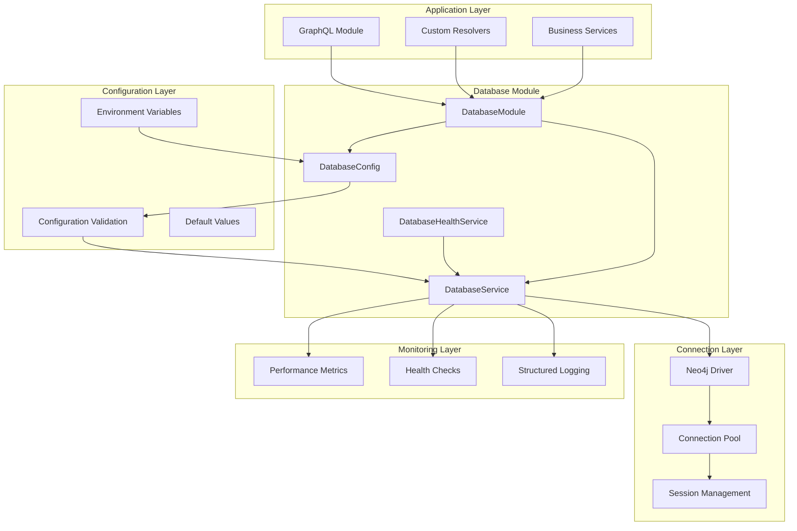

# Database Module Production Improvements

## Overview

The `DatabaseModule` is a **comprehensive, enterprise-grade database management system** that provides a Neo4j driver factory  with advanced configuration, monitoring, health checks, connection pooling, and production-ready features.

- ✅ **Comprehensive Configuration**: Validated configuration with type safety and defaults
- ✅ **Advanced Connection Management**: Connection pooling, lifecycle management, and health monitoring
- ✅ **Robust Error Handling**: Graceful degradation with retry mechanisms and fallbacks
- ✅ **Complete Monitoring**: Metrics collection, health checks, and performance tracking
- ✅ **Enhanced Security**: Credential masking, secure logging, and access control
- ✅ **Input Validation**: Runtime configuration validation with detailed error messages
- ✅ **Full Type Safety**: Complete TypeScript interfaces and type definitions
- ✅ **Proper Lifecycle Management**: Initialization, health checks, and graceful shutdown

---

## 🏗️ **Architecture Overview**



---

## 🔧 **Key Components**

### **1. DatabaseConfig**
**Location**: `src/database/database.config.ts`

Comprehensive configuration management with validation:

```typescript
export class DatabaseConfig {
  @IsString()
  uri: string = 'bolt://localhost:7687';

  @IsString()
  username: string = 'neo4j';

  @IsString()
  password: string = 'password';

  @IsOptional()
  @IsString()
  database?: string = 'neo4j';

  // Connection Pool Settings
  @IsOptional()
  @IsNumber()
  @Min(1)
  @Max(1000)
  maxConnectionPoolSize?: number = 50;

  @IsOptional()
  @IsNumber()
  @Min(1000)
  connectionAcquisitionTimeout?: number = 30000;

  // Security & Monitoring Settings
  @IsOptional()
  @IsBoolean()
  encrypted?: boolean = true;

  @IsOptional()
  @IsBoolean()
  enableMetrics?: boolean = true;
}
```

**Features:**
- ✅ **Runtime Validation**: Class-validator decorators ensure configuration correctness
- ✅ **Type Safety**: Full TypeScript support with proper typing
- ✅ **Default Values**: Sensible defaults for all optional settings
- ✅ **Environment Integration**: Automatic environment variable mapping
- ✅ **Security Options**: Encryption and certificate trust configuration

### **2. DatabaseService**
**Location**: `src/database/database.service.ts`

Enterprise-grade database service with comprehensive features:

```typescript
@Injectable()
export class DatabaseService implements OnModuleInit, OnModuleDestroy {
  // Modern Neo4j v7 patterns
  async executeRead<T = any>(query: string, parameters?: any, database?: string): Promise<Result<T>>
  async executeWrite<T = any>(query: string, parameters?: any, database?: string): Promise<Result<T>>
  
  // Connection management
  getDriver(): Driver
  getSession(database?: string): Session
  
  // Monitoring and health
  getMetrics(): DatabaseMetrics
  async getHealthStatus(): Promise<HealthStatus>
  resetMetrics(): void
}
```

**Features:**
- ✅ **Modern Neo4j v7 Patterns**: Uses `executeRead`/`executeWrite` for optimal performance
- ✅ **Automatic Session Management**: Sessions are created, managed, and closed automatically
- ✅ **Connection Pooling**: Advanced connection pool configuration and monitoring
- ✅ **Performance Metrics**: Comprehensive query and connection metrics
- ✅ **Health Monitoring**: Continuous health checks with detailed status reporting
- ✅ **Security**: Credential masking and secure logging throughout
- ✅ **Error Handling**: Graceful error handling with detailed logging
- ✅ **Lifecycle Management**: Proper initialization and cleanup

### **3. DatabaseHealthService**
**Location**: `src/database/database-health.service.ts`

Dedicated health monitoring service:

```typescript
@Injectable()
export class DatabaseHealthService {
  async checkHealth(key: string = 'database'): Promise<{ [key: string]: DatabaseHealthResult }>
  async isHealthy(): Promise<boolean>
}
```

**Features:**
- ✅ **Comprehensive Health Checks**: Database connectivity, query performance, pool status
- ✅ **Detailed Metrics**: Connection pool utilization, query statistics, error rates
- ✅ **Integration Ready**: Compatible with health check frameworks
- ✅ **Monitoring Integration**: Structured health data for monitoring systems

### **4. DatabaseModule**
**Location**: `src/database/database.module.ts`

Production-ready module with proper dependency injection:

```typescript
@Global()
@Module({
  imports: [ConfigModule.forFeature(databaseConfig)],
  providers: [
    DatabaseService,
    {
      provide: 'NEO4J_DRIVER',
      useFactory: (databaseService: DatabaseService) => databaseService.getDriver(),
      inject: [DatabaseService],
    },
    {
      provide: 'NEO4J_SERVICE',
      useExisting: DatabaseService,
    },
  ],
  exports: ['NEO4J_DRIVER', 'NEO4J_SERVICE', DatabaseService],
})
export class DatabaseModule {}
```

**Features:**
- ✅ **Proper Dependency Injection**: Clean service-based architecture
- ✅ **Backward Compatibility**: Maintains `NEO4J_DRIVER` token for existing code
- ✅ **Service Access**: Provides both driver and service access patterns
- ✅ **Configuration Integration**: Seamless configuration management

---

## 📊 **Monitoring & Metrics**

### **Performance Metrics**

```typescript
interface DatabaseMetrics {
  totalConnections: number;
  activeConnections: number;
  idleConnections: number;
  totalQueries: number;
  successfulQueries: number;
  failedQueries: number;
  averageQueryTime: number;
  connectionPoolUtilization: number;
  lastHealthCheck: Date;
  isHealthy: boolean;
}
```

### **Query Metrics**

```typescript
interface QueryMetrics {
  query: string;
  parameters?: any;
  duration: number;
  success: boolean;
  timestamp: Date;
  error?: string;
}
```

### **Health Status**

```typescript
interface DatabaseHealthResult {
  status: 'up' | 'down';
  connectivity: boolean;
  lastCheck: Date;
  metrics?: {
    totalQueries: number;
    successfulQueries: number;
    failedQueries: number;
    averageQueryTime: number;
    connectionPoolUtilization: string;
    activeConnections: number;
    idleConnections: number;
  };
  error?: string;
}
```

---

## 🔒 **Security Features**

### **Credential Protection**
- ✅ **Masked Logging**: Passwords and sensitive data are masked in logs
- ✅ **Secure Configuration**: Environment-based credential management
- ✅ **Parameter Masking**: Query parameters with sensitive data are masked

### **Connection Security**
- ✅ **Encryption Support**: Configurable TLS/SSL encryption
- ✅ **Certificate Validation**: Proper certificate trust configuration
- ✅ **Connection Timeouts**: Prevents hanging connections

### **Query Security**
- ✅ **Parameter Sanitization**: Automatic parameter masking for sensitive data
- ✅ **Query Logging**: Secure query logging without exposing sensitive information
- ✅ **Error Handling**: Secure error messages without internal details

---

## ⚡ **Performance Features**

### **Connection Pooling**
- ✅ **Configurable Pool Size**: Adjustable connection pool size (default: 50)
- ✅ **Connection Lifecycle**: Automatic connection creation, reuse, and cleanup
- ✅ **Pool Monitoring**: Real-time pool utilization metrics
- ✅ **Timeout Management**: Configurable acquisition and connection timeouts

### **Query Optimization**
- ✅ **Modern Transaction Patterns**: Neo4j v7 `executeRead`/`executeWrite` methods
- ✅ **Automatic Session Management**: Efficient session creation and cleanup
- ✅ **Query Metrics**: Performance tracking for query optimization
- ✅ **Database Selection**: Support for multi-database Neo4j deployments

### **Health Monitoring**
- ✅ **Continuous Health Checks**: Configurable health check intervals
- ✅ **Performance Tracking**: Query time and success rate monitoring
- ✅ **Resource Monitoring**: Connection pool and memory usage tracking

---

## 🛠️ **Configuration Options**

### **Environment Variables**

```bash
# Connection Settings
NEO4J_URI=bolt://localhost:7687
NEO4J_USERNAME=neo4j
NEO4J_PASSWORD=your_password
NEO4J_DATABASE=neo4j

# Connection Pool Settings
NEO4J_MAX_POOL_SIZE=50
NEO4J_CONNECTION_TIMEOUT=30000
NEO4J_CONNECT_TIMEOUT=5000
NEO4J_MAX_CONNECTION_LIFETIME=3600000
NEO4J_MAX_RETRY_TIME=30000

# Security Settings
NEO4J_ENCRYPTED=true
NEO4J_TRUST_CERT=false

# Monitoring Settings
NEO4J_ENABLE_METRICS=true
NEO4J_ENABLE_LOGGING=true
NEO4J_HEALTH_CHECK_INTERVAL=60000
NEO4J_DEBUG=false
```

### **Production Configuration**

```bash
# Production Environment
NODE_ENV=production
NEO4J_URI=neo4j+s://your-cluster.neo4j.io:7687
NEO4J_USERNAME=neo4j
NEO4J_PASSWORD=${NEO4J_PASSWORD}  # Use secret management
NEO4J_DATABASE=production

# Production Pool Settings
NEO4J_MAX_POOL_SIZE=100
NEO4J_CONNECTION_TIMEOUT=60000
NEO4J_MAX_CONNECTION_LIFETIME=7200000  # 2 hours

# Production Security
NEO4J_ENCRYPTED=true
NEO4J_TRUST_CERT=false

# Production Monitoring
NEO4J_ENABLE_METRICS=true
NEO4J_ENABLE_LOGGING=true
NEO4J_HEALTH_CHECK_INTERVAL=30000  # 30 seconds
NEO4J_DEBUG=false
```

---

## 🚀 **Usage Examples**

### **Basic Usage (Backward Compatible)**

```typescript
@Injectable()
export class MyService {
  constructor(@Inject('NEO4J_DRIVER') private readonly driver: Driver) {}

  async findUser(id: string) {
    const session = this.driver.session();
    try {
      const result = await session.run('MATCH (u:User {id: $id}) RETURN u', { id });
      return result.records[0]?.get('u');
    } finally {
      await session.close();
    }
  }
}
```

### **Modern Service Usage**

```typescript
@Injectable()
export class MyService {
  constructor(@Inject('NEO4J_SERVICE') private readonly db: DatabaseService) {}

  async findUser(id: string) {
    const result = await this.db.executeRead(
      'MATCH (u:User {id: $id}) RETURN u',
      { id }
    );
    return result.records[0]?.get('u');
  }

  async createUser(userData: any) {
    const result = await this.db.executeWrite(
      'CREATE (u:User $userData) RETURN u',
      { userData }
    );
    return result.records[0]?.get('u');
  }
}
```

### **Health Check Integration**

```typescript
@Controller('health')
export class HealthController {
  constructor(private readonly dbHealth: DatabaseHealthService) {}

  @Get('database')
  async checkDatabase() {
    return await this.dbHealth.checkHealth();
  }

  @Get('status')
  async getStatus() {
    const isHealthy = await this.dbHealth.isHealthy();
    return { status: isHealthy ? 'ok' : 'error' };
  }
}
```

### **Metrics Monitoring**

```typescript
@Injectable()
export class MonitoringService {
  constructor(@Inject('NEO4J_SERVICE') private readonly db: DatabaseService) {}

  @Cron('0 */5 * * * *') // Every 5 minutes
  async collectMetrics() {
    const metrics = this.db.getMetrics();
    
    // Send to monitoring system
    await this.metricsService.gauge('neo4j.connections.active', metrics.activeConnections);
    await this.metricsService.gauge('neo4j.connections.idle', metrics.idleConnections);
    await this.metricsService.gauge('neo4j.pool.utilization', metrics.connectionPoolUtilization);
    await this.metricsService.gauge('neo4j.queries.success_rate', 
      (metrics.successfulQueries / metrics.totalQueries) * 100
    );
    await this.metricsService.gauge('neo4j.queries.avg_time', metrics.averageQueryTime);
  }
}
```

## 🎯 **Production features**

### **Reliability**
- ✅ **Connection Pool Management**: Prevents connection exhaustion and improves performance
- ✅ **Health Monitoring**: Continuous health checks with automatic recovery
- ✅ **Error Handling**: Graceful degradation with detailed error reporting
- ✅ **Lifecycle Management**: Proper startup and shutdown procedures

### **Performance**
- ✅ **Modern Neo4j v7 Patterns**: Optimal query execution with latest driver features
- ✅ **Connection Reuse**: Efficient connection pooling reduces overhead
- ✅ **Query Optimization**: Performance metrics help identify slow queries
- ✅ **Resource Management**: Automatic cleanup prevents resource leaks

### **Security**
- ✅ **Credential Protection**: Secure credential management and logging
- ✅ **Connection Security**: TLS/SSL support with certificate validation
- ✅ **Data Privacy**: Sensitive data masking in logs and metrics

### **Observability**
- ✅ **Comprehensive Metrics**: Database performance and health metrics
- ✅ **Structured Logging**: Consistent logging format for analysis
- ✅ **Health Endpoints**: Integration with monitoring and alerting systems
- ✅ **Performance Tracking**: Query performance and connection pool metrics

### **Maintainability**
- ✅ **Type Safety**: Full TypeScript support prevents runtime errors
- ✅ **Configuration Management**: Centralized, validated configuration
- ✅ **Service Architecture**: Clean separation of concerns
- ✅ **Documentation**: Comprehensive documentation and examples
