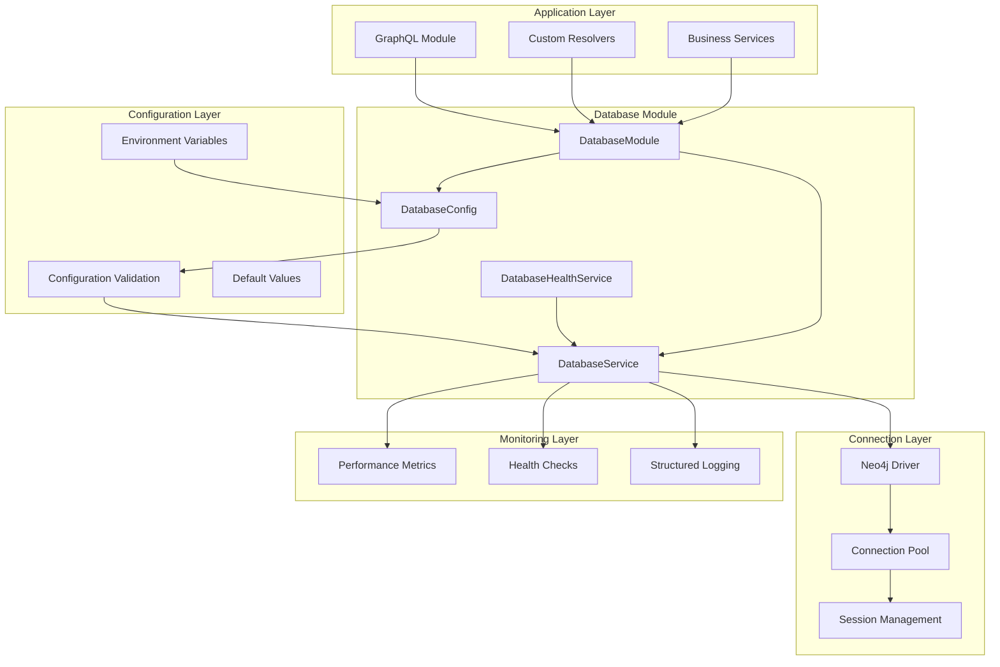

# Database Module

## Overview

The `DatabaseModule` provides a Neo4j driver factory with configuration, monitoring, health checks, and connection pooling.

- Configuration with type safety and defaults
- Connection pooling, lifecycle management, and health monitoring
- Retry mechanisms with fallbacks
- Metrics collection, health checks, and performance tracking
- Credential masking, secure logging, and access control
- Runtime configuration validation with detailed error messages
- Complete TypeScript interfaces and type definitions
- Proper initialization, health checks, and graceful shutdown

---

## Architecture Overview



---

## Key Components

### 1. DatabaseConfig

**Location**: `src/database/database.config.ts`

Configuration management with validation:

```typescript
export class DatabaseConfig {
  @IsString()
  uri: string = 'bolt://localhost:7687';

  @IsString()
  username: string = 'neo4j';

  @IsString()
  password: string = 'password';

  @IsOptional()
  @IsString()
  database?: string = 'neo4j';

  // Connection Pool Settings
  @IsOptional()
  @IsNumber()
  @Min(1)
  @Max(1000)
  maxConnectionPoolSize?: number = 50;

  @IsOptional()
  @IsNumber()
  @Min(1000)
  connectionAcquisitionTimeout?: number = 30000;

  // Security & Monitoring Settings
  @IsOptional()
  @IsBoolean()
  encrypted?: boolean = true;

  @IsOptional()
  @IsBoolean()
  enableMetrics?: boolean = true;
}
```

Features:
- Runtime validation via class-validator decorators
- Full TypeScript support with proper typing
- Sensible defaults for all optional settings
- Automatic environment variable mapping
- Encryption and certificate trust configuration

### 2. DatabaseService

**Location**: `src/database/database.service.ts`

Database service with connection management, monitoring, and health checks:

```typescript
@Injectable()
export class DatabaseService implements OnModuleInit, OnModuleDestroy {
  // Modern Neo4j v5 patterns
  async executeRead<T = any>(query: string, parameters?: any, database?: string): Promise<Result<T>>
  async executeWrite<T = any>(query: string, parameters?: any, database?: string): Promise<Result<T>>

  // Connection management
  getDriver(): Driver
  getSession(database?: string): Session

  // Monitoring and health
  getMetrics(): DatabaseMetrics
  async getHealthStatus(): Promise<HealthStatus>
  resetMetrics(): void
}
```

Features:
- Uses Neo4j v5 `executeRead`/`executeWrite` for optimal performance
- Sessions are created, managed, and closed automatically
- Advanced connection pool configuration and monitoring
- Query and connection metrics
- Continuous health checks with detailed status reporting
- Credential masking and secure logging
- Graceful error handling with detailed logging
- Proper initialization and cleanup

### 3. DatabaseHealthService

**Location**: `src/database/database-health.service.ts`

Dedicated health monitoring service:

```typescript
@Injectable()
export class DatabaseHealthService {
  async checkHealth(key: string = 'database'): Promise<{ [key: string]: DatabaseHealthResult }>
  async isHealthy(): Promise<boolean>
}
```

Features:
- Database connectivity, query performance, and pool status checks
- Connection pool utilization, query statistics, and error rates
- Compatible with health check frameworks
- Structured health data for monitoring systems

### 4. DatabaseModule

**Location**: `src/database/database.module.ts`

Module with proper dependency injection:

```typescript
@Global()
@Module({
  imports: [ConfigModule.forFeature(databaseConfig)],
  providers: [
    DatabaseService,
    {
      provide: 'NEO4J_DRIVER',
      useFactory: (databaseService: DatabaseService) => databaseService.getDriver(),
      inject: [DatabaseService],
    },
    {
      provide: 'NEO4J_SERVICE',
      useExisting: DatabaseService,
    },
  ],
  exports: ['NEO4J_DRIVER', 'NEO4J_SERVICE', DatabaseService],
})
export class DatabaseModule {}
```

Features:
- Clean service-based architecture with dependency injection
- Maintains `NEO4J_DRIVER` token for backward compatibility
- Provides both driver and service access patterns
- Configuration management

---

## Monitoring and Metrics

### Performance Metrics

```typescript
interface DatabaseMetrics {
  totalConnections: number;
  activeConnections: number;
  idleConnections: number;
  totalQueries: number;
  successfulQueries: number;
  failedQueries: number;
  averageQueryTime: number;
  connectionPoolUtilization: number;
  lastHealthCheck: Date;
  isHealthy: boolean;
}
```

### Query Metrics

```typescript
interface QueryMetrics {
  query: string;
  parameters?: any;
  duration: number;
  success: boolean;
  timestamp: Date;
  error?: string;
}
```

### Health Status

```typescript
interface DatabaseHealthResult {
  status: 'up' | 'down';
  connectivity: boolean;
  lastCheck: Date;
  metrics?: {
    totalQueries: number;
    successfulQueries: number;
    failedQueries: number;
    averageQueryTime: number;
    connectionPoolUtilization: string;
    activeConnections: number;
    idleConnections: number;
  };
  error?: string;
}
```

---

## Security Features

### Credential Protection
- Passwords and sensitive data are masked in logs
- Environment-based credential management
- Query parameters with sensitive data are masked

### Connection Security
- Configurable TLS/SSL encryption
- Proper certificate trust configuration
- Connection timeouts to prevent hanging connections

### Query Security
- Automatic parameter masking for sensitive data
- Secure query logging without exposing sensitive information
- Secure error messages without internal details

---

## Performance Features

### Connection Pooling
- Adjustable connection pool size (default: 50)
- Automatic connection creation, reuse, and cleanup
- Real-time pool utilization metrics
- Configurable acquisition and connection timeouts

### Query Optimization
- Neo4j v5 `executeRead`/`executeWrite` methods
- Efficient session creation and cleanup
- Performance tracking for query optimization
- Support for multi-database Neo4j deployments

### Health Monitoring
- Configurable health check intervals
- Query time and success rate monitoring
- Connection pool and memory usage tracking

---

## Configuration Options

### Environment Variables

```bash
# Connection Settings
NEO4J_URI=bolt://localhost:7687
NEO4J_USERNAME=neo4j
NEO4J_PASSWORD=your_password
NEO4J_DATABASE=neo4j

# Connection Pool Settings
NEO4J_MAX_POOL_SIZE=50
NEO4J_CONNECTION_TIMEOUT=30000
NEO4J_CONNECT_TIMEOUT=5000
NEO4J_MAX_CONNECTION_LIFETIME=3600000
NEO4J_MAX_RETRY_TIME=30000

# Security Settings
NEO4J_ENCRYPTED=true
NEO4J_TRUST_CERT=false

# Monitoring Settings
NEO4J_ENABLE_METRICS=true
NEO4J_ENABLE_LOGGING=true
NEO4J_HEALTH_CHECK_INTERVAL=60000
NEO4J_DEBUG=false
```

### Example Configuration

```bash
# Example deployment configuration
NODE_ENV=production
NEO4J_URI=neo4j+s://your-cluster.neo4j.io:7687
NEO4J_USERNAME=neo4j
NEO4J_PASSWORD=${NEO4J_PASSWORD}  # Use secret management
NEO4J_DATABASE=production

# Pool Settings
NEO4J_MAX_POOL_SIZE=100
NEO4J_CONNECTION_TIMEOUT=60000
NEO4J_MAX_CONNECTION_LIFETIME=7200000  # 2 hours

# Security
NEO4J_ENCRYPTED=true
NEO4J_TRUST_CERT=false

# Monitoring
NEO4J_ENABLE_METRICS=true
NEO4J_ENABLE_LOGGING=true
NEO4J_HEALTH_CHECK_INTERVAL=30000  # 30 seconds
NEO4J_DEBUG=false
```

---

## Usage Examples

### Basic Usage (Backward Compatible)

```typescript
@Injectable()
export class MyService {
  constructor(@Inject('NEO4J_DRIVER') private readonly driver: Driver) {}

  async findUser(id: string) {
    const session = this.driver.session();
    try {
      const result = await session.run('MATCH (u:User {id: $id}) RETURN u', { id });
      return result.records[0]?.get('u');
    } finally {
      await session.close();
    }
  }
}
```

### Modern Service Usage

```typescript
@Injectable()
export class MyService {
  constructor(@Inject('NEO4J_SERVICE') private readonly db: DatabaseService) {}

  async findUser(id: string) {
    const result = await this.db.executeRead(
      'MATCH (u:User {id: $id}) RETURN u',
      { id }
    );
    return result.records[0]?.get('u');
  }

  async createUser(userData: any) {
    const result = await this.db.executeWrite(
      'CREATE (u:User $userData) RETURN u',
      { userData }
    );
    return result.records[0]?.get('u');
  }
}
```

### Health Check Integration

```typescript
@Controller('health')
export class HealthController {
  constructor(private readonly dbHealth: DatabaseHealthService) {}

  @Get('database')
  async checkDatabase() {
    return await this.dbHealth.checkHealth();
  }

  @Get('status')
  async getStatus() {
    const isHealthy = await this.dbHealth.isHealthy();
    return { status: isHealthy ? 'ok' : 'error' };
  }
}
```

### Metrics Monitoring

```typescript
@Injectable()
export class MonitoringService {
  constructor(@Inject('NEO4J_SERVICE') private readonly db: DatabaseService) {}

  @Cron('0 */5 * * * *') // Every 5 minutes
  async collectMetrics() {
    const metrics = this.db.getMetrics();

    // Send to monitoring system
    await this.metricsService.gauge('neo4j.connections.active', metrics.activeConnections);
    await this.metricsService.gauge('neo4j.connections.idle', metrics.idleConnections);
    await this.metricsService.gauge('neo4j.pool.utilization', metrics.connectionPoolUtilization);
    await this.metricsService.gauge('neo4j.queries.success_rate',
      (metrics.successfulQueries / metrics.totalQueries) * 100
    );
    await this.metricsService.gauge('neo4j.queries.avg_time', metrics.averageQueryTime);
  }
}
```
