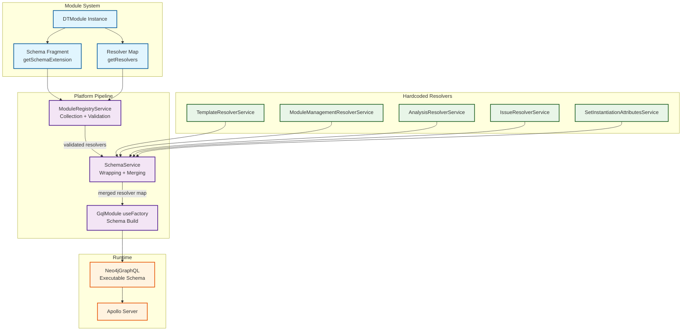
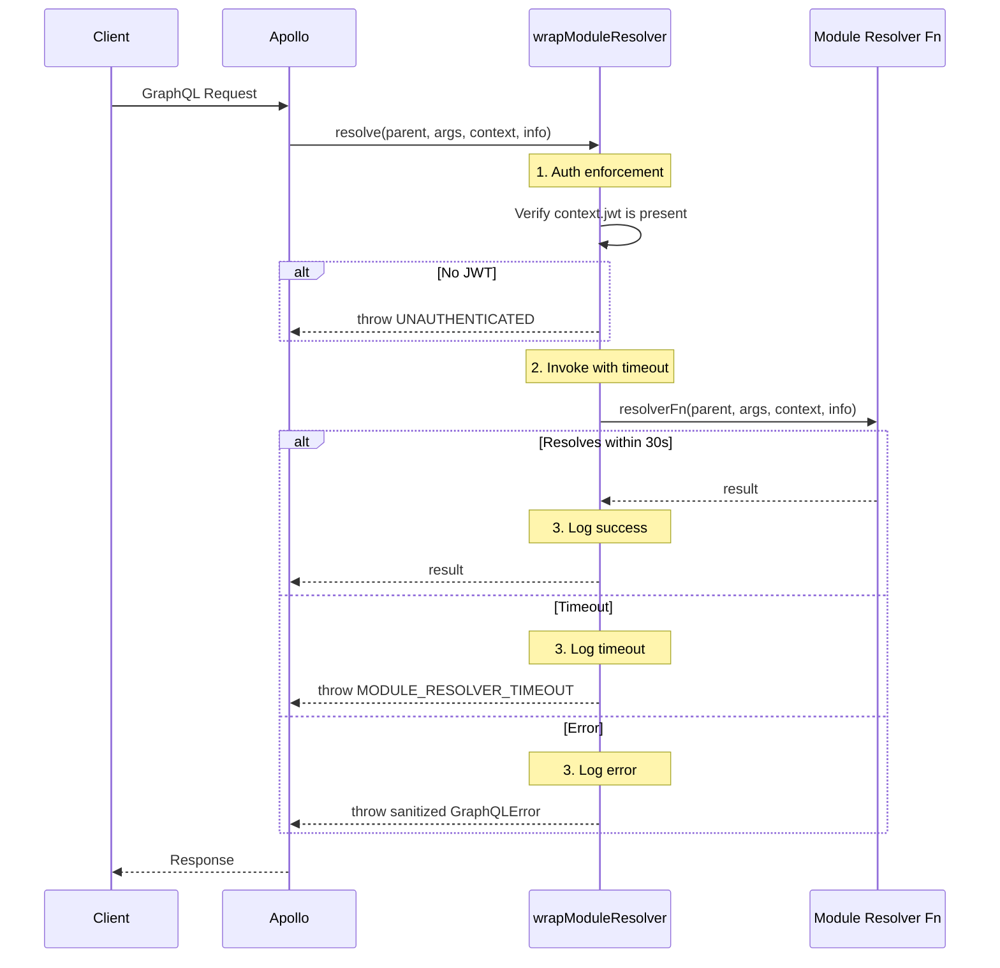

# Module Custom Resolvers

## Table of Contents

1. [Overview](#overview)
2. [Problem Statement](#problem-statement)
3. [Architecture](#architecture)
4. [Interface Contracts](#interface-contracts)
5. [Resolver Collection Pipeline](#resolver-collection-pipeline)
6. [Resolver Validation](#resolver-validation)
7. [Resolver Wrapping and Security](#resolver-wrapping-and-security)
8. [Schema Build Integration](#schema-build-integration)
9. [SDL Parsing and Field Extraction](#sdl-parsing-and-field-extraction)
10. [Security Model](#security-model)
11. [Error Handling](#error-handling)
12. [Configuration](#configuration)
13. [Testing Strategy](#testing-strategy)
14. [Implementation Reference](#implementation-reference)
15. [Cross-References](#cross-references)

---

## Overview

Module Custom Resolvers extends the DTModule system to allow modules to register custom GraphQL resolver functions alongside their schema fragments. Prior to this extension, modules could contribute SDL types via `getSchemaExtension()` but had no mechanism to provide the resolver logic to back those types. Fields that required non-Cypher logic (external API calls, procedural operations, policy evaluation) had to be hardcoded in `dt-ws` resolver services.

This extension adds an optional `getResolvers()` method to the `DTModule` interface. A module that returns both a schema extension and resolver functions gets a fully functional GraphQL API without any core platform changes.

### Key Features

- Modules provide resolver functions alongside schema SDL fragments
- Resolver validation ensures modules can only resolve fields they declared
- Resolver wrapping provides timeout, auth enforcement, logging, and error handling
- Hardcoded platform resolvers always take precedence over module resolvers
- Fully backward-compatible: modules without `getResolvers()` work unchanged

### Affected Components

| Component | Package | Change Type |
|-----------|---------|-------------|
| `DTModule` interface | `dt-module` | Interface addition |
| `ModuleResolverContext` | `dt-module` | New interface |
| `ResolverMap`, `ResolverFunction` | `dt-module` | New interface (module-facing) |
| `ModuleEntry` | `dt-ws` | Field addition |
| `ModuleRegistryService` | `dt-ws` | New methods |
| `SchemaService` | `dt-ws` | New methods |
| `GqlModule` useFactory | `dt-ws` | Pipeline update |

---

## Problem Statement

Some module operations cannot be expressed as Cypher queries and therefore cannot be handled by Neo4j GraphQL's auto-generated resolvers:

- **External API calls** -- calling an OPA server, a third-party REST endpoint, or an internal microservice
- **Procedural logic** -- assembling export archives, running transformations, or aggregating data across sources
- **Stateful operations** -- managing sessions, caching results, or tracking progress

Today, adding such operations requires hardcoding a new resolver service in `src/gql/resolver-services/` and registering it in `CustomResolverModule`. This couples add-on functionality to the core platform, violating the module extensibility model.

**The gap:** Modules can contribute schema types but not the resolver logic to back them.

---

## Architecture

### System Context



### Data Flow -- Startup

```
Module startup (revised)
  |
  +-- ModuleRegistryService.loadModules()
  |    +-- For each module:
  |    |    +-- await module.getSchemaExtension()   --> store in ModuleEntry.schemaFragment
  |    |    +-- await module.getResolvers(context)   --> store in ModuleEntry.resolverMap
  |    |         (only if getResolvers exists and schemaFragment is non-empty)
  |    |
  |    +-- Validate: resolverMap fields <= schemaFragment declared fields
  |    +-- Validate: no directive redefinitions in SDL
  |    +-- Validate: no Subscription resolvers (v1 restriction)
  |
  +-- moduleRegistryService.getSchemaFragments()     (unchanged)
  |
  +-- moduleRegistryService.getModuleResolvers()     (NEW)
  |    +-- Returns { moduleName, resolvers }[] from healthy modules
  |
  +-- schemaService.mergeResolvers(resolverServices)  (unchanged -- hardcoded services)
  |
  +-- schemaService.mergeModuleResolvers(existing, moduleResolvers)  (NEW)
  |    +-- For each module resolver:
  |    |    +-- Skip if field already resolved (hardcoded wins)
  |    |    +-- Skip if field already resolved by another module (first-loaded wins)
  |    |    +-- Wrap with auth enforcement, timeout, logging, error handling
  |    |    +-- Add to merged resolver map
  |
  +-- schemaService.buildSchemaWithResolvers(allResolvers)  (receives merged map)
```

### Data Flow -- Per Request

```
GraphQL Request
  |
  +-- Apollo Server parses query
  +-- JWT Authentication (schema-level @authentication directive)
  +-- Query depth/complexity validation
  +-- Resolver dispatch:
  |    +-- If field matches a wrapped module resolver:
  |    |    +-- Auth enforcement: verify context.jwt is present
  |    |    +-- Invoke module resolver with (parent, args, context, info)
  |    |    +-- Timeout: 30s race
  |    |    +-- Log: module name, type, field, duration
  |    |    +-- Return result or sanitized error
  |    +-- If field matches hardcoded resolver: execute directly
  |    +-- If field matches Neo4j auto-generated: Cypher execution
  +-- Response formatting
```

---

## Interface Contracts

### DTModule -- `getResolvers()` (new optional method)

**Source file:** `packages/dt-module/src/interfaces/module-interface.ts`

```typescript
interface DTModule {
  // ... existing methods unchanged ...

  /**
   * Return custom GraphQL resolvers for fields declared in this module's
   * schema extension. The returned map must only contain fields that appear
   * in the SDL returned by getSchemaExtension().
   *
   * Called once at startup. Resolver functions are closures that capture
   * shared resources from the context. Per-request data (auth, token)
   * arrives via the standard resolver function signature.
   */
  getResolvers?(context: ModuleResolverContext): ResolverMap | Promise<ResolverMap>;
}
```

**Contract rules:**
- Optional -- modules without this method work unchanged
- Only called if `getSchemaExtension()` returned a non-empty SDL fragment
- Called once at startup (not per-request)
- If it throws, the module remains healthy -- resolvers are a best-effort addition
- The returned resolver map is validated against the module's SDL fragment

### ModuleResolverContext -- startup context

**New file:** `packages/dt-module/src/interfaces/module-resolver-interface.ts`

```typescript
/**
 * Context passed to a module's getResolvers() at startup.
 * Use this to construct resolver functions that close over shared resources.
 *
 * This is NOT a per-request context. Per-request data (auth token, user)
 * arrives in the standard resolver function signature: (parent, args, context, info).
 */
export interface ModuleResolverContext {
  /** Neo4j/Memgraph driver -- same driver the module received at construction time */
  driver: any;
  /** Logger scoped to the module */
  logger: Logger;
  /** Database name for session creation */
  databaseName: string;
}
```

**Design decision:** `moduleConfig` was considered but omitted from v1. Module configuration is accessible through the module instance's own state (set at construction time). Adding a config passthrough would require defining the source and format, which is out of scope.

### ResolverMap and ResolverFunction -- module-facing types

**Same file:** `packages/dt-module/src/interfaces/module-resolver-interface.ts`

```typescript
/**
 * Map of GraphQL type names to field resolver functions.
 *
 * Example:
 *   {
 *     Query: { myField: resolverFn },
 *     Mutation: { doThing: resolverFn },
 *     MyCustomType: { computedField: resolverFn }
 *   }
 */
export interface ResolverMap {
  [typeName: string]: {
    [fieldName: string]: ResolverFunction;
  };
}

/**
 * Standard GraphQL resolver function signature.
 * The `context` parameter is the per-request GraphQLContext (token, driver, etc.).
 */
export interface ResolverFunction {
  (parent: any, args: any, context: any, info: any): any;
}
```

**Note on type duplication:** The `dt-ws` package has its own `ResolverMap` and `ResolverFunction` in `resolver.interface.ts` with `context` typed as `GraphQLContext`. The module-facing types use `context: any` intentionally -- modules must not depend on platform-internal types. The two sets of types are structurally compatible.

### ModuleEntry -- extended

**Source file:** `apps/dt-ws/src/gql/interfaces/module-registry.interface.ts`

```typescript
export interface ModuleEntry {
  // ... existing fields unchanged ...

  /** Custom resolvers from the module's getResolvers() method */
  resolverMap?: ResolverMap;
}
```

---

## Resolver Collection Pipeline

### ModuleRegistryService -- new logic in `loadModules()`

After the existing schema fragment collection (currently at the `if (typeof loadResult.module.getSchemaExtension === 'function')` block), add resolver collection:

```typescript
// After schema fragment collection, within the same module loading loop:
if (
  moduleEntry.schemaFragment &&
  typeof loadResult.module.getResolvers === 'function'
) {
  try {
    const resolverContext: ModuleResolverContext = {
      driver: this.neo4jDriver,
      logger: new Logger(`Module:${moduleName}:Resolvers`),
      databaseName: this.configService.get('database.name') || 'neo4j',
    };
    const resolverMap = await loadResult.module.getResolvers(resolverContext);
    if (resolverMap && Object.keys(resolverMap).length > 0) {
      const validated = this.validateModuleResolvers(
        moduleName,
        moduleEntry.schemaFragment,
        resolverMap,
      );
      if (Object.keys(validated).length > 0) {
        moduleEntry.resolverMap = validated;
        this.logger.log('Module provided custom resolvers', {
          moduleName,
          types: Object.keys(validated),
          fieldCount: Object.values(validated)
            .reduce((sum, fields) => sum + Object.keys(fields).length, 0),
        });
      }
    }
  } catch (error) {
    this.logger.warn('Failed to get resolvers from module', {
      moduleName,
      error: error?.message,
    });
    // Module remains healthy -- resolvers are optional
  }
}
```

**Key behaviors:**
- Resolvers are only collected if the module also has a schema fragment (no fragment = nothing to resolve)
- Failure in `getResolvers()` does not affect module health
- Validation strips invalid entries; a partially valid map is accepted
- The `resolverContext.driver` is the same proxy driver from `createSecureDriver()`

### ModuleRegistryService -- `getModuleResolvers()` (new method)

```typescript
/**
 * Gets custom resolver maps from all healthy modules that provide them.
 * Returns them in deterministic order (sorted by module name) so that
 * cross-module collision resolution is predictable.
 */
getModuleResolvers(): Array<{ moduleName: string; resolvers: ResolverMap }> {
  const result: Array<{ moduleName: string; resolvers: ResolverMap }> = [];

  // Sort by module name for deterministic collision resolution
  const sortedEntries = Array.from(this.customModules.entries())
    .sort(([a], [b]) => a.localeCompare(b));

  for (const [name, entry] of sortedEntries) {
    if (entry.isHealthy && entry.resolverMap) {
      result.push({ moduleName: name, resolvers: entry.resolverMap });
    }
  }
  return result;
}
```

**Design decision -- deterministic ordering:** Module load order depends on `fs.readdir()` which is non-deterministic across platforms. Sorting by module name ensures that if two modules attempt to resolve the same field, the alphabetically-first module always wins, regardless of filesystem behavior.

---

## Resolver Validation

### Validation Rules

The `validateModuleResolvers()` method enforces these rules before accepting a module's resolver map:

| Rule | Description | On Violation |
|------|-------------|--------------|
| **Schema coverage** | Resolver field must be declared in the module's SDL fragment | Resolver skipped with warning |
| **Function check** | Each resolver entry must be `typeof 'function'` | Entry skipped with warning |
| **No core type mutation** | Module must use `extend type Query/Mutation` (not bare `type Query`) to resolve root fields | Resolver skipped with warning |
| **No Subscription resolvers** | Module resolver map must not contain `Subscription` type entries | All `Subscription` entries skipped with warning |
| **No directive redefinition** | Module SDL must not redefine platform-owned directives | Entire module's resolvers rejected |
| **No hardcoded collision** | Checked later in `mergeModuleResolvers()` -- hardcoded resolvers always win | Module resolver skipped with warning |
| **No cross-module collision** | Checked later in `mergeModuleResolvers()` -- first module (alphabetical) wins | Later module's resolver skipped with warning |

### Implementation

```typescript
private validateModuleResolvers(
  moduleName: string,
  schemaFragment: string,
  resolverMap: ResolverMap,
): ResolverMap {
  // Step 1: Validate SDL safety (directive redefinitions, bare root types)
  const sdlValidation = this.validateModuleSDL(moduleName, schemaFragment);
  if (!sdlValidation.isValid) {
    this.logger.warn(
      `Module "${moduleName}" SDL validation failed -- all resolvers rejected`,
      { errors: sdlValidation.errors },
    );
    return {};
  }

  // Step 2: Extract declared fields from SDL
  const declaredFields = extractDeclaredFields(schemaFragment);

  // Step 3: Validate each resolver against declared fields
  const validated: ResolverMap = {};
  for (const [typeName, fields] of Object.entries(resolverMap)) {
    // Rule: No Subscription resolvers in v1
    if (typeName === 'Subscription') {
      this.logger.warn(
        `Module "${moduleName}" attempted to register Subscription resolvers -- ` +
        `not supported in this version, skipping`,
      );
      continue;
    }

    validated[typeName] = {};
    for (const [fieldName, resolverFn] of Object.entries(fields)) {
      // Rule: Must be a function
      if (typeof resolverFn !== 'function') {
        this.logger.warn(
          `Module "${moduleName}": ${typeName}.${fieldName} is not a function -- skipping`,
        );
        continue;
      }
      // Rule: Must be declared in SDL
      if (!declaredFields.has(`${typeName}.${fieldName}`)) {
        this.logger.warn(
          `Module "${moduleName}": ${typeName}.${fieldName} not declared in SDL -- skipping`,
        );
        continue;
      }
      validated[typeName][fieldName] = resolverFn;
    }

    // Clean up empty type entries
    if (Object.keys(validated[typeName]).length === 0) {
      delete validated[typeName];
    }
  }

  return validated;
}
```

### SDL Safety Validation

```typescript
/**
 * Validates module SDL for safety before accepting resolvers.
 * Rejects SDL that could compromise platform security.
 */
private validateModuleSDL(
  moduleName: string,
  schemaFragment: string,
): { isValid: boolean; errors: string[] } {
  const errors: string[] = [];

  try {
    const doc = parse(schemaFragment);

    for (const def of doc.definitions) {
      // Rule: No directive redefinitions
      if (def.kind === 'DirectiveDefinition') {
        const directiveName = def.name.value;
        if (PROTECTED_DIRECTIVES.has(directiveName)) {
          errors.push(
            `Redefines protected directive @${directiveName}`,
          );
        }
      }

      // Rule: No bare root type definitions (must use 'extend type')
      if (
        def.kind === 'ObjectTypeDefinition' &&
        ROOT_TYPE_NAMES.has(def.name.value)
      ) {
        errors.push(
          `Uses 'type ${def.name.value}' instead of 'extend type ${def.name.value}' -- ` +
          `bare root type definitions can shadow the platform schema`,
        );
      }
    }
  } catch (parseError) {
    // SDL parse failure is already caught by SchemaService.mergeModuleSchemas()
    // If it parses here, it will parse there too. If it fails here, the
    // fragment will be skipped entirely (no resolvers needed).
    errors.push(`SDL parse error: ${parseError?.message}`);
  }

  return { isValid: errors.length === 0, errors };
}
```

**Protected directives and root type names:**

```typescript
/** Platform-owned directives that modules must not redefine */
const PROTECTED_DIRECTIVES = new Set([
  'authentication',
  'authorization',
  'cypher',
  'node',
  'relationship',
  'query',
  'mutation',
  'subscription',
  'filterable',
  'settable',
  'selectable',
  'jwt',
]);

/** Root type names that require 'extend type' syntax */
const ROOT_TYPE_NAMES = new Set([
  'Query',
  'Mutation',
  'Subscription',
]);
```

---

## Resolver Wrapping and Security

Every module-provided resolver function is wrapped before being added to the merged resolver map. The wrapper enforces security, observability, and resource protection.

### Wrapper Architecture



### Implementation

**Source file:** `apps/dt-ws/src/gql/services/schema.service.ts` (new methods)

```typescript
/** Default timeout for module resolvers */
private readonly MODULE_RESOLVER_TIMEOUT_MS = 30_000;

/**
 * Merges module-contributed resolvers into the resolver map.
 * Each module resolver is wrapped with auth, timeout, logging, and error handling.
 *
 * @param existingResolvers - Resolver map from hardcoded services (these take precedence)
 * @param moduleResolvers - Resolver maps from modules (sorted by module name)
 * @returns Merged resolver map ready for Neo4jGraphQL
 */
mergeModuleResolvers(
  existingResolvers: ResolverMap,
  moduleResolvers: Array<{ moduleName: string; resolvers: ResolverMap }>,
): ResolverMap {
  const merged = { ...existingResolvers };

  for (const { moduleName, resolvers } of moduleResolvers) {
    for (const [typeName, fields] of Object.entries(resolvers)) {
      if (!merged[typeName]) {
        merged[typeName] = {};
      }

      for (const [fieldName, resolverFn] of Object.entries(fields)) {
        // Hardcoded resolvers and earlier modules win
        if (merged[typeName][fieldName]) {
          this.logger.warn(
            `Module "${moduleName}" resolver for ${typeName}.${fieldName} ` +
            `conflicts with existing resolver -- skipped`,
          );
          continue;
        }

        merged[typeName][fieldName] = this.wrapModuleResolver(
          moduleName, typeName, fieldName, resolverFn,
        );
      }
    }
  }

  return merged;
}

/**
 * Wraps a module resolver with auth enforcement, timeout, logging,
 * and error sanitization.
 */
private wrapModuleResolver(
  moduleName: string,
  typeName: string,
  fieldName: string,
  resolverFn: ResolverFunction,
): ResolverFunction {
  const logger = this.logger;
  const timeoutMs = this.MODULE_RESOLVER_TIMEOUT_MS;
  const fieldPath = `${moduleName}:${typeName}.${fieldName}`;

  return async (parent, args, context, info) => {
    const start = Date.now();

    // --- Auth enforcement ---
    // Platform defense-in-depth: even if the module's SDL lacks
    // @authentication, module resolvers require a valid JWT.
    if (!context?.jwt && !context?.token) {
      logger.warn(`Module resolver ${fieldPath} called without authentication`);
      throw new GraphQLError('Authentication required', {
        extensions: { code: 'UNAUTHENTICATED' },
      });
    }

    // --- Invoke with timeout ---
    try {
      const result = await Promise.race([
        resolverFn(parent, args, context, info),
        new Promise((_, reject) =>
          setTimeout(
            () => reject(new Error(`Module resolver timeout after ${timeoutMs}ms`)),
            timeoutMs,
          ),
        ),
      ]);

      logger.debug(`Module resolver ${fieldPath} completed`, {
        duration: Date.now() - start,
      });

      return result;
    } catch (error) {
      const duration = Date.now() - start;
      const isTimeout = error?.message?.includes('timeout');

      logger.error(`Module resolver ${fieldPath} failed`, {
        error: error?.message,
        duration,
        isTimeout,
      });

      // --- Error sanitization ---
      // Wrap module errors in a GraphQLError with a safe message.
      // In production, formatError will further sanitize.
      // This prevents module errors from carrying unexpected extensions.
      throw new GraphQLError(
        isTimeout
          ? 'Operation timed out'
          : `Module operation failed: ${moduleName}`,
        {
          extensions: {
            code: isTimeout ? 'MODULE_RESOLVER_TIMEOUT' : 'MODULE_RESOLVER_ERROR',
            moduleName,
            ...(process.env.NODE_ENV !== 'production' && {
              originalMessage: error?.message,
            }),
          },
        },
      );
    }
  };
}
```

### Auth Enforcement -- Design Rationale

The `@authentication` directive on schema types is the primary auth mechanism (enforced by Neo4j GraphQL + OIDC JWKS). However, module authors may forget to add `@authentication` to their extended types, creating unauthenticated endpoints. The wrapper adds a second defense layer:

| Scenario | `@authentication` directive | Wrapper check | Result |
|----------|----------------------------|---------------|--------|
| Correct module | Present | Passes | Authenticated |
| Forgetful author | Missing | Catches it | Authenticated (wrapper enforces) |
| Intentional public endpoint | N/A | N/A | Not supported in v1 |

If future requirements need public module endpoints, a `publicFields` declaration mechanism can be added to the `getResolvers()` return type. For v1, all module resolvers require authentication.

### Timeout Behavior -- Known Limitation

`Promise.race()` returns after 30 seconds, but the module's resolver function continues executing. For I/O operations (HTTP fetches, database queries), the underlying connection stays open.

**Mitigations:**
- Module authors should use `AbortController` for fetch-based resolvers
- The 30s timeout prevents client-facing latency from growing unbounded
- Errors from timed-out resolvers are logged for operator visibility

**Not addressed in v1:** per-module concurrency limiting. A module resolver that calls external services could be used for amplification. Future enhancement: add a semaphore counter per module in the wrapper.

---

## Schema Build Integration

### GqlModule `useFactory` Changes

**Source file:** `apps/dt-ws/src/gql/gql.module.ts`

The change is minimal -- three new lines between the existing `mergeResolvers()` call and `buildSchemaWithResolvers()`:

```typescript
// Existing: merge hardcoded resolver services
const customResolvers = schemaService.mergeResolvers(resolverServices);

// NEW: collect and merge module-contributed resolvers
const moduleResolvers = moduleRegistryService.getModuleResolvers();
const allResolvers = schemaService.mergeModuleResolvers(
  customResolvers,
  moduleResolvers,
);

// Existing: build schema (now receives allResolvers instead of customResolvers)
const schema = await schemaService.buildSchemaWithResolvers(allResolvers);
```

**Ordering guarantee:** Module resolvers are merged after hardcoded resolvers. The `mergeModuleResolvers` method receives the hardcoded map as `existingResolvers` and checks for conflicts before inserting module resolvers. This ensures hardcoded resolvers always win.

### Schema Rebuild Limitations

The schema is built once at startup in `useFactory`. Module resolvers, like schema fragments, are startup-only:

- `reloadModule()` does not trigger a schema rebuild
- Hot-reloaded modules get updated instances but their resolvers are not re-collected
- A server restart is required to pick up changed module resolvers

This is consistent with how schema fragments already work and is a deliberate simplification for v1.

---

## SDL Parsing and Field Extraction

### `extractDeclaredFields()` -- Core Validation Function

This function parses a module's SDL fragment and returns the set of `TypeName.fieldName` pairs that the module declared. This is the keystone of resolver validation -- it determines what a module is allowed to resolve.

**Recommended location:** `apps/dt-ws/src/gql/utils/sdl-parser.ts` (new utility file)

```typescript
import { parse, Kind, DocumentNode, DefinitionNode, FieldDefinitionNode } from 'graphql';

/**
 * Extracts declared type-field pairs from a GraphQL SDL fragment.
 *
 * Handles:
 * - type Foo { bar: String }           --> "Foo.bar"
 * - extend type Query { myField: Int } --> "Query.myField"
 * - input types, enums, unions are skipped (no resolver fields)
 *
 * @returns Set of "TypeName.fieldName" strings
 */
export function extractDeclaredFields(sdl: string): Set<string> {
  const fields = new Set<string>();

  let doc: DocumentNode;
  try {
    doc = parse(sdl);
  } catch {
    return fields; // Unparseable SDL = no declared fields
  }

  for (const def of doc.definitions) {
    if (!hasFieldDefinitions(def)) continue;

    const typeName = def.name.value;
    for (const field of (def.fields || [])) {
      fields.add(`${typeName}.${field.name.value}`);
    }
  }

  return fields;
}

/**
 * Type guard: definition kinds that can have field definitions with resolvers.
 */
function hasFieldDefinitions(
  def: DefinitionNode,
): def is DefinitionNode & { name: { value: string }; fields?: readonly FieldDefinitionNode[] } {
  return (
    def.kind === Kind.OBJECT_TYPE_DEFINITION ||
    def.kind === Kind.OBJECT_TYPE_EXTENSION
  );
}
```

**What is included:**
- `ObjectTypeDefinition` (`type Foo { ... }`)
- `ObjectTypeExtensionDefinition` (`extend type Query { ... }`)

**What is excluded (no resolver fields):**
- `InputObjectTypeDefinition` -- input types don't have resolvers
- `EnumTypeDefinition` -- enums don't have resolvers
- `UnionTypeDefinition` -- union resolution is type-based, not field-based
- `InterfaceTypeDefinition` -- interface resolvers are resolved on concrete types
- `ScalarTypeDefinition` -- scalar serialization, not field resolution

---

## Security Model

### Trust Boundary

```
+-----------------------------------------------------------------------+
|  Platform Process (Node.js)                                            |
|                                                                        |
|  +-----------------------+  +--------------------------------------+  |
|  | Platform Code         |  | Module Code                          |  |
|  | (dt-ws, resolvers)    |  | (custom_modules/, runtime-loaded)    |  |
|  |                       |  |                                      |  |
|  | Full NestJS access    |  | Full process access (no sandbox)     |  |
|  | Full Neo4j driver     |  | Neo4j driver (via constructor)       |  |
|  | Full GraphQL context  |  | GraphQL context (via resolver args)  |  |
|  +-----------------------+  +--------------------------------------+  |
|                                                                        |
|  Trust assumption: modules are loaded from a local directory by an     |
|  administrator. They run in-process with the same privileges as        |
|  platform code. The validation and wrapping mechanisms protect against |
|  bugs and mistakes, not against a determined adversary with module     |
|  installation access.                                                  |
+-----------------------------------------------------------------------+
```

### Security Controls

| Control | Protects Against | Enforcement Point |
|---------|------------------|-------------------|
| **Schema coverage validation** | Module resolving fields it doesn't own | `validateModuleResolvers()` at startup |
| **SDL safety validation** | Directive redefinition, root type shadowing | `validateModuleSDL()` at startup |
| **Auth enforcement in wrapper** | Unauthenticated access to module endpoints | `wrapModuleResolver()` per request |
| **Hardcoded-wins precedence** | Module overriding platform resolvers | `mergeModuleResolvers()` at startup |
| **Deterministic ordering** | Non-reproducible collision resolution | `getModuleResolvers()` sorts by name |
| **30s timeout** | Blocking/hanging resolvers | `wrapModuleResolver()` per request |
| **Error sanitization** | Internal error leakage to clients | `wrapModuleResolver()` + `formatError` |
| **Subscription prohibition** | Lifecycle/auth complexity in v1 | `validateModuleResolvers()` at startup |
| **Module whitelist** | Unauthorized module loading | `ModuleRegistryService` at startup (existing) |

### Subscription Resolvers -- v1 Restriction

Subscription resolvers are explicitly prohibited in v1 for these reasons:

1. **Different resolver shape** -- subscriptions need `{ subscribe: () => AsyncIterator, resolve: (payload) => ... }`, not a plain function. The timeout wrapper doesn't handle this.
2. **Auth gap** -- `@authentication` does not work on Subscription types in Neo4j GraphQL v7. The platform uses `JwtAuthGuard` on the SSE controller, but module subscriptions would need a different auth path.
3. **Lifecycle complexity** -- subscriptions are long-lived and need cleanup. The wrapper can't manage this.

The validation rejects any `Subscription` key in the resolver map.

### What This Does NOT Protect Against

- A malicious module mutating its own closures after startup (inherent to in-process execution)
- A module reading other modules' data via direct Neo4j queries (modules share the driver)
- A module exfiltrating data through side channels (logging, external HTTP, etc.)

These are pre-existing limitations of the in-process module trust model. See `docs/SECURITY_MODEL.md` for the platform's security posture.

---

## Error Handling

### Error Classification

| Error Source | When | Handling |
|-------------|------|----------|
| `getResolvers()` throws | Startup | Warning logged, module remains healthy, no resolvers registered |
| Resolver validation rejects field | Startup | Warning logged per field, valid fields still accepted |
| SDL validation fails | Startup | Warning logged, all resolvers for that module rejected |
| Auth check fails | Per request | `GraphQLError` with `UNAUTHENTICATED` code |
| Resolver times out | Per request | `GraphQLError` with `MODULE_RESOLVER_TIMEOUT` code |
| Resolver throws | Per request | `GraphQLError` with `MODULE_RESOLVER_ERROR` code |

### Error Flow

```
Module resolver error
  |
  +-- Caught by wrapModuleResolver()
  |    +-- Logged with module name, type, field, duration, error message
  |    +-- Wrapped in GraphQLError with safe message
  |    +-- Original message included only in non-production (extensions.originalMessage)
  |
  +-- Passed to Apollo's formatError()
       +-- Production: replaced with "Internal server error"
       +-- Development: passed through with details
```

### Startup Error Resilience

The resolver collection pipeline is designed to be maximally resilient at startup:

```
Module A: getResolvers() works     --> resolvers collected and validated
Module B: getResolvers() throws    --> warning logged, Module B healthy, no resolvers
Module C: getResolvers() returns   --> validated, some fields rejected, rest accepted
Module D: no getResolvers() method --> unchanged behavior (schema fragment only)
```

The platform never fails to start because of module resolver issues. Partial success is preferred over all-or-nothing.

---

## Configuration

### Environment Variables

No new environment variables are required. The module resolver system uses existing configuration:

| Variable | Used For | Default |
|----------|----------|---------|
| `ALLOWED_MODULES` | Module whitelist (existing) | `*` (all) |
| `MODULE_LOAD_TIMEOUT` | Timeout for `getResolvers()` call | `30000` ms |
| `NEO4J_DATABASE` / `database.name` | Passed in `ModuleResolverContext.databaseName` | `neo4j` |

### Compile-Time Constants

| Constant | Value | Location |
|----------|-------|----------|
| `MODULE_RESOLVER_TIMEOUT_MS` | `30_000` | `SchemaService` |
| `PROTECTED_DIRECTIVES` | Set of directive names | `ModuleRegistryService` |
| `ROOT_TYPE_NAMES` | `Query`, `Mutation`, `Subscription` | `ModuleRegistryService` |

---

## Testing Strategy

### Unit Tests

#### `extractDeclaredFields()`

| Test Case | Input SDL | Expected |
|-----------|-----------|----------|
| Simple type | `type Foo { bar: String }` | `{ "Foo.bar" }` |
| Extended type | `extend type Query { myField: Int }` | `{ "Query.myField" }` |
| Multiple types | `type A { x: Int } type B { y: String }` | `{ "A.x", "B.y" }` |
| Input type (excluded) | `input MyInput { field: String }` | `{}` |
| Enum (excluded) | `enum Status { ACTIVE INACTIVE }` | `{}` |
| Unparseable SDL | `not valid graphql` | `{}` |
| Empty string | `""` | `{}` |

#### `validateModuleSDL()`

| Test Case | Input | Expected |
|-----------|-------|----------|
| Safe SDL | `extend type Query { myField: String }` | Valid |
| Directive redefinition | `directive @authentication on FIELD_DEFINITION` | Invalid |
| Bare root type | `type Query { myField: String }` | Invalid |
| Custom directive (allowed) | `directive @myDirective on FIELD_DEFINITION` | Valid |

#### `validateModuleResolvers()`

| Test Case | Description | Expected |
|-----------|-------------|----------|
| Matching resolvers | Resolver map matches SDL fields | All accepted |
| Undeclared field | Resolver for field not in SDL | Field skipped, warning |
| Non-function entry | Resolver entry is a string | Entry skipped, warning |
| Subscription resolver | `{ Subscription: { ... } }` | Entire type skipped, warning |
| Empty result | All entries invalid | Empty map returned |

#### `wrapModuleResolver()`

| Test Case | Description | Expected |
|-----------|-------------|----------|
| Success | Resolver returns value | Value returned, debug log |
| No auth | `context.jwt` missing | `UNAUTHENTICATED` error thrown |
| Timeout | Resolver exceeds 30s | `MODULE_RESOLVER_TIMEOUT` error |
| Error | Resolver throws | `MODULE_RESOLVER_ERROR`, sanitized message |
| Error in non-prod | Resolver throws, `NODE_ENV=development` | Includes `originalMessage` |

#### `mergeModuleResolvers()`

| Test Case | Description | Expected |
|-----------|-------------|----------|
| No conflicts | Module adds new fields | Fields merged with wrapping |
| Hardcoded conflict | Module resolves existing platform field | Module resolver skipped |
| Cross-module conflict | Two modules resolve same field | First (alphabetical) wins |
| Multiple modules | Three modules, no conflicts | All merged |

### Integration Tests

| Test | Description |
|------|-------------|
| End-to-end query | Load test module with SDL + resolvers, query the field, verify response |
| Undeclared field rejection | Load module resolving undeclared field, verify rejection at startup |
| Cross-module collision | Load two modules with same field, verify first-loaded (alphabetical) wins |
| Timeout behavior | Load module with slow resolver, verify 30s timeout fires |
| Auth enforcement | Query module field without JWT, verify `UNAUTHENTICATED` |

### Regression Tests

| Test | Description |
|------|-------------|
| Existing resolvers unchanged | All five hardcoded resolver services work after pipeline change |
| Schema-only modules | Modules with only `getSchemaExtension()` work unchanged |
| Module health | Module health checks pass with and without resolvers |

---

## Implementation Reference

### Implementation Order

| Step | Component | Package | Description |
|------|-----------|---------|-------------|
| 1 | `ModuleResolverContext`, `ResolverMap`, `ResolverFunction` | `dt-module` | New interface file + export |
| 2 | `DTModule.getResolvers()` | `dt-module` | Add optional method to interface |
| 3 | `extractDeclaredFields()` | `dt-ws` | SDL parsing utility |
| 4 | `validateModuleSDL()`, `validateModuleResolvers()` | `dt-ws` | Validation in `ModuleRegistryService` |
| 5 | `getModuleResolvers()` | `dt-ws` | Collection method in `ModuleRegistryService` |
| 6 | Resolver collection in `loadModules()` | `dt-ws` | Integration point in module loading |
| 7 | `mergeModuleResolvers()`, `wrapModuleResolver()` | `dt-ws` | Wrapping + merging in `SchemaService` |
| 8 | `GqlModule` useFactory update | `dt-ws` | Pipeline integration |
| 9 | Unit + integration tests | `dt-ws` | All test cases from above |
| 10 | Documentation update | `docs/` | Update `DT_MODULE_INTERFACE.md` |

### Files Changed

| File | Change |
|------|--------|
| `packages/dt-module/src/interfaces/module-interface.ts` | Add `getResolvers?()` |
| `packages/dt-module/src/interfaces/module-resolver-interface.ts` | **New file** |
| `packages/dt-module/src/index.ts` | Export new interfaces |
| `apps/dt-ws/src/gql/interfaces/module-registry.interface.ts` | Add `resolverMap?` to `ModuleEntry` |
| `apps/dt-ws/src/gql/utils/sdl-parser.ts` | **New file** -- `extractDeclaredFields()` |
| `apps/dt-ws/src/gql/module-management-services/module-registry.service.ts` | Add validation, collection, `getModuleResolvers()` |
| `apps/dt-ws/src/gql/services/schema.service.ts` | Add `mergeModuleResolvers()`, `wrapModuleResolver()` |
| `apps/dt-ws/src/gql/gql.module.ts` | 3 new lines in `useFactory` |

All changes are in `oss/`. This lands as a single PR on both repos.

---

## Cross-References

| Document | Relevance |
|----------|-----------|
| [MODULE_REGISTRY_DOCUMENTATION.md](./MODULE_REGISTRY_DOCUMENTATION.md) | Module loading, whitelisting, health checks |
| [CUSTOM_RESOLVER_SERVICES_DOCUMENTATION.md](./CUSTOM_RESOLVER_SERVICES_DOCUMENTATION.md) | Existing hardcoded resolver services |
| [GRAPHQL_MODULE.md](./GRAPHQL_MODULE.md) | GqlModule structure, security config |
| [ARCHITECTURE.md](./ARCHITECTURE.md) | System architecture, schema build flow |
| [DT_MODULE_INTERFACE.md](../../modules/DT_MODULE_INTERFACE.md) | DTModule interface (needs update after implementation) |
| [SECURITY_MODEL.md](../../../SECURITY_MODEL.md) | Platform security posture, trust model |
| [EXAMPLES.md](./EXAMPLES.md) | Code examples for resolver implementation |
