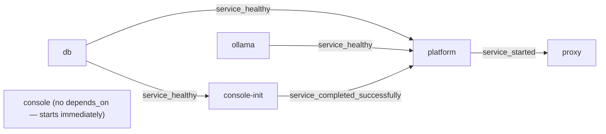

# BYODt Deployment — Architecture

> The deployment topology: every service, how they depend on each other, what is published, where
> state lives, and how a request reaches the platform.

A BYODt deployment is a Compose project named `dethernety`: six services on one private bridge
network, one published host port, and host-local storage. This document describes that topology and
the reasoning behind the parts that are not obvious — the startup ordering, the single published port,
the split configuration layers, and the front door's request-time upstream resolution.

The console's own design is in [`CONSOLE.md`](./CONSOLE.md); how modules arrive is in
[`SUPPLY_CHAIN.md`](./SUPPLY_CHAIN.md); trust boundaries are in
[`SECURITY_MODEL.md`](./SECURITY_MODEL.md).

---

## At a glance

| | |
|---|---|
| **Orchestration** | Docker Compose or Podman Compose, auto-detected on first run and recorded as `CONTAINER_ENGINE` |
| **Project name** | `dethernety` — containers and the optional named volume carry it as a prefix |
| **Network** | One bridge network, `dethernety`; services address each other by service name |
| **Published ports** | Exactly one: the front door, bound to loopback by default |
| **Persistent state** | Host directories under the bundle (or one named volume for the graph) |
| **Images** | Pinned by `.env`: `PLATFORM_VERSION` selects both of Dethernety's own images — platform and console — while the three third-party images carry their own references |
| **Control surface** | The `byodt` script — a wrapper over the engine's `compose` that carries both env files |

---

## Topology

```
                                host
   ┌──────────────────────────────────────────────────────────────┐
   │   ${FRONT_DOOR_BIND}:${FRONT_DOOR_PORT}  →  proxy :80        │
   │   default 127.0.0.1:3000                                     │
   └───────────────────────────┬──────────────────────────────────┘
                               │
 ═══ network: dethernety (bridge) ═════════════════════════════════════════════
                               │
                        ┌──────▼──────┐
                        │    proxy    │  nginx · :80 (edge) · :8081 (health)
                        └──┬───────┬──┘
             /console/     │       │   everything else
                ┌──────────┘       └──────────┐
                ▼                             ▼
         ┌─────────────┐               ┌─────────────┐
         │   console   │ ────────────▶ │  platform   │  :3003
         │   :8080     │  /config      │  API + SPA  │
         └──────┬──────┘  /graphql     └──┬───────┬──┘
                │                         │       │
                │  writes                 │ Bolt  │ HTTP
                │  mode/ + modules/       ▼       ▼
                │                     ┌──────┐ ┌────────┐
                │                     │  db  │ │ ollama │
                │                     │:7687 │ │ :11434 │
                │                     └──────┘ └────────┘
                │                         ▲
                │   reads state file      │ Bolt
                └──── modules/ ◀───── console-init  (one-shot, exits)
```

`console-init` and `console` run the same image; the one-shot runs its default `init` entrypoint and
the daemon is started with `command: ["daemon"]`.

---

## The services

### `db` — graph database

Holds every model, the reference corpus, and the module-derived class registry. Reached over Bolt at
`db:7687`; never published.

| | |
|---|---|
| Image | `${DB_IMAGE}` — a third-party reference resolved by your runtime |
| Credentials | `MEMGRAPH_USER` / `MEMGRAPH_PASSWORD` from `NEO4J_USERNAME` (`.env`) and `NEO4J_PASSWORD` (`.env.secrets`) |
| Storage | `${DB_DATA}` mounted at `/var/lib/memgraph` |
| Health | Answers a query (`RETURN 1;` through `mgconsole`) — not merely "the process is up": 5 s interval, 30 retries, 15 s start period |
| Restart | `unless-stopped` |

Notable startup flags, all set in `compose.yaml`:

| Flag | Why |
|---|---|
| `--memory-limit=4096` | The measured floor for this workload; the embedding-bearing ingest statements fail below it |
| `--storage-snapshot-interval-sec=${SNAPSHOT_INTERVAL_SEC:-300}` | In-place crash-recovery snapshots; `0` disables. Not a substitute for `byodt backup` |
| `--query-execution-timeout-sec=600` | Long analysis and ingest statements |
| `--bolt-num-workers=4`, `--query-plan-cache-max-size=100`, `--query-max-plans=100`, `--cartesian-product-enabled=true`, `--storage-gc-cycle-sec=300`, `--query-vertex-count-to-expand-existing=10` | Query planner and worker sizing for a single-node deployment |

The plain image is used rather than the extended variant: class matching uses the built-in vector
search, and the one procedure that would otherwise require the extended build has a built-in fallback.
Pinning avoids a silent multi-gigabyte difference in the first-run pull.

### `ollama` — embedding server

Serves the embedding model the platform queries when matching model elements to classes. Stack-internal
at `ollama:11434`.

| | |
|---|---|
| Image | `${OLLAMA_IMAGE}` — third-party reference |
| Model | `EMBEDDING_MODEL` (default `embeddinggemma`) — the same value selects what Ollama serves and what the platform asks for |
| Storage | `./data/ollama` mounted at `/root/.ollama` |
| Health | Pulls the model if absent, then asserts it is listed: 15 s interval, 120 s timeout, 40 retries, 30 s start period — sized for a first-run model pull on a slow connection |
| Restart | `unless-stopped` |

The health check is what performs the first-run model pull, which is why its retry budget is far larger
than a liveness probe would need.

### `console-init` — the pre-start one-shot

Runs to completion before the platform starts, and exits. It places the no-auth schema, fetches and
verifies the signed code modules, and ingests the reference corpus.

| | |
|---|---|
| Image | The console image, derived from `PLATFORM_VERSION` (overridable with `CONSOLE_IMAGE`), run with its default entrypoint (`init`) |
| Depends on | `db` healthy |
| Reads | `mode/mode.env` (as `env_file`), `PLATFORM_VERSION`, the Bolt credentials, `CONSOLE_RELEASE_BASE_URL` |
| Writes | `./modules` (module payloads + the state file), `./schema` (the no-auth schema) |
| Restart | `no` |

It reads the same mode layer the platform will read, so its decision about which schema to place always
tracks the mode the platform comes up in. Its exit discipline is the deployment's start/abort contract
and is documented in [`CONSOLE.md`](./CONSOLE.md#the-two-exit-disciplines).

### `platform` — API, SPA, and runtime config

The product. Serves the GraphQL API, the SPA, the runtime `/config` document the SPA reads, and the
subscription stream.

| | |
|---|---|
| Image | `ghcr.io/dether-net/dethernety:${PLATFORM_VERSION}` |
| Port | `3003`, stack-internal |
| Depends on | `db` healthy, `ollama` healthy, `console-init` completed successfully |
| Health | `GET /health/simple` over the loopback inside the container: 15 s interval, 20 retries, 60 s start period |
| Restart | `unless-stopped` |

Its environment is split deliberately: everything fixed by the deployment shape is in the service's
`environment:` block, while the two variables that decide the authentication posture — `NODE_ENV` and
`ENABLE_NOAUTH` — live only in the `env_file` mode layer. A service's `environment:` overrides its
`env_file:`, so putting them in both places would pin the platform to one posture forever.

| Variable | Value | Note |
|---|---|---|
| `NEO4J_URI` | `bolt://db:7687` | Stack-internal, unencrypted |
| `NEO4J_ENCRYPTED` / `NEO4J_TRUST_CERT` | `false` / `false` | Bolt does not leave the stack network, so certificate trust is moot — and the platform's production validation rejects a truthy `NEO4J_TRUST_CERT` outright |
| `GQL_QUERY_DEPTH_LIMIT` / `GQL_QUERY_COMPLEXITY_LIMIT` | `10` / `1000` | Query guards; they apply in every posture |
| `CUSTOM_MODULES_PATH` | `custom_modules` | Resolved against the image's working directory, `/app/apps/dt-ws` |
| `ALLOWED_MODULES` | `*` | The deployment loads what the console placed in the modules mount; provenance is enforced at install time, not by name matching |
| `ENABLE_MODULE_HOT_RELOAD` | `false` | Module changes take effect on a recreate, never mid-flight |
| `EMBEDDING_URL` / `EMBEDDING_MODEL` / `EMBEDDING_SIMILARITY_THRESHOLD` | `http://ollama:11434/api/embed`, `.env` values | The threshold is model-dependent; the default is tuned for the default model |
| `SETTINGS_URL` | `${SETTINGS_URL:-/console/}` | Surfaces a **Settings** link in the platform sidebar pointing at the console on this same origin; set empty to hide it |

### `console` — the operator console daemon

A small HTTP server that reports the deployment's state and owns the mode layer. It has **no**
`depends_on`, so it starts immediately and can report while the rest of the stack is down — which is
exactly when an operator needs it.

| | |
|---|---|
| Image | The same console image as `console-init`, started with `command: ["daemon"]` |
| Port | `8080` inside the container, bound to all interfaces there; reached as `console:8080` on the stack network |
| Reads | `PLATFORM_URL=http://platform:3003`, `STATE_PATH` (the init record), `MODE_LAYER_PATH` |
| Writes | `./mode` (the mode layer) and `./modules` (content-mount stubs) |
| Health | None — the image is `FROM scratch` and has no shell for a container health check |
| Restart | `unless-stopped` |

It is deliberately not given the database password: the compose service block passes it neither
directly nor through interpolation.

### `proxy` — the front door

The only published service, and the TLS terminator for the whole stack.

| | |
|---|---|
| Image | `${PROXY_IMAGE}` — third-party reference |
| Publishes | `${FRONT_DOOR_BIND:-127.0.0.1}:${FRONT_DOOR_PORT:-3000}` → container `:80` |
| Depends on | `platform` **started** — not healthy |
| Mounts | `proxy/nginx.conf` (template, read-only), `proxy/40-tls.sh` (entrypoint hook, read-only), `tls/` (read-only) |
| Health | `GET /healthz` on the internal always-plain listener `:8081` |
| Restart | `unless-stopped` |

Port 3000 is not arbitrary: it is a pre-registered loopback callback, so a laptop deployment needs no
identity-provider callback registration. Renumbering it to 80 silently reintroduces that step.

---

## Startup ordering



Three different conditions are used, and each is chosen for a reason:

| Edge | Condition | Why this one |
|---|---|---|
| `db` → `console-init`, `db`/`ollama` → `platform` | `service_healthy` | "The container is running" is not enough: the one-shot writes to the graph on its first statement, and the platform queries the embedding server on its first class match. Health here means *answers a query* / *serves the model* |
| `console-init` → `platform` | `service_completed_successfully` | A declared dependency, not a service that merely tends to finish first. Without it the platform could read a previous boot's schema, or start against an unseeded graph |
| `platform` → `proxy` | `service_started` | The front door answers its own `/healthz` and resolves the platform at request time, so a platform outage is a `502` from a live front door rather than a proxy that refuses to start. Waiting for platform *health* would make a backend failure present as no front door at all |
| — | `console` has none | It reports on the deployment, so it must not be gated on the deployment being up |

The one-shot's own failure semantics decide whether `up` proceeds at all — see
[the two exit disciplines](./CONSOLE.md#the-two-exit-disciplines).

---

## Ports

| Service | Container port | Published on the host | Purpose |
|---|---|---|---|
| `proxy` | `80` | `${FRONT_DOOR_BIND}:${FRONT_DOOR_PORT}` (default `127.0.0.1:3000`) | The single entry point; serves HTTPS on this same port when a certificate is installed |
| `proxy` | `8081` | no | Always-plain health listener for the container health check |
| `platform` | `3003` | no | API, SPA, `/config`, subscription stream |
| `console` | `8080` | no | Console API and SPA, reached through the proxy at `/console/` |
| `db` | `7687` | no | Bolt |
| `ollama` | `11434` | no | Embedding HTTP API |

`FRONT_DOOR_BIND` defaults to `127.0.0.1`. Binding it to `0.0.0.0` publishes the platform *and the
console* to your network; the consequences of that are the subject of
[`SECURITY_MODEL.md`](./SECURITY_MODEL.md#console-reachability-is-authority-over-the-deployments-identity-configuration).

---

## Storage and volumes

| Host path | Mounted at | By | Mode | Contents |
|---|---|---|---|---|
| `${DB_DATA}` (default `./data/memgraph`) | `/var/lib/memgraph` | `db` | rw | The graph, plus the database's own in-place snapshots |
| `./data/ollama` | `/root/.ollama` | `ollama` | rw | The pulled embedding model |
| `./modules` | `/app/apps/dt-ws/custom_modules` | `console-init`, `console` | rw | Installed module payloads, the console's state file, content-mount stubs |
| `./modules` | `/app/apps/dt-ws/custom_modules` | `platform` | **ro** | The platform loads what was placed; it never writes here |
| `./schema` | `/app/apps/dt-ws/schema` | `console-init` | rw | Where the one-shot writes the no-auth schema |
| `./schema/schema-noauth.graphql` | same path | `platform` | **ro** | A *single-file* mount, so the generated schema lands beside the image's baked `schema.graphql` without shadowing the directory |
| `./data/content-cache` | `/app/apps/dt-ws/.module-content-cache` | `platform` | rw | Durable cache for mounted content modules; the path matches what the console writes as `MODULE_CONTENT_CACHE_DIR` |
| `./mode` | `/var/lib/dethernety` | `console` | rw | The mode layer the console owns — scoped to its own directory, so it can reach nothing else in the bundle |
| `./proxy/nginx.conf`, `./proxy/40-tls.sh` | `/etc/nginx/nginx.conf.in`, `/docker-entrypoint.d/40-tls.sh` | `proxy` | ro | Config template and its renderer |
| `./tls` | `/etc/nginx/tls` | `proxy` | ro | `cert.pem` + `key.pem` when TLS is enabled |

Two details are load-bearing:

**The no-auth schema is a single-file mount.** The one-shot always writes that exact path — the real
schema when no-auth is on, an **empty file** when it is off — so the mount target is always a stable
regular file. If the source were missing, the container runtime would create a *directory* there, and a
later flip back to no-auth would fail trying to write over it.

**`DB_DATA` selects the store.** The default host bind mount is visible on disk and easy to inspect and
copy. On VM-backed runtimes (a Podman machine, or Docker Desktop on macOS/Windows) the file-sharing
layer can corrupt a database under a bind mount; setting `DB_DATA=memgraph-data` moves the graph into
the declared named volume, inside the engine's own storage. The two are separate stores — switching is
a fresh database, not a migration.

The runtime directories are created world-writable by the control script. That is not incidental: under
a rootless engine the container's unprivileged uid need not match the operator's, and the one-shot and
the daemon both write into these mounts. `tls/` is deliberately excluded from that and kept at `0700` —
a world-writable directory there would let any local user replace the private key and force the
plaintext fallback.

---

## The request path

Everything reaches the deployment through the front door, on one origin.

```
browser
  │  http(s)://<bind>:<port>/…
  ▼
┌────────────────────────────────────────────────────────────────────┐
│ proxy                                                              │
│                                                                    │
│  = /healthz          → 200 "ok"          answered by the proxy     │
│  = /console          → 308 /console/     relative Location         │
│    /console/…        → console:8080      prefix stripped by rewrite │
│    /            (*)  → platform:3003     SPA, /graphql, /config,    │
│                                          /auth/callback, SSE       │
│                                                                    │
│  :8081 /healthz      → 200 "ok"          container health check    │
└────────────────────────────────────────────────────────────────────┘
```

**Upstreams are resolved at request time.** A literal `proxy_pass http://platform:3003;` makes nginx
resolve the upstream once at startup and exit with *host not found in upstream* whenever the platform
is not up yet — so a backend outage would present as no front door at all. The config instead sets a
`resolver` and puts the upstream in a variable, which defers resolution and turns that case into a
`502` from a live proxy. The resolver address itself is rendered at container start from
`/etc/resolv.conf`, because it differs by engine (Docker publishes `127.0.0.11`; Podman's DNS is a
per-network address).

**The console is fronted under a subpath.** `location /console/` rewrites the prefix away before
proxying, because a variable `proxy_pass` does not strip the location prefix automatically; the console
SPA is built with base `/console/` so the browser's URLs carry it. The rewrite preserves the query
string, so an authorization code and state survive the round trip. `absolute_redirect off` keeps the
`/console` → `/console/` redirect relative — the proxy listens on `:80` in-container but is published
on a different host port, and an absolute `Location` would drop that port.

**Subscriptions and uploads.** The platform location passes `Upgrade`/`Connection` through for
WebSocket and SSE, disables proxy buffering and caching, and sets 24-hour read/send timeouts so a
long-lived subscription is not cut. `client_max_body_size` is 50 MB for large model payloads.

### TLS at the edge

TLS terminates at the front door for the whole stack — the platform, the console, and the API behind one
endpoint. The mechanism is the entrypoint hook `40-tls.sh`, which the stock nginx image runs before
starting nginx: it renders the active config from the mounted template, turning the `__TLS_LISTEN__` and
`__TLS_CERT__` markers into an `ssl` listener (TLS 1.2 and 1.3) when both `cert.pem` and `key.pem` are
present in the mounted `tls/` directory, and into a plain `listen 80` otherwise. The published port is
unchanged either way — the protocol flips on the same port.

`byodt tls generate` writes a self-signed certificate (RSA 2048, 730 days, SANs `localhost`, the given
or detected hostname, and `127.0.0.1`); dropping your own `cert.pem`/`key.pem` into `tls/` works
identically. Removing both files reverts to plain HTTP.

**Applying a certificate change means recreating the proxy — `byodt restart proxy`.** This is the one
change in the bundle that `byodt up` does not apply. The certificate lands *inside* the already-mounted
`tls/` directory, so no service's compose configuration changes and the proxy is not recreated; its
entrypoint therefore never re-renders the TLS server block. Recreating the proxy is what re-runs the
hook. Because the proxy is named explicitly, nothing else in the stack moves.

Everything behind the front door stays plain HTTP on the isolated stack network; encrypting those hops
is not the deployment's model.

---

## Configuration layers

Three layers, with different owners and different lifetimes.

| Layer | File | Owner | Read by |
|---|---|---|---|
| Configuration | `.env` | The operator | Compose interpolation (image pins, ports, database name, embedding settings, `DB_DATA`) |
| Secret | `.env.secrets`, mode `0600` | Generated once by the control script | Compose interpolation (the database password only) |
| Mode | `mode/mode.env` | The **console** | `env_file` on `platform` and `console-init` |

Both env files are passed on every command — that is the control script's main job — so the password
stays out of the readable configuration layer while still reaching interpolation.

`.env.example` is also the **release manifest**. Its image and version keys name the tested set that
ships together, and their names are a contract — `compose.yaml` interpolates exactly these names, so
renaming one breaks the bundle.

| Key | What it selects |
|---|---|
| `PLATFORM_VERSION` | The platform image tag, the console image tag, and the release the console fetches modules from |
| `DB_IMAGE`, `OLLAMA_IMAGE`, `PROXY_IMAGE` | Third-party image references, pinned separately so each can be repointed at a mirror you operate |
| `CONSOLE_IMAGE` | An optional override for the console image, shipped commented out. Set it only to repoint at a mirror, and keep its tag equal to `PLATFORM_VERSION` |

**Upgrading is a one-line change: move `PLATFORM_VERSION` to a published release.** Both of
Dethernety's own images follow it — the compose file derives the console image from it — so the two
cannot drift apart, and the bundle's own manifest cannot name a console version that differs from the
platform it ships with. That matters because the console refuses to run against a `PLATFORM_VERSION` it
was not built for (see [`CONSOLE.md`](./CONSOLE.md#the-version-gate)); with the console image derived,
that gate is reachable only through a deliberate mismatched `CONSOLE_IMAGE` override. What remains
assertable, the release process asserts (see
[`SUPPLY_CHAIN.md`](./SUPPLY_CHAIN.md#one-tag-one-coherent-artifact-set)).

**Applying a change means recreating containers, not restarting them.** A container's environment is
fixed when it is created, so a plain restart would not pick up an edited `.env` or a rewritten mode
layer. `byodt up` and `byodt restart` both recreate. `byodt restart <service>` recreates only the named
services (`--no-deps`), so restarting the proxy does not bounce the database underneath it.

One change is not covered by that rule: installing or removing a TLS certificate changes no service's
compose configuration, so `up` recreates nothing and the front door keeps serving its previous
protocol. That case needs the proxy recreated by name — see [TLS at the edge](#tls-at-the-edge).

---

## Operations surface

Every command in the control script wraps the engine's `compose` with both env files. The table is a
map of the mechanism; the guide has the procedures.

| Command | Mechanism |
|---|---|
| `up` | Repairs the on-disk layout (idempotent), generates the database password if absent, then `compose up -d` |
| `bootstrap` | The layout + password steps alone |
| `down` | `compose down`; refuses `-v`/`--volumes`/`--rmi` rather than forwarding them |
| `restart [service]` | `compose up -d --force-recreate` (with `--no-deps` when services are named) |
| `status`, `logs [service]` | `compose ps`, `compose logs -f` |
| `update` | `compose pull` then `compose up -d` — the pinned images, not floating tags |
| `backup [dir]`, `restore <file>` | See below |
| `destroy` | `compose down` only. Deliberately deletes no data; prints the exact wipe commands instead |
| `tls {generate\|status}` | Manages `tls/cert.pem` + `tls/key.pem` |
| `console` | Prints (and opens) the console URL |
| `version` | The script's own version plus the pinned release keys read from `.env` |
| `compose …` | The escape hatch — the engine's compose with this bundle's env files |

The engine is resolved once and recorded: an exported `CONTAINER_ENGINE` wins, then the value in
`.env`, then auto-detection (Docker first, then Podman). Whatever it lands on, the script validates
that engine's `compose` actually runs, so a wrong choice fails with a clear message instead of deep
inside a compose call.

### Backup and restore

`backup` asks the database for a fresh snapshot (`CREATE SNAPSHOT`, hot and consistent — no downtime),
then copies **that exact file** out through the container to `backups/`. It copies through the
container rather than reading the host path, so it works identically for a bind mount and a named
volume. If no writes have occurred since the last snapshot the request fails benignly, and the newest
existing snapshot — already current — is used instead.

Snapshots are **graph-only**: database authentication is separate system state and is not inside them.
That has two consequences worth knowing. A snapshot carries no password, so it is not a secret-bearing
file (it does carry your entire graph, which is). And a restore leaves this deployment's own
credentials untouched, so a backup restores cleanly onto any deployment of the same version.

`restore` is destructive by design: it stages the file into the database container, then runs `RECOVER
SNAPSHOT … FORCE`, which clears the current graph before applying. It requires typed confirmation, and
warns when the version encoded in the backup's filename differs from the deployment's
`PLATFORM_VERSION`.

The database's own in-place snapshots (`SNAPSHOT_INTERVAL_SEC`) are for crash recovery. They live in
the data directory and are pruned by retention — they are not backups.

---

## Related documentation

| Document | Description |
|---|---|
| [`CONSOLE.md`](./CONSOLE.md) | The one-shot's jobs and exit contract, the daemon, the state file, the mode layer |
| [`SUPPLY_CHAIN.md`](./SUPPLY_CHAIN.md) | Where the module payloads the one-shot installs come from |
| [`SECURITY_MODEL.md`](./SECURITY_MODEL.md) | Trust boundaries, the authentication postures, and hardening |
| [BYODt deployment guide](../../user/byodt/README.md) | Operator procedures |
| [Configuration Guide](../../CONFIGURATION_GUIDE.md) | Every platform environment variable in detail |
| [Platform Architecture](../README.md) | What runs inside the platform container |
