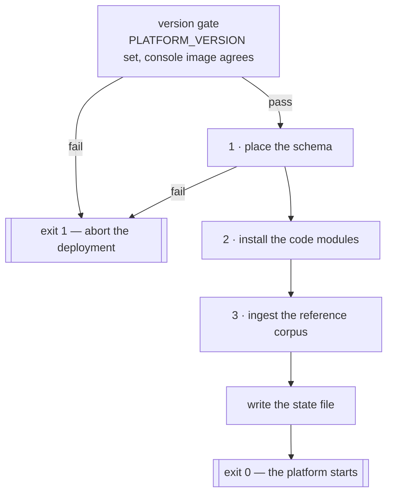

# BYODt Deployment — The Operator Console

> One binary, two subcommands: a deploy-time one-shot that prepares the deployment before the platform
> starts, and a long-lived daemon that reports what happened and owns the deployment's mode layer.

The console is a single Go program, `byodt-console`, published as one image and used twice in the
stack: `console-init` runs it as `init`, and `console` runs it as `daemon`. Both halves share the same
embedded assets and the same view of the deployment's directories, which is what lets the daemon report
on work the one-shot did and then exited.

The binary is named for its deployment type so another deployment type can ship its own console
alongside it, and every artifact it writes carries the same qualifier — the state file, the ingest
marker, the mount marker.

---

## At a glance

| | |
|---|---|
| **Language / image** | Go, `CGO_ENABLED=0`, cross-compiled per architecture; final image is `FROM scratch` |
| **Runs as** | Numeric uid/gid `65532:65532` — no root. `scratch` has no user database, so the id must be numeric |
| **Contents** | The binary, CA certificates, and an embedded asset tree: the no-auth schema, the ingest corpus, and the built console SPA |
| **Version** | Stamped at build time with `-ldflags "-X main.version=…"`; empty in an unstamped local build |
| **Subcommands** | `init` (default `CMD`) and `daemon`; anything else exits `2` with usage |

The embedded asset tree is a build prerequisite, not committed source: `build-assets.sh` generates the
no-auth schema from the platform's `schema.graphql`, copies each bundled data module's `.cypher`
corpus, and builds the SPA. A build that skips it fails to compile at the `//go:embed` lines — a loud
guard rather than an image that serves a blank page.

---

## `init` — the pre-start one-shot

`init` runs once per `up`, after the database is healthy and before the platform starts. It performs a
version gate and then three jobs, in a fixed order.

### The version gate

`PLATFORM_VERSION` must be set, and — when the console image carries a stamped version — it must equal
it. A mismatch means this console image cannot serve the version the deployment is pinned to, and it
aborts rather than installing one release's modules with another release's logic. An unstamped local
build skips the comparison so a development image still runs.

In the shipped bundle the two cannot disagree: the compose file derives the console image tag from
`PLATFORM_VERSION`, so bumping the version moves both images together. The gate is reachable only when
an operator sets a `CONSOLE_IMAGE` override whose tag differs — which is why the override exists to
repoint at a mirror, not to select a version.

`PLATFORM_VERSION` is the only version input the console has. It never picks a version of its own: the
release it fetches from, the identity it pins signatures to, and the tag it records in its state file
all derive from this one value.

### Job 1 — place the schema

The platform reads its no-auth schema from a fixed path beside the baked `schema.graphql`. The one-shot
writes that path from its embedded copy when `ENABLE_NOAUTH` is on, and writes an **empty file** when it
is off.

It reads `ENABLE_NOAUTH` from the same mode layer the platform will read, so the decision always tracks
the posture the platform comes up in. Parsing is lenient about spelling but fails *secure*: an empty or
unrecognised value is `false`, and `false` leaves the platform authenticated.

The empty-file case is a realization detail with teeth. The platform bind-mounts this exact path as a
single file; if the source were absent, the container runtime would create a directory there, and a
later flip back to no-auth would fail trying to write over it. An empty file keeps the mount a stable
regular file while leaving no usable no-auth schema on disk.

This job goes first because it cannot fail for database reasons, and because its failure must stop the
deployment.

### Job 2 — install the code modules

The one-shot fetches the release's signed module index, verifies it, then fetches, verifies, and
installs each module it names into the modules mount. Every step of that — the channel, the signature
policy, the digests, the extraction limits, and the replacement rule — is documented in
[`SUPPLY_CHAIN.md`](./SUPPLY_CHAIN.md).

What matters here is the classification it produces. Each module ends as `placed`, `skipped` (the
on-disk payload already matches), or `failed`, and the channel as a whole gets one status:

| Status | Meaning |
|---|---|
| `ok` | Every module placed or skipped |
| `partial` | Some placed, some failed |
| `failed` | Every module failed — the deployment has no code modules |
| `unreachable` | The release channel could not be reached (a network event) |
| `no-assets` | The named release carries no module assets (a configuration or publication event — it must not be reported as the operator's mistake) |
| `did-not-verify` | A signature did not verify. This is a security event, and it outranks everything else: it is reported even if other modules installed cleanly |

### Job 3 — ingest the reference corpus

The MITRE ATT&CK and D3FEND corpus is embedded in the console image as `.cypher` files, one directory
per bundled data module. The one-shot walks them in sorted path order, hashes the set, and compares
that hash against a marker node in the graph (`DethernetyIngestMarker`, keyed `byodt-console`). An
unchanged corpus is skipped.

The marker is an optimisation, not the correctness control — every ingest statement is a `MERGE`, so
re-running is a safe no-op. That is why any doubt about the marker resolves toward re-ingesting.

Execution mirrors the platform's own installer: one session per file, one autocommit transaction per
statement, fail-fast with the file name and a 1-based statement index. Two choices are deliberate:

- **Results are consumed.** A Bolt `Run` reports only run-phase failures; execution-phase errors — the
  memory-limit a large `MERGE` can hit part-way — arrive on the result stream and never surface unless
  it is consumed. Dropping the result would record a partial ingest as complete and lock it in behind
  the marker.
- **No managed transactions.** A managed transaction would *retry* a memory-limit error, which the
  database classifies as transient. Under this workload it is terminal: it means the database needs a
  larger memory limit. The error is classified and reported as such rather than retried.

### The two exit disciplines

The one-shot's exit code is the deployment's start/abort contract, and the two halves differ on
purpose.

| Outcome | Exit | Effect |
|---|---|---|
| Version gate or schema placement failed | `1` | The whole `up` stops. The platform's dependency is `service_completed_successfully`, so it never starts |
| Anything else — including a total module or ingest failure | `0` | The platform starts. The fault is recorded in the state file for the console to explain |

The asymmetry follows from what each failure means. A schema that disagrees with the code serving it
must not serve — there is no safe degraded mode, so the deployment stops. A missing module or an
incomplete corpus produces a deployment that is diminished but diagnosable, and a running deployment is
what lets an operator read the diagnosis. The alternative — refusing to start — leaves them with a
silent empty stack and a container log.

### The state file

The one-shot's last act is to write its record where the daemon can read it.

| | |
|---|---|
| Path | `.byodt-console-state.json` at the top of the modules mount (`STATE_PATH` overrides it) |
| Schema | `dethernety.byodt-console-state/1` |
| Write | Atomic — temp file plus rename in the same directory |
| Visibility | A top-level dotfile: the platform's module loader iterates *subdirectories* looking for `*Module.js`, so it never sees this |

It records the tag, the run timestamp, the modules block (status, per-module outcome, version, payload
digest, detail) and the ingest block (status, content hash, statement count, elapsed time, detail).

It records what init **placed**, not what registered — init exits before the platform starts, so it
cannot observe registration. Closing that gap is the daemon's job.

A failure to write the state file is logged but does not abort a running deployment; the daemon then
reports `init-not-run`, which is the honest reading of an absent record.

---

## `daemon` — the operator console

A small HTTP server with four responsibilities: report the deployment's state, own the mode layer,
manage content mounts, and install, report and remove entitled artifacts. It holds no database
connection, and its only dependency is an HTTP probe of the platform — so it keeps answering while the
rest of the stack is down.

| | |
|---|---|
| Listen | `0.0.0.0:8080` inside the container (`CONSOLE_BIND` / `CONSOLE_PORT`) |
| Transport | Plain HTTP — the front door terminates TLS for the whole stack, and is the only way in: the console publishes no port of its own |
| Timeouts | 10 s read-header, 30 s read, 30 s write, 120 s idle — except `POST /api/artifacts`, which raises its own response write deadline to twice the entitled-fetch bound plus 60 s (180 s today), because an install spends that budget on two entitled fetches, a signature verification and an extraction ([below](#entitled-artifacts)) |
| Shutdown | `SIGINT`/`SIGTERM` trigger a graceful shutdown with a 10 s budget |
| Session store | In memory — a daemon restart invalidates every live session, which is intended |

### Reporting state and failures

`GET /api/state` returns the init record plus the failures the daemon derives from it. Two of the five
failure kinds are things only the daemon can see, because they compare init's record against the
running platform.

| Kind | Derived from |
|---|---|
| `init-not-run` | No state file at all |
| `module-fetch-failed` | The recorded channel status (`unreachable`, `no-assets`, `did-not-verify`, `partial`, `failed`) — one message per class, because the causes and remedies differ |
| `fewer-modules-registered` | Modules init placed (or skipped, which also means "on disk") that the platform's live registry does not list. Failed modules are excluded — their absence is expected |
| `ingest-failed` | The recorded ingest status |
| `platform-unreachable` | `GET /config` did not answer |

The placed-versus-registered diff needs the platform's live module set, which the daemon reads with a
GraphQL `{ modules { name version } }` query. Reachability is judged **only** by `/config`, never by
that query: in cloud posture the module query requires the operator's bearer, and a rejected or
bearer-less query must not be mistaken for "the platform is down". When the query does not return
clean data the diff is simply skipped, so a transient blip cannot manufacture a
`fewer-modules-registered` banner.

### The mode layer

The console owns exactly one file: an env-file it writes with either the local values or the cloud
values, which `platform` and `console-init` both read as an `env_file`. It is **rewritten, never
deleted** — both Podman's `--env-file` and systemd's `EnvironmentFile` fail on a missing file, which
would break the very recovery path a disconnect is.

**Disconnect asks first, and it takes the cloud's modules with it.** The control opens a confirmation
before anything happens, because a revert that recreates the stack should not be one click from anywhere
in the panel — and because what it costs has to be a decision rather than a discovery.

A cloud connection puts three kinds of module into the modules mount, each told apart by the marker the
console wrote beside it: a content mount from the catalog, an installed artifact, and the knowledge-graph
connection. **All three exist only because the deployment was connected, so a disconnect removes all
three.** A deployment the console reports as pure-OSS while it still serves cloud-provided modules is not
one. Ownership is decided by marker and nothing else: a module the platform shipped, or a directory the
console never wrote, is never touched — and neither is one carrying two ownership markers at once, which
is claimed by two kinds and therefore by neither.

**The console deletes files here and issues no database command.** What follows is the platform's own
startup reconciliation: a `Module` it no longer finds on disk is dropped from the graph *together with
every class that module declared*, detaching those classes from everything they are linked to, existing
analyses included. Reconnecting and mounting again restores the classes but **not** those links. That
sentence is in the confirmation, in the same words the artifact panel already uses before a single
removal — one event should not be described more gently in one place than the other. Anything authored
outside those classes is kept.

The sweep runs while the deployment is still cloud-configured, before the mode layer is rewritten, so a
failure leaves a state a second disconnect can retry from. It can never block the revert: the modules
lock is taken with `TryLock` and a busy modules directory is reported rather than waited on, and a
directory that cannot be removed is named and stepped over. A recovery path something else can block is
not a recovery path.

The file lives under `/var/lib/dethernety` in the console's container (`MODE_LAYER_PATH`), surfaced on
the host as the bundle's `mode/` directory. The daemon's write access is scoped to that directory
alone — it can reach nothing else in the bundle.

**Intent versus phase.** The console distinguishes what *it* last wrote from what the platform is
*actually running*:

- **Intent** is read from the file on disk. `cloud` when the file carries the shared-pool marker;
  `pure-OSS` when it carries the development values; otherwise `none` — which is what an operator's
  own identity-provider configuration reads as, since the console did not write it.
- **Phase** is read from the platform's `/config`, never from the console's own file. Reading back its
  own write, the console would claim a mode the platform has not restarted into.

| Phase | Meaning |
|---|---|
| `pre-cloud` | The platform reports authentication disabled |
| `authenticated` | Authentication is on and the console wrote no cloud file — the operator's own identity provider |
| `post-cloud` | Authentication is on and the console wrote the cloud file |
| `platform-unreachable` | `/config` did not answer; no intent comparison is asserted |

**Restart pending** is exactly the disagreement between the two: a cloud file while the platform still
reports no-auth (a connect not yet applied), or the local file while the platform is still
authenticated (a disconnect not yet applied). It covers both directions with one rule, and it drives
the banner that names the command to run.

Most of what the layer holds comes from the recipe. Two values do not: those that depend on where the
deployment answers or how it is laid out, and the knowledge-graph pin, which the console reads from a
public listing at connect time (see [below](#the-knowledge-graph-connection)).

**Writing the layer** is guarded. A pasted **recipe** — the block of `NAME=value` lines an operator
copies from their account — is refused outright if a cloud file already exists, so reconfiguring must
go through a disconnect. The variable names the console will copy out of it are a closed set,
which is the subject of
[`SECURITY_MODEL.md`](./SECURITY_MODEL.md#the-mode-layer-is-a-closed-variable-allowlist). Reverting
rewrites the same file with the local values and contacts nothing: it is the recovery path, and a
recovery path that depended on the thing it recovers from would be useless.

Either write drops every live session but the one that made the change, which is kept on a short grace
deadline. A posture change must not leave a session minted under the old posture usable under the new
one — but the caller performing it is being handed an instruction to act on, so signing it out in the
same response would hide the instruction and strand the operator on a sign-in screen the new posture
cannot yet satisfy. See [`SECURITY_MODEL.md`](./SECURITY_MODEL.md#sessions).

### Content mounts

On a deployment connected to the cloud, the console can mount content-backed modules. Mounting is not a
download: the generic remote-module class already ships inside the platform's module package, so a
mount is a small CommonJS stub naming a module key and an immutable content pin, plus a marker file.
The module's classes, guides, and evaluation are then served per request against the caller's own
token — the console never fetches or holds that content.

| Artifact | Purpose |
|---|---|
| `<modules>/<module-key>/<PascalCase>Module.js` | The stub: a fixed template with exactly two substituted values, the module key and the pin |
| `<modules>/<module-key>/.dethernety-mount.json` | The marker (`dethernety.byodt-mount/1`): package key, module key, pin, timestamp |

The marker is the proof of ownership, and it is what makes mount and unmount safe:

- **Mount never clobbers.** A directory with the target name that does not carry the marker is refused,
  so a shipped module, an operator's own module, or an installed code module is never overwritten.
  Re-mounting the console's *own* stub is allowed — that is how a pin is advanced.
- **Unmount never deletes what it did not create.** Same test, opposite direction.
- **Keys are constrained and re-checked.** The module key must match a strict charset (it becomes both
  a directory name and a JavaScript string literal), the pin must be `sha256:` plus 64 hex characters,
  and the resolved directory is asserted to sit directly under the modules root.

A mount is written in a fixed order — the directory, then the marker, then the stub — and the
knowledge-graph mount below goes through the same writer, so the order has one definition. Marker first
is what makes the rest safe: writing the stub first would leave a loadable module in a directory that
mount and unmount then both refuse forever, and the operator's only remedy is a shell in the volume. A
marker failure undoes a directory the call created; a stub failure deliberately undoes nothing, because
the marker is exactly what makes that state recoverable. The half-mount it leaves is reported rather than
hidden — the mount's currency reads `incomplete`, rendered as "module file missing" — and mounting again
completes it while unmounting removes it. On a re-mount that advances a pin, which half is which
matters: the marker records the new pin while the stub still carries the old one — a file that is
present, non-empty and loadable, so every check the inventory makes passes and the mount reads `current`
while the platform serves the old code.

**The stub is published by rename.** It is written to a temp file beside it and renamed into place, so a
reader sees the previous stub or the new one and never a partial write, and the window the marker-first
ordering opens closes for every failure the write itself can catch. Where the temp cannot be created the
console writes in place instead, and that fallback is not a nicety: a module directory at mode `0555`
with the stub already in it permits an overwrite and refuses the creation of a sibling, so a rename-only
publish would turn a pin advance that succeeds today into a failure — landing in exactly the state the
ordering exists to make recoverable. The temp's mode is set explicitly rather than left to the write that
created it, because a temp left behind by an earlier attempt would otherwise carry its own mode into the
published stub, and the mode is load-bearing: the platform runs as a different user than the console and
has to be able to read the file.

**What a rename cannot close is an abrupt death between the two writes**, so the state is reported as
well as narrowed. A module file that does not carry the pin its mount records reads `diverged`, rendered
as "module file mismatched" and in the fault tone rather than the warning tone `outdated` and
`incomplete` share — this is not a state an operator chose, nor one they finish by getting round to it.
The row stays and offers **Repair**, which mounts again at the pin the marker already records and not at
the catalog's newest, because the complaint is that the platform is not running what was asked for and
answering it must not quietly substitute a different version. `incomplete` is asked first and wins — a
directory with no loadable file cannot also have one naming the wrong pin — and both override the catalog
comparison: a mount can be behind the catalog and also not be serving what it records, and only the
second is something the operator has not already been told.

The catalog itself is read **unauthenticated** — it is public, and attaching the operator's credential
would forward it to a surface that must not receive it. The catalog host is read from the mode file the
console itself wrote, never from the request, which is what keeps the console from being usable as a
request-forwarding primitive. If the catalog is unreachable the local inventory still renders, with a
note explaining why and every mount's currency reported as `unknown` — except where the on-disk checks
have something to say regardless, since `incomplete` and `diverged` are answered from the volume and need
no catalog to reach.

A mount takes effect when the platform is recreated. If the written stub ends up world-writable — some
bind-mount backends do not preserve modes — the console says so, because the platform refuses to load a
world-writable module file when running in production mode.

### The knowledge-graph connection

A deployment whose cloud recipe names a knowledge-graph service gets a third kind of mount, and the
console writes it with the cloud connection rather than from the catalog — so its presence always means
"a service is wired", and it never outlives the connection that justified it.

| Artifact | Purpose |
|---|---|
| `<modules>/knowledge-graph/KnowledgeGraphModule.js` | The stub. Fixed text with **nothing** substituted into it — there is no per-module value to carry |
| `<modules>/knowledge-graph/.dethernety-kg-mount.json` | The marker (`dethernety.byodt-kg-mount/1`): schema and timestamp |

It carries less than a content mount because there is less to carry. The class it instantiates already
ships inside the platform's module package, and the version it answers at belongs to the whole
deployment rather than to the module — so the version lives in the mode layer, not in the marker. One
value, one writer, and what the operator is shown is the one the platform reads.

Three properties are worth stating because each is a decision rather than a consequence:

- **The version is chosen by the console, from a public listing, with no credential.** It is not in the
  recipe — a recipe that could carry it could pin a deployment to a version of the sender's choosing.
  The console validates it as `sha256:` plus 64 hex before writing, refuses a version the listing marks
  withdrawn, and refuses to take "whatever is newest" at query time, which would advance the knowledge
  graph under a deployment that pinned deliberately.
- **Both variables are written, or neither is.** If the service cannot be reached the console writes no
  knowledge-graph configuration at all, mounts nothing, and says so — the deployment connects to the
  cloud without it. A service that is momentarily down must not cost an operator their cloud connection,
  and a base URL with no version is inert while *looking* configured.
- **The marker name is distinct from the other three.** Content mount, code-module stamp,
  knowledge-graph mount, artifact install: four kinds, four names, so unmount and remove can never take a
  directory they did not create, and the key `knowledge-graph` is refused — as a content module key and
  as an artifact key — rather than contended for. Like the artifact marker and unlike the content
  mount's, this one is parsed and its schema checked rather than stat'd: a file carrying the marker's
  name and another schema is not the console's.

The connection is reported apart from the content mounts, and read-only. There is nothing for an
operator to do with it, and listing it among modules whose content is served per request would invite
reading it as the knowledge graph itself having been installed — when what was installed is a client.

### Entitled artifacts

A deployment connected to the cloud can also **install** an artifact, which is not a mount. A content
mount needs no credential — the catalog is public and a mount is a local file write — but installing an
entitled artifact means asking the content service for bytes it will only hand to a subscriber. What
lands is not a stub naming content to fetch later: it is the module's own verified payload tree, in the
modules mount, and from then on the deployment holds the code.

Only one kind of artifact is installed onto a deployment, a code module. The other kind the content
service publishes is an application, which is not something a deployment hosts — it runs wherever
its operator runs it. Asking to install one is refused — `409` rather than `400`, because the request
is well formed and it is the destination that is wrong — and refused before the archive is fetched, so a request that
was never going to install does not pull megabytes first. That is the only check anywhere that reads an
artifact's kind: the staging sequence asserts a module *layout*, which an application's archive could
satisfy by accident, and the platform would load what it found there as a module.

**The install runs on the operator's own credential, not the console's.** The console holds none of its
own and gains none here. The operator's OIDC *access* token — minted in the same sign-in as the ID token
their session was established with — rides its own header, `X-Console-Cloud-Token`, for the duration of
one request: never logged, never written to disk, nothing kept between requests. A header of its own,
because `Authorization` already carries the ID token the daemon forwards to the platform's own module
query — why the two cannot be collapsed is in [`SECURITY_MODEL.md`](./SECURITY_MODEL.md#sessions). An
install attempted without it is `400` and "a cloud sign-in is required" — deliberately not `401`, which
the SPA reads as an expired session and would answer by returning the operator to the sign-in card
mid-install.

**Nothing is placed until the signature verifies.** The archive is checked against a Sigstore bundle
pinned to a certificate subject derived from the request — the signer the cloud connection names, plus a
ref naming this artifact key and this version — so a signature that verifies means "these are the bytes
I asked for" and not merely "someone we trust signed something". Verify, digest, extract, assert the
layout, recompute the payload digest: the same sequence the boot path runs
([`SUPPLY_CHAIN.md`](./SUPPLY_CHAIN.md)), in a staging directory under the modules mount, and only then
is the tree marked and swapped into place. A signature that does not verify is refused with "nothing was
installed", takes the staged tree with it, and is logged as a security event rather than an ordinary
install failure. A deployment whose cloud connection names no signer refuses every install rather than
falling back to a weaker check — reconnecting is what obtains one.

**The inventory rides on the modules read.** `GET /api/modules` returns the installed artifacts
alongside the mounted stubs and the knowledge-graph connection, each with its version, when it was
installed, and its currency against the catalog:

| Currency | Meaning |
|---|---|
| `current` | The installed version is the newest the catalog offers |
| `outdated` | A newer version is offered, and the response names it |
| `unknown` | No comparison could be made, and the causes do not all explain themselves. A version on one side the console cannot parse, and an installed version newer than anything on offer, each add a note naming the artifact. A catalog that could not be read at all — unreachable, or no usable content service configured — adds one note for the whole response instead. Silence is the fourth case: an artifact that no package in the catalog offers is reported `unknown` with nothing further said, which is what an operator sees both for a version the catalog no longer lists and for one whose package the catalog could not serve |
| `unavailable` | Every published version has been recalled, so there is nothing to offer. Not the same as being up to date, and not the same as not knowing |

`outdated` is never answered on a comparison that could not be made. It is an invitation to install, and
the cases that cannot be compared would be inviting either a downgrade the install refuses or a version
that no longer exists. The mounts carry two values of their own, `incomplete` and `diverged`, and
neither is one of these: they report what is on disk rather than how it compares to the catalog.
`incomplete` belongs to a stub mount whose module file is not there; `diverged` to one whose module file
is there and names a pin the mount does not record. Mounting again is what settles both
([above](#content-mounts)).

**Removal takes only what the console installed as an artifact.** `DELETE /api/artifacts/{key}` renames
the tree away and then deletes it — the rename is the atomic point, so the module is gone from where the
platform looks whatever happens to the copy afterwards. A directory carrying the code-module stamp and
no artifact marker is read as one of the release's own modules — placed by
[job 2](#job-2--install-the-code-modules) before the platform started — and the refusal says it was
installed *with* the platform rather than claiming the console did not create it; a content mount using
the same name is answered "unmount it instead"; and `knowledge-graph` is removed by disconnecting from
the cloud.

Removal has a consequence in the graph, and the console states it **before** the operator confirms as
well as on the answer: at the next platform restart the classes the module provides — and any it once
provided — are deleted, together with every link to them, including existing analyses' links.
Re-installing brings the classes back but not those links. Anything authored outside those classes is
kept, but nothing can read, edit or export it until the module is installed again. It is carried on the
modules read for exactly that reason, so the confirmation an operator is asked for can state it, and
repeated on the removal's own answer for the operator who arrived from a reload.

**The refusals an operator actually meets.** Each is a sentence rather than a code, and the sentence is
what is shown.

| Refusal | What it means |
|---|---|
| `409` another module operation is already running | Installing, removing, mounting and unmounting all write into the same modules directory, and one runs at a time. The second caller is told rather than left holding a connection open through another request's multi-megabyte download — retry once the first finishes |
| `409` this version is older than the installed one and has to be asked for explicitly | The request is a downgrade. Confirm it — the confirmation names both versions, and it is the only thing that turns the guard off — or install the newer version instead. Without the guard, a service that withdrew a fixed version could walk a deployment backwards onto a known-bad one. Re-installing the *same* version is not a downgrade: it is how a damaged tree is repaired |
| `410` this version has been withdrawn | Recalled by its publisher. The reason the publisher wrote is surfaced with the refusal, and the version that supersedes it when there is one. Expect it in the window after a recall: a package cut beforehand still advertises the withdrawn version, so the console keeps offering it until the last cut lands |
| `403` this deployment's subscription does not include this artifact | The content service's own denial, passed through verbatim |
| `502` the content service could not be reached | A dial failure, or a redirect the console refuses to follow because following it would dial a host the operator never named. It takes up to a minute to arrive — an entitled fetch is bounded at 60 s |
| `409` no content service, or no artifact signer, is configured | The cloud connection carries neither the host to ask nor the identity to verify against. Reconnect |

**An install can run for minutes, which is why two timeouts are set the way they are.** Two entitled
fetches bounded at 60 s each, plus a verification, an extraction and a digest recompute, do not fit the
server-wide 30 s write deadline — past it the install still completed on disk while the `200` could no
longer be written, so a success reached the browser as a dropped connection with no restart reminder.
That one route raises its own deadline rather than weakening every other handler's. The front door is
the other half: `/console/` carries `proxy_read_timeout 240s`, deliberately longer than the daemon's own
budget so the daemon is always the one that gives up first and the operator reads its refusal instead of
a proxy `504`. The front door's own 60 s default would otherwise cut off the case that matters most — an
unreachable content service, whose refusal is composed at t≈60 s by construction.

Like a mount, an install takes effect when the platform is recreated, and the answer names the command.
A removed module stays loaded until that same recreate, which is when its graph consequences fire. And
as with a mount's stub, if a module file in the installed tree ends up world-writable the console says
so.

### Authentication posture

How a session is minted tracks the deployment's posture; how it is *carried* never changes.

| Posture | Mint | Lifetime |
|---|---|---|
| Local (the default, and an own-identity-provider deployment) | No credential | No expiry |
| Cloud | The operator's OIDC ID token, presented as a bearer | 1 hour, absolute |

**The session is a request header (`X-Console-Session`), never a cookie.** A header cannot be attached
by a third-party page, which removes the CSRF class outright — no `SameSite` reasoning, no
double-submit token, no `Origin` check. This holds in both postures, and it is the reason a loopback
bind is not treated as the boundary: loopback is not a boundary against the operator's own browser, but
a custom header is.

**Local posture mints with no credential.** Under single-user host trust, a secret here would only
fence out other local processes. The consequence — that reaching the console *is* holding a session —
is the central hardening fact of this deployment and is stated plainly in
[`SECURITY_MODEL.md`](./SECURITY_MODEL.md#console-reachability-is-authority-over-the-deployments-identity-configuration).

**Cloud posture delegates.** The daemon forwards the presented ID token to the platform's
authenticated module query and mints only if the platform returns clean data. The platform performs
*all* validation — signature, expiry, issuer, audience, and the deployment's own access list — so the
console holds no key-fetching, no token-parsing-for-trust, and no allowlist logic of its own. It reads
the token's display claims without verifying them, purely to show who is signed in.

Two properties of that path are deliberate:

- **Any non-clean response is "could not verify — retry", never "your token is bad."** In production
  the platform masks an authentication rejection and a backend blip to a byte-identical generic error,
  so the two are indistinguishable on the wire; asserting a token problem would be a guess.
- **The mint route never returns `401`.** A missing sign-in is `400` and a failed verification is
  `503`, so the SPA's session-expired handling can never be tripped by the mint itself.

The 1-hour cloud session is the revocation window: past it, gated calls fail and the sign-in re-runs,
which re-checks the platform's access list. There is no silent re-mint. Concurrent cloud mints are
capped at four in flight, because the mint route is ungated and each one costs the platform an
authentication round trip.

### HTTP surface

| Route | Session required | Purpose |
|---|---|---|
| `GET /healthz` | no | Liveness |
| `GET /` | no | The console SPA shell |
| `GET /assets/…` | no | The hashed SPA bundle |
| `GET /auth/callback` | no | The sign-in landing page — serves the same shell, which completes the exchange |
| `POST /api/session` | no | Mint a session, by posture |
| `GET /api/posture` | no | Which sign-in to render, plus the public discovery values it needs |
| `GET /api/mode` | yes | Phase, restart-pending, and the signed-in subject |
| `GET /api/state` | yes | The init record plus derived failures |
| `POST /api/cloud` | yes | Write the cloud mode layer from a pasted recipe |
| `DELETE /api/cloud` | yes | Revert the mode layer to the local values |
| `GET /api/packages` | yes | The public content catalog (cloud posture only) |
| `GET /api/modules` | yes | The whole modules-directory inventory in one read: the mounted stubs and their currency, the knowledge-graph connection, the installed artifacts and their currency, and — whenever there is an artifact it could apply to — what removing one does (cloud posture only) |
| `POST /api/modules` | yes | Mount one module at one pin (cloud posture only) |
| `DELETE /api/modules/{key}` | yes | Unmount (cloud posture only) |
| `POST /api/artifacts` | yes | Install one entitled artifact at one version (cloud posture only) — the only route that carries a second credential, the operator's access token on `X-Console-Cloud-Token` |
| `DELETE /api/artifacts/{key}` | yes | Remove one installed artifact (cloud posture only) |

Everything that carries deployment data is gated. The SPA shell is not, because it holds no data and
the sign-in page has to load; `GET /api/posture` is not, because the sign-in page needs to know which
sign-in to render *before* a session can exist. That endpoint is a hard five-field projection of the
mode file rather than a dump of it — the same file also holds the deployment's access list and its
service URLs, and none of those are returned.

Request bodies are capped at 1 MiB and decoded with unknown fields rejected.

---

## Why the console has no process control

The console writes files that change how the deployment starts, and then tells the operator which
command to run. It never restarts anything itself.

This is not an omission. Reaching the container runtime from inside a Compose deployment means mounting
the engine's socket into the console container — and access to that socket is equivalent to root on the
host. It would mean that a flaw in a small status server, or possession of a console session, escalates
to arbitrary control of the machine. The console's whole value is that its blast radius is the handful
of files it owns; a socket mount would erase that in exchange for saving one typed command.

So the console names the command instead, and names the *right* one, because the changes it writes do
not all apply at the same scope:

| Change | Command the console names | Why that scope |
|---|---|---|
| Connect to or disconnect from the cloud | `byodt restart` | The mode layer is read by more than one service, so all of them must come up in the new mode |
| Mount or unmount a content module | `byodt restart platform` | The stub lands in the modules mount, which only the platform reads at startup |
| Install or remove an entitled artifact | `byodt restart platform` | A whole verified payload tree is swapped into that same mount. A removed module stays loaded until that boot, which is also when its graph consequences fire |

All three are recreates rather than restarts, because a container's environment is fixed at creation.

---

## What the console cannot reach

| | |
|---|---|
| The database password | Not passed to the daemon at all — the service block gives it neither the variable nor the secrets file |
| The container runtime | No socket, no process control |
| The rest of the bundle | Its writable mounts are the modules directory and its own mode directory |
| The graph | The daemon holds no database connection; the one-shot's connection ends when it exits |
| Content served to modules | It writes the pin; the platform fetches the content against the caller's own token |

---

## Related documentation

| Document | Description |
|---|---|
| [`ARCHITECTURE.md`](./ARCHITECTURE.md) | Where the console sits in the stack, its mounts, and the startup conditions |
| [`SUPPLY_CHAIN.md`](./SUPPLY_CHAIN.md) | The channel, signatures, and digests behind job 2 |
| [`SECURITY_MODEL.md`](./SECURITY_MODEL.md) | Sessions, the mode-layer allowlist, and the reachability rule |
| [Configuration Guide](../../CONFIGURATION_GUIDE.md) | `ENABLE_NOAUTH`, the OIDC variables, and the no-auth preconditions |
| [Module System](../modules/README.md) | How the platform loads what the console places |
