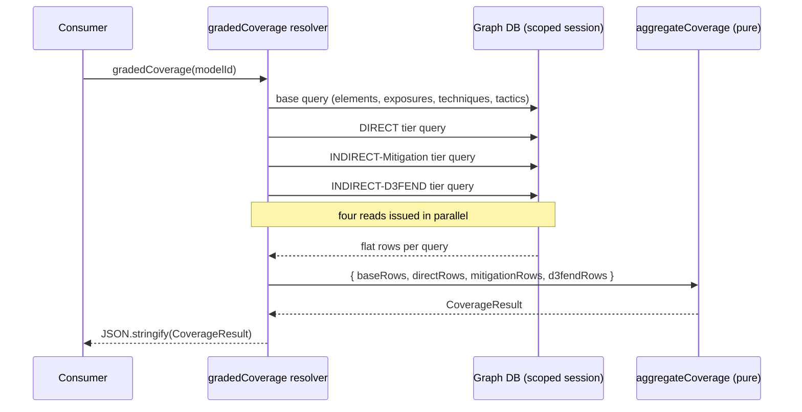
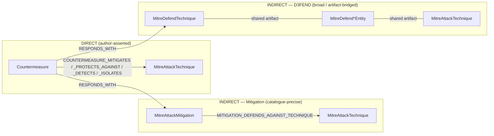
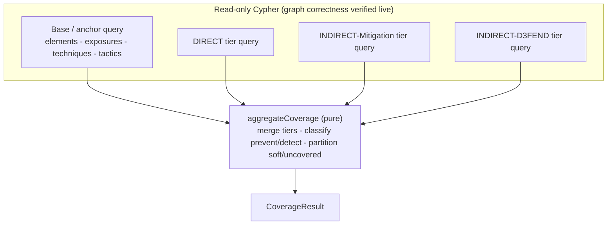

# Coverage Tools — Architecture

Dethernety Coverage Tools is a backend-only `DTModule` that turns a model's threat graph into a single set of graded, element-scoped MITRE coverage facts. Its design splits cleanly into two halves: a thin set of read-only Cypher queries that gather flat rows from the graph, and a pure function that assembles those rows into the result. This document explains how those halves fit together, why the graph traversal is shaped the way it is, and where the line falls between what this module computes and what a consumer is responsible for.

**What this document covers:** the pure backend-module shape and its non-responsibilities; the GraphQL field, resolver, and secure scoped driver; the three-tier graded bridge from countermeasure to technique; element scoping as a correctness property; the prevent/detect classification rules; the anchor-first query design and why it bounds the D3FEND traversal; the four-query plus pure-aggregator structure and its testability rationale; the raw-facts contract and the producer/consumer division of labor; database portability; and why coverage lives in its own module. For the field-level shape of the output, see [coverage-facts.md](./coverage-facts.md).

---

## 1. Module shape and non-responsibilities

The module implements the [`DTModule`](../modules/DT_MODULE_INTERFACE.md) interface directly rather than extending an OPA or analysis base class, because it needs none of what those base classes provide. It has no classes to register, no Rego policies to evaluate, and no analysis workflow to run.

Its `getMetadata()` returns name, description, version, and author — and nothing about classes, because it declares none. Its only structural contributions are:

- **`getSchemaExtension()`** — extends the root `Query` type with one field.
- **`getResolvers(context)`** — supplies the resolver for that field and captures the session-scoped database name from the resolver context at startup.

Everything else a richer module might implement — `getClassTemplate`, `getExposures`, `getCountermeasures`, `runAnalysis`, `startChat` — is intentionally absent. The module:

- declares **no** component, data-flow, security-boundary, data, control, issue, or analysis classes;
- contributes **no** frontend, no diagram behavior, no UI schema;
- performs **no** AI or rule evaluation;
- writes **nothing** — every query is read-only;
- presents **nothing** — it emits raw facts, never a rendered or scored view.

This minimalism is the point. The module is a query primitive: it exists to compute one well-defined set of facts and hand them off.

---

## 2. The GraphQL field, resolver, and scoped driver

### The field

```graphql
extend type Query {
  gradedCoverage(modelId: ID!): String
}
```

The field name is unique across the platform on purpose: GraphQL schema merging silently drops a colliding resolver, so the name must not collide with the platform's own control-gap field or any other module's field. The return type is `String` — a JSON-encoded payload — rather than a declared GraphQL object type, which keeps the schema layer from treating the coverage shape as a graph node and matches the convention the consuming report surface uses for its own custom field.

### The resolver

The resolver is deliberately thin. It coerces `modelId` to a string, returns `null` for an empty id, runs the computation, and `JSON.stringify`s the result:

```ts
gradedCoverage: async (_parent, args) => {
  const modelId = String(args?.modelId ?? '');
  if (!modelId) return null;
  const result = await this.computeGradedCoverage(modelId);
  return JSON.stringify(result);
}
```

### The scoped driver and no self-authorization

The driver handed to the module constructor is the **secure, session-scoping driver**. The resolver context, captured once at startup, carries the database name that scopes every session the module opens. The module:

- **adds no authorization of its own** — the platform's JWT guard and per-session scoping own access decisions;
- **broadens no scope** — it opens sessions only against the scoped database name it was given;
- **only reads** — every query runs inside `executeRead`.

Each read also carries a defensive transaction timeout. This is a belt-and-suspenders ceiling rather than the load-bearing bound: on Neo4j the driver honors the transaction `timeout`; on Memgraph per-query bounding is governed server-side. The real bound on the work comes from the query design itself (see [§6, Anchor-first](#6-anchor-first-query-design)). Because a raw-Cypher resolver is not covered by GraphQL complexity limits, the resolver owns its own bound deliberately.



---

## 3. The three-tier graded bridge

The central idea is that a countermeasure can demonstrate coverage of an ATT&CK technique through evidence of three different strengths. All three are real coverage; they are *graded* by specificity so a consumer can weigh them differently.

| Tier | Constant | Evidence path | Specificity |
|------|----------|---------------|-------------|
| DIRECT | `DIRECT` | An author-asserted edge straight from the countermeasure to the technique | Highest — but rarely present |
| INDIRECT — Mitigation | `INDIRECT_MITIGATION` | The countermeasure responds with an ATT&CK mitigation that defends against the technique | High — catalogue-precise |
| INDIRECT — D3FEND | `INDIRECT_D3FEND` | The countermeasure responds with a D3FEND technique that shares a defensive artifact with the technique | Broad — low specificity |



A note on the three tiers:

- **DIRECT** is the optional enrichment most real controls lack, so in practice this tier is often empty. When present, it is the strongest signal — a human asserted the edge.
- **INDIRECT — Mitigation** rides the ATT&CK catalogue itself. A countermeasure `RESPONDS_WITH` an ATT&CK mitigation, and the mitigation `MITIGATION_DEFENDS_AGAINST_TECHNIQUE` the technique. This is catalogue-precise and is always treated as preventive.
- **INDIRECT — D3FEND** is the broad tier. A countermeasure `RESPONDS_WITH` a D3FEND technique, and that defensive technique reaches the attack technique only by sharing a defensive **artifact**. The artifact link is OWL-derived and **untyped in the GraphQL schema** — offensive verbs (such as `PRODUCES`/`MODIFIES`) on the ATT&CK side and defensive verbs (such as `ANALYZES`/`MONITORS`) on the D3FEND side — so it is matched by raw Cypher, verb-agnostic and directionless, bounded to the `MitreDefend*Entity` node-label family.

### Sub-technique coverage inheritance

Coverage flows **down** the ATT&CK sub-technique hierarchy, never up. A covering edge that lands on a parent technique covers its sub-techniques, but a single sub-technique's mitigation does not cover the parent or its siblings. In every tier query this is expressed by walking from the exposure's own technique `t` toward its ancestors — `(t)-[:SUBTECHNIQUE_OF*0..1]->(ct)` — and attributing the covering fact to `t` (the exposure's technique, the matrix row), not to the ancestor that carried the edge. The walk is bounded to a single level because ATT&CK sub-techniques are one level deep, which keeps the anchor-first guarantee intact.

> ATT&CK's `SUBTECHNIQUE_OF` (no underscore between `SUB` and `TECHNIQUE`) is a **different** relationship from D3FEND's `SUB_TECHNIQUE_OF`, which appears in the D3FEND tier's tactic resolution. They are not interchangeable.

---

## 4. Element scoping as a correctness property

Element scoping is not a filter applied after the fact — it is part of what "covered" means. A technique is covered **for an exposure** only when the covering countermeasure's parent `Control` `SUPPORTS` the exposed element, or the boundary that element belongs to. A countermeasure that counters the same technique on some *other* element does not cover this exposure.

The support relationship is pinned by a shared anchor that every tier query reuses:

```cypher
MATCH (element)-[:HAS_EXPOSURE]->(exp:Exposure)-[:EXPLOITED_BY]->(t:MitreAttackTechnique)
OPTIONAL MATCH (element)<-[:SUPPORTS]-(:Control)-[:HAS_COUNTERMEASURE]->(cmDirect:Countermeasure)
OPTIONAL MATCH (element)-[:BELONGS_TO]->(:SecurityBoundary)<-[:SUPPORTS]-(:Control)-[:HAS_COUNTERMEASURE]->(cmBnd:Countermeasure)
WITH exp, t, [x IN collect(DISTINCT cmDirect) + collect(DISTINCT cmBnd) WHERE x IS NOT NULL] AS cms
UNWIND cms AS cm
```

Two scoping rules are worth calling out, both chosen to match the platform's own control-gap analysis:

- **Boundary inheritance is exactly one `BELONGS_TO` level.** A control on the element's immediate boundary is credited; a control on a grandparent boundary is not. This is a deliberate, platform-consistent under-count, not a bug.
- **Only `Component` and `SecurityBoundary` declare `BELONGS_TO`.** The boundary-inherited hop is therefore a structural no-op for `DataFlow` and `Data` elements, which are credited through a direct `SUPPORTS` edge only — again matching the reference behavior.

Because the anchor `UNWIND`s only the surviving element-supporting countermeasures, every tier hop expands from an already-element-scoped countermeasure. Scoping cannot be forgotten in a tier query, because the tier query never sees an unscoped countermeasure.

---

## 5. Prevent vs. detect classification

Each covering edge is classified as `PREVENT` or `DETECT`. The rules differ by tier because the evidence differs by tier.

| Tier | Rule |
|------|------|
| **DIRECT** | Read from the relationship type: only `COUNTERMEASURE_DETECTS` is detective; `_MITIGATES`, `_PROTECTS_AGAINST`, and `_ISOLATES` are preventive. |
| **INDIRECT — Mitigation** | Always `PREVENT`. An ATT&CK mitigation is a preventive catalogue entry. |
| **INDIRECT — D3FEND** | Derived from the D3FEND technique's tactic name(s): a `Detect` tactic yields `DETECT`; `Harden`/`Isolate` (or a tactic-less bridge) yields `PREVENT`. A defensive technique that spans both yields **both** functions. |

The D3FEND rule is intentionally conservative about claiming detection: `DETECT` is asserted only when a `Detect` tactic is actually present; everything else — including a bridge with no resolvable tactic — reads as `PREVENT` ("a defensive action, not a detector"). The tactic itself is resolved through `(:MitreDefendTechnique)-[:SUB_TECHNIQUE_OF|ENABLES*0..]->(:MitreDefendTactic)`, because in the D3FEND ontology a sub-technique inherits its tactic from its parent; a single-hop traversal would miss inherited tactics and could mislabel detective coverage as preventive.

Note what is **not** done here: the module records both functions wherever the evidence supports them and does not collapse a technique to "detect-only." Reducing a technique to detection coverage when no preventive edge survives anywhere is a consumer concern (see [§8](#8-the-raw-facts-contract-and-the-division-of-labor)).

---

## 6. Anchor-first query design

The D3FEND tier is broad: a single defensive technique can bridge to dozens of attack techniques through shared artifacts. Enumerated naively, that fan-out would dominate the query cost. The module avoids it entirely with an **anchor-first** structure.

Every tier query pins two things *before* it runs the tier hop:

1. the **element-support join** — the element-supporting countermeasures (§4); and
2. the exposure's **`EXPLOITED_BY` technique** — the specific technique `t` the exposure maps to.

Only then does the tier hop run, and it runs as an **existence test against an already-pinned `(countermeasure, technique)` pair** rather than as an enumeration. The D3FEND tier asks "does this defensive technique bridge to *this* exposure's technique?" — it never asks "what is the full set of techniques this defensive technique can reach?" The broad fan-out is eliminated by construction, so no explicit fan-out cap is needed.

The artifact bridge itself is matched carefully:

```cypher
MATCH (cm)-[:RESPONDS_WITH]->(dt:MitreDefendTechnique)
MATCH (dt)--(art)--(ct:MitreAttackTechnique)
WHERE any(l IN labels(art) WHERE l STARTS WITH 'MitreDefend' AND l ENDS WITH 'Entity')
MATCH (t)-[:SUBTECHNIQUE_OF*0..1]->(ct)
```

The two artifact hops stay in a single `MATCH (dt)--(art)--(ct)`. Relationship-isomorphism — guaranteed by both engines within one `MATCH` — ensures the two anonymous edges are distinct; splitting them into separate `MATCH` clauses would let one edge bind both and fake a self-bridge. The `MitreDefend*Entity` label filter both restricts `art` to the artifact family and guarantees `art` is neither `dt` nor `ct`.

---

## 7. Four queries and one pure aggregator

The computation is structured as **four small, portable Cypher reads feeding one pure function**.



### The shared building blocks

Two Cypher fragments are shared across the reads:

- **Element discovery** gathers the model's `Component`, `DataFlow`, `SecurityBoundary`, and `Data` elements. Each kind is collected with its own `OPTIONAL MATCH` rooted at the model — the boundary forest via a bounded `BELONGS_TO*0..50` walk, then contained components, then their flows, and `Data` via the model's `CONTAINS` edge — and only the final combined list is `UNWIND`ed. Collecting each kind independently before unwinding is what lets a model with no boundaries but with `Data` still yield its `Data` elements; a leading required boundary match would collapse such a model to zero rows. The fragment ends `WITH DISTINCT element` so each query appends its own anchor and tier hop. It uses no nested `EXISTS` and only scalar collects, which keeps it portable across engines.
- **The support anchor** (§4) pins the exposed technique and the element-supporting countermeasures, then `UNWIND`s the surviving countermeasures.

### The four reads

1. **Base / anchor query** — one row per `(element, exposure, exploited technique)`, carrying the technique's ATT&CK tactic name(s) (the matrix columns), name, and description. An exposure with no `EXPLOITED_BY` technique yields a single row with a null technique id — the soft/unmapped marker. Tactics are resolved through `SUBTECHNIQUE_OF*0..1` so a sub-technique inherits its parent's tactic columns as well as its own.
2. **DIRECT tier query** — element-anchored countermeasures with an author-asserted edge (`type(r) IN [...]`, the most engine-portable form) to the exposed technique or its parent, returning the relationship type so the function classification can read it.
3. **INDIRECT-Mitigation tier query** — element-anchored countermeasures that respond with a mitigation defending against the exposed technique.
4. **INDIRECT-D3FEND tier query** — element-anchored countermeasures whose D3FEND technique artifact-bridges to the exposed technique, returning the D3FEND tactic name(s) for prevent/detect derivation.

Each tier query also returns the covering countermeasure's parent `Control` via `(:Control)-[:HAS_COUNTERMEASURE]->(cm)`. `HAS_COUNTERMEASURE` is one control per countermeasure, so this is a single hop with no fan-out; the control id is the signal a consumer uses to spot a supporting control that covers none of an element's gaps. The four reads are issued in parallel.

### The pure aggregator and why it is pure

`aggregateCoverage` takes the flat rows and produces the `CoverageResult`. It:

- keys contributions by `(exposure, technique)`, then by tier, then by function, accumulating the contributing countermeasure ids and their parent control ids;
- classifies each DIRECT edge via the relationship type and each D3FEND edge via its tactic set (a D3FEND edge spanning both functions contributes to both);
- builds one `ExposureCoverage` per distinct exposure, marking an exposure `soft` when it has no technique at all, and marking each technique `covered` when at least one tier fact exists for it;
- dedupes technique name/description into a single `techniques` map so the full description is not repeated per exposure;
- computes `meta`: exposure and soft-exposure counts, distinct covered `(exposure, technique)` pairs per tier, and distinct contributing countermeasures per tier.

Keeping this assembly in a pure function — rather than in deeply nested Cypher `collect`s — is what makes the tier merge, the soft/uncovered partition, and the prevent/detect mapping **unit-testable against fixtures**. The split is deliberate: the *graph* correctness of the four reads is verified against a live graph, while the *assembly* correctness is verified deterministically in the test suite. Neither half has to carry the other's complexity.

---

## 8. The raw-facts contract and the division of labor

The output is **raw and disposition-agnostic by contract.** This is a present-tense design property, not a missing feature: the module emits facts and intentionally leaves interpretation to consumers.

The `CoverageResult` carries **no**:

- disposition filter (every exposure and countermeasure is reported regardless of any recorded disposition);
- tier bucketing (tiers are reported per technique, not pre-segregated into summary buckets);
- percentage or coverage score;
- single "Covered: N" rollup;
- detect-only reduction.

A consumer applies its own policy on top. Concretely, a consuming surface is responsible for:

| Consumer responsibility | Why the primitive leaves it out |
|---|---|
| **Live-only disposition filter** | Whether a disposition (not applicable, false positive, risk accepted, waived, superseded, …) excludes a finding is a presentation/governance decision that varies per consumer |
| **Tier bucketing and presentation** | How to surface the three tiers — and whether to weight the broad D3FEND tier differently — is a display choice |
| **Detect-only reduction** | Collapsing a technique to "detective-only iff no preventive edge survives at any tier" is a consumer's honesty rule; the primitive records both functions wherever the evidence exists |
| **Any percentage or score** | The primitive emits none on purpose; a consumer that wants a number computes its own from the raw pairs |

The primary consumer, the [Dethernety Threat Report](../dethernety-threat-report/README.md) module's Coverage & Gaps surface, applies exactly these. The exact list of consumer obligations and the join model are in [coverage-facts.md](./coverage-facts.md).

---

## 9. Database portability

Every query is written to run unchanged on both Neo4j and Memgraph:

- **No nested `EXISTS`** in the element-discovery and anchor fragments; scalar `collect`s are used instead.
- **Bounded variable-length walks** — `BELONGS_TO*0..50` for the boundary forest, `SUBTECHNIQUE_OF*0..1` for sub-technique inheritance — rather than unbounded `*`.
- **`type(r) IN [...]`** for the DIRECT relationship set, the most portable way to match a relationship-type union.
- **Relationship-isomorphism within a single `MATCH`** for the D3FEND artifact bridge, a guarantee both engines honor.
- **Read-only transactions** with a defensive timeout that Neo4j honors directly and Memgraph backstops server-side.

The result is a primitive that behaves identically across the platform's supported graph backends.

---

## 10. Why coverage is its own module

Coverage facts are consumed by more than one tool, and the element-support reasoning already exists in the platform's control-gap analysis. Rather than copy that traversal into every consumer — and let each copy drift — the module factors coverage into one reusable primitive that:

- generalizes the element-scoped, control-supported reasoning into a gradable result;
- adds the DIRECT and D3FEND tiers on top of the DIRECT/Mitigation reasoning consumers already rely on;
- emits raw facts so each consumer applies its own interpretation policy.

One traversal, many interpretations. That is the rationale for the module boundary.

---

## Related documentation

| Topic | Document |
|-------|----------|
| Output contract (field-by-field) | [coverage-facts.md](./coverage-facts.md) |
| Module index and build/test | [README.md](./README.md) |
| `DTModule` interface | [../modules/DT_MODULE_INTERFACE.md](../modules/DT_MODULE_INTERFACE.md) |
| Module system overview | [../modules/README.md](../modules/README.md) |
| Primary consumer | [../dethernety-threat-report/README.md](../dethernety-threat-report/README.md) |
| Platform overview | [../README.md](../README.md) |
