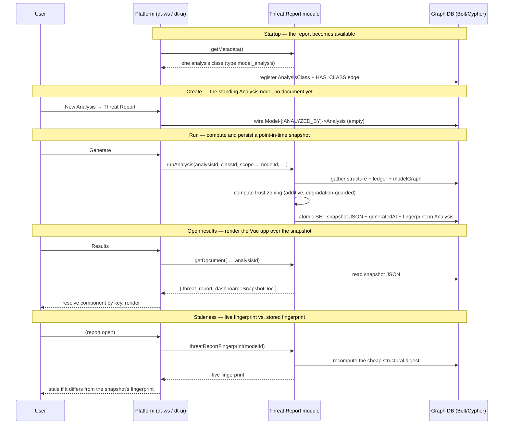
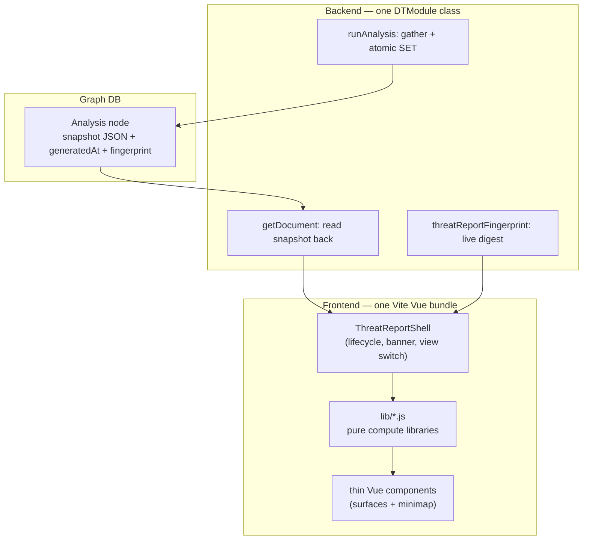

# Threat Report — Architecture Overview

> What the module is, how a report comes to exist, and where the deeper docs live.

The Dethernety Threat Report is a **pure, read-only reporting `DTModule`** layered over an *existing* threat model. It adds no threat-modeling classes, runs no AI or policy evaluation, and edits nothing in the platform UI, backend, or shared packages. It mounts entirely through the platform's native analysis lifecycle: it declares one non-AI analysis class, computes a point-in-time **snapshot** of the model when the analyst runs it, persists that snapshot on the standing `Analysis` node, and renders a single Vue application over that snapshot when the analyst opens the results.

This document is the orientation layer. It covers what the module is and is not, the snapshot lifecycle end to end, the backend/frontend split and the pure-compute-libraries pattern that runs through both, the snapshot-faithful stance and graceful degradation when optional coverage data is absent, a component responsibility map, and a "where to go next" table into the five deeper documents. It summarizes and links; it does not duplicate the field-level or surface-level detail those documents own.

---

## What the module is

The threat report turns a modeled system into an analyst-facing report without changing the platform. It speaks the platform's existing analysis contract, so it appears in a model's **Analysis** tab the same way any other analysis does, with no platform code edits.

| The module **is** | The module **is not** |
|---|---|
| A pure `DTModule` implementing the analysis interface directly | A modeling module — it contributes no Component / DataFlow / Boundary / Data / Control classes |
| A read-only reporting surface over an existing model | A writer — it owns no disposition or mutation path of its own |
| A point-in-time snapshot generator + a thin viewer | A live dashboard — it never live-queries the model graph to draw its surfaces |
| Self-contained: one backend class plus one Vue bundle | A platform patch — it changes no `dt-ui`, `dt-ws`, or `dt-core` code |

The report describes the **modeled** system as of a moment in time — not the running system, and not a live view of the graph. That stance is deliberate and load-bearing; the honesty contracts it enables are documented in [`./design-principles.md`](./design-principles.md).

---

## The snapshot lifecycle

A report moves through four stages: an analysis instance is **created**, a **run** computes and persists a snapshot, **opening the results** renders the Vue app over that snapshot, and **staleness** is detected by comparing a live structural fingerprint against the one baked into the snapshot.

### Create

Picking **Threat Report** from the **New Analysis** menu wires the analysis graph — `(:Model)-[:ANALYZED_BY]->(:Analysis)` and `(:Analysis)-[:IS_INSTANCE_OF]->(:AnalysisClass)` — but writes **no document**. The standing `Analysis` node exists but is empty until a run fills it. Because the module inherits no platform-default document store, the snapshot lives or dies by the module's own write.

### Run

`runAnalysis(...)` is the "generate snapshot" step. It follows a strict **compute-before-write** ordering: it runs three gather passes (structure, residual-risk ledger, positional model graph), then an **additive trust-zoning computation** that reuses the shared `dt-core` zoning engine to derive per-boundary declared effective zones and advisory findings, assembles the document, and replaces the snapshot on the `Analysis` node in a single atomic `SET` alongside its `generatedAt` timestamp and a structural `fingerprint`. If any gather pass throws, the method throws *before* any write, so a previously good snapshot is never destroyed by a failed regeneration; the zoning step is different — it is degradation-guarded, so a zoning fault degrades to an empty block rather than aborting the run. The gather passes, the zoning computation, and their portability discipline are detailed in [`./backend.md`](./backend.md); the resulting document shape is in [`./data-model.md`](./data-model.md).

### Open results

`getDocument(...)` serves the persisted snapshot to the platform's analysis-results page under the component-registry key `threat_report_dashboard` — the exact key the frontend bundle registers its root component under. The page resolves that key against the registry and mounts the report's Vue shell over the snapshot. When no snapshot has been generated (or a stored document fails to parse), the module returns `{ generated: false }` under the same key, so the component still resolves and shows its empty state rather than erroring.

### Staleness

The module contributes exactly one custom GraphQL field, `threatReportFingerprint(modelId)`, a **live** recompute of the same cheap structural digest baked into the snapshot. The frontend fetches it and compares it to the snapshot's stored fingerprint: a mismatch means the model changed since generation, and the report surfaces **stale**. The digest folds in element identity plus disposition, sensitivity, and data-handling signatures, so a re-triage or re-classification correctly flips the report to stale while a no-op save leaves it fresh. The report never silently mixes a stale snapshot with live data.

---

## Backend and frontend split

The module is two cooperating halves that meet at the snapshot.

- **Backend** ([`./backend.md`](./backend.md)) is a single TypeScript class implementing the `DTModule` interface directly. Its whole job is to gather a model into a snapshot, persist it, serve it back, and answer the live fingerprint query. It makes no access decisions — authorization is owned upstream by the platform's JWT guard and the session-scoping driver.
- **Frontend** ([`./frontend.md`](./frontend.md)) is a single Vite-bundled Vue 3 application registered into the host UI. It renders the snapshot into analyst-facing surfaces, switching between them in place (there is no router). It borrows the host's Vue runtime rather than shipping its own, and reaches the graph only through the host's single data-access seam.

### The pure-compute-libraries + thin-components pattern

The pattern that runs through both halves is the separation of **pure compute** from **thin presentation**.

- On the **backend**, the structural fingerprint is hashed in TypeScript (sorted ids, SHA-256) rather than by a graph-engine function, and every query returns scalar fields only — so the same snapshot is produced on either supported database.
- On the **frontend**, the analytical rules live in plain JavaScript libraries (`lib/*.js`): no Vue, no network, no DOM. They take the snapshot (and the parsed coverage facts) and return view models. The Vue components are encoding-only — they render a view model and nothing more. All bucketing, partitioning, and the honesty rules live in the libraries, where they are unit-tested against fixtures.

This is what lets the report claim its calibration is *verified* rather than merely intended: each rule is a pure function with a test, not logic scattered through markup.

---

## Snapshot-faithful, with graceful degradation

Two stances define how the report behaves at the edges.

**Snapshot-faithful.** Every analytical surface computes purely over the persisted snapshot. The report shows the model exactly as it stood at generation time and never presents a stale report as fresh — staleness is detected structurally (the fingerprint) and surfaced banner-first, above any reassuring count.

**Graceful degradation.** The one piece of *live* data the report consumes is optional: graded MITRE coverage facts from the sibling [`dethernety-coverage-tools`](../dethernety-coverage-tools/README.md) module. When that module is not deployed, the `gradedCoverage` field is absent from the schema, the fetch degrades to `null`, and the **Coverage & Gaps** surface (and the coverage lines of the **Posture Summary**) simply do not render. The rest of the report is unaffected, and it never fabricates an empty or all-green coverage grid in place of the missing data. The same "missing evidence is not a failure" posture covers a missing host disposition dialog, a missing analysis id, a failed fingerprint fetch (treated as "assume fresh"), and a trust-zoning fault at generate time (the snapshot carries an empty zoning block rather than failing the run, and a pre-zoning snapshot with no zoning block at all is defaulted by the frontend).

---

## Component and responsibility map

| Layer | Component | Responsibility | Authority doc |
|---|---|---|---|
| Backend | `DethernetyThreatReportModule` | Declare the analysis class; gather + persist the snapshot; serve it back; answer the live fingerprint query | [`./backend.md`](./backend.md) |
| Persistence | `Analysis` node properties | Hold the snapshot JSON, its `generatedAt`, and its structural `fingerprint` | [`./data-model.md`](./data-model.md) |
| Enrichment | `dethernety-coverage-tools` (`gradedCoverage`) | Produce graded, element-scoped, disposition-agnostic MITRE coverage facts | [`../dethernety-coverage-tools/README.md`](../dethernety-coverage-tools/README.md) |
| Frontend shell | `ThreatReportShell` | Normalize the document; gate the lifecycle; pin the banner; switch surfaces; trigger Generate/Recreate | [`./frontend.md`](./frontend.md) |
| Frontend compute | `lib/*.js` | The pure, tested analytical engines (ledger aggregation, coverage honesty, reachability, crossings, declared-zone data-flow policy, profile, completeness) | [`./frontend.md`](./frontend.md) · [`./design-principles.md`](./design-principles.md) |
| Frontend surfaces | Posture Summary, Coverage & Gaps, Reachability, Boundary Crossings, Residual Risk, Component Profile | Encode one engine's view model each | [`./frontend.md`](./frontend.md) |
| Shared building block | `ModelMinimap` | A faithful read-only render of the model used by several surfaces (not itself a surface) | [`./frontend.md`](./frontend.md) |

### The surfaces at a glance

The report presents six surfaces. **Posture Summary** is the default landing and the only aggregating roll-up; the others each present one analytical engine, and **Component Profile** is a drill target overlaid on whichever surface is active rather than a separate tab.

| Surface | What it shows |
|---|---|
| **Posture Summary** | The at-a-glance roll-up — live-exposure bands, disposition counts, the boundary-crossing total, and a separate defense-in-depth line. The only surface that aggregates. |
| **Coverage & Gaps** | The MITRE ATT&CK coverage matrix, joined from the live graded-coverage facts. Renders only when `dethernety-coverage-tools` is deployed. |
| **Reachability** | The flow-route engine: crown-jewel reachability from a chosen origin, and origin→target route enumeration. Flow routes, never "attack paths". |
| **Boundary Crossings** | Two layers per flow: structural `EXIT`/`ENTER` crossings derived from boundary nesting (never an inferred trust gradient), plus a **declared-zone data-flow policy** verdict judged against the operator's declared zones, domains, planes, and conduits. |
| **Residual Risk** | The findings ledger: every finding (an exposure) per element, partitioned into live and dispositioned. |
| **Component Profile** | The per-element drill target — one element's residual-risk profile, reachable from any surface. |

The **model minimap** is a shared building block, not a surface: both Boundary Crossings and Reachability embed it (pinned and non-interactive in the former, interactive in the latter), and the Component Profile renders a focused copy.

---

## Where to go next

| Document | Read it for |
|---|---|
| [`./backend.md`](./backend.md) | How the module mounts, the three gather passes, the atomic snapshot write, the live fingerprint query, and the database-portability discipline. |
| [`./frontend.md`](./frontend.md) | How the bundle integrates with the host, the pure-library / thin-component layering, each surface, the in-component navigation model, and export. |
| [`./data-model.md`](./data-model.md) | The field-level contracts: the `SnapshotDoc`, the ledger, the model graph, the graded coverage payload, and the join keys that tie them together. |
| [`./design-principles.md`](./design-principles.md) | Why the report is built to under-claim — the honesty and accuracy contracts each surface enforces, mapped to the code. |
| [`./README.md`](./README.md) | The documentation index and a one-glance summary of the module. |

---

## Related documentation

| Document | Description |
|---|---|
| [`../dethernety-coverage-tools/README.md`](../dethernety-coverage-tools/README.md) | The sibling module that produces the graded MITRE coverage facts |
| [Module System Overview](../modules/README.md) | How modules load, register, and route through the platform |
| [DTModule Interface](../modules/DT_MODULE_INTERFACE.md) | The core module contract this module implements |
| [Platform Architecture](../README.md) | The graph-native platform overview |
| [Glossary](../../GLOSSARY.md) | Platform-wide terminology |
