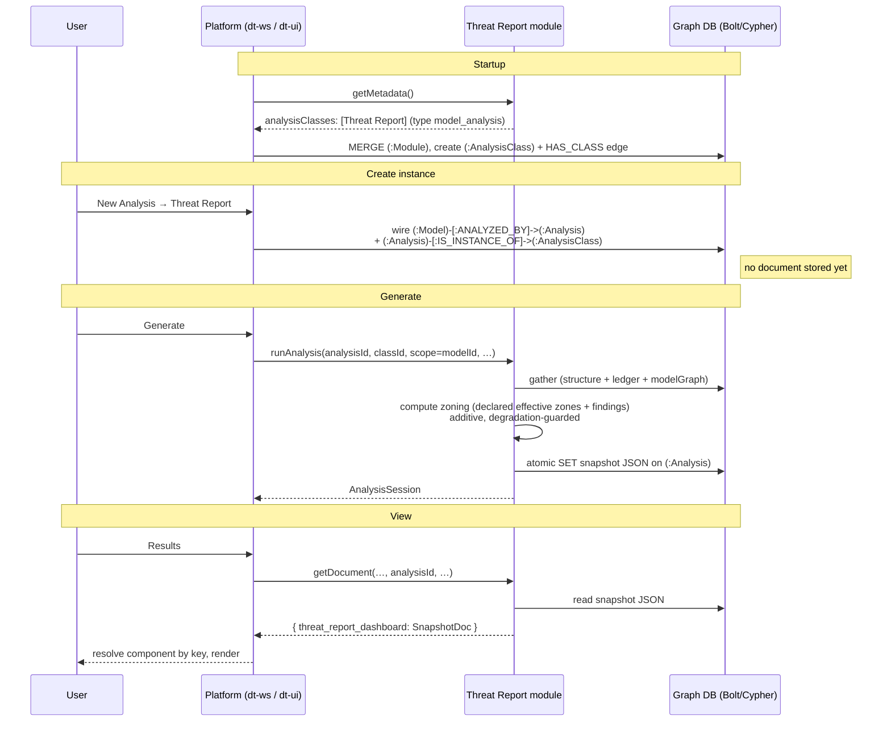
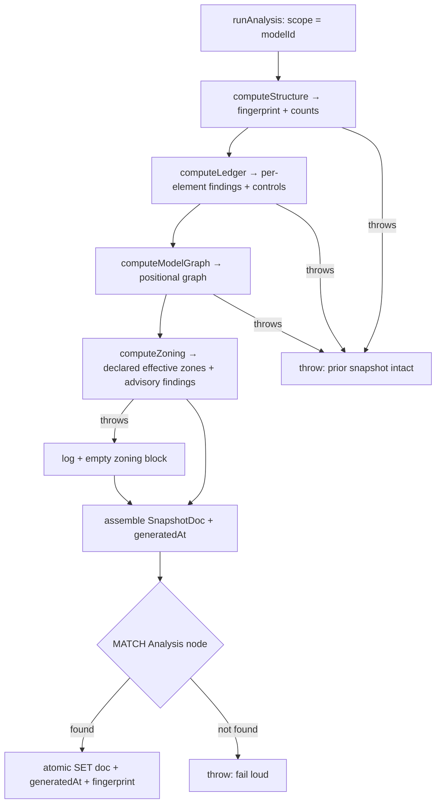

# Threat Report — Backend

> The server-side module: how the threat report mounts, generates a snapshot, and serves it back.

The Dethernety Threat Report is a **pure `DTModule`** — a read-only, query-based reporting surface laid over an *existing* threat model. It contributes no threat-modeling classes (no components, controls, exposures, policies), runs no AI or LangGraph analysis, and edits nothing in the platform UI, backend, or core packages. Its entire footprint is a single TypeScript class that mounts through the platform's native analysis lifecycle, gathers a model snapshot at generate time, and persists that snapshot as JSON on the standing `Analysis` node so the analysis-results page can render it. Everything else — aggregation, charting, the minimap, boundary-crossing math — is pure client-side logic over the snapshot (see [`./frontend.md`](./frontend.md)).

**What this document covers:** the module's role and deliberate non-responsibilities; how it mounts via the analysis lifecycle; the snapshot generation path and the three gather passes; the additive trust-zoning computation and its degradation guard; how the snapshot is read back; the static status contract; the live staleness query; the database-portability discipline; and where MITRE coverage data comes from. Field-level shapes of the snapshot live in [`./data-model.md`](./data-model.md); the lifecycle at a glance is in [`./architecture.md`](./architecture.md).

---

## Role and shape

The module implements the `DTModule` interface directly (it does not extend any of the `dt-module` base classes). It is "pure" in the sense that it carries none of the class-and-policy machinery a modeling module carries:

| Capability a typical module provides | This module |
|---|---|
| Component / DataFlow / Boundary / Data / Control classes | **None** |
| Exposure or countermeasure evaluation (OPA/Rego, JSON Logic) | **None** |
| AI / LangGraph analysis workflows | **None** |
| Document storage inherited from a base class | **None** — the module owns persistence itself |
| One non-AI analysis class + a snapshot read/write path | **Yes** |

Because it inherits from no base class, it also does **not** inherit the default LangGraph-backed document store. That is a deliberate consequence, not an oversight: the module owns snapshot persistence end-to-end (see [Snapshot generation](#snapshot-generation)).

### Authorization is not the module's job

The driver handed to the constructor is the platform's **secure, session-scoping driver**. Resolvers and interface methods in this module do **not** implement their own authorization. Authorization is owned upstream by the JWT guard that wraps every module resolver and by the session scoping applied to the driver — the report only ever reads the graph it is already entitled to read. The module's responsibility is to open correctly-scoped sessions (see [Database scoping](#database-scoping)), never to make access decisions.

---

## How it mounts via the analysis lifecycle

The module appears in the product without any platform edits because it speaks the platform's existing analysis contract. Five steps carry a report from "available" to "rendered".



### Declaring the analysis class

`getMetadata()` returns a single analysis class with a stable id, of platform type `model_analysis`:

| Field | Value | Why it matters |
|---|---|---|
| `id` | `dethernety-threat-report-snapshot` | Stable across deployments. It anchors the `(:Module)-[:HAS_CLASS]->(:AnalysisClass)` edge **and** the document-dispatch lookup, so it must not change. |
| `name` | `Threat Report` | Display label in the **New Analysis** menu. |
| `type` | `model_analysis` | The platform contract for a **model-scoped analysis creatable from a model's Analysis tab**. The New Analysis menu fetches only classes of this type, so this is what makes the report appear there. |
| `category` | `reporting` | Free-form; distinguishes this as a reporting analysis rather than an attack-scenario or threat workflow. |
| `icon` | `mdi-file-chart-outline` | Menu icon. |

At startup the platform's module reconciler MERGEs the module node and creates the `AnalysisClass` node plus the `HAS_CLASS` edge — so the class surfaces in the model's Analysis tab with no UI code.

### Creating an instance stores no document

When the user picks **Threat Report**, the platform's create-instance step wires the analysis graph — `(:Model)-[:ANALYZED_BY]->(:Analysis)` and `(:Analysis)-[:IS_INSTANCE_OF]->(:AnalysisClass)` — but **writes no document field**. That is the crux of why this module owns persistence: the standing `Analysis` node exists, but it is empty until the module fills it. There is no platform-default store stepping in behind the scenes (the module inherits none), so the snapshot lives or dies by the module's own write.

---

## Snapshot generation

`runAnalysis(...)` is the "generate snapshot" step. The platform calls it with positional arguments `(analysisId, analysisClassId, scope, pubSub, additionalParams)`. For a model-scoped report, **`scope` is the model id** — that is the only argument the module needs beyond `analysisId`.

The method follows a strict **compute-before-write** ordering:

1. **Compute everything first.** Run the three gather passes (`computeStructure`, `computeLedger`, `computeModelGraph`) and stamp `generatedAt`. If any pass throws, the method throws *before* any write — so a previously generated snapshot is left intact. A failed regeneration never destroys a good prior report.
2. **Compute trust-zoning additively.** After the gather passes, an additive [trust-zoning computation](#trust-zoning-computation) runs over the model graph. It is wrapped in a degradation guard: unlike the gather passes, a zoning fault does **not** abort the run — it degrades to an empty zoning block so a zoning problem can never take down the core snapshot.
3. **Write atomically.** A single-statement Cypher `SET` replaces the snapshot in one operation: it serializes the assembled document to JSON and stores it alongside its `generatedAt` timestamp and structural `fingerprint` on the standing `Analysis` node.



### Fail loud when the Analysis node is missing

The write `MATCH`es the `Analysis` node by id and `RETURN`s its id. If the node is absent, the `MATCH` yields zero rows and the `SET` silently no-ops — Cypher does not error on a match-less `SET`. The module guards against exactly this: it inspects the returned record count and **throws** when no row came back. Reporting success for a write that never landed would be worse than failing, so the module fails loud.

The snapshot is stored as three properties on the `Analysis` node: the JSON document, its generation timestamp, and the structural fingerprint (the fingerprint is duplicated as a top-level property so the live staleness query can read it cheaply without parsing the whole document).

---

## The three gather passes

All three passes share the same **boundary-forest traversal** to discover a model's elements, so their element sets match exactly. Elements reach the model as follows:

- **Security boundaries:** `(:Model)-[:CONTAINS]->(top:SecurityBoundary)`, then all descendants via `<-[:BELONGS_TO*0..50]-`.
- **Components:** descend the boundary forest, then `(:Component)-[:BELONGS_TO]->(boundary)`.
- **Data flows:** `(:Component)-[:FLOWS]-(df:DataFlow)`.
- **Data:** `(:Model)-[:CONTAINS]->(d:Data)`.

This mirrors the platform's own model-to-elements traversals, so it stays portable across Neo4j and Memgraph, and the bounded variable-length walk (`*0..50`) matches the platform schema's descendant-traversal bound.

### `computeStructure` — the cheap structural fingerprint

`computeStructure` produces a short digest of a model's report-relevant content. It is the cheap pass: it collects **scalar ids and a few signature strings only**, never the full ledger, so it is light enough to run on a live request.

The digest is computed in **TypeScript** — the collected id sets are sorted and SHA-256 hashed application-side — so it is independent of any graph-engine hash function and identical on either database. The first 16 hex characters of the digest are the fingerprint.

What the digest folds in determines what counts as a meaningful change:

| Signal folded in | Effect on the fingerprint |
|---|---|
| Boundary, component, data-flow, and Data ids | Adding/removing an element flips it. |
| **Exposure signature** — exposure id + `dispositionKind` + `dispositionStale`, via `HAS_EXPOSURE` across all four element types | **Disposition-aware.** Disposing or clearing a finding, or a stale-flip, flips it. |
| **Data signature** — Data id + `sensitivity` | **Sensitivity-aware.** Re-classifying a Data node (e.g. `PUBLIC` → `RESTRICTED`) flips it. |
| **HANDLES signature** — each `(element)-[:HANDLES]->(Data)` edge | **Handler-aware.** Re-wiring which element handles which data flips it. |
| **Zoning signatures** — boundary `zone` / `planes` / `domains` + nesting parent, component `crownJewel` + containing boundary, Data regulatory flags, declared `CONDUIT` edges, and flow endpoints | **Zoning-aware.** Re-zoning, re-tagging, re-parenting, flag changes, or re-wiring a flow flips it, so the [zoning block](#trust-zoning-computation) never reads "fresh" against a changed model. Gathered by a separate structural query so the proven digest query is left untouched. |

The design intent is **accurate staleness**: a re-disposition, re-classification, or re-wiring changes the live fingerprint so an open snapshot correctly reads stale, while a no-op model save leaves the fingerprint unchanged so the snapshot stays "fresh". The same method also returns `componentCount` and `boundaryCount`, which the snapshot carries as headline figures.

> The `(element)-[:HANDLES]->(Data)` collect produces `"<elId>|<dataId>"` pairs. An element with no `HANDLES` edge concatenates against a null and yields null, which `collect()` drops — so the signature set holds exactly the real handler-to-data edges, no spurious entries.

### `computeLedger` — the residual-risk ledger

`computeLedger` gathers the full residual-risk ledger for a model in **one query**: every element (Component, DataFlow, SecurityBoundary, Data) with its findings and supporting controls. This is the heavy pass and runs only at generate time, never on the live staleness check.

For each element it collects:

- **Findings** — every `Exposure` (`HAS_EXPOSURE`) with the fields a residual-risk reviewer needs: `score`, `attackVector`, the descriptive set (`description`, `type`, `category`, `references`, `mitigationSuggestions`, `detectionMethods`, `tags`) that drives the exposure detail dialog, provenance (`createdBy`, `authoredBy`), and the full disposition block (`dispositionKind`, `dispositionReason`, `dispositionedBy`, `dispositionedAt`, `dispositionStale`). The list-valued properties (`mitigationSuggestions` / `detectionMethods` / `tags`) are normalised to arrays; the descriptive fields are baked into the snapshot point-in-time and sit deliberately **outside** the structural fingerprint above.
- **Supporting controls** — every `(:Control)-[:SUPPORTS]->(element)`, captured as muted "controls present" context (id, name, type, category), never as a coverage claim.

The query is written for **JSON-safe, engine-portable** output:

- The element's type is derived from `labels()` (filtered to the four element labels) rather than carried as a node — **no nodes-in-maps**.
- Maps are built from **scalar fields only**.
- Timestamps are `toString()`-ed in Cypher; graph `Integer` scores are normalized to JS numbers application-side — so the assembled document `JSON.stringify`s cleanly.

The exact field shapes are documented in [`./data-model.md`](./data-model.md).

### `computeModelGraph` — the positional model graph

`computeModelGraph` gathers the **positional** model graph — the geometry, nesting, connectivity, and declared trust-zoning the client needs to redraw a faithful minimap, compute boundary crossings, and evaluate the declared-zone data-flow policy. It runs as **four small, independently-portable passes** (boundaries, components, flows, data nodes) plus a small conduits sub-pass folded onto the boundaries, each in the same `OPTIONAL MATCH` + `collect` style as the ledger (no pattern comprehensions, no nodes-in-maps, scalar fields only). Element discovery mirrors the other passes, so the model-graph element set matches the ledger's exactly.

| Pass | Per-element data | Notes |
|---|---|---|
| **boundaries** | canvas geometry (`positionX/Y`, `dimensionsWidth/Height` aliased to `width`/`height`), `parentBoundaryId`, declared trust-zoning (`zone`, `planes`, `domains`, `conduits`) | `parentBoundaryId` is `null` for top-level boundaries; it drives both the minimap's nesting and the client-side boundary-crossing walk. The declared trust-zoning fields feed both the [zoning computation](#trust-zoning-computation) and the frontend's per-flow declared-zone policy. `conduits` come from a small `CONDUIT`-edge sub-pass folded onto each boundary, gathered `OUTBOUND`-canonical (peer id + optional justification only). |
| **components** | geometry, `boundaryId` (parent), lower-cased DFD `type`, `crownJewel` | `type` is `toLower`-ed to match the minimap's shape vocabulary; `boundaryId` is `null` for an orphan with no `BELONGS_TO` parent. |
| **flows** | `sourceId`, `targetId`, carried `sensitivities` (nulls dropped), `dataItemCount` | Endpoints resolved via collect + `head()` (see below). `dataItemCount` distinguishes **"no data"** (count 0) from **"data-in-motion but unclassified"** (count > 0, `sensitivities` empty). |
| **dataNodes** | `sensitivity`, `handledBy` (ids of elements with `HANDLES` → this Data) | `sensitivity` is `null` for unclassified data (never coerced to a level). Carries the sensitivity + handling topology the ledger does not; Data's own exposures stay in the ledger. |

**Why endpoints are resolved with collect + `head()`.** A `DataFlow`'s source/target are gathered by collecting the connected component ids and taking the head, rather than by two `OPTIONAL MATCH`es that would each multiply rows. The schema types a flow's endpoints as lists, so a malformed multi-endpoint flow would otherwise fan out into duplicate flow-id rows with conflicting endpoints. Collect-then-head guarantees **one row per flow**.

**Why Data nodes are gathered here at all.** A Data node is already a first-class ledger element (its exposures live in the ledger), so this pass deliberately does **not** re-gather its exposures. It carries only what the ledger lacks: the Data's `sensitivity` and the ids of the Component / DataFlow / SecurityBoundary elements that `HANDLES` it. The client reverse-indexes `handledBy` to attribute data-handling to the handling element.

---

## Trust-zoning computation

After the three gather passes, `runAnalysis` computes an **additive** trust-zoning block over the gathered model graph and folds it into the snapshot as `zoning` (shape in [`./data-model.md`](./data-model.md)). Rather than re-implement zone logic, the module **reuses the platform's shared `dt-core` zoning engine** — the same determination the modeling side uses — so the report and the model agree on what a boundary's effective zone is.

```mermaid
flowchart LR
    MG[modelGraph<br/>flat boundaries / components / flows / dataNodes] --> ADP[graphToZoningStructure<br/>pure projection]
    ADP --> STR[nested ModelStructure<br/>+ DataFlow[] + DataItem[]]
    LOAD[loadZoningEngine<br/>runtime ESM import] --> CZ
    STR --> CZ[computeZoning]
    CZ --> EZ[effectiveZones<br/>resolveEffectiveZone]
    CZ --> FN[findings<br/>computeZoningFindings]
```

### The adapter: flat graph → nested structure

The engine consumes dt-core's nested `ModelStructure`, but the report's `modelGraph` is flat (parallel arrays of boundaries, components, flows, data nodes). `graphToZoningStructure` bridges the two as a **pure** function (dt-core *types* only, no value import), so the fiddly translation is unit-testable in isolation:

- **Rebuilds the nesting tree** — each boundary is linked under its declared parent, and each component grouped under its boundary, so the engine's ancestry walks resolve.
- **Translates vocabulary** — the graph's `UPPERCASE` sensitivity is lower-cased and `camelCase` regulatory flags become the engine's `snake_case`, because a casing miss would silently zero the asset set the engine keys on.
- **Inverts the handling topology** — `HANDLES` edges are inverted into per-holder `dataItemIds`, routed by handler type.
- **Guards against corrupt nesting** — the parent chain is walked with a cycle-and-depth guard (matching the platform's `*0..50` ceiling), so a corrupt `parentBoundaryId` can never produce a self-referential object graph. Any boundary in or leading into a cycle is attached to a synthetic root instead, guaranteeing an acyclic forest.

`computeZoning` then drives the engine over the adapted structure and returns `{ findings, effectiveZones }`. The engine is **injected** as an argument, so the pure adapter stays testable with a real engine import while production supplies the engine through the runtime loader below.

### The runtime ESM loader (CommonJS → ESM)

The module compiles to **CommonJS**, but `dt-core` is **ESM-only**. A literal dynamic `import()` would be down-emitted by the TypeScript compiler into a `require()` helper under `module: commonjs`, which throws `ERR_REQUIRE_ESM` against an ESM-only package. `loadZoningEngine` sidesteps this with a `new Function('s', 'return import(s)')` indirection that preserves a **genuine runtime `import()`** the compiler will not rewrite. The specifier is a hardcoded constant — never model or user input.

It resolves against two paths, in order:

1. **Primary — the `@dethernety/dt-core/zone-determination` ESM subpath.** This reaches the self-contained, dependency-light zoning engine directly, bypassing the package barrel's heavier UI/transport dependencies.
2. **Fallback — the `@dethernety/dt-core` barrel.** A stale build whose `package.json` predates the subpath export throws `ERR_PACKAGE_PATH_NOT_EXPORTED`; the barrel re-exports the same engine functions and is always present, so the loader falls back to it. The degradation is logged, never silent.

The loader returns only the three functions the adapter drives: `buildZoningContext`, `computeZoningFindings`, and `resolveEffectiveZone`.

### Declared effective zones, not the topological proposal

The per-boundary map the snapshot carries is the **declared effective zone** — each boundary's declared `zone` resolved through nesting inheritance (`resolveEffectiveZone`, yielding `declared` / `inherited` / `default`). It is deliberately **not** the engine's separate topological zone-tier *proposal* (`determineZoneTier`), which the report does not call. The declared zone is authoritative and administrative: the report reports it, it never recomputes or overrides it. The rationale is a load-bearing design principle — see [`./design-principles.md`](./design-principles.md). Alongside the effective zones, `computeZoningFindings` produces the advisory per-boundary coherence findings the snapshot carries in `zoning.findings`.

### The degradation guard

The whole computation is **additive and non-fatal**. Where the three gather passes abort the run on failure (compute-before-write), the zoning step is wrapped in a guard that logs the fault and degrades to an empty block `{ findings: [], effectiveZones: {} }`. A zoning problem therefore never takes down the ledger or model-graph snapshot — the report still generates, simply without the zoning surface. On the read side, a pre-zoning snapshot that carries no `zoning` field at all is handled the same way by the frontend, which defaults it.

### Staleness folds in the zoning inputs

Because the zoning block is derived from the model, the structural [fingerprint](#computestructure--the-cheap-structural-fingerprint) folds in every input the engine reads — boundary `zone` / `planes` / `domains` and nesting, component `crownJewel` and containment, data regulatory flags, declared conduit edges, and flow endpoints — so a re-zoned or re-wired model correctly reads **stale** rather than leaving a now-inconsistent zoning block reading "fresh".

---

## Reading the snapshot back

`getDocument(...)` serves the persisted snapshot to the analysis-results page. The document is keyed to the `Analysis` instance, so the module reads by `analysisId`, returning the parsed snapshot under the frontend component-registry key:

```
{ "threat_report_dashboard": <SnapshotDoc> }
```

The analysis-results page resolves the first non-`metadata.*` key against the component registry to pick the component to render — so returning the snapshot under `threat_report_dashboard` (the exact key the frontend bundle registers its root component under) is what makes the right component render. The key must match the frontend registration exactly.

Two fallbacks keep the page robust:

- **Never generated** — if the `Analysis` node carries no snapshot property, the module returns `{ generated: false }` under the same key. The component still resolves and shows its empty state rather than erroring.
- **Corrupt JSON** — if the stored document fails to parse, the module falls back to the same `{ generated: false }` signal rather than throwing.

---

## Analysis status

`getAnalysisStatus(...)` returns a static `idle` status. A report is **not a long-running run** — there is no streaming progress to report. The platform's Analysis tab enables its **Results** action when status is `idle`, so returning `idle` keeps Results available. The method is cheap and side-effect-free, which matters because it is called on every analysis listing.

---

## The live staleness query

The module contributes exactly **one** custom GraphQL field through `getSchemaExtension()`:

```graphql
extend type Query {
  """Structural fingerprint of a model's current threat-report-relevant
     content (counts + element ids, hashed). Cheap; used for snapshot
     staleness detection."""
  threatReportFingerprint(modelId: ID!): String
}
```

Its resolver (registered in `getResolvers()`) delegates straight to `computeStructure` and returns the live fingerprint. This is the **live counterpart** to the fingerprint baked into a snapshot: the frontend fetches the live digest and compares it to the snapshot's stored fingerprint to detect staleness. Because `computeStructure` collects scalars only, this stays a light query suitable for polling. The client-side fetch seam — including the cancel/dedup discipline that keeps only the latest answer — lives in [`./frontend.md`](./frontend.md).

### Database scoping

`getResolvers()` is called **once at startup**, and the module captures `databaseName` from the resolver context there. The no-context interface methods (`runAnalysis`, `getDocument`, `getAnalysisStatus`) use that captured name to open correctly-scoped sessions via a small private `session()` helper — falling back to the driver's default database when no name was captured. This is the seam that keeps every session pointed at the right database even though those methods receive no per-request context.

---

## Database-portability discipline

Every query in the module is written to run unchanged on **both Neo4j and Memgraph**. The disciplines that achieve this:

- **No nodes-in-maps.** Maps are built from scalar fields only; an element's type is derived from `labels()`, not by returning the node.
- **Scalar collects.** The structural digest collects ids and signature strings, never node objects.
- **Bounded variable-length traversal.** The boundary-forest walk is bounded at `*0..50`, matching the platform's own descendant traversal.
- **Endpoint resolution via collect + `head()`** instead of row-multiplying `OPTIONAL MATCH`es.
- **Application-side hashing and normalization.** SHA-256 is computed in TypeScript; `Integer` → `number` and temporal → `string` normalization happen application-side, so nothing depends on engine-specific functions or serialization.

These constraints serve the platform's database-portability goal (see the [platform architecture overview](../README.md)) and the report's honesty contracts (see [`./design-principles.md`](./design-principles.md)).

---

## Where coverage data comes from

The threat-report backend does **not** compute MITRE coverage. Richer graded-coverage data is contributed by a sibling open-source module, **`dethernety-coverage-tools`** (declared as a manifest dependency of this module), which adds its own field to the merged GraphQL schema. The report fetches that field **client-side** at view time and degrades gracefully — rendering a "coverage unavailable" affordance, never a fake all-green grid — when the field is absent or the fetch fails.

The dependency exists so the platform installs `dethernety-coverage-tools` whenever the threat report is installed; the threat-report backend itself stays a pure reporting surface over its own snapshot. The coverage payload contract is documented in [`./data-model.md`](./data-model.md), and [`dethernety-coverage-tools`](../dethernety-coverage-tools/README.md) is the authority on how those facts are produced.

---

## Related documentation

| Document | Description |
|---|---|
| [`./README.md`](./README.md) | Threat Report documentation index |
| [`./architecture.md`](./architecture.md) | System overview and the snapshot lifecycle at a glance |
| [`./data-model.md`](./data-model.md) | Snapshot and coverage payload contracts (field-level) |
| [`./frontend.md`](./frontend.md) | How the rendered SPA consumes the snapshot |
| [`./design-principles.md`](./design-principles.md) | The honesty/accuracy contracts the data shapes serve |
| [DTModule Interface](../modules/DT_MODULE_INTERFACE.md) | The core module contract this module implements |
| [Module System Overview](../modules/README.md) | How modules load, register, and route |
| [Platform Architecture](../README.md) | Graph-native platform overview |
