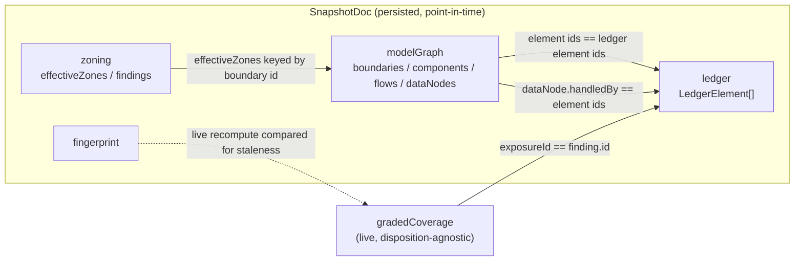

# Threat Report — Data Model

> The field-level data contracts the Threat Report renders over.

The Threat Report renders over a single **persisted snapshot document** that is computed once, at generate time, and stored as a JSON property on the standing analysis node. Everything the report shows about *what the model contained* — every element, every finding, every disposition, the positional layout — is read from that snapshot, so the report is a faithful point-in-time record rather than a live view of the graph. One other data source is layered on top: **graded MITRE coverage facts** contributed by the sibling `dethernety-coverage-tools` module, fetched live and joined to the snapshot ledger by exposure id. This document is the authority for the shape and meaning of both sources; other documents in this set link here rather than re-listing fields.

## What this document covers

- [The two data sources](#the-two-data-sources) — the persisted snapshot vs. the live coverage facts, and how they relate.
- [SnapshotDoc](#snapshotdoc) — the top-level persisted document, including its empty-state form.
- [The ledger](#the-ledger) — elements, findings, and supporting controls (`LedgerElement` / `LedgerFinding` / `LedgerControl`).
- [The model graph](#the-model-graph) — positional boundaries, components, flows, and data nodes, including each boundary's declared trust-zoning.
- [The zoning block](#the-zoning-block) — the computed per-boundary declared effective zones and advisory zoning findings.
- [The graded coverage payload](#the-graded-coverage-payload) — the live, disposition-agnostic coverage facts.
- [The fingerprint and staleness contract](#the-fingerprint-and-staleness-contract) — what the structural fingerprint covers.
- [Join keys and invariants](#join-keys-and-invariants) — the identifiers that tie the three shapes together.

Cross-references: snapshot gathering and persistence is in [backend.md](./backend.md); how these shapes are consumed and rendered is in [frontend.md](./frontend.md); the end-to-end lifecycle is in [architecture.md](./architecture.md); the accuracy goals these fields exist to serve are in [design-principles.md](./design-principles.md). For platform-wide terminology, see the [glossary](../../GLOSSARY.md).

---

## The two data sources

Two shapes feed the report, with deliberately different freshness semantics.

| | **Snapshot document** | **Graded coverage payload** |
|---|---|---|
| Origin | This module, at generate time | Sibling `dethernety-coverage-tools` module |
| Freshness | Frozen point-in-time | Fetched live on every report open |
| Persistence | Stored on the analysis node | Not persisted by this module |
| Disposition awareness | Carries each finding's disposition | Disposition-agnostic |
| Optional? | Always present once generated | Absent when the providing module is not deployed |

The snapshot is the spine. The coverage payload is an *enrichment* joined onto it by exposure id. When the coverage-providing module is not deployed, the field is absent, the fetch degrades to `null`, and the coverage surfaces (the Coverage & Gaps matrix and the coverage lines of the Posture Summary) simply do not render — the rest of the report is unaffected.



---

## SnapshotDoc

The top-level persisted document. It is serialized to a JSON string and stored on the analysis node; on read it is parsed back into this shape. Every field is JSON-safe — the gathering queries normalize graph-engine integers to plain numbers and timestamps to ISO strings, so no graph-native integer or temporal objects ever reach the document.

| Field | Type | Meaning |
|---|---|---|
| `generated` | `boolean` | `true` for a real snapshot; `false` is the empty-state signal (see below). |
| `modelId` | `string?` | The model the snapshot was computed over (the analysis scope). |
| `generatedAt` | `string?` | ISO timestamp of when the snapshot was generated. |
| `fingerprint` | `string?` | The structural digest captured at generate time. See [the fingerprint contract](#the-fingerprint-and-staleness-contract). |
| `componentCount` | `number?` | Count of components discovered at generate time. |
| `boundaryCount` | `number?` | Count of security boundaries discovered at generate time. |
| `ledger` | `LedgerElement[]?` | The residual-risk ledger — every element with its findings and supporting controls. See [the ledger](#the-ledger). |
| `modelGraph` | `ModelGraph?` | The positional model graph — boundaries, components, flows, and data nodes. See [the model graph](#the-model-graph). |
| `zoning` | `{ findings: ZoningFinding[]; effectiveZones: Record<boundaryId, EffectiveZone> }?` | The computed trust-zoning block — per-boundary **declared effective zones** and advisory zoning findings. See [the zoning block](#the-zoning-block). Absent on snapshots generated before this field existed (the frontend defaults it). |

### Empty state

An analysis instance that has never been generated yields the minimal form:

```json
{ "generated": false }
```

The reader returns this same shape whenever no snapshot has been persisted or a stored document fails to parse, so the report component always resolves and can render its empty state rather than erroring.

---

## The ledger

The ledger (`SnapshotDoc.ledger`) is the residual-risk record: one entry per model element, each carrying its findings and its supporting controls, gathered in full at generate time. The frontend aggregates and presents it with pure functions — no further graph access — feeding the Residual Risk surface, the Component Profile, and the on-flow and crossed-boundary posture used by the Boundary Crossings engine.

### LedgerElement

One model element with its findings and supporting controls.

| Field | Type | Meaning |
|---|---|---|
| `id` | `string` | Element id. Matches the corresponding `modelGraph` element id and the `handledBy` references. |
| `name` | `string` | Display name (empty string when unnamed). |
| `type` | `'Component' \| 'DataFlow' \| 'SecurityBoundary' \| 'Data'` | Which kind of element this is, derived from the node's label. |
| `findings` | `LedgerFinding[]` | The element's findings (exposures). Empty when the element has none. |
| `supportingControls` | `LedgerControl[]` | Controls attached to this element. Context only — never a coverage claim. |

All four element kinds are first-class ledger entries. `Data` elements appear here with their own findings (their exposures are not duplicated into the model graph's data nodes); the model graph contributes only the sensitivity and handling topology the ledger does not carry.

### LedgerFinding

One finding (an exposure) on an element — the fields a residual-risk reviewer needs, including the full disposition record.

| Field | Type | Meaning |
|---|---|---|
| `id` | `string` | Finding id. **This is the join key to the coverage payload** (`coverage.exposureId === finding.id`). |
| `name` | `string` | Display name (empty string when unnamed). |
| `score` | `number \| null` | The platform's 0–10 (CVSS-like) exposure score. `null` means unknown — the report treats it as `unknown`, never as low. A presentation sort/group aid only, never a single risk verdict. |
| `attackVector` | `string \| null` | The finding's attack vector, when recorded. |
| `description` | `string \| null` | The exposure's own free-text description. Surfaced in the exposure detail dialog (see [frontend.md](./frontend.md)); `null` when the model records none. |
| `type` | `string \| null` | Exposure type classifier, when recorded. |
| `category` | `string \| null` | Exposure category classifier, when recorded. |
| `references` | `string \| null` | External references (URLs, CVE IDs) as free text, when recorded. Rendered as plain text, never as a clickable link. |
| `mitigationSuggestions` | `string[]` | Class-authored *suggested* mitigations for the exposure **type** — **not** controls applied to this element, and never a coverage claim. Empty array when none. |
| `detectionMethods` | `string[]` | Suggested ways this exposure would be detected. Empty array when none. |
| `tags` | `string[]` | Filtering/grouping labels. Empty array when none. |
| `createdBy` | `string \| null` | Provenance: `'USER'` or `'SYSTEM'`. **`null` is treated as `SYSTEM`** (legacy-data rule): any value other than `'USER'` resolves to `SYSTEM`. |
| `authoredBy` | `string \| null` | Identifier of the author, when recorded. |
| `dispositionKind` | `string \| null` | The structured disposition decision. **`null` means the finding is *live*** (undispositioned). Non-null values name the kind (see below). |
| `dispositionReason` | `string \| null` | The written reason accompanying a disposition. |
| `dispositionedBy` | `string \| null` | Who recorded the disposition. |
| `dispositionedAt` | `string \| null` | ISO timestamp of when the disposition was recorded. |
| `dispositionStale` | `boolean \| null` | `true` when the disposition is flagged for review because the element changed after the decision was set. |

**Live vs. dispositioned.** A finding is *live* exactly when `dispositionKind == null`. Live findings drive the residual-risk severity rollups and the live coverage grid; dispositioned findings are never dropped — they are partitioned into a muted view and still counted.

**Disposition kinds.** `dispositionKind`, when present, takes one of the platform's disposition kinds, surfaced with these labels:

| Kind | Label |
|---|---|
| `NOT_APPLICABLE` | Not Applicable |
| `FALSE_POSITIVE` | False Positive |
| `COMPENSATING_CONTROL` | Compensating Control |
| `RISK_ACCEPTED` | Risk Accepted |
| `WAIVED` | Waived |
| `SUPERSEDED` | Superseded |

An unrecognized kind is shown verbatim rather than dropped.

**Score bands.** The report buckets `score` into presentation bands as a sort/group aid only: `critical` (≥ 9), `high` (≥ 7), `medium` (≥ 4), `low` (below 4), and `unknown` (`null` or not a number).

**Descriptive fields are snapshot-baked.** `description` / `type` / `category` / `references` / `mitigationSuggestions` / `detectionMethods` / `tags` are captured into the snapshot at generation time alongside the rest of the ledger — so the exposure detail they drive is frozen point-in-time with the report and travels into the export, rather than being fetched live. A snapshot generated before these fields existed simply carries `null`/empty values for them; the detail dialog degrades gracefully. These fields are **not** part of the structural-staleness [fingerprint](./backend.md) (they are descriptive metadata, not a structural signal), so editing an exposure's description does not by itself flag the snapshot stale.

### LedgerControl

A control attached to an element. Shown as muted "controls present" context. It is **never** a coverage claim — whether a control actually addresses a modeled threat is determined entirely by the [graded coverage payload](#the-graded-coverage-payload), not by this presence.

| Field | Type | Meaning |
|---|---|---|
| `id` | `string` | Control id. |
| `name` | `string` | Display name (empty string when unnamed). |
| `type` | `string \| null` | Control type, when recorded. |
| `category` | `string \| null` | Control category, when recorded. |

---

## The model graph

The model graph (`SnapshotDoc.modelGraph`) is the positional, structural view captured at generate time — the same as-of-generation model as the ledger. It reproduces the hand-laid canvas layout for the minimap and supplies the structural input for the Boundary Crossings engine. Both are computed by pure functions over this graph joined with the ledger, so no separate posture query is needed: the ledger already carries each element's findings and supporting controls, reused for on-flow and crossed-boundary posture.

```
ModelGraph
├── boundaries : ModelGraphBoundary[]
├── components : ModelGraphComponent[]
├── flows      : ModelGraphFlow[]
└── dataNodes  : ModelGraphDataNode[]
```

### ModelGraphBoundary

A security boundary with its canvas geometry, nesting parent, and declared trust-zoning.

| Field | Type | Meaning |
|---|---|---|
| `id` | `string` | Boundary id (matches the ledger element id). |
| `name` | `string` | Display name. |
| `positionX` | `number \| null` | Parent-relative X position on the canvas. |
| `positionY` | `number \| null` | Parent-relative Y position on the canvas. |
| `width` | `number \| null` | Boundary width. |
| `height` | `number \| null` | Boundary height. |
| `parentBoundaryId` | `string \| null` | The enclosing boundary, or `null` for a top-level boundary. |
| `zone` | `string \| null` | The boundary's **declared** trust zone — one of `UNTRUSTED`, `PUBLIC`, `EXPOSED`, `INTERNAL`, `RESTRICTED`, `VENDOR`. **`null` means the zone is not declared here and is inherited** from the nearest ancestor that declares one (this is the raw declaration, not the resolved effective zone — see [the zoning block](#the-zoning-block)). |
| `planes` | `string[]` | The boundary's declared operational planes (`WORKLOAD`, `MANAGEMENT`). Empty when untagged. |
| `domains` | `string[]` | The boundary's declared business-domain tags (free text). Empty when untagged. |
| `conduits` | `{ peerId: string; direction: 'OUTBOUND'; justification: string \| null }[]` | The boundary's declared approved channels to peer boundaries. Gathered **`OUTBOUND`-canonical** — one record per declared crossing, on the source side (the inbound mirror is re-derived, never stored, to avoid double-counting). Empty when none is declared. |

The parent-relative geometry lets the minimap reproduce the layout faithfully, and `parentBoundaryId` defines the nesting forest. That same nesting drives the Boundary Crossings engine, which walks each element's ancestor stack to decide which trust boundaries a flow crosses.

The four zoning fields (`zone`, `planes`, `domains`, `conduits`) are the operator's **declared** trust-zoning intent. They feed two consumers: at generate time they are projected into the dt-core zoning engine to compute the [zoning block](#the-zoning-block); at render time the frontend reads them raw to drive the per-flow declared-zone data-flow policy (see [frontend.md](./frontend.md)). They are declared intent, never a proven or enforced permission.

### ModelGraphComponent

A component with its canvas geometry, data-flow-diagram type, parent boundary, and crown-jewel flag.

| Field | Type | Meaning |
|---|---|---|
| `id` | `string` | Component id (matches the ledger element id). |
| `name` | `string` | Display name. |
| `type` | `string \| null` | The data-flow-diagram type, **lower-cased** to match the minimap's shape vocabulary (e.g. `process`, `store`, `external_entity`). |
| `positionX` | `number \| null` | Parent-relative X position. |
| `positionY` | `number \| null` | Parent-relative Y position. |
| `width` | `number \| null` | Component width. |
| `height` | `number \| null` | Component height. |
| `boundaryId` | `string \| null` | The boundary the component belongs to, or `null` for an orphan with no parent boundary. |
| `crownJewel` | `boolean` | `true` when the component is flagged as a crown jewel (a high-value asset). Normalized so only an explicit true value is `true`. |

### ModelGraphFlow

A flow rendered as a component-to-component edge, with the data sensitivities it carries.

| Field | Type | Meaning |
|---|---|---|
| `id` | `string` | Flow id (matches the ledger element id). |
| `name` | `string` | Display name. |
| `sourceId` | `string \| null` | Source component id, or `null` if unresolved. |
| `targetId` | `string \| null` | Target component id, or `null` if unresolved. |
| `sensitivities` | `string[]` | The sensitivity levels carried on the flow, with nulls dropped. |
| `dataItemCount` | `number` | Total count of data items carried by the flow. |

**The count/sensitivity distinction matters.** `dataItemCount` and `sensitivities` together encode three states the Boundary Crossings engine treats differently:

| `dataItemCount` | `sensitivities` | Meaning |
|---|---|---|
| `0` | `[]` | No data in motion on this flow. |
| `> 0` | non-empty | Classified data in motion. |
| `> 0` | `[]` | Data in motion, but **unclassified** — carried data exists, none of it carries a sensitivity. |

The third row is distinct from the first: it is data moving across a boundary that nobody has classified, which the engine treats as a signal rather than as "no data".

### ModelGraphDataNode

A `Data` node with its author-asserted sensitivity and the elements that handle it. This block exists to supply the sensitivity and handling topology the ledger does not carry; a `Data` node's own findings still come from its first-class ledger entry and are not duplicated here.

| Field | Type | Meaning |
|---|---|---|
| `id` | `string` | Data id (matches the ledger element id). |
| `name` | `string` | Display name. |
| `sensitivity` | `string \| null` | The author-asserted sensitivity level. **`null` means unclassified** — never coerced to a level, and not the same as the lowest level. |
| `handledBy` | `string[]` | Ids of the elements (components, flows, or boundaries) that handle this data. |

**`handledBy` powers the Component Profile's data relations in both directions.** The frontend reverse-indexes `handledBy` so that, per element, it can list the data that element handles; and for each handled data id it joins back to that data's own ledger entry for the data's findings (coverage is attributed to the handling element, not to the data node, because data nodes carry no typed control support). Reading the field forward gives "which elements handle this data"; reverse-indexing it gives "which data does this element handle".

---

## The zoning block

The zoning block (`SnapshotDoc.zoning`) is the computed trust-zoning view, produced at generate time by projecting the model graph into the shared dt-core zoning engine (see [backend.md](./backend.md)). It carries two things: a per-boundary map of **declared effective zones**, and a list of advisory zoning findings.

```
zoning
├── effectiveZones : Record<boundaryId, EffectiveZone>
└── findings       : ZoningFinding[]
```

The block **graceful-degrades to the empty form** `{ findings: [], effectiveZones: {} }` — a zoning fault at generate time never takes down the ledger or model graph — and is **absent entirely** on a snapshot generated before this field existed. In both cases the frontend defaults it, so the pure engines never see `undefined`.

### EffectiveZone

`effectiveZones` maps each boundary id to the **declared effective zone** — the operator's declared `zone` resolved through nesting inheritance. It is keyed by boundary id (the synthetic traversal root is excluded).

| Field | Type | Meaning |
|---|---|---|
| `zone` | `'UNTRUSTED' \| 'PUBLIC' \| 'EXPOSED' \| 'INTERNAL' \| 'RESTRICTED' \| 'VENDOR'` | The resolved effective zone for the boundary. |
| `source` | `'declared' \| 'inherited' \| 'default'` | How the zone was resolved: **declared** on the boundary itself, **inherited** from an ancestor, or the **default** (`INTERNAL`) when no ancestor declares one. |
| `from` | `string?` | Present only when `source === 'inherited'` — the ancestor boundary id whose declared zone was inherited. |

**Declared, not proposed.** This is deliberately the *declared* effective zone (`resolveEffectiveZone`), resolved by walking the nesting chain to the nearest declared `zone`. It is **not** the engine's separate topological zone-tier *proposal* (`determineZoneTier`), which the report does not use. The declared zone is authoritative and administrative: the report reports it, never recomputes or overrides it (see [design-principles.md](./design-principles.md)).

The distinction from `ModelGraphBoundary.zone` matters: that field is the **raw declaration** (`null` ⇒ not declared here), whereas `effectiveZones[id].zone` is the **resolved** value every boundary gets after inheritance.

### ZoningFinding

`findings` is the list of coherence findings the engine derives — each an advisory, per-boundary observation about the declared zoning, not a per-flow verdict.

| Field | Type | Meaning |
|---|---|---|
| `kind` | `'unclassified' \| 'under-protected' \| 'mgmt-plane' \| 'external-ingress' \| 'flow-channel' \| 'cross-tier-domain'` | The finding category. |
| `boundaryId` | `string` | The boundary the finding is about (matches a model-graph / ledger boundary id). |
| `detail` | `string` | Human-readable description of the observation. |
| `severity` | `'info' \| 'warning'` | Advisory severity — never a score. |
| `peerId` | `string?` | For the conduit-dependent kinds (`external-ingress`, `flow-channel`), the peer boundary id of the crossing or channel. Undefined for the conduit-independent kinds. |

The frontend renders a subset of these — the four per-boundary conduit-independent kinds (`unclassified`, `under-protected`, `mgmt-plane`, `cross-tier-domain`) — as a compact, un-scored advisory block on the Residual Risk surface. The crossing-oriented kinds (`external-ingress`, `flow-channel`) are **not** re-rendered from the block, because the per-flow declared-zone policy (over the raw `modelGraph` declarations) already covers those crossings at flow granularity (see [frontend.md](./frontend.md)).

---

## The graded coverage payload

The `gradedCoverage(modelId)` query is contributed to the merged GraphQL schema by the sibling `dethernety-coverage-tools` module and returns the coverage facts as a **JSON-encoded string**. The report fetches it live, parses it, and layers its own honesty rules on top — the disposition filter, the tier-segregated bucketing, the detect-only reduction, and the no-percentage presentation all live in the report, not in the payload. The payload itself is **disposition-agnostic**: it states which techniques each exposure maps to and how well each is covered, as a fact about the exposure, regardless of any disposition.

The shape below is the contract this report consumes; [`dethernety-coverage-tools`](../dethernety-coverage-tools/README.md) is the authority on how these facts are produced (the tier queries, the element-support join, and the prevent/detect derivation).

**Absence is a normal state.** When `dethernety-coverage-tools` is not deployed the `gradedCoverage` field is not in the schema; the query errors and the fetch degrades to `null`. An empty or invalid `modelId`, a superseded in-flight request, or a parse failure also resolve to `null`. In every case the coverage surfaces do not render — the report never shows a fabricated empty or all-covered grid.

### Parsed shape

| Field | Type | Meaning |
|---|---|---|
| `modelId` | `string` | The model the coverage was computed over. |
| `generatedAt` | `string` | When the coverage facts were produced. |
| `exposures` | `CoverageExposure[]` | Per-exposure coverage facts (see below). |
| `techniques` | `Record<string, { name, description }>` | A top-level, deduped map of ATT&CK technique id → human-readable name and description, for tooltips and dialogs. Always present (it holds one entry per technique referenced anywhere in `exposures`, so the full description is not repeated per exposure). |
| `meta` | `CoverageMeta` | Producer metadata, always emitted (see below). |

#### CoverageMeta

Always present on the payload. It carries producer-side roll-up counts; the report never renders these as a coverage percentage or a single "Covered: N".

| Field | Type | Meaning |
|---|---|---|
| `exposureCount` | `number` | Number of exposures in `exposures[]`. |
| `softExposureCount` | `number` | How many of those are soft (no ATT&CK mapping). |
| `coveredPairsByTier` | `Record<'DIRECT' \| 'INDIRECT_MITIGATION' \| 'INDIRECT_D3FEND', number>` | Distinct `(exposure, technique)` pairs covered at each tier. |
| `countermeasuresByTier` | `Record<'DIRECT' \| 'INDIRECT_MITIGATION' \| 'INDIRECT_D3FEND', number>` | Distinct countermeasures contributing a covering edge at each tier. |

#### CoverageExposure

| Field | Type | Meaning |
|---|---|---|
| `exposureId` | `string` | The exposure this fact is about. **Equals the ledger `finding.id`** — the join key. |
| `elementId` | `string` | The element the exposure sits on (matches a ledger / model-graph element id). |
| `elementKind` | `string` | The element's kind (`Component`, `DataFlow`, `SecurityBoundary`, or `Data`). |
| `soft` | `boolean` | `true` when the exposure has no ATT&CK mapping — coverage is unprovable, so it is held off the grid. |
| `techniques` | `CoverageTechnique[]` | The ATT&CK techniques this exposure maps to. |

#### CoverageTechnique

| Field | Type | Meaning |
|---|---|---|
| `techniqueId` | `string` | ATT&CK technique id. |
| `tactics` | `string[]` | The technique's tactics (the matrix columns). |
| `covered` | `boolean` | Whether any covering edge exists for this technique. |
| `tiers` | `CoverageTier[]` | The graded covering edges (see below). Empty means uncovered. |

#### CoverageTier

A single covering edge, graded by how directly it applies and what defensive function it performs.

| Field | Type | Meaning |
|---|---|---|
| `tier` | `'DIRECT' \| 'INDIRECT_MITIGATION' \| 'INDIRECT_D3FEND'` | How directly the edge covers the technique, strongest first. |
| `function` | `'PREVENT' \| 'DETECT'` | The defensive function the edge performs. |
| `countermeasureIds` | `string[]` | Ids of the countermeasures contributing this edge. |
| `controlIds` | `string[]` | Ids of the parent controls of those countermeasures. |

The report reduces these tiers per technique: a technique is *covered* when at least one edge exists, surfaced as preventive when any `PREVENT` edge survives at any tier, and as detect-only ("see it, can't stop it") when it is covered but only by non-preventive edges. The strongest tier present becomes the technique's best tier. These reductions are presentation logic in the report; the payload carries only the raw graded edges.

---

## The fingerprint and staleness contract

The structural fingerprint is a cheap digest of a model's report-relevant content. The snapshot stores the fingerprint as of generation; the report fetches the *live* fingerprint via the `threatReportFingerprint(modelId)` query and compares the two — a mismatch means the model changed since the snapshot was generated, which drives the staleness signal.

The digest is computed in the module (sorted ids, hashed) so it is independent of any graph-engine hash function, and it folds in exactly the inputs the report renders:

- **Element identity** — the ids of every boundary, component, data flow, and data element.
- **Exposure disposition signatures** — each finding's id plus its disposition kind and stale flag, so disposing, clearing, or stale-flipping a finding changes the fingerprint while a no-op save does not.
- **Data sensitivity** — each data element's id paired with its sensitivity, so re-classifying data flips the fingerprint instead of leaving a now-misclassified snapshot reading "fresh".
- **Handling edges** — each element-handles-data relationship, so re-wiring which element handles a data element flips the fingerprint.
- **Zoning inputs** — every input the zoning engine reads: each boundary's `zone` / `planes` / `domains` and its nesting parent, each component's `crownJewel` flag and containing boundary, each data element's regulatory flags, each declared conduit edge, and each flow's endpoints. Re-zoning, re-tagging, re-parenting, or re-wiring the model therefore flips the fingerprint, so a re-computed zoning block never reads "fresh" against a changed model.

The digest collects scalar ids and signatures only — never the full ledger — so the live staleness check stays light enough to poll. The query mechanics are documented in [backend.md](./backend.md); the rationale for treating freshness this way is in [design-principles.md](./design-principles.md).

---

## Join keys and invariants

Three identifier relationships tie the shapes together. They hold because the ledger, the model graph, and the fingerprint are all gathered by the same model→all-elements traversal at generate time.

| Join | Relationship | Used by |
|---|---|---|
| `coverage.exposures[].exposureId` ↔ `ledger.findings[].id` | One-to-one on exposure id | Coverage & Gaps, Posture Summary, the technique chips on Residual Risk and Component Profile |
| `modelGraph` element ids ↔ `ledger` element ids | Same id sets (same traversal) | Reachability minimap, Boundary Crossings, on-flow and crossed-boundary posture |
| `dataNode.handledBy[]` ↔ `ledger` / `modelGraph` element ids | Many-to-many handling topology | Component Profile data relations (both directions) |
| `zoning.effectiveZones` keys ↔ `modelGraph.boundaries[].id` | Keyed by boundary id | Boundary Crossings declared-zone policy, Component Profile trust-zoning block, Residual Risk zoning advisories |

**Invariants worth relying on:**

- The model-graph element set and the ledger element set match exactly — neither carries an element the other lacks for the same model.
- A coverage exposure with no matching ledger finding defaults to *live* (the staleness signal owns coverage-vs-snapshot drift, since coverage is live and the ledger is the snapshot).
- The coverage payload is the **only** source of exposure→technique mappings; the ledger carries none. An exposure with no coverage entry therefore shows no technique information rather than a false "no techniques".
- Control *presence* in the ledger and control *coverage* in the payload are independent: a supporting control that covers none of its element's modeled threats is a real, surfaced state, not a contradiction.
