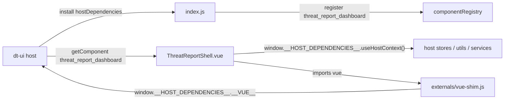
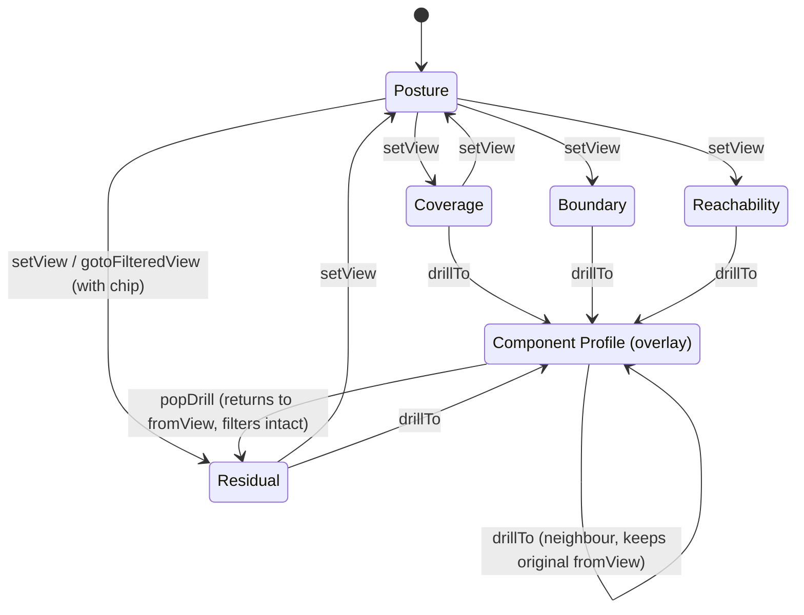

# Threat Report — Frontend Architecture

The Threat Report frontend is a single Vue 3 application, bundled by Vite into one
file and registered into the host UI (`dt-ui`) as a runtime-loaded module
component. It renders a **point-in-time snapshot** of a threat model — a document
the backend produces at generation time — into a set of analyst-facing views:
posture, MITRE ATT&CK coverage, flow reachability, boundary crossings, residual
risk, and a per-element drill-down. It does **not** live-query the model graph to
draw those views; everything it renders comes from the snapshot it was handed,
with one narrow, optional exception (live MITRE coverage facts, fetched through
the host). The whole report is one mounted component switching between views in
place — there is no router.

**What this document covers:** how the bundle integrates with the host, the
pure-library / thin-component layering that the whole module is built on, the
shell and each view surface, the in-component navigation model, the shared UI
building blocks, the snapshot lifecycle and staleness machinery, and export.

For the system-level snapshot story see [`./architecture.md`](./architecture.md);
for snapshot generation and persistence see [`./backend.md`](./backend.md); for
the exact field shapes of the snapshot document and the coverage payload see
[`./data-model.md`](./data-model.md); and for the rationale behind the honesty
rules these components enforce see
[`./design-principles.md`](./design-principles.md).

---

## 1. Bundle and host integration

### A single Vite library bundle

The frontend is built as a single-file ES library
([`vite.config.mjs`](../../../modules/dethernety-threat-report/frontend/vite.config.mjs)):
one entry (`index.js`), one output (`bundle.js`), `inlineDynamicImports: true`
and `manualChunks: undefined` so nothing splits, and `cssCodeSplit: false` with
`vite-plugin-css-injected-by-js` so the component CSS rides inside the JS and is
injected at runtime — there is no separate stylesheet for the host to load.

### Borrowing the host's Vue runtime

The bundle deliberately does **not** ship its own copy of Vue. The Vite config
aliases `vue` to
[`externals/vue-shim.js`](../../../modules/dethernety-threat-report/frontend/externals/vue-shim.js),
which reads the runtime the host published on
`window.__HOST_DEPENDENCIES__.__VUE__` and re-exports every reactivity primitive,
lifecycle hook, and SFC-compiler helper from it. Every `import { ref } from 'vue'`
in the module therefore resolves to the *host's* Vue instance. This is what lets
the module's components mount inside the host's component tree, share its
reactivity system, and live under its router and Pinia without the dual-Vue
breakage two runtime copies would cause. If the host runtime is missing, the shim
throws immediately at load — a loud failure rather than a silent second Vue.

### Registration under `threat_report_dashboard`

[`index.js`](../../../modules/dethernety-threat-report/frontend/index.js) is the
module entry. The host imports the bundle's default export and calls
`install(hostDependencies)`; the module pulls `componentRegistry` from
`hostDependencies.services` and registers the shell component under the key
`threat_report_dashboard`, tagged with the module id so `uninstall()` can remove
the whole module's registrations in one call.

That key is a contract with the backend. The backend declares a "Threat Report"
analysis class and serves its document under the same `threat_report_dashboard`
key; the platform's analysis-results page resolves the key through
`componentRegistry.getComponent(...)` and renders the shell. The registry key and
the document key must stay identical — changing one without the other breaks the
mount.

### Reaching the host: `useHostContext()` and `dtUtils`

Inside `setup()`, the shell resolves the host bridge once:
`window.__HOST_DEPENDENCIES__.useHostContext()`. From it the module takes only
what it needs:

- `stores.analysisStore` — to trigger a snapshot run (`runAnalysis`).
- `utils.dtUtils` — the **single data-access seam**. Every graph read goes through
  `dtUtils.performQuery(...)`; the module never instantiates its own GraphQL
  client and never hand-rolls `fetch`.
- `services.openDispositionDialog` — the host's reusable disposition dialog,
  used to triage a finding (the module owns no write path).

### Graceful degradation

The bridge is treated as best-effort. `openDispositionDialog` may be absent on an
older host; the shell sets `canDispose = Boolean(openDispositionDialog)` and the
views hide the Review/Edit affordance rather than rendering a silently-inert
button. If `analysisStore` or the analysis id is missing, Generate surfaces a
clear error instead of throwing. The live coverage and fingerprint fetches both
degrade to `null` on any failure — the report still renders, just without the
optional data. This "missing evidence is not a failure" posture runs through the
whole frontend.

---

## 2. The layered architecture: pure libraries, thin components

The single most important pattern in this frontend is the separation of **pure
compute libraries** (`lib/*.js`) from **thin presentational Vue components**
(`components/*.vue`).

- The libraries are plain JavaScript: no Vue import, no network, no DOM. They take
  the snapshot document (and, for coverage, the parsed coverage facts) and return
  view models. They are unit-tested directly against fixtures (see the
  `__tests__/` suite).
- The components are **encoding-only**. They take a view model from a library and
  render it. All bucketing, partitioning, sorting, and — critically — all of the
  honesty rules live in the libraries, in one place, where they can be tested
  exhaustively without mounting a component.

This keeps the rules ("never imply a coverage percentage", "a null score is
*unknown*, never *low*", "dispositioned findings are muted, never dropped")
auditable in isolation, and keeps the components small enough that what they show
is obvious from reading them. The deep rationale for those rules lives in
[`./design-principles.md`](./design-principles.md); this document treats them as a
given and describes where they are enforced.

### Library inventory

| Library | Purpose |
|---|---|
| [`aggregateLedger.js`](../../../modules/dethernety-threat-report/frontend/lib/aggregateLedger.js) | The base aggregation over the snapshot `ledger`: per-element live/dispositioned partition, score-band annotation, USER/SYSTEM provenance, control-consistency audit. The shared substrate the other engines reuse. |
| [`postureSummary.js`](../../../modules/dethernety-threat-report/frontend/lib/postureSummary.js) | Composes the ledger aggregation plus the boundary-crossing counts into the Posture Summary roll-up. The only aggregating surface; introduces no new analysis. |
| [`coverageMatrix.js`](../../../modules/dethernety-threat-report/frontend/lib/coverageMatrix.js) | The MITRE ATT&CK coverage presentation/honesty layer: joins live coverage facts to the ledger for disposition, buckets by tactic × tier × prevent/detect, and accounts for everything held off the grid. |
| [`reachability.js`](../../../modules/dethernety-threat-report/frontend/lib/reachability.js) | The flow-route engine: a pure, bounded, simple-path traversal over the snapshot topology for crown-jewel reachability and origin→target route enumeration. |
| [`boundaryCrossings.js`](../../../modules/dethernety-threat-report/frontend/lib/boundaryCrossings.js) | The structural boundary-crossing engine: ancestor-stack resolution, the EXIT/ENTER symmetric-difference crossing model, on-flow and crossed-boundary posture. |
| [`componentProfile.js`](../../../modules/dethernety-threat-report/frontend/lib/componentProfile.js) | Synthesises a single element's residual-risk profile: boundary context, handled data, exposures, controls, and 1-hop neighbours. |
| [`completenessFlags.js`](../../../modules/dethernety-threat-report/frontend/lib/completenessFlags.js) | Model-wide "silent-green" guards: under-analyzed high-value elements, orphan components outside any boundary. Surfaced banner-first. |
| [`reportNavigation.js`](../../../modules/dethernety-threat-report/frontend/lib/reportNavigation.js) | Pure state-transition reducers for the in-component navigation (views, drills, filter chips). |
| [`exportReport.js`](../../../modules/dethernety-threat-report/frontend/lib/exportReport.js) | Pure builders for the JSON and self-contained printable-HTML exports, plus the single DOM touch that downloads them. |

### How the engines reuse each other

The libraries compose rather than duplicate, which is why a finding's posture
reads identically wherever it appears:

- `postureSummary` is *only* composition — it runs `aggregateLedger` for exposure
  bands, dispositions, and controls, and reuses the already-computed
  `computeCrossings` result for the boundary-crossing count. No second analysis.
- `boundaryCrossings` exports the shared primitives — `makeStackResolver` (the
  memoized component → ancestor-boundary walk), `postureOf`, and the sensitivity
  helpers — that the other topology engines build on.
- `reachability` and `componentProfile` both import `makeStackResolver` and
  `postureOf` from `boundaryCrossings`, and `isLive`/`scoreBand` from
  `aggregateLedger`. The profile's per-element exposure partition is literally
  `aggregateLedger` run over a single element, so its posture is identical to the
  residual-risk view's by construction.
- `exportReport` builds its coverage section from the same `buildCoverageView`
  honesty layer and its reachability section from the same `modeAReachability`
  engine the live views use — the exported artifact and the on-screen report
  apply the same rules.

---

## 3. The shell and the surfaces

[`ThreatReportShell.vue`](../../../modules/dethernety-threat-report/frontend/components/ThreatReportShell.vue)
is the registered root. The analysis-results page mounts it with three props —
`analysisId` (the standing Analysis node), `content` (the full
`getDocument` payload, `{ threat_report_dashboard: <snapshot> }`), and `scopeId`
(the model id) — and listens for `@update:content`, which the shell emits to ask
the host to re-fetch the document.

The shell normalizes the raw document into a `snapshot` computed that always
presents the four graph keys (`boundaries`, `components`, `flows`, `dataNodes`)
and a `ledger`, defaulting any absent key so the pure libraries never see
`undefined`. It owns three concerns: lifecycle gating, the banner, and the
view/drill switch.

### Lifecycle gating

The shell renders one of three shapes depending on the derived lifecycle
(see [State and lifecycle](#6-state-and-lifecycle)):

- **never** — no snapshot has ever been generated. The banner carries the
  Generate call to action and the body shows an empty-state hint.
- **fresh / stale / generating** — the full report surface renders. A stale
  snapshot is dimmed and its banner explains why.

### The scope and completeness banner

[`ScopeBanner.vue`](../../../modules/dethernety-threat-report/frontend/components/ScopeBanner.vue)
is pinned *above* the view switch. This placement is intentional: a reviewer must
learn that a snapshot is stale, that a model has no boundaries, or that
high-value elements went un-analyzed **before** reading any reassuring count.
The banner is presentational — the shell computes `completenessFlags` by
combining freshness, a no-boundaries check, and the model-wide guards from
`computeCompletenessFlags`, then hands the list to the banner. The banner also
emits `generate`.

### The segmented view switch and export

A segmented control (`role="tablist"`) switches between the five views in
`VIEWS`, in place — no routes, no remount. Below it sits an export action that
serializes the current snapshot to JSON or self-contained HTML (see [Export](#7-export)). A breadcrumb
row renders the active filter chips with per-chip removal.

### The surfaces

Each view is a thin component over one engine. The drill target overlays whichever
view is active.

| Surface | Component | Driven by |
|---|---|---|
| **Posture Summary** (default landing) | [`PostureSummary.vue`](../../../modules/dethernety-threat-report/frontend/components/PostureSummary.vue) | `computePostureSummary` |
| **Coverage & Gaps** | [`CoverageMatrix.vue`](../../../modules/dethernety-threat-report/frontend/components/CoverageMatrix.vue) | `buildCoverageView` |
| **Reachability** | [`ReachabilityView.vue`](../../../modules/dethernety-threat-report/frontend/components/ReachabilityView.vue) | `reachability.js` |
| **Boundary Crossings** | [`BoundaryCrossings.vue`](../../../modules/dethernety-threat-report/frontend/components/BoundaryCrossings.vue) | `computeCrossings` |
| **Residual Risk** | [`FindingsLedger.vue`](../../../modules/dethernety-threat-report/frontend/components/FindingsLedger.vue) | `aggregateLedger` |
| **Component Profile** (drill target) | [`ComponentProfile.vue`](../../../modules/dethernety-threat-report/frontend/components/ComponentProfile.vue) | `computeComponentProfile` |

**Posture Summary** is the default landing view and the only aggregating roll-up.
It composes the ledger aggregation with the boundary-crossing totals into
at-a-glance tiles: live-exposure bands, disposition counts, boundary-crossing
count, and a separate defense-in-depth line (controls are a positive line of
their own, never folded into a coverage number). Every stat is a deep-link — it
emits a `navigate` intent the shell turns into a filtered view or a drill, so no
number on the summary is a dead end. When the live coverage facts and the
reachability rollup are present they light additional blocks; when absent, those
blocks simply do not render (no dead "unavailable" tiles).

**Coverage & Gaps** renders the MITRE ATT&CK coverage matrix. It consumes the
live graded-coverage facts joined to the snapshot ledger through
`buildCoverageView`, with rows = techniques the model's live exposures map to and
columns = ATT&CK tactics in canonical order. The encoding is deliberately
constrained: tier is conveyed by fill, prevent/detect by a single glyph, and the
grid stays monochrome so it never reads as a traffic-light dashboard. The library
also does the off-grid accounting — data exposures and boundary exposures that do
not belong in a technique cell are counted into completeness lines rather than
rendered as false UNCOVERED cells, and a class-wide structural gap collapses into
a single completeness line instead of N empty cells. When the coverage module is
not deployed the view renders a no-coverage affordance rather than an empty grid.

**Reachability** is the flow-route view over the pure `reachability.js` engine. It
offers two modes sharing one engine and one minimap: a crown-jewel mode that, from
a selectable origin (external entry points by default, or any node as an
assumed-breach origin), reports which crown jewels are reachable, in how few hops,
and what threats sit on the route; and a pick-two mode where two pickers (or the
expanded minimap as a click-to-pick surface) drive origin→target route
enumeration. The engine is strictly topological and bounded — simple paths
enforced by a visited-set, hop/route/step ceilings to keep the synchronous
compute cheap — and is careful in its language: these are *flow routes*, an
unreachable crown jewel is reported as a modeling gap, never as "safe".

**Boundary Crossings** renders the structural crossings from `computeCrossings`.
A crossing is the symmetric difference of the two flow endpoints' ancestor-
boundary stacks, expressed as EXIT/ENTER containment steps — never a trust
gradient. Flows carrying a signal (classified data, a live on-flow or
crossed-boundary exposure, or a present control) form the ranked worklist; signal-
free flows collapse into a muted "under-modeled" tail (present, never dropped).
The pinned minimap is the spatial home — clicking a crossing highlights its flow's
endpoints on the map.

**Residual Risk** is the findings ledger from `aggregateLedger`, grouped by
element and partitioned into open versus dispositioned findings (dispositioned
ones muted with who/when/why, never removed). The score band is presented as a
triage sort-aid, not a risk rating. It honors the in-view facet filters and the
deep-link filters from Posture (band, live, provenance, element type), renders the
technique chips on each finding, and emits `dispose(finding)` for the host to
route to the real disposition dialog.

**Component Profile** is the per-element drill target from
`computeComponentProfile`, reachable for a Component, SecurityBoundary, DataFlow,
or Data node. It synthesises one element's residual risk: ancestor-boundary
context with each boundary's own posture, the data it handles as a finding-bearing
sub-block, its live-vs-dispositioned exposures with uncovered ones highlighted,
supporting controls as muted context, 1-hop flow neighbours (each itself
drillable), and a minimap. For a Data target it inverts to show the elements that
*handle* the data.

---

## 4. Navigation model

The report is one component, so navigation is module-local state, not URL state.
[`reportNavigation.js`](../../../modules/dethernety-threat-report/frontend/lib/reportNavigation.js)
holds the navigation as **pure reducers** — `(state, args) → newState`, no Vue,
no side effects, unit-tested. The shell keeps the state in a `reactive()` cell and
applies each reducer's result back onto it. This is the same pure-logic /
reactive-holder split as the lifecycle derivation.

The state has three fields:

- `activeView` — which of the segmented-control `VIEWS` is showing.
- `drill` — the Component Profile target overlaid on the active view, or `null`.
- `filters` — the active filter chips.

### Views versus the drill overlay

A segmented-control click (`setView`) is treated as a fresh, unfiltered view: it
clears both the drill and any filters, so a manual tab switch never silently
carries a prior view's filter chip. The Component Profile is *not* a sixth view —
it is a drill **target** rendered as a dialog overlay (`v-dialog`) on top of the
active view. Because it overlays rather than replaces, the view underneath stays
mounted and keeps its scroll position, expanded rows, and reachability
selections; closing the dialog (via the ✕, Esc, or scrim-click, all routed
through `popDrill`) returns the analyst to exactly where they were. A drill from
inside a drill (a neighbour link in one profile to another) preserves the
*original* return view, so closing always lands back on the list view rather than
an intermediate profile.

### The filter-chip model

Filters are a single uniform model shared by the deep-links, the in-view facet
bar, and the removable breadcrumb chips:

- **single-select per key** — applying a new value for an existing key replaces it.
- **toggle** — clicking the same key+value again removes it.
- **AND-combined across keys** — different keys accumulate.
- **deep-link** — a Posture stat can jump straight to a view *with* a filter
  applied (`gotoFilteredView`), e.g. a high-band tile opens Residual Risk filtered
  to high.

The shell derives the Residual Risk view's `filter` prop from the active chips
(band, live, provenance, element type).

---

## 5. Shared UI building blocks

### The model minimap

[`ModelMinimap.vue`](../../../modules/dethernety-threat-report/frontend/components/ModelMinimap.vue)
is a faithful, read-only SVG rendering of the threat model that uses the model's
*real* canvas coordinates (parent-relative positions walked through the boundary
nesting chain) — a small copy of the hand-laid diagram, not an auto-layout. It
draws DFD-typed node shapes, flow edges, and boundary rectangles, and highlights
nodes via `highlightIds` and specific edges via `highlightEdgeIds` (a precise
flow-id list, so a chord between two highlighted nodes that is not on the route
stays un-highlighted). It is presentational by default (selection driven by the
parent) and *optionally* interactive: with `selectable` set it emits
`pick(componentId)` on a node click and renders `pendingIds` nodes with a dashed
stroke for the pick-two first-click state. Boundary Crossings uses it pinned and
non-interactive; Reachability uses both the sidebar and an expanded interactive
variant.

### The shared ATT&CK technique dialog and chips

[`TechniqueChips.vue`](../../../modules/dethernety-threat-report/frontend/components/TechniqueChips.vue)
renders one small monospace chip per technique resolved for an exposure (from
`buildExposureTechniqueIndex`) and emits `show(technique)`; it renders nothing
when there are no techniques. A chip is deliberately an **identity plus a
launcher** — it is *not* tinted by coverage tier, because coverage encoding lives
only in the Coverage & Gaps matrix and a chip must never double as a coverage
claim.
[`TechniqueInfoDialog.vue`](../../../modules/dethernety-threat-report/frontend/components/TechniqueInfoDialog.vue)
is the one shared dialog the chips launch — it resolves an opaque attack id to the
ATT&CK name, tactics, and cleaned description, and is reused by the coverage
matrix, the Component Profile, and the Residual Risk ledger so the affordance is
identical everywhere. It is a Vuetify `v-dialog` so it stacks correctly above the
Component Profile dialog.

### Sensitivity and score-band encoding

Two ordinal scales are shared through the libraries. Data sensitivity
(`PUBLIC < INTERNAL < CONFIDENTIAL < RESTRICTED`) is ranked in `boundaryCrossings`,
with a null/absent level rendered as *unknown* — never silently treated as low; an
unclassified flow in motion is a flagged modeling gap. The exposure score band
(`critical / high / medium / low / unknown`, derived from the platform's 0–10
score in `aggregateLedger`) is a presentation sort/group aid only, never a risk
verdict, and again a null score lands in *unknown*, never *low*.

---

## 6. State and lifecycle

### A module-scoped reactive singleton

[`useThreatReportState.js`](../../../modules/dethernety-threat-report/frontend/composables/useThreatReportState.js)
holds the lifecycle state — `generating` and `liveFingerprint` — as module-level
refs, **not** a Pinia store. The host does not expose its Pinia instance to module
bundles, and a module-local Pinia would be a separate, unsynced instance, so a
plain shared cell is the correct tool. Exactly one report renders at a time (the
analysis-results page), and the shell resets this state on mount and releases it
on unmount, so the singleton is safe and self-healing across mounts.

### `deriveLifecycle`

The same file exports `deriveLifecycle`, a pure function that is the single source
of truth for which state the report is in:

- **generating** — a run is in flight (overrides everything else).
- **never** — `generated` is false; show the Generate CTA.
- **stale** — a snapshot exists but the live fingerprint no longer matches the
  stored one; the model changed since generation, so offer Recreate.
- **fresh** — a snapshot exists and still matches.

A `null` live fingerprint (not yet fetched, or the fetch failed) is treated as
*assume fresh* — the report never cries stale on missing evidence.

### The live-fingerprint staleness comparison

[`useThreatReportData.js`](../../../modules/dethernety-threat-report/frontend/composables/useThreatReportData.js)
is the data seam that backs staleness. `fetchLiveFingerprint` queries the model's
current structural fingerprint through `dtUtils.performQuery` (network-only),
wrapped in `dtUtils.withCancellableLatest` keyed by model so a fast Recreate's
older in-flight call is superseded rather than racing the newer one; a superseded
or failed call resolves to `null`. The shell compares this live fingerprint
against the fingerprint baked into the snapshot, and `deriveLifecycle` turns a
mismatch into `stale`.

The Generate/Recreate flow is single-flight, gated synchronously on `generating`
before any `await`. After `runAnalysis` resolves, the shell emits
`update:content`; the host re-fetches the document and the new snapshot's
`generatedAt` changing is the signal that it landed. A watcher on `generatedAt`
then refreshes the live fingerprint **before** releasing the gate — keeping stored
and live in lockstep so the post-generate window never derives a false state — and
refreshes coverage. A bounded fallback timer releases the gate if the host's
fire-and-forget re-fetch never produces a fresh document, so the gate can never
stick. Disposing a finding goes through the host dialog and, on success,
re-checks the live fingerprint — the model has changed, so the report reads
*stale* and prompts a Recreate to fold the disposition into a fresh snapshot.

> The coverage facts (`fetchGradedCoverage`) flow through the same seam and the
> same cancel/dedup discipline, but they are **live graph facts, independent of
> the snapshot**. Any drift between live coverage and the snapshot ledger is owned
> by the staleness banner, not papered over in the matrix.

---

## 7. Export

[`exportReport.js`](../../../modules/dethernety-threat-report/frontend/lib/exportReport.js)
produces two artifacts from the current snapshot. `buildJsonExport` and
`buildHtmlExport` are pure (string in, string out) and unit-tested; `downloadBlob`
is the single DOM touch that triggers the browser download.

- **JSON** — a structured serialization of the snapshot for downstream tooling.
- **Printable HTML** — a fully self-contained document: inline `<style>`,
  hard-coded hex colors (a standalone file cannot resolve the host theme tokens),
  and no external assets. It opens anywhere and prints to PDF via the browser's
  Print dialog.

Both formats build their coverage section from the same `buildCoverageView`
honesty layer and their reachability from the same `modeAReachability` engine as
the live views (coverage is simply omitted when the coverage module is not
deployed), and both carry a provenance footer that states plainly what the
artifact is: a point-in-time snapshot of the *modeled* posture — not a live or
deployed-state scan — with findings deliberately not rolled into a single risk
score and no coverage percentage implied.

---

## Related documentation

- [`./architecture.md`](./architecture.md) — system overview and the snapshot lifecycle.
- [`./backend.md`](./backend.md) — snapshot generation and persistence.
- [`./data-model.md`](./data-model.md) — the snapshot document and coverage payload field shapes.
- [`./design-principles.md`](./design-principles.md) — the honesty and encoding contracts these components enforce.
- [`./README.md`](./README.md) — the Threat Report documentation index.
