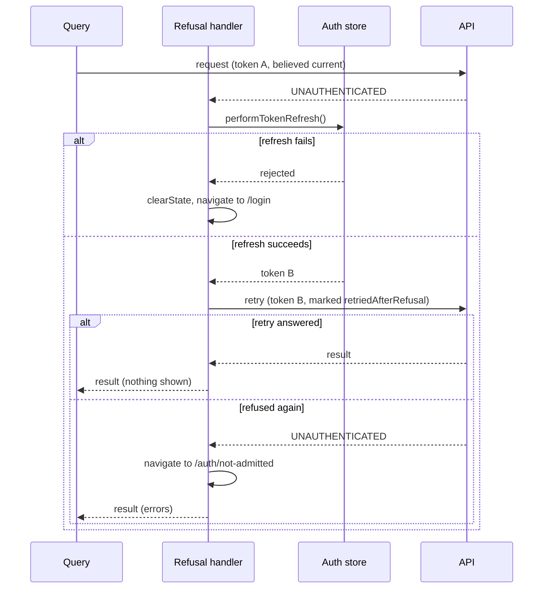
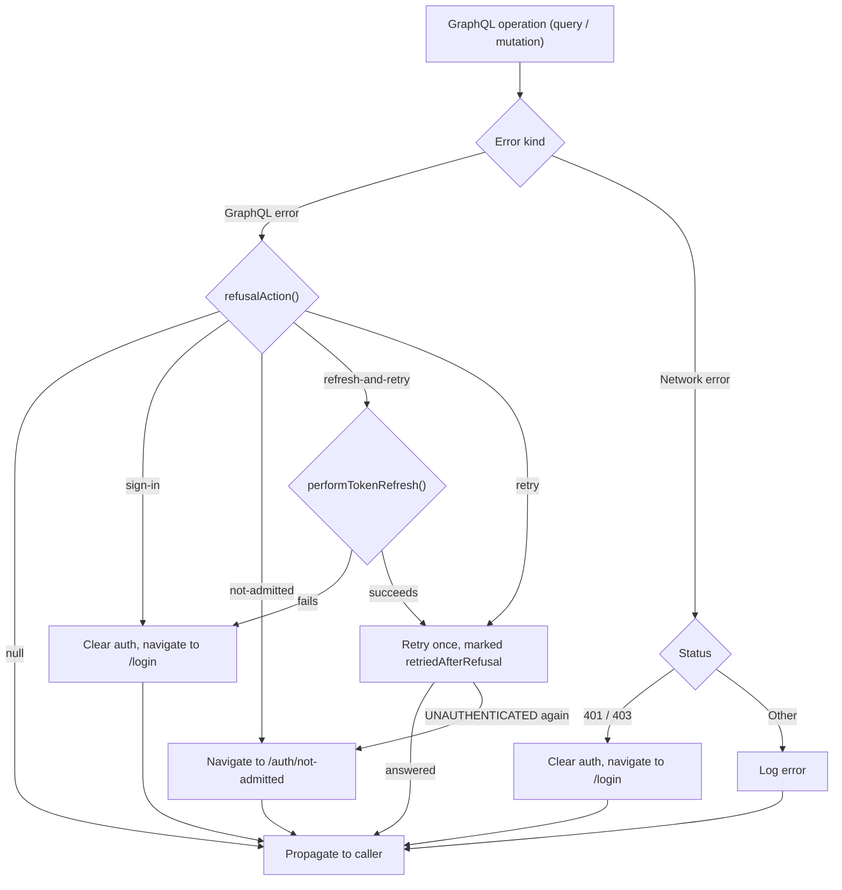

# Apollo Client Configuration

## Table of Contents
- [Overview](#overview)
- [Multi-Transport Architecture](#multi-transport-architecture)
- [Link Chain Architecture](#link-chain-architecture)
- [Authentication Integration](#authentication-integration)
- [Subscription Transports](#subscription-transports)
- [Cache Configuration](#cache-configuration)
- [Initialization Pattern](#initialization-pattern)
- [Error Handling](#error-handling)

## Overview

The Apollo Client configuration provides a GraphQL client with:
- Dual subscription transport support (SSE/WebSocket)
- Automatic token injection and refresh
- Structured error handling with auth failure detection
- Optimized cache policies for threat modeling data

**Primary Source File:** `apps/dt-ui/src/plugins/apolloClient.ts`

```
┌─────────────────────────────────────────────────────────────────────────┐
│                      Apollo Client Architecture                         │
├─────────────────────────────────────────────────────────────────────────┤
│                                                                         │
│                        ┌─────────────────────┐                          │
│                        │   Apollo Client     │                          │
│                        │    (Lazy Init)      │                          │
│                        └──────────┬──────────┘                          │
│                                   │                                     │
│                        ┌──────────┴──────────┐                          │
│                        │      Split Link     │                          │
│                        └──────────┬──────────┘                          │
│                    ┌──────────────┴──────────────┐                      │
│                    │                             │                      |
│               Subscriptions            Queries/Mutations                │
│                    │                             │                      │
│          ┌─────────┴─────────┐     ┌─────────────┴─────────────┐        │
│          │ SSE/WS Transport  │     │      Error Link           │        │
│          └───────────────────┘     └─────────────┬─────────────┘        │
│                                    ┌─────────────┴─────────────┐        │
│                                    │       Auth Link           │        │
│                                    │  (ensureValidToken)       │        │
│                                    └─────────────┬─────────────┘        │
│                                    ┌─────────────┴─────────────┐        │
│                                    │       HTTP Link           │        │
│                                    └───────────────────────────┘        │
│                                                                         │
└─────────────────────────────────────────────────────────────────────────┘
```

---

## Multi-Transport Architecture

### Transport Selection

**Source:** `apolloClient.ts:16-20`

The transport type is determined at runtime from configuration:

```typescript
async function createApolloClient() {
  const config = await getConfig()
  const useWebSocket = config.subscriptionTransport === 'ws'

  console.log(`[ApolloClient] Subscription transport: ${useWebSocket ? 'WebSocket' : 'SSE'}`)

  // ... transport-specific setup
}
```

### When to Use Each Transport

| Transport | Use Case | Benefits | Limitations |
|-----------|----------|----------|-------------|
| **SSE** | CDN deployments, CloudFront | Works through CDN/proxy, HTTP-based | Unidirectional, reconnection overhead |
| **WebSocket** | Direct server access | Bidirectional, lower latency | May not work through CDN/proxy |

**Default:** SSE (for broader infrastructure compatibility)

---

## Link Chain Architecture

### Link Order (Critical)

**Source:** `apolloClient.ts:152-163`

The order of links matters for correct behavior:

```typescript
const httpChain = from([
  errorLink,    // 1. First: Catch all errors
  authLink,     // 2. Second: Inject auth token
  httpLink      // 3. Last: Execute request
])

const splitLink = split(
  ({ query }) => {
    const definition = getMainDefinition(query)
    return (
      definition.kind === 'OperationDefinition' &&
      definition.operation === 'subscription'
    )
  },
  subscriptionLink,  // Subscriptions bypass error/auth links
  httpChain          // Queries/mutations go through full chain
)
```

**Why This Order:**
1. **errorLink first**: Catches GraphQL and network errors before they propagate
2. **authLink second**: Attaches a valid token before each request
3. **httpLink last**: Actually sends the request

### Split Link Routing

```
┌─────────────────────────────────────────────────────────┐
│                    Incoming Operation                   │
└─────────────────────────────┬───────────────────────────┘
                              │
                    ┌─────────┴─────────┐
                    │  Is Subscription? │
                    └─────────┬─────────┘
                    ┌─────────┴─────────┐
                    │                   │
                   Yes                  No
                    │                   │
         ┌──────────┴──────────┐   ┌────┴────────────────────┐
         │  Subscription Link  │   │ errorLink → authLink →  │
         │  (SSE or WebSocket) │   │ httpLink                │
         └─────────────────────┘   └─────────────────────────┘
```

---

## Authentication Integration

### Auth Link Implementation

**Source:** `apolloClient.ts:44-59`

```typescript
const authLink = setContext(async (_, { headers }) => {
  const authStore = useAuthStore()

  // CRITICAL: This call may trigger token refresh
  // If token is expiring soon (< 5 min), refreshToken is called
  await authStore.ensureValidToken()

  const token = authStore.token

  return {
    headers: {
      ...headers,
      ...(token ? { Authorization: `Bearer ${token}` } : {}),
    }
  }
})
```

**Key Behavior:**
- `ensureValidToken()` is async - waits for refresh if needed
- Token refresh uses mutex to prevent concurrent refreshes
- Empty token results in no Authorization header (unauthenticated request)
- In [auth-disabled mode](./AUTHENTICATION.md#auth-disabled-mode), the token is always empty — requests are sent without `Authorization` and the backend creates a mock user

### ensureValidToken Flow

```
┌─────────────────────────────────────────────────────────┐
│               ensureValidToken() Called                  │
└─────────────────────────────┬───────────────────────────┘
                              │
                    ┌─────────┴─────────┐
                    │ Token valid and   │
                    │ not expiring soon?│
                    └─────────┬─────────┘
                    ┌─────────┴─────────┐
                    │                   │
                   Yes                  No
                    │                   │
              Return immediately    ┌───┴───┐
                                    │       │
                          Refresh in progress?
                                    │       │
                                   Yes      No
                                    │       │
                            Await existing  Start new
                            promise         refresh
```

---

## Subscription Transports

### WebSocket Transport

**Source:** `apolloClient.ts:85-110`

```typescript
const createWebSocketLink = () => {
  const wsClient = createWsClient({
    url: wsUrl,

    // Auth: Token passed via connection parameters
    connectionParams: () => {
      const authStore = useAuthStore()
      const token = authStore.token
      return token ? { Authorization: `Bearer ${token}` } : {}
    },

    // Reconnection settings
    retryAttempts: 5,
    connectionAckWaitTimeout: 10000,

    // Error handling
    on: {
      error: (error: unknown) => {
        console.error('[WebSocket] Error:', error)

        // Detect auth failures
        const errorMessage = (error as any)?.message || ''
        if (errorMessage.includes('Unauthorized') ||
            errorMessage.includes('401')) {
          const authStore = useAuthStore()
          authStore.clearState()
          window.location.href = '/login'
        }
      }
    }
  })

  return new GraphQLWsLink(wsClient)
}
```

**WebSocket Auth Notes:**
- Token is passed at connection time via `connectionParams`
- Token refresh requires reconnection (WebSocket limitation)
- 401 errors trigger session clear and redirect

### SSE Transport

**Source:** `apolloClient.ts:112-149`

```typescript
const createSSELink = () => {
  const sseClient = createSseClient({
    url: sseUrl,

    // Auth: Token passed via HTTP headers
    headers: (): Record<string, string> => {
      const authStore = useAuthStore()
      const token = authStore.token
      if (token) {
        return { Authorization: `Bearer ${token}` }
      }
      return {}
    }
  })

  // Wrap SSE client in Apollo Link
  return new ApolloLink((operation) => {
    return new Observable((observer) => {
      const { query, variables, operationName } = operation

      const subscription = sseClient.subscribe({
        query: print(query),  // Convert to string
        variables,
        operationName
      }, {
        next: (data) => observer.next(data),
        error: (err) => observer.error(err),
        complete: () => observer.complete()
      })

      return () => subscription.unsubscribe()
    })
  })
}
```

**SSE Advantages:**
- Headers sent per-request (token always current)
- Works through CDN/proxy (HTTP-based)
- Automatic reconnection by browser

---

## Cache Configuration

### Type Policies

**Source:** `apolloClient.ts:167-224`

Cache policies define how Apollo merges and stores data:

```typescript
const cache = new InMemoryCache({
  typePolicies: {
    Query: {
      fields: {
        // Replace arrays entirely (don't merge)
        folders: {
          merge(existing, incoming) {
            return incoming
          }
        },
        analyses: {
          merge(existing, incoming) {
            return incoming
          }
        }
      }
    },

    Folder: {
      fields: {
        // Nested folder fields
        models: { merge: (_, incoming) => incoming },
        childFolders: { merge: (_, incoming) => incoming },
        analyses: { merge: (_, incoming) => incoming }
      }
    },

    Issue: {
      fields: {
        // Issue element relationships
        elements: { merge: (_, incoming) => incoming },
        elementsWithExtendedInfo: { merge: (_, incoming) => incoming }
      }
    }
  }
})
```

**Merge Strategy:**
- **Replace incoming**: Always use server data, never merge with cache
- **Prevents stale data**: Important for real-time collaborative editing

### Why Not Merge?

```typescript
// Problem with default merge:
// Cache: { models: [A, B] }
// Server: { models: [A, C] }
// Default merge: { models: [A, B, C] }  <- WRONG!
// Replace merge: { models: [A, C] }      <- CORRECT!
```

---

## Initialization Pattern

### Lazy Initialization

**Source:** `apolloClient.ts:229-255`

The client uses lazy initialization with a proxy pattern:

```typescript
// Private state
let apolloClient: ApolloClient<NormalizedCacheObject> | null = null
let initPromise: Promise<ApolloClient<NormalizedCacheObject>> | null = null

// Async getter
export async function getApolloClient(): Promise<ApolloClient<NormalizedCacheObject>> {
  if (apolloClient) {
    return apolloClient
  }

  if (!initPromise) {
    initPromise = createApolloClient()
  }

  apolloClient = await initPromise
  return apolloClient
}

// Synchronous proxy for immediate access
export default new Proxy({} as ApolloClient<NormalizedCacheObject>, {
  get(target, prop) {
    if (!apolloClient) {
      throw new Error('Apollo client accessed before initialization')
    }
    return (apolloClient as any)[prop]
  }
})
```

**Usage Pattern:**

```typescript
// In application startup (main.ts)
await initializeApolloClient()

// In stores (after initialization)
import apolloClient from '@/plugins/apolloClient'
const dtAnalysis = new DtAnalysis(apolloClient)
```

### Initialization Sequence

**Source:** `main.ts:26-47`

```typescript
async function bootstrap() {
  const app = createApp(App)

  // 1. Initialize Apollo client (async - fetches config)
  await initializeApolloClient()

  // 2. Setup plugins (router, pinia, vuetify)
  app.use(createPinia())
  app.use(router)
  app.use(vuetify)

  // 3. Expose host dependencies for modules
  ModuleLoader.exposeHostDependencies(VueRuntime, app._context)

  // 4. Load dynamic modules
  await ModuleLoader.loadAvailableModules()

  // 5. Mount application
  app.mount('#app')
}
```

---

## Error Handling

### Error Link

**Source:** `apolloClient.ts` (`errorLink`), `plugins/refusalHandler.ts` (`createRefusalHandler`), `utils/deploymentRefusal.ts` (`refusalAction`)

```typescript
const handleRefusal = createRefusalHandler({
  auth: () => useAuthStore(),
  leave: leaveForOnce,
  basePath: import.meta.env.BASE_URL,
})

const errorLink = new ErrorLink(({ error, operation, forward }) => {
  if (CombinedGraphQLErrors.is(error)) {
    // GraphQL errors: logged in DEV, then handed to the refusal handler,
    // which may return an Observable that retries the operation
    return handleRefusal({ error, operation, forward })
  } else {
    // Network errors: a 401/403 status clears the session and redirects
    if (error && 'statusCode' in error && (error.statusCode === 401 || error.statusCode === 403)) {
      const authStore = useAuthStore()
      authStore.clearState()
      leaveForOnce(`${import.meta.env.BASE_URL}login`)
    }
  }
})
```

The link sits on the HTTP chain only (queries and mutations); the subscription transports handle their own auth failures ([above](#subscription-transports)).

**A refusal for identity, classified client-side.** The API answers every refused credential the same way — `extensions.code: UNAUTHENTICATED`, whether the token is missing, invalid, expired, or valid but not on the deployment's access list (`DEPLOYMENT_ALLOWLIST`) — so the API itself is no oracle for "your token is real but you are not admitted". The distinction is drawn in the browser, and only from something the browser has proved.

**Why the browser's belief is not enough.** `authStore.isAuthenticated` is a local calculation: the token's own `exp` against the browser's clock, with a refresh scheduled a few minutes early. The API checks the same expiry against the server's clock. Around expiry the two can disagree — clock skew, a scheduled refresh that did not run while the tab slept, a request that left just before a refresh landed. Treating "believed current" as "current" would send a person whose session had merely expired to a page saying the deployment refuses their account. So a refusal of a token believed current is first answered with a **forced token refresh and one retry**; only a freshly issued token that is refused again is shown as a refusal by the deployment.

**The decision — `refusalAction()`** (`utils/deploymentRefusal.ts`, pure, unit-tested apart from the link). It reads the errors and a context the handler builds from the auth store and the operation:

| Context field | Source |
|---|---|
| `authDisabled` | `authStore.authDisabled` |
| `isAuthenticated` | `authStore.isAuthenticated` — the browser believes its token has not expired |
| `alreadyRetried` | The operation context carries `RETRIED_AFTER_REFUSAL` (`'retriedAfterRefusal'`) |
| `refusedTokenIsCurrent` | `bearerOf(context.headers) === authStore.token` — the bearer the request actually went out with is still the one the store holds |

Arms, evaluated in order:

| `UNAUTHENTICATED` seen and… | Action | What the handler does |
|---|---|---|
| `authDisabled` | `null` — the API cannot refuse for identity; this is something else | None |
| No `UNAUTHENTICATED` among the errors | `null` | None (propagates to the caller) |
| `alreadyRetried` | `'not-admitted'` — a freshly issued token was refused too; the deployment refuses the account | Navigate to `/auth/not-admitted` |
| Not `isAuthenticated` — the token is stale or gone | `'sign-in'` — the ordinary refusal | Clear state, navigate to `/login` (no retry) |
| `refusedTokenIsCurrent` | `'refresh-and-retry'` | `authStore.performTokenRefresh()`, then retry once |
| Otherwise — the refused token has already been replaced | `'retry'` — a refresh landed while this request was out; the current token has not been tried | Retry once, without another refresh |

Only the code is read, never the message — production masking scrubs the message to "Internal server error". One refusal among several errors is enough.

**Acting on it — `createRefusalHandler()`** (`plugins/refusalHandler.ts`). It returns nothing for `null`, `'sign-in'` and `'not-admitted'`, and an `Observable` for the two retry arms — ErrorLink's contract for "retry this operation". Inside that Observable:

- **Refresh fails** — the identity provider will not issue a fresh token, so the session is over: clear state, navigate to `/login`, and error the Observable with the original error.
- **Refresh succeeds (or no refresh was needed)** — mark the operation with `RETRIED_AFTER_REFUSAL` and `forward(operation)`. The rest of the chain runs again, so the auth link sets the `Authorization` header afresh from the token the store now holds.
- **Retry succeeds** — the result goes to the caller; nothing is shown.
- **Retry is refused again** — navigate to `/auth/not-admitted`. The result still goes on to its caller.

**The handler reads the retry's answer itself.** Apollo's `ErrorLink` hands a retried result straight to the caller without running its handler on it again. Left to the link, a second refusal would reach the page as a plain "failed to load" error. So the handler's own subscriber to `forward(operation)` inspects the retried result and runs `refusalAction()` on it with `alreadyRetried: true`. The `RETRIED_AFTER_REFUSAL` marker is the second guard: however a second refusal comes back, it ends the matter instead of starting a third attempt.

**Concurrent refusals share one refresh.** A page load fires several queries, and near expiry they are refused together. `performTokenRefresh()` is locked in the auth store — callers that arrive while a refresh is in flight await the same promise — so they share one refresh rather than starting one each. A request refused after that refresh has landed finds its bearer no longer matches the store's token and takes the `'retry'` arm.



**Navigation is started once.** A page load fires several queries and every one of them is refused the same way; `leaveForOnce()` guards `window.location.href` so the second navigation does not cancel the first. The not-admitted page is its own route, deliberately not the login page: a redirect there would go silently through the identity provider, come back with an equally current token, and loop. See [`AUTHENTICATION.md` → Router Guard](./AUTHENTICATION.md#router-guard) for why `/auth/not-admitted` is reachable while signed in.

### Error Flow



### HTTP Link Configuration

**Source:** `apolloClient.ts:30-42`

```typescript
const httpLink = createHttpLink({
  uri: graphqlUrl,
  fetch: (uri, options) => {
    // Custom fetch with timeout
    const controller = new AbortController()
    const timeoutId = setTimeout(() => controller.abort(), 30000)

    return fetch(uri, {
      ...options,
      signal: controller.signal
    }).finally(() => clearTimeout(timeoutId))
  }
})
```

---

## Configuration Reference

### URL Configuration

| Variable | Purpose | Example |
|----------|---------|---------|
| `VITE_GRAPHQL_URL` | GraphQL HTTP endpoint | `https://api.example.com/graphql` |
| `VITE_WS_URL` | WebSocket endpoint | `wss://api.example.com/graphql` |
| `VITE_SSE_URL` | SSE endpoint | `https://api.example.com/graphql/stream` |
| `VITE_SUBSCRIPTION_TRANSPORT` | Transport type | `sse` or `ws` |

### Runtime Configuration

```typescript
// Fetched from /config endpoint in production
interface FrontendConfig {
  graphqlUrl: string
  wsUrl?: string
  sseUrl?: string
  subscriptionTransport: 'sse' | 'ws'
  // ... other config
}
```

---

## Integration with dt-core

### Query Class Pattern

**Source:** `packages/dt-core/src/dt-utils/dt-utils.ts`

All dt-core classes receive the Apollo client at construction:

```typescript
export class DtAnalysis {
  private apolloClient: ApolloClient<NormalizedCacheObject>
  private dtUtils: DtUtils

  constructor(apolloClient: ApolloClient<NormalizedCacheObject>) {
    this.apolloClient = apolloClient
    this.dtUtils = new DtUtils(apolloClient)
  }

  findAnalyses = async (params: QueryParams): Promise<Analysis[]> => {
    return this.dtUtils.performQuery({
      query: FIND_ANALYSES,
      variables: params,
      action: 'findAnalyses',
      fetchPolicy: 'network-only'
    })
  }
}
```

### Store Initialization

**Source:** `stores/flowStore.ts:18-29`

```typescript
import apolloClient from '@/plugins/apolloClient'

export const useFlowStore = defineStore('flow', () => {
  // Initialize all dt-core classes with the shared client
  const dtUtils = new DtUtils(apolloClient)
  const dtModel = new DtModel(apolloClient)
  const dtComponent = new DtComponent(apolloClient)
  const dtBoundary = new DtBoundary(apolloClient)
  const dtDataflow = new DtDataflow(apolloClient)
  // ... more classes

  // Store actions use these classes
  const loadModel = async (modelId: string) => {
    const model = await dtModel.getModel({ modelId })
    // ...
  }
})
```
