# How Dethernety Works

This document provides a technical explanation of how the Dethernety threat modeling framework operates, including the workflow, components interaction, and technical implementation details.

## System Components

Dethernety is built as a monorepo with the following components:

### Applications

- **dt-ui**: Vue.js/Vuetify frontend application for visual modeling and analysis
- **dt-ws**: NestJS GraphQL backend service with Neo4j integration
- **dethermine**: LangGraph server with AI-powered analysis graphs
- **dethernety-module**: Core module providing fundamental component types and security controls
- **mitre-attack-n-defend-ingest**: Python tooling for ingesting MITRE ATT&CK and D3FEND frameworks

### Packages

- **dt-module**: Core API used by modules to interact with the system
- **dt-core**: TypeScript Core API package for backend communication
- **dt-core-py**: Python Core API package for analysis and tooling
- **ui**: Shared UI components
- **eslint-config**: Shared ESLint configuration
- **typescript-config**: Shared TypeScript configuration
- **test-module**: Testing utilities for module development

## Core Workflow

The core user workflow in Dethernety consists of the following steps:

### 1. Model Creation and Configuration

1. Users create system models using the visual editor in the frontend
2. Each Model is automatically created with a Default boundary directly linked to the Model
3. Components are placed and connected with data flows
4. All components added to a model are descendants of this Default boundary
5. Additional security boundaries are defined to group components and other boundaries in a hierarchical structure
6. Components are configured with specific attributes
7. The model is stored in the Neo4j database via the GraphQL API

### 2. Component Class Instantiation

1. Users select component classes from loaded modules in the UI
2. The UI retrieves class metadata through GraphQL queries
3. When a component is created from a class, it inherits the class's properties
4. The UI generates configuration forms based on the class's JSON schema
5. Component configuration is stored as attributes on the relationship to its class

### 3. Component Model Representation

1. In addition to instantiating from classes, components can also represent other Models
2. When a component represents a Model, it uses a REPRESENTS_MODEL relationship instead of IS_INSTANCE_OF
3. Component types that can represent Models include:
   - Security Boundaries
   - Processes
   - Stores
   - External Entities
4. This creates a hierarchical relationship between Models
5. Components representing Models allow for multi-level abstraction in system architecture
6. These components don't inherit from a ComponentClass but rather link directly to the Model they represent
7. This enables top-down decomposition of complex systems into manageable submodels

### 4. Exposure Detection

1. The system evaluates exposure rules against components
2. Rules check component configuration and context
3. When a rule's conditions are met, an Exposure node is created
4. Exposures are linked to MITRE ATT&CK techniques
5. The UI displays detected exposures in the model

### 5. Control Application

1. Users select Control classes from loaded modules in the UI
2. The UI retrieves Control class templates through GraphQL custom resolvers
3. Users configure the Control with specific parameters
4. When configuration is saved, the backend evaluates countermeasure rules
5. Matching rules create Countermeasure nodes in the database
6. Countermeasures are linked to MITRE ATT&CK Mitigations and D3FEND techniques through RESPONDS_WITH relationships
7. Users can assign the Control to various elements:
   - Components (processes, stores, external entities)
   - Data Flows between components
   - Security Boundaries
   - Models (applying to the entire system)
8. The assignment creates a SUPPORTS relationship between the Control and the target element
9. The UI displays applied controls and their countermeasures in the model view

### 6. AI Analysis

1. Users initiate an analysis from the UI
2. The backend forwards the request to the dethermine server
3. LangGraph executes the selected analysis graph
4. Analysis results are stored in LangGraph's store as YAML and JSON documents
5. When analysis completes, the frontend retrieves these documents from LangGraph's store via the backend
6. The frontend visualizes the analysis results
7. During analysis, Neo4j database is used as a vector store for contextual information retrieval

### 7. Chat with Analysis Agent

1. Users initiate a chat from the analysis results view
2. The backend establishes a communication channel with the LangGraph server
3. The frontend subscribes to results via GraphQL subscription
4. The LangGraph server processes user queries with access to context vectors stored in Neo4j
5. Chat responses are streamed back to the frontend in real-time
6. This provides contextual AI interaction based on the stored context in Neo4j

### 8. Issue Management

The issue management system provides a structured approach to tracking and managing identified security issues throughout their lifecycle. Issues are class-based entities that can be associated with multiple system elements.

#### Issue Creation and Configuration

1. **Issue Class Selection**:
   - Users select from available IssueClass types loaded from modules
   - Each IssueClass defines the structure, attributes, and behavior for issues of that type
   - Issue classes are provided by modules and registered in the Neo4j database

2. **Issue Instantiation**:
   - Users create issues by instantiating from an IssueClass
   - Issues inherit properties and configuration schema from their class
   - The frontend generates dynamic forms based on the IssueClass schema
   - Configuration attributes are stored on the IS_INSTANCE_OF relationship

3. **Element Association**:
   - Issues can be associated with multiple system elements through HAS_ISSUE relationships
   - Supported element types include Components, DataFlows, SecurityBoundaries, and Models
   - Elements can have multiple issues, and issues can be associated with multiple elements
   - This many-to-many relationship enables comprehensive issue tracking across the system

#### Issue Lifecycle Management

1. **Issue Status Tracking**:
   - Issues maintain status through the issueStatus field
   - Common statuses include: identified, analyzing, mitigating, monitored, resolved, accepted
   - Status transitions can be tracked over time through the updatedAt timestamp

2. **Issue Attributes and Metadata**:
   - Issues support dynamic attributes defined by their IssueClass
   - Common attributes may include severity, likelihood, impact, priority
   - Metadata includes creation time, last update, and synchronization tracking
   - Comments array supports collaborative annotation and status updates

3. **Issue Search and Filtering**:
   - Advanced search capabilities using query syntax (e.g., "status:identified severity:high")
   - Filtering by status, class, associated elements, modules
   - Full-text search across issue names and descriptions
   - Remote and local filtering for performance optimization

#### Issue Data Management

1. **Clipboard Operations**:
   - Issue data can be copied to a clipboard for batch creation
   - Supports copying issue templates with pre-filled element associations
   - Clipboard data includes return navigation for seamless user experience
   - Auto-cleanup prevents memory leaks from stale clipboard data

2. **Batch Operations**:
   - Multiple elements can be added to or removed from issues
   - Bulk issue creation from analysis results
   - Mass status updates across related issues

3. **Synchronization**:
   - Issues maintain lastSyncAt timestamps for external integration
   - Supports synchronization with external issue tracking systems
   - Synced attributes are cached for performance

#### Integration with System Components

1. **Analysis Integration**:
   - Analysis results can automatically generate issues
   - Issues can be created from detected exposures or vulnerabilities
   - AI analysis can suggest issue classifications and priorities

2. **Model Integration**:
   - Issues are scoped to models and can traverse model hierarchies
   - Element associations respect model boundaries and security contexts
   - Issues can be exported and imported as part of model data

3. **Module System Integration**:
   - IssueClasses are provided by modules and loaded at startup
   - Modules define issue templates, validation rules, and behavior
   - Custom issue types can be implemented through module development

## Technical Implementation

### Module System and Loading Process

Modules are JavaScript packages that:
- Implement the `Module` interface from `@dethernety/dt-module`
- Provide `ComponentClass`, `DataFlowClass`, `SecurityBoundaryClass`, `ControlClass`, and `DataClass` definitions
- Define configuration schemas using JSONSchema
- Implement exposure detection rules using OPA (Open Policy Agent) with Rego policies
- Implement countermeasure generation rules using OPA/Rego for advanced policy evaluation
- Provide visualization templates
- Support OPA WASM for high-performance policy evaluation

While the example modules use file-based storage for metadata, templates, and rules, modules can implement these capabilities using any external source depending on the implementation needs.

The module loading process occurs during system initialization:

1. Module files are compiled and placed in the `dt-ws/custom_modules` directory
2. When the backend starts, the ModuleRegistryService scans this directory
3. Each module is loaded and instantiated with the Neo4j driver
4. Module metadata and classes are registered in the Neo4j database
5. An in-memory registry of modules is maintained by the backend

Once loaded, modules provide component classes and functionality that users can interact with through the frontend.

### Control and Countermeasure Implementation

Controls are specialized components that implement security measures. The process works as follows:

1. **Template Retrieval**:
   - When a Control is selected in the UI, the frontend requests its template
   - The GraphQL API invokes a custom resolver for the ControlClass
   - The resolver finds the module providing the class
   - The module's `getClassTemplate()` method returns the template
   - The template defines the configuration UI for the Control

2. **Attribute Setting**:
   - When a Control is configured, attributes are sent to the backend
   - The backend creates or updates the IS_INSTANCE_OF relationship with these attributes
   - It then determines the component is a Control and requests countermeasures

3. **Countermeasure Generation**:
   - The module evaluates countermeasure rules against the Control's attributes using OPA/Rego policies
   - Rego policies provide powerful declarative logic for determining which countermeasures apply
   - The module executes Rego queries against component attributes to evaluate policy conditions
   - For each matching policy rule, a countermeasure specification is created
   - The specification includes links to MITRE ATT&CK Mitigations or D3FEND techniques

4. **Database Integration**:
   - Countermeasures are created as nodes in the Neo4j database
   - They're linked to the Control via the HAS_COUNTERMEASURE relationship
   - They're linked to framework nodes (Mitigations, D3FEND) via RESPONDS_WITH relationships
   - This creates a traceable link between Controls and industry-standard defensive techniques

5. **Control Assignment**:
   - Controls can be assigned to different types of elements in the system
   - Assignment targets can include:
     - Components (processes, external entities, stores)
     - Data Flows between components
     - Security Boundaries (applying to the boundary and all contained components/sub-boundaries)
     - Models (applying globally to the entire system)
   - When assigned, a SUPPORTS relationship is created from the Control to the element
   - This relationship indicates that the Control is providing security to that element
   - Multiple Controls can be assigned to the same element
   - The same Control can be assigned to multiple elements
   - This flexible assignment model allows for precise security control mapping

### Exposure Implementation

Exposures represent potential security vulnerabilities in components. The process works as follows:

1. **Component Configuration**:
   - When a Component is configured with attributes in the UI, changes are sent to the backend
   - The backend updates the IS_INSTANCE_OF relationship with these attributes
   - The system identifies this is a Component (not a Control) and requests exposures

2. **Exposure Detection**:
   - The module's `getExposures()` method is called with the component ID
   - The module retrieves the component's class and attributes
   - It evaluates OPA/Rego policies against the component's configuration attributes
   - Rego policies define conditions that trigger specific exposures based on component state
   - For matching policy rules, exposure specifications are created
   - Specifications include details like severity, description, and links to MITRE ATT&CK techniques

3. **Database Integration**:
   - Exposures are created as nodes in the Neo4j database
   - They're linked to the Component via the HAS_EXPOSURE relationship
   - Exposures can be linked to MITRE ATT&CK techniques via the EXPLOITED_BY relationship
   - This provides traceability from component vulnerabilities to potential attack techniques

4. **Lifecycle Management**:
   - When component configuration changes, exposures are re-evaluated
   - Obsolete exposures are removed from the database
   - New exposures are added based on the current configuration
   - This ensures the exposure model stays in sync with the component configuration

#### OPA/Rego Policy Implementation

The system uses Open Policy Agent (OPA) with Rego policies for exposure and countermeasure evaluation. This provides a powerful, declarative approach to security rule definition.

**Policy Structure Example:**
```rego
package _dt_built_in.exposures.amazon_cognito

# Define exposure template
_weak_password_policy_def := {
    "name": "weak_password_and_mfa_policy_configuration",
    "description": "Weak password policy allows brute-force attacks",
    "criticality": "high",
    "type": "Exposure",
    "category": "Auto generated",
    "exploited_by": [
        { "label": "MitreAttackTechnique", "property": "attack_id", "value": "T1078" },
        { "label": "MitreAttackTechnique", "property": "attack_id", "value": "T1110.001" }
    ]
}

# Policy rules that trigger the exposure
weak_password_policy[_weak_password_policy_def] if {
    input.password_minimum_length < 8
}

weak_password_policy[_weak_password_policy_def] if {
    input.password_require_uppercase != true
}

weak_password_policy[_weak_password_policy_def] if {
    input.multi_factor_authentication_requirement != "REQUIRED"
}

# Export exposures that match conditions
exposures contains _weak_password_policy_def if {
    count(weak_password_policy) > 0
}
```

**Policy Evaluation Process:**
1. **Input Preparation**: Component attributes are formatted as JSON input for Rego evaluation
2. **Policy Execution**: OPA evaluates all relevant policies against the component's attributes
3. **Rule Matching**: Rego rules check conditions against input data (e.g., password length, encryption settings)
4. **Exposure Generation**: When rule conditions are met, exposure definitions are returned
5. **Result Processing**: The module creates Exposure nodes in Neo4j based on policy results

**Key Benefits of Rego Policies:**
- **Declarative Logic**: Rules clearly express "what" conditions trigger exposures, not "how" to check them
- **Complex Conditions**: Support for nested logic, array operations, and data transformations
- **Maintainability**: Policy changes don't require code compilation, only policy redeployment
- **Performance**: OPA WASM provides high-performance policy evaluation
- **Security**: Policies are sandboxed and cannot perform arbitrary system operations

### Analysis Graph System and Loading Process

Analysis graphs are Python-based LangGraph workflows that:
- Define structured analysis processes for security assessment
- Implement specialized AI agents for different analysis tasks
- Provide tools for querying and analyzing model data
- Define state machines for managing analysis flow
- Support interactive user feedback during analysis

The analysis graph loading process also occurs during system initialization:

1. Analysis graphs are defined in the dethermine component as Python files
2. Graphs are registered in the `langgraph.json` configuration file
3. When the backend starts, the AnalysisRegistryService connects to the LangGraph server
4. It retrieves available analysis assistants via the LangGraph API
5. Analysis metadata is registered in the Neo4j database as AnalysisClass nodes
6. The backend maintains the ability to interact with these analyses via the LangGraph client

This separation of concerns allows the analysis system to evolve independently while maintaining integration with the rest of the framework.

### Frontend (dt-ui)

The frontend is a Vue 3 application using:
- **Vuetify**: UI component library
- **Vue Flow**: Graph visualization for data flow diagrams
- **Pinia**: State management
- **GraphQL/Apollo**: Communication with backend
- **JSONForms**: Dynamic form generation for component configuration
- **@dethernety/dt-core**: Core API package for backend communication

The frontend operates entirely through the GraphQL API and doesn't directly access modules or the database.

### Core API Package (dt-core)

The dt-core package is a TypeScript library that abstracts GraphQL communications between the frontend and backend:

- **Entity Classes**: Provides specialized classes for each entity type (Model, Component, Boundary, DataFlow, etc.)
- **GraphQL Abstraction**: Encapsulates GraphQL queries, mutations, and subscriptions behind clean method interfaces
- **Type Safety**: Includes TypeScript interfaces for all entity types and relationships
- **Error Handling**: Centralized error handling for GraphQL operations
- **Data Transformation**: Converts between GraphQL and UI-friendly data structures
- **Apollo Integration**: Uses Apollo Client for communication with the backend

The package follows a modular structure:
- Each entity type has its own module with a class (DtModel, DtComponent, etc.)
- Each module contains both the entity class and its corresponding GraphQL fragments
- The DtUtils class provides common functionality like error handling and mutation helpers

Using this package, the UI components no longer need to define GraphQL specifications or handle transformation logic, making the codebase more maintainable and testable.

### Backend (dt-ws)

The backend is a NestJS application with:
- **GraphQL API**: Primary interface for the frontend
- **Neo4j GraphQL Library**: Database interface
- **Module Registry Service**: Loads and manages modules with OPA/Rego policy support
- **Analysis Registry Service**: Connects to and registers LangGraph analyses
- **WebSockets**: Real-time communication for analysis results
- **Authentication Integration**: Zitadel OIDC/JWT token validation
- **Policy Engine Integration**: Open Policy Agent (OPA) for exposure and countermeasure evaluation using Rego policies

The backend loads modules at startup, registers them in the database, and provides their functionality through the GraphQL API. It integrates with external services for authentication and policy evaluation.

### Database (Neo4j)

The Neo4j database stores:
- **Models**: System representations
- **Components**: System entities
- **Data Flows**: Information flows between components
- **Security Boundaries**: Trust boundaries (including the Default boundary that contains all components in a model)
- **Exposures**: Potential vulnerabilities
- **Controls**: Security countermeasures
- **Issues**: Tracked security issues and their lifecycle
- **Issue Classes**: Issue type definitions and templates
- **Module Metadata**: Information about loaded modules
- **Analysis Classes**: Information about available analysis graphs
- **MITRE Data**: ATT&CK and D3FEND frameworks

The graph structure allows for efficient traversal and analysis of complex relationships.

### Analysis System (dethermine)

The analysis system is a LangGraph server that:
- Hosts different analysis graphs
- Provides AI-powered security analysis
- Accesses the Neo4j database for model data and vector storage
- Uses PostgreSQL with pgvector for LangGraph store persistence
- Uses Redis for session management and caching
- Interacts with users through a chat interface
- Returns structured analysis results

Analysis is initiated from the frontend through the backend's GraphQL API and results are streamed via WebSockets. The system uses dedicated databases for different purposes: Neo4j for graph data and vectors, PostgreSQL for LangGraph state persistence, and Redis for session management.

## Data Flow Between Components

```mermaid
sequenceDiagram
    participant User
    participant Frontend as dt-ui (Frontend)
    participant CoreAPI as dt-core (Core API)
    participant Backend as dt-ws (Backend)
    participant DB as Neo4j (Database/Vector Store)
    participant AI as dethermine (AI Analysis)
    participant LGStore as LangGraph Store (PostgreSQL)
    participant Redis as Redis (Session Management)
    participant Auth as Zitadel (Authentication)
    participant OPA as OPA (Policy Engine)
    
    %% System Initialization
    Note over Backend,DB: System Initialization (at startup)
    Backend->>Backend: Load modules from custom_modules
    Backend->>DB: Register module metadata
    Backend->>AI: Connect to LangGraph server
    AI-->>Backend: Retrieve analysis assistants
    Backend->>DB: Register analysis graphs as AnalysisClass nodes
    
    %% Model Creation
    User->>Frontend: Create Model
    Frontend->>CoreAPI: Use DtModel.createModel()
    CoreAPI->>Backend: GraphQL Mutation
    Backend->>DB: Store Model
    DB-->>Backend: Confirmation
    Backend-->>CoreAPI: Success Response
    CoreAPI-->>Frontend: Return Model Object
    Frontend-->>User: Model Created
    
    %% Component Creation
    User->>Frontend: Add Component
    Frontend->>CoreAPI: Use DtClass.getClasses()
    CoreAPI->>Backend: Query Available Classes
    Backend->>DB: Get Classes
    DB-->>Backend: Class Data
    Backend-->>CoreAPI: Class Objects
    CoreAPI-->>Frontend: Available Classes
    User->>Frontend: Select Class
    Frontend->>CoreAPI: Use DtComponent.createComponent()
    CoreAPI->>Backend: Create Component Mutation
    Backend->>DB: Store Component
    DB-->>Backend: Confirmation
    Backend-->>CoreAPI: Component Data
    CoreAPI-->>Frontend: Component Object
    Frontend-->>User: Show Component
    
    %% Exposure Detection
    User->>Frontend: Configure Component
    Frontend->>CoreAPI: Use DtComponent.updateComponent()
    CoreAPI->>Backend: Update Component Mutation
    Backend->>DB: Apply Configuration
    Backend->>DB: Evaluate Exposure Rules
    DB-->>Backend: Detected Exposures
    Backend-->>CoreAPI: Exposure Data
    CoreAPI-->>Frontend: Exposure Objects
    Frontend-->>User: Show Exposures
    
    %% Control Creation and Configuration
    User->>Frontend: Create Control
    Frontend->>Backend: Query Control Classes
    Backend->>DB: Get Control Classes
    DB-->>Backend: Control Class Data
    Backend-->>Frontend: Available Control Classes
    User->>Frontend: Select Control Class
    Frontend->>Backend: Request Control Template
    Backend->>DB: Retrieve Module Info
    DB-->>Backend: Module Info
    Backend->>Backend: Invoke Module's getClassTemplate()
    Backend-->>Frontend: Control Template
    User->>Frontend: Configure Control
    Frontend->>Backend: GraphQL Mutation (setInstantiationAttributes)
    Backend->>DB: Create/Update Control
    Backend->>Backend: Invoke Module's getCountermeasures()
    Backend->>DB: Create Countermeasure Nodes
    Backend->>DB: Link to MITRE Mitigations/D3FEND
    DB-->>Backend: Confirmation
    Backend-->>Frontend: Updated Control
    Frontend-->>User: Show Control with Countermeasures
    
    %% Control Assignment
    User->>Frontend: Assign Control to Element
    Note right of Frontend: Element can be Component, DataFlow, or Model
    Frontend->>Backend: GraphQL Mutation (addControlToElement)
    Backend->>DB: Create SUPPORTS Relationship
    DB-->>Backend: Confirmation
    Backend-->>Frontend: Assignment Confirmation
    Frontend-->>User: Show Element with Control
    
    %% Analysis
    User->>Frontend: Run Analysis
    Frontend->>Backend: GraphQL Mutation (runAnalysis)
    Backend->>AI: Forward Analysis Request
    AI->>DB: Query Model Data
    DB-->>AI: Model Information
    AI->>AI: Execute Analysis Graph
    AI->>LGStore: Store Analysis Results (JSON/YAML)
    AI->>DB: Store Context Vectors (Neo4j as vector store)
    AI-->>Backend: Analysis Completion Notification
    Backend-->>Frontend: Analysis Complete
    Frontend->>Backend: Request Analysis Documents
    Backend->>LGStore: Retrieve Documents
    LGStore-->>Backend: Analysis Documents
    Backend-->>Frontend: Return Documents
    Frontend-->>User: Display Analysis Results
    
    %% Chat with Analysis Agent
    User->>Frontend: Start Chat
    Frontend->>Backend: GraphQL Mutation (startChat)
    Backend->>AI: Establish Chat Session
    Frontend->>Backend: Subscribe to Chat Responses
    User->>Frontend: Send Message
    Frontend->>Backend: Forward User Message
    Backend->>AI: Send User Message
    AI->>DB: Retrieve Context Vectors (from Neo4j)
    DB-->>AI: Context Vectors for Analysis
    AI->>DB: Query Additional Model Data if Needed
    DB-->>AI: Additional Model Data
    AI-->>Backend: Stream Chat Response
    Backend-->>Frontend: Stream via GraphQL Subscription
    Frontend-->>User: Display Response
    
    %% Issue Management
    User->>Frontend: Create Issue
    Frontend->>CoreAPI: Use DtIssue.findIssueClasses()
    CoreAPI->>Backend: Query Available Issue Classes
    Backend->>DB: Get Issue Classes
    DB-->>Backend: Issue Class Data
    Backend-->>CoreAPI: Issue Class Objects
    CoreAPI-->>Frontend: Available Issue Classes
    User->>Frontend: Select Issue Class and Configure
    Frontend->>CoreAPI: Use DtIssue.createIssue()
    CoreAPI->>Backend: Create Issue Mutation
    Backend->>DB: Store Issue with IS_INSTANCE_OF relationship
    DB-->>Backend: Issue Created
    Backend-->>CoreAPI: Issue Data
    CoreAPI-->>Frontend: Issue Object
    Frontend-->>User: Show Created Issue
    
    %% Issue Element Association
    User->>Frontend: Associate Elements with Issue
    Frontend->>CoreAPI: Use DtIssue.addElementsToIssue()
    CoreAPI->>Backend: Add Elements Mutation
    Backend->>DB: Create HAS_ISSUE relationships
    DB-->>Backend: Relationships Created
    Backend-->>CoreAPI: Association Count
    CoreAPI-->>Frontend: Success Response
    Frontend-->>User: Show Updated Issue with Elements
    
    %% Issue Lifecycle Management
    User->>Frontend: Update Issue Status
    Frontend->>CoreAPI: Use DtIssue.updateIssue()
    CoreAPI->>Backend: Update Issue Mutation
    Backend->>DB: Update Issue Properties
    DB-->>Backend: Updated Issue
    Backend-->>CoreAPI: Issue Data
    CoreAPI-->>Frontend: Updated Issue Object
    Frontend-->>User: Show Updated Issue
```



## Development Workflow

1. **Develop Modules**:
   - Create new modules in the apps directory
   - Implement component classes and exposure rules
   - Build and place in custom_modules

2. **Update Frontend**:
   - Enhance UI components and visualizations
   - Add support for new module features
   - Update GraphQL queries and mutations

3. **Extend Backend**:
   - Improve API functionality
   - Enhance module loading mechanism
   - Add new database operations

4. **Create Analysis Graphs**:
   - Develop new LangGraph-based analyses
   - Integrate with Neo4j database
   - Enhance user interaction mechanisms

## Deployment

The system can be deployed in several configurations:

1. **Development**:
   - Run all components locally
   - Use local Neo4j database
   - Direct file system access for modules

2. **Production Docker Compose**:
   - Containerized services orchestrated via Docker Compose
   - Neo4j database with health checks
   - Zitadel for identity and access management
   - PostgreSQL for Zitadel and LangGraph store
   - Redis for LangGraph session management
   - Open Policy Agent (OPA) for advanced policy evaluation
   - Dethermine LangGraph API server
   - Network isolation and service discovery
   - Volume mounting for modules and persistent data

3. **Cloud**:
   - Deploy containers to cloud service
   - Use managed database services (Neo4j Aura, RDS, etc.)
   - Configure for horizontal scaling
   - Load balancers for high availability

## Extension Points

The system provides several extension points:

1. **Custom Modules**:
   - Add specialized component types
   - Implement domain-specific exposure rules
   - Create tailored security controls
   - Define custom issue types and tracking workflows

2. **Frontend Customization**:
   - Extend visualization capabilities
   - Add custom reporting features
   - Enhance user experience

3. **Backend Enhancement**:
   - Add new GraphQL queries and mutations
   - Implement additional services
   - Extend database schema

4. **Analysis Customization**:
   - Create new analysis graphs
   - Integrate additional AI capabilities
   - Add specialized tools for analysis agents 

## Model Export and Import

Dethernety supports exporting models to JSON files and importing them back, enabling model sharing, versioning, and backup capabilities:

### Export Process

1. Users can export any model to a JSON file from the UI
2. The export creates a comprehensive JSON file containing:
   - Model metadata (name, description)
   - Default boundary and all nested boundaries
   - All components with their positions, attributes, and class references
   - All data flows with their routing and attributes
   - All data items with their attributes
   - All control assignments
   - Module references

### Import Process

1. Users can import a model from a previously exported JSON file
2. The system recreates the complete model structure:
   - Creates the model with its default boundary
   - Recreates all security boundaries in their hierarchy
   - Recreates all components with their exact positioning
   - Reestablishes all data flows between components
   - Restores all data items and their associations
   - Relinks to modules and classes using an intelligent ID-then-name matching algorithm
   - Reconnects controls using an intelligent ID-then-name matching algorithm

3. The import process uses a sophisticated fallback matching mechanism:
   - **For Modules**: First tries to find by exact ID, then falls back to finding by module name
   - **For Classes**: First tries to find by exact ID, then falls back to finding by class name within a module with matching name
   - **For Controls**: First tries to find by exact ID, then falls back to finding by control name
   - This robust matching ensures models can be transferred between different environments where IDs might differ but names remain consistent

4. When a direct ID match is not found, the system:
   - Logs detailed information about the matching attempt
   - Attempts name-based matching as a fallback
   - Preserves as much of the model structure and relationships as possible
   - Only skips elements that cannot be matched by either ID or name

### Use Cases

1. **Model Versioning**: Create snapshots of models at different stages of development
2. **Model Templates**: Share predefined model templates across organizations
3. **Backup and Recovery**: Ensure models can be restored after system changes
4. **Cross-Environment Transfer**: Move models between development, testing, and production environments
5. **Knowledge Sharing**: Exchange threat models with external consultants or partners

### Export/Import Data Structure

The JSON structure for model export and import follows a hierarchical format that mirrors the model's structure in the application. Below is a detailed specification of this format:

> **Note**: A complete JSON Schema specification is available in the [export-import-schema.json](./export-import-schema.json) file, which can be used for validation and programmatic interaction with export files.

#### Root Object Structure

```json
{
  "name": "Sample Model Name",
  "description": "Model description text",
  "defaultBoundary": {
    // Default boundary object
  },
  "dataFlows": [
    // Array of data flow objects
  ],
  "dataItems": [
    // Array of data item objects
  ],
  "modules": [
    // Array of module references
  ]
}
```

#### Boundary Object Structure

Boundaries are hierarchical and can contain other boundaries and components:

```json
{
  "id": "uuid-string",
  "name": "Boundary Name",
  "description": "Boundary description",
  "positionX": 100.0, // x position relative to the parent
  "positionY": 200.0, // y position relative to the parent
  "dimensionsWidth": 300.0,
  "dimensionsHeight": 400.0,
  "dimensionsMinWidth": 250.0,
  "dimensionsMinHeight": 350.0,
  "parentBoundary": {
    "id": "parent-uuid-string"
  },
  "controls": [
    {
      "id": "control-uuid-string"
    }
  ],
  "classData": {
    "id": "class-uuid-string",
    "name": "Class Name",
    "description": "Class description",
    "type": "SECURITY_BOUNDARY",
    "category": "Category Name",
    "module": {
      "id": "module-uuid-string",
      "name": "Name of the Module that provides the Class"
    }
  },
  "attributes": {
    // Dynamic key-value pairs specific to this boundary type
    "segmentationLevel": "flat",
    "remoteAccessLevel": "unrestricted",
    // Any number of additional attributes...
  },
  "boundaries": [
    // Nested boundary objects with the same structure
  ],
  "components": [
    // Component objects contained in this boundary
  ],
  "dataItemIds": [
    // Array of data item IDs associated with this boundary
  ],
  "representedModel": {
    "id": "model-uuid-string",
    "name": "Model Name",
    "description": "Model description"
  }
}
```

#### Component Object Structure

Components represent entities in the system model:

```json
{
  "id": "uuid-string",
  "name": "Component Name",
  "description": "Component description",
  "type": "PROCESS", // Or EXTERNAL_ENTITY, STORE, etc.
  "positionX": 150.0, // x position relative to the parent
  "positionY": 250.0, // y position relative to the parent
  "parentBoundary": {
    "id": "boundary-uuid-string"
  },
  "controls": [
    {
      "id": "control-uuid-string",
      "name": "Control Name"
    }
  ],
  "classData": {
    "id": "class-uuid-string",
    "name": "Class Name",
    "description": "Class description",
    "type": "PROCESS", // Same as component type
    "category": "Category Name",
    "module": {
      "id": "module-uuid-string",
    }
  },
  "attributes": {
    // Dynamic key-value pairs specific to this component type
    "credentialStorage": "plaintext",
    "deploymentType": "public",
    // Any number of additional attributes...
  },
  "dataItemIds": [
    // Array of data item IDs associated with this component
  ],
  "representedModel": {
    "id": "model-uuid-string",
    "name": "Model Name",
    "description": "Model description"
  }
}
```

#### Data Flow Object Structure

Data flows represent connections between components:

```json
{
  "id": "uuid-string",
  "name": "Data Flow Name",
  "description": "Data flow description",
  "source": {
    "id": "source-component-uuid"
  },
  "target": {
    "id": "target-component-uuid"
  },
  "sourceHandle": "bottom", // Connection point on source
  "targetHandle": "left", // Connection point on target
  "controls": [
    {
      "id": "control-uuid-string"
    }
  ],
  "classData": {
    "id": "class-uuid-string",
    "name": "Class Name",
    "description": "Class description",
    "type": "DATA_FLOW",
    "category": "Category Name",
    "module": {
      "id": "module-uuid-string",
    }
  },
  "attributes": {
    // Dynamic key-value pairs specific to this data flow type
    "protocolUsed": "HTTPS",
    "encryption": "TLS",
    // Any number of additional attributes...
  },
  "dataItemIds": [
    // Array of data item IDs associated with this data flow
  ]
}
```

#### Data Item Object Structure

Data items represent information handled by components and flows:

```json
{
  "id": "uuid-string",
  "name": "Data Item Name",
  "description": "Data item description",
  "classData": {
    "id": "class-uuid-string",
    "name": "Class Name",
    "description": "Class description",
    "type": "DATA",
    "category": "Category Name",
    "module": {
      "id": "provider-module-uuid-string",
    }
  },
  "attributes": {
    // Dynamic key-value pairs specific to this data type
    "certificateType": "SSL/TLS",
    "isSelfSigned": "self_signed",
    // Any number of additional attributes...
  }
}
```

#### Module Reference Structure

Module references link to system modules:

```json
{
  "id": "uuid-string",
  "name": "Module Name",
  "description": "Module description"
}
```

#### Important Notes About the Data Structure

1. **Dynamic Attributes**: The `attributes` object can contain any number of key-value pairs. The specific attributes depend on the class of the component, boundary, data flow, or data item. These are not predefined and can vary between different class types.

2. **ID References**: The system uses UUIDs to maintain relationships between objects. During import, the system first attempts to match these IDs to existing objects in the system. If a direct ID match is not found, the system falls back to matching by name:
   - For modules: Matches by module name
   - For classes: Matches by class name within a module with the same name
   - For controls: Matches by control name
   This intelligent matching facilitates cross-environment transfers where IDs may differ but names remain consistent.

3. **Represented Models**: Components and boundaries can either be instances of classes (with `classData`) or represent other models (with `representedModel`), but not both simultaneously.

4. **Nested Structure**: The hierarchy is preserved through the nested structure of boundaries and the parent-child relationships between boundaries and components.

5. **Positioning**: All visual elements (components and boundaries) include positioning information to recreate the exact visual layout of the model. The positioning information is relative to the parent boundary.

6. **Control References**: Controls include both ID and name, allowing the system to relink to existing controls during import using the ID-then-name matching algorithm. This ensures that security measures are properly maintained when transferring models between environments. 