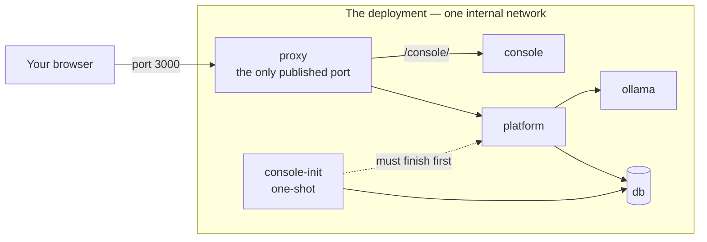

# BYODt Deployment

The **BYODt deployment** runs the whole Dethernety platform on a machine you control. It ships as a small bundle — a compose file, a control script, and a configuration template — that starts a graph database, an embedding server, the platform, an operator console, and a front-door proxy from published, signed container images.

There is no source checkout and no build toolchain. A container engine is the only prerequisite.

```sh
./byodt up
```

That one command sets the deployment up on first run and starts it every time after. Everything runs locally; the deployment reaches the network only to pull its images, the embedding model, and the signed module payloads for the release it is pinned to.

New here? Go to **[Installation](./INSTALLATION.md)**.

---

## What it runs

Six services, of which exactly one publishes a port.

| Service | What it does | Published |
|---|---|---|
| `db` | The graph database. Every model, finding, and control lives here. | no |
| `ollama` | The embedding server used for class matching. | no |
| `console-init` | A one-shot that runs before the platform: places the schema, installs the signed modules, ingests the reference data, then exits. | no |
| `platform` | The product — the API, the web application, and its runtime configuration. | no |
| `console` | The operator console: deployment status, cloud connect, content packages. | via the proxy |
| `proxy` | The front door. The single entry point, and the TLS terminator. | **yes** |



The database and the embedding server never leave the stack network. The console is served through the front door at `/console/`, on the same address as the platform — one endpoint, not two.

`console-init` must complete before the platform starts. That ordering is declared, not hoped for: a schema problem stops the whole start, while a module or data problem is recorded and the stack still comes up, so you can read the diagnosis instead of facing a silent empty deployment.

## What you reach it at

With the shipped defaults, on the machine running the deployment:

| Address | What |
|---|---|
| `http://127.0.0.1:3000` | The platform — where you build and analyse threat models. |
| `http://127.0.0.1:3000/console/` | The operator console — deployment status and configuration. |

Both move together if you change the port or bind address. See [Configuration](./CONFIGURATION.md).

## What it needs

- **A container engine** — Docker with the Compose plugin, or Podman 4.1+ with a Compose provider. The control script detects which you have and remembers the choice.
- **Several gigabytes of free disk and memory.** The database container alone is started with a 4096 MiB memory limit, and the embedding server and platform run alongside it.
- **A network connection for the first run** — to pull the container images, the embedding model, and the signed module payloads.

Full detail, including Podman specifics, is in [Installation](./INSTALLATION.md).

## The control script

`byodt` is the deployment's control script and your whole interface to it. It wraps your container engine's `compose` command, carries the two configuration files every operation needs, folds first-run setup into the first start, and gives the common operations plain names:

```sh
./byodt help        # every command
./byodt status      # what is running
./byodt logs platform
./byodt backup
```

It operates on the bundle it lives in, so it can be run from anywhere. The full command reference is in [Operations](./OPERATIONS.md).

## What is in the bundle

The release tarball extracts to a single directory containing these files:

| Path | What it is |
|---|---|
| `byodt` | The control script. |
| `compose.yaml` | The service definitions. |
| `.env.example` | The configuration template, and the release manifest for the tested image set. |
| `proxy/nginx.conf`, `proxy/40-tls.sh` | The front-door configuration and its TLS entrypoint. |
| `README.md`, `LICENSE`, `NOTICE` | Quickstart, licence, and third-party notices. |

The first start creates the rest — `.env`, `.env.secrets`, `mode/`, `modules/`, `schema/`, `data/`, and `tls/`. Those are yours: they hold your configuration, your database password, and your data. Nothing in them is overwritten by a later start.

## Two ways to run it

**Standalone** is the default and needs nothing external. The platform runs unauthenticated for a single operator on a trusted machine, with the reference data and the modules that ship with the release.

**Cloud-connected** is opt-in. You connect the deployment from the console to add sign-in for your team and to mount curated content packages. Nothing is sent anywhere until you do it, and disconnecting never depends on the cloud being reachable. See [Cloud](./CLOUD.md).

Your data never moves either way: the graph stays in your database in both modes.

---

## Documentation map

| Guide | What it covers |
|---|---|
| [Installation](./INSTALLATION.md) | Prerequisites, getting the bundle, the first start, what happens during it, and how to confirm the deployment is healthy. **Start here.** |
| [Configuration](./CONFIGURATION.md) | Every setting in `.env`, the generated secret file, where the database keeps its data, and how to apply a change. |
| [Operations](./OPERATIONS.md) | The `byodt` command reference and the day-to-day tasks: start, stop, inspect, back up, restore, TLS, upgrade, remove. |
| [Cloud](./CLOUD.md) | Connecting the deployment to cloud sign-in and content packages from the console, and disconnecting again. |
| [Troubleshooting](./TROUBLESHOOTING.md) | Symptom, cause, and fix for the failures this deployment actually produces. |

**Suggested order:** [Installation](./INSTALLATION.md) → [Configuration](./CONFIGURATION.md) → [Operations](./OPERATIONS.md). Read [Cloud](./CLOUD.md) only if you are connecting the deployment. Keep [Troubleshooting](./TROUBLESHOOTING.md) to hand.

## Using the platform

These guides cover running the deployment. For using the product it serves, see the [user documentation index](../README.md) — start with [Building Your First Model](../BUILDING_YOUR_FIRST_MODEL.md).

## Licensing

The Dethernety platform and the operator console are licensed under the **GNU AGPL v3** (`LICENSE` in the bundle).

The deployment also *references* third-party container images — the graph database, the embedding server, and the proxy — which your container engine pulls directly from their publishers. The bundle does not redistribute them. Read `NOTICE` in the bundle for their licences and provenance; note in particular that **Memgraph is licensed BSL 1.1, whose production-use terms bind you as the operator directly**.

## For developers

The design behind this deployment — the service topology, the trust boundaries, the one-shot's exit discipline, and the console's state model — is described in the [BYODt architecture set](../../architecture/byodt/README.md).
